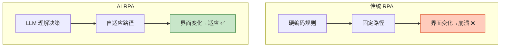

# RPA 与业务流程自动化 Agent 图解

> 确定性步骤用脚本、非确定性步骤用 LLM。本图解可视化混合 RPA 架构和流程编排。

---

## 传统 vs AI RPA



---

## 混合策略

```mermaid
graph LR
    STEP["流程步骤"] --> TYPE&#123;"类型?"&#125;
    TYPE -->|"确定性"| SCRIPT["脚本执行<br/>快、可靠"]
    TYPE -->|"非确定性"| LLM["LLM 执行<br/>灵活、智能"]
    TYPE -->|"需审批"| HUMAN["人工审核<br/>HITL"]
    SCRIPT --> NEXT["下一步"]
    LLM --> NEXT
    HUMAN --> NEXT

    style SCRIPT fill:#C8E6C9,stroke:#2E7D32,stroke-width:2px
    style LLM fill:#FFF9C4,stroke:#F9A825,stroke-width:2px
    style HUMAN fill:#FFCCBC,stroke:#D84315
```

---

## 发票处理流程示例

```mermaid
graph TB
    D["下载邮件附件<br/>脚本"] --> C["发票分类<br/>LLM"]
    C --> E["提取信息<br/>LLM+OCR"]
    E --> V&#123;"数据校验<br/>条件"&#125;
    V -->|"通过"| ERP["录入ERP<br/>API"]
    V -->"不通过"| REVIEW["人工审核"]
    ERP --> N["通知完成<br/>脚本"]
    REVIEW --> ERP

    style D fill:#C8E6C9,stroke:#2E7D32
    style C fill:#FFF9C4,stroke:#F9A825,stroke-width:2px
    style E fill:#FFF9C4,stroke:#F9A825,stroke-width:2px
    style REVIEW fill:#FFCCBC,stroke:#D84315
```

---

## 常见场景

| 场景 | 脚本步骤 | LLM 步骤 |
|------|---------|---------|
| 发票处理 | 下载/录入 | 分类/提取 |
| 简历筛选 | 收集/通知 | 解析/评分 |
| 合同审查 | 上传 | OCR/条款/风险 |
| 报告生成 | 采集/发送 | 分析/生成 |

---

## 检查清单

| 检查项 | 状态 |
|--------|------|
| 理解传统vs AI RPA | ☐ |
| 混合策略 | ☐ |
| 流程定义 | ☐ |
| 执行引擎 | ☐ |
| 异常处理 | ☐ |
| LangGraph 集成 | ☐ |
