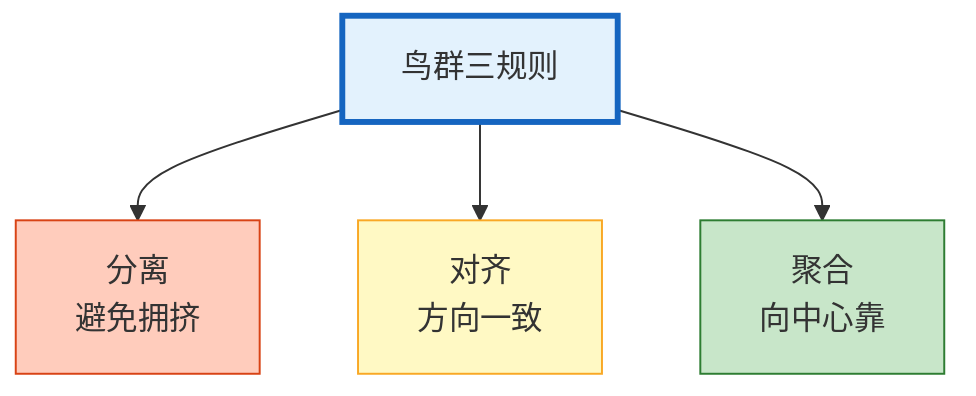

# 多 Agent 仿真与群体智能图解

> 个体简单+大量交互=复杂集体行为。本图解可视化群体智能原理和仿真流程。

---

## Boid 三规则



---

## 仿真流程

```mermaid
graph TB
    INIT["初始化 Agent 群体"] --> ROUND&#123;"仿真轮次"&#125;
    ROUND --> OBS["观察邻居"]
    OBS --> DECIDE["LLM决策更新"]
    DECIDE --> UPDATE["更新状态"]
    UPDATE --> MEASURE["测量共识/多样性"]
    MEASURE --> ROUND
    ROUND -->|"结束"| RESULT["涌现分析"]

    style ROUND fill:#FFF9C4,stroke:#F9A825,stroke-width:2px
    style RESULT fill:#C8E6C9,stroke:#2E7D32,stroke-width:2px
```

---

## 涌现行为

| 涌现类型 | 表现 | 条件 |
|---------|------|------|
| 共识形成 | 观点趋同 | 交互充分 |
| 角色分化 | 自发分工 | 任务复杂 |
| 观点聚类 | 阵营形成 | 多轮交互 |
| 趋同效应 | 少数被同化 | 群体压力 |

---

## 检查清单

| 检查项 | 状态 |
|--------|------|
| 理解群体智能原理 | ☐ |
| Boid 三规则 | ☐ |
| 仿真器实现 | ☐ |
| 共识/多样性测量 | ☐ |
| 涌现行为检测 | ☐ |
