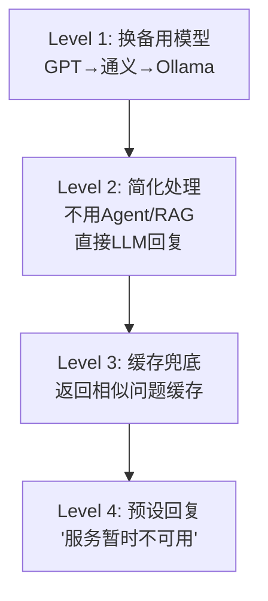
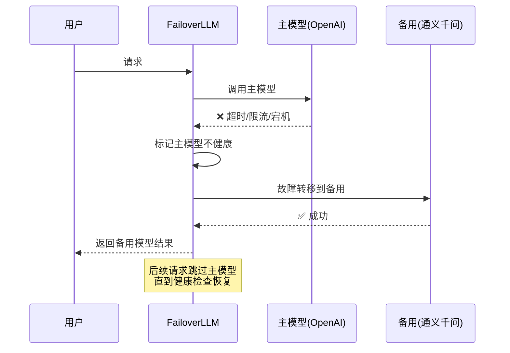

# 容灾设计图解

> 用图解理解 LLM 应用的容灾架构和降级策略。

---

## 一、故障类型

```mermaid
graph TB
    subgraph 故障 &#123;"常见故障类型"&#125;
        F1["🔴 API宕机<br/>(OpenAI不可用)"]
        F2["🟡 API限流<br/>(超过QPS)"]
        F3["🟡 网络超时<br/>(跨区域)"]
        F4["🔴 DB故障<br/>(向量库/历史DB)"]
    end

    style F1 fill:'#FFCDD2'
    style F4 fill:'#FFCDD2'
    style F2 fill:'#FFE0B2'
```

## 二、容灾架构

```mermaid
graph TB
    U["请求"] --> HEALTH&#123;"主模型<br/>健康?"&#125;
    HEALTH -->|"是"| PRIMARY["主模型<br/>GPT-4o-mini"]
    HEALTH -->|"否"| FAIL["故障转移"]
    FAIL --> BACKUP1["备用<br/>通义千问"]
    BACKUP1 -->|"不可用"| BACKUP2["兜底<br/>Ollama本地"]
    BACKUP2 -->|"不可用"| CACHE["缓存兜底<br/>或预设回复"]
    PRIMARY --> OUT["返回结果"]

    style PRIMARY fill:'#C8E6C9'
    style FAIL fill:'#FFE0B2'
    style CACHE fill:'#FFCDD2'
```

## 三、四级降级



## 四、故障转移时序



## 五、容灾检查清单

| 检查项 | 状态 |
|--------|------|
| 多模型故障转移 | ☐ |
| 超时设置(30s) | ☐ |
| 重试(指数退避3次) | ☐ |
| 限流(QPS限制) | ☐ |
| 降级策略(4级) | ☐ |
| 健康检查 | ☐ |
| 监控告警 | ☐ |
| 熔断器 | ☐ |
