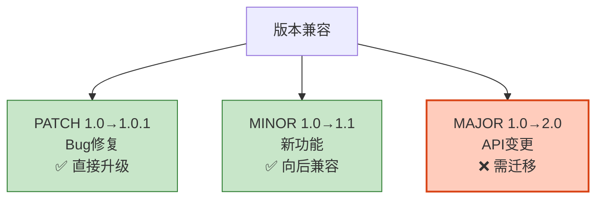
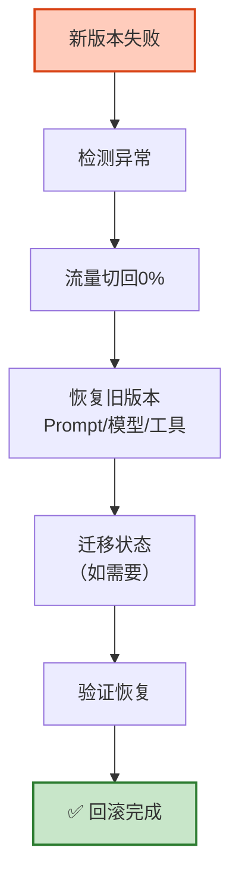

# Agent 版本兼容与平滑升级图解

> 升级不停服、回滚不丢数据。本图解可视化灰度迁移和回滚机制。

---

## 平滑升级路径

```mermaid
graph LR
    TEST["测试环境验证"] --> CANARY["灰度10%"]
    CANARY --> MONITOR&#123;"监控正常?"&#125;
    MONITOR -->|"是"| INC1["25%"]
    INC1 --> INC2["50%"]
    INC2 --> FULL["100%全量"]
    MONITOR -->|"否"| ROLLBACK["⬅️回滚"]

    style CANARY fill:#FFF9C4,stroke:#F9A825,stroke-width:2px
    style FULL fill:#C8E6C9,stroke:#2E7D32,stroke-width:2px
    style ROLLBACK fill:#FFCCBC,stroke:#D84315,stroke-width:2px
```

---

## 版本兼容策略



---

## 回滚机制



---

## 检查清单

| 检查项 | 状态 |
|--------|------|
| 版本兼容性检查 | ☐ |
| 兼容层适配 | ☐ |
| 状态迁移 | ☐ |
| 灰度迁移 | ☐ |
| 回滚机制 | ☐ |
| 依赖版本锁定 | ☐ |
