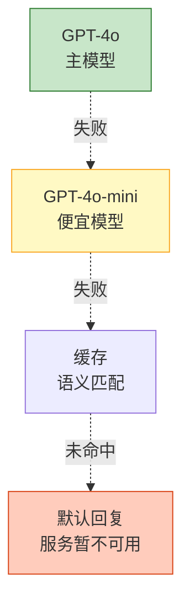

# Agent 错误处理与异常恢复工程化图解

> 瞬时错误重试、持续错误降级、致命错误恢复。本图解可视化错误分类和降级链。

---

## 错误分类

```mermaid
graph TB
    E["Agent错误"]

    E --> T["瞬时错误<br/>超时/限流/网络<br/>→重试+退避"]
    E --> P["持续错误<br/>API宕机<br/>→降级/切换"]
    E --> L["逻辑错误<br/>参数错/格式不对<br/>→修正重试"]
    E --> F["致命错误<br/>OOM/数据损坏<br/>→崩溃恢复"]

    style E fill:#FFCCBC,stroke:#D84315,stroke-width=3px
    style T fill:#C8E6C9,stroke:#2E7D32,stroke-width=2px
```

---

## 降级链



---

## LangGraph 错误路由

```mermaid
graph TB
    LLM["LLM节点"] --> ERROR&#123;"有错误?"&#125;
    ERROR -->|"无"| END1["完成"]
    ERROR -->|"瞬时+重试<3"| RETRY["重试"]
    ERROR -->|"持续"| FALLBACK["降级"]
    ERROR -->|"已降级"| END2["完成(降级)"]
    RETRY --> LLM
    FALLBACK --> END2

    style ERROR fill:#FFF9C4,stroke:#F9A825,stroke-width=2px
    style END1 fill:#C8E6C9,stroke:#2E7D32,stroke-width=2px
```

---

## 检查清单

| 检查项 | 状态 |
|--------|------|
| 错误分类体系 | ☐ |
| 指数退避重试 | ☐ |
| 多级降级链 | ☐ |
| LangGraph错误路由 | ☐ |
| 上下文超长处理 | ☐ |
