# 并行扇出图解

> 用图解理解 LangGraph 的静态并行和动态扇出（Send）机制。

---

## 一、两种并行方式

```mermaid
graph TB
    subgraph 静态并行 &#123;"静态并行（固定边）"&#125;
        S1["START"] --> A & B & C
        A & B & C --> M["合并"]
        N1["并行数量=编译时确定"]
    end

    subgraph 动态扇出 &#123;"动态扇出（Send）"&#125;
        D1["START"] --> D["分发<br/>return [Send()×N]"]
        D --> W1 & W2 & WN
        W1 & W2 & WN --> R["合并"]
        N2["并行数量=运行时决定"]
    end

    style 静态并行 fill:'#C8E6C9'
    style 动态扇出 fill:'#F3E5F5'
```

## 二、Send 机制原理

```mermaid
sequenceDiagram
    participant S as START
    participant D as 分发节点
    participant W1 as Worker1
    participant W2 as Worker2
    participant W3 as Worker3
    participant R as 合并节点

    S->>D: 输入: [doc1, doc2, doc3]
    Note over D: 为每个文档创建Send<br/>return [Send("worker", &#123;doc:doc1&#125;),<br/>Send("worker", &#123;doc:doc2&#125;),<br/>Send("worker", &#123;doc:doc3&#125;)]

    par 并行执行
        D->>W1: &#123;document: doc1&#125;
        W1->>R: summaries: ["摘要1"]
    and
        D->>W2: &#123;document: doc2&#125;
        W2->>R: summaries: ["摘要2"]
    and
        D->>W3: &#123;document: doc3&#125;
        W3->>R: summaries: ["摘要3"]
    end

    Note over R: 所有Worker完成后<br/>自动触发合并
    R->>S: 最终报告
```



## 三、对比

```mermaid
graph TB
    subgraph 对比 &#123;"静态边 vs Send"&#125;
        STATIC["静态边<br/>add_edge(START, A, B, C)<br/>✅ 简单<br/>❌ N固定"]
        SEND["Send<br/>return [Send()×N]<br/>✅ N运行时决定<br/>✅ 每个带不同数据"]
    end

    style STATIC fill:'#C8E6C9'
    style SEND fill:'#E3F2FD'
```

## 四、适用场景

| 场景 | 方式 | 原因 |
|------|------|------|
| 3个Agent审查 | 静态 | N=3固定 |
| N篇文档摘要 | Send | N运行时知道 |
| 3个模型对比 | 静态 | N=3固定 |
| N个搜索查询 | Send | N动态 |
| 固定流水线 | 静态 | 步骤固定 |
| 用户文件处理 | Send | 文件数不定 |

## 五、注意事项

```mermaid
graph TB
    subgraph 注意 &#123;"Send使用注意"&#125;
        N1["⚠️ Worker必须用Reducer<br/>(Annotated[list, add])"]
        N2["⚠️ 每个Send实例数据独立<br/>不共享完整State"]
        N3["⚠️ 合并节点自动等待<br/>所有Worker完成"]
        N4["⚠️ 并行过多→限流<br/>控制最大并发"]
    end

    style 注意 fill:'#FFE0B2'
```
