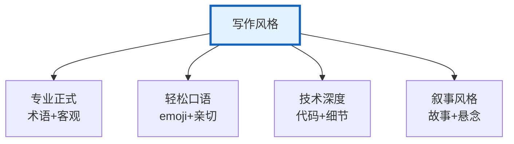

# Agent 内容创作与写作辅助深度图解

> 主题→大纲→起草→润色→原创检查。本图解可视化创作全流程。

---

## 创作流程

```mermaid
graph TB
    TOPIC["创作主题"] --> PLAN["大纲规划<br/>结构+要点"]
    PLAN --> DRAFT["逐段起草<br/>分段生成"]
    DRAFT --> POLISH["润色打磨<br/>风格/流畅"]
    POLISH --> CHECK["原创性检查<br/>查重/套话"]
    CHECK --> REVISE&#123;"需要修改?"&#125;
    REVISE -->|"是"| DRAFT
    REVISE -->|"否"| OUTPUT["✅ 输出"]

    style PLAN fill:#E3F2FD,stroke:#1565C0,stroke-width:2px
    style POLISH fill:#FFF9C4,stroke:#F9A825,stroke-width=2px
    style OUTPUT fill:#C8E6C9,stroke:#2E7D32,stroke-width:2px
```

---

## 四种写作风格



---

## 原创性检查

| 检查项 | 说明 |
|--------|------|
| AI套话 | "作为一个AI"/"总而言之" |
| 重复表述 | 同一表达多次 |
| 模板化 | 结构过于固定 |
| 独特性 | 有无独特观点 |

---

## 检查清单

| 检查项 | 状态 |
|--------|------|
| 风格控制 | ☐ |
| 大纲规划 | ☐ |
| 逐段起草 | ☐ |
| 润色打磨 | ☐ |
| 原创性检查 | ☐ |
| 技术博客 | ☐ |
| 营销文案 | ☐ |
