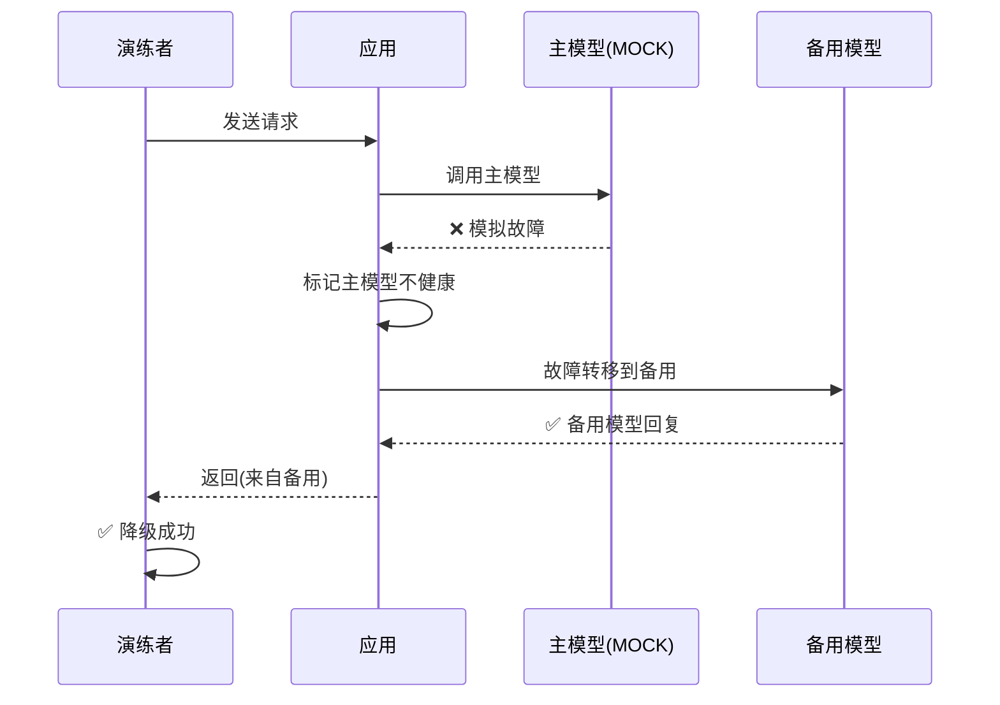

# 灾备演练图解

> 用图解理解 LLM 应用的灾备演练流程和场景设计。

---

## 一、灾备演练价值

```mermaid
graph TB
    subgraph 不演练 &#123;"❌ 不演练"&#125;
        N1["平时OK"] --> N2["故障时慌乱"] --> N3["恢复慢+投诉多"]
    end

    subgraph 演练 &#123;"✅ 定期演练"&#125;
        T1["主动模拟故障"] --> T2["发现弱点"] --> T3["提前修复"] --> T4["故障时快速恢复"]
    end

    style 不演练 fill:'#FFCDD2'
    style 演练 fill:'#C8E6C9'
```

## 二、五个演练场景

```mermaid
graph TB
    subgraph 场景 &#123;"五个灾备演练场景"&#125;
        S1["🔴 API宕机<br/>OpenAI不可用<br/>→ 降级备用模型"]
        S2["🔴 向量库损坏<br/>FAISS文件丢失<br/>→ 备份恢复"]
        S3["🟡 DB故障<br/>对话历史不可用<br/>→ 无历史继续"]
        S4["🟡 网络延迟<br/>API 10秒延迟<br/>→ 超时重试"]
        S5["🟢 高负载<br/>QPS ×10<br/>→ 限流生效"]
    end

    style 场景 fill:'#E3F2FD'
```

## 三、演练流程

```mermaid
graph LR
    subgraph 流程 &#123;"灾备演练流程"&#125;
        P1["1.制定计划"] --> P2["2.通知人员"]
        P2 --> P3["3.注入故障"]
        P3 --> P4["4.观察行为"]
        P4 --> P5["5.恢复正常"]
        P5 --> P6["6.总结复盘"]
        P6 -.->|"改进"| P1
    end

    style P1 fill:'#E3F2FD'
    style P5 fill:'#C8E6C9'
    style P6 fill:'#F3E5F5'
```

## 四、API故障演练



## 五、检查表

| 场景 | 预期行为 | 状态 |
|------|---------|------|
| API宕机 | 降级到备用 | ☐ |
| 向量库损坏 | 备份恢复 | ☐ |
| DB不可用 | 无历史继续 | ☐ |
| 高并发 | 限流生效 | ☐ |
| 恢复时间 | 故障后立即正常 | ☐ |
