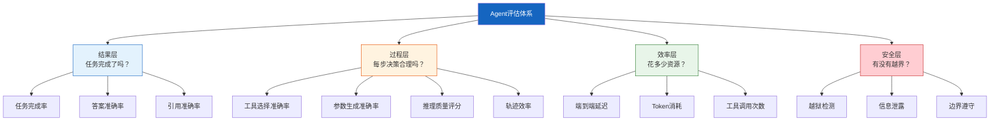
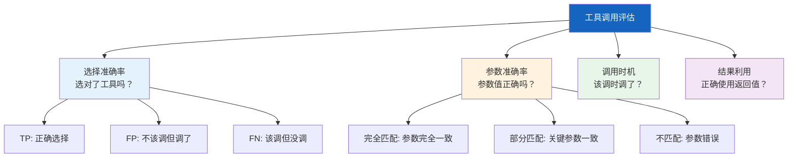
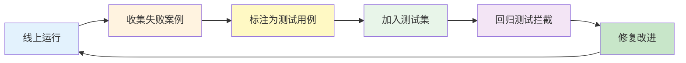

# Agent 评估框架图解

> 用图解理解 Agent 评估的四层体系、轨迹评估方法、工具调用准确率分解和回归测试流程。

---

## 一、评估体系全景



---

## 二、单次LLM vs Agent评估对比

```mermaid
graph LR
    subgraph 单次LLM &#123;"单次LLM调用评估"&#125;
        A1["输入"] --> A2["LLM"] --> A3["输出"]
        A3 --> A4["对比标准答案"]
        A4 --> A5["准确率"]
    end

    subgraph Agent &#123;"Agent评估"&#125;
        B1["任务"] --> B2["推理"]
        B2 --> B3["工具A"]
        B3 --> B4["观察"]
        B4 --> B2
        B2 --> B5["工具B"]
        B5 --> B6["观察"]
        B6 --> B2
        B2 --> B7["最终回答"]
        B7 --> B8["轨迹评估<br/>+ 工具评估<br/>+ 结果评估<br/>+ 效率评估"]
    end

    style 单次LLM fill:#E3F2FD
    style Agent fill:#FFF3E0
```

---

## 三、轨迹评估三种方法

```mermaid
graph TB
    subgraph 方法 &#123;"轨迹评估方法"&#125;
        M1["精确匹配法<br/>actual == reference<br/>顺序和内容都要一致"]
        M2["集合匹配法<br/>参考步骤都被执行<br/>允许额外步骤"]
        M3["LLM-as-Judge<br/>无参考轨迹时<br/>用LLM评判每步质量"]
    end

    subgraph 对比 &#123;"三种方法对比"&#125;
        C1["精确匹配: 严格但脆弱<br/>少一步就失败"]
        C2["集合匹配: 宽松但可能漏检<br/>多了冗余步骤也通过"]
        C3["LLM-Judge: 灵活但有成本<br/>需校准偏差"]
    end

    style 方法 fill:#E3F2FD
    style 对比 fill:#FFF9C4
```

---

## 四、工具调用准确率分解



---

## 五、测试集分层设计

```mermaid
graph TB
    subgraph 测试集 &#123;"Agent测试集分层"&#125;
        T1["简单任务 30%<br/>1-2步完成<br/>如: 查询天气"]
        T2["中等任务 50%<br/>3-5步完成<br/>如: 检索+计算+总结"]
        T3["复杂任务 20%<br/>5+步+多工具<br/>如: 研究+分析+报告"]
    end

    subgraph 标注 &#123;"每条用例标注"&#125;
        L1["任务描述"]
        L2["参考答案/参考轨迹"]
        L3["必备工具列表"]
        L4["禁用操作列表"]
        L5["成功判定标准"]
    end

    style 测试集 fill:#E3F2FD
    style 标注 fill:#FFF9C4
```

---

## 六、回归测试与基线管理

```mermaid
graph TB
    subgraph CI流程 &#123;"CI/CD中的Agent回归测试"&#125;
        DEV["开发者修改Agent"] --> COMMIT["提交代码"]
        COMMIT --> RUN["运行测试集"]
        RUN --> COMPARE&#123;"对比基线"&#125;
        COMPARE -->|通过率≥基线| PASS["✅ 通过"]
        COMPARE -->|通过率<基线| FAIL["❌ 阻止合并"]
        FAIL --> DIFF["显示退化用例"]
    end

    subgraph 基线 &#123;"基线版本管理"&#125;
        V1["v1.0: pass_rate=82%"]
        V2["v1.1: pass_rate=85%"]
        V3["v1.2: pass_rate=83% → 回退"]
    end

    style CI流程 fill:#E3F2FD
    style 基线 fill:#FFF9C4
```

---

## 七、效率指标采集

```mermaid
graph LR
    subgraph 采集 &#123;"Agent运行时指标采集"&#125;
        S1["总Token数"] 
        S2["LLM调用次数"]
        S3["工具调用次数<br/>+各工具分布"]
        S4["端到端延迟"]
        S5["Token/秒"]
    end

    subgraph 用途 &#123;"指标用途"&#125;
        U1["成本分析<br/>Token→费用"]
        U2["性能优化<br/>找最慢的环节"]
        U3["容量规划<br/>QPS预估"]
        U4["效率对比<br/>不同模型/配置"]
    end

    S1 & S2 & S3 & S4 & S5 --> U1 & U2 & U3 & U4

    style 采集 fill:#E8F5E9
    style 用途 fill:#FFF3E0
```

---

## 八、评估飞轮



---

## 九、检查清单

| 检查项 | 状态 |
|--------|------|
| 定义了至少3个评估维度 | ☐ |
| 测试集按难度分层 | ☐ |
| 有轨迹评估或LLM-Judge方案 | ☐ |
| 工具调用准确率有自动化采集 | ☐ |
| 建立了评估基线并纳入CI | ☐ |
| 效率指标已采集 | ☐ |
| 线上失败案例有回流机制 | ☐ |
