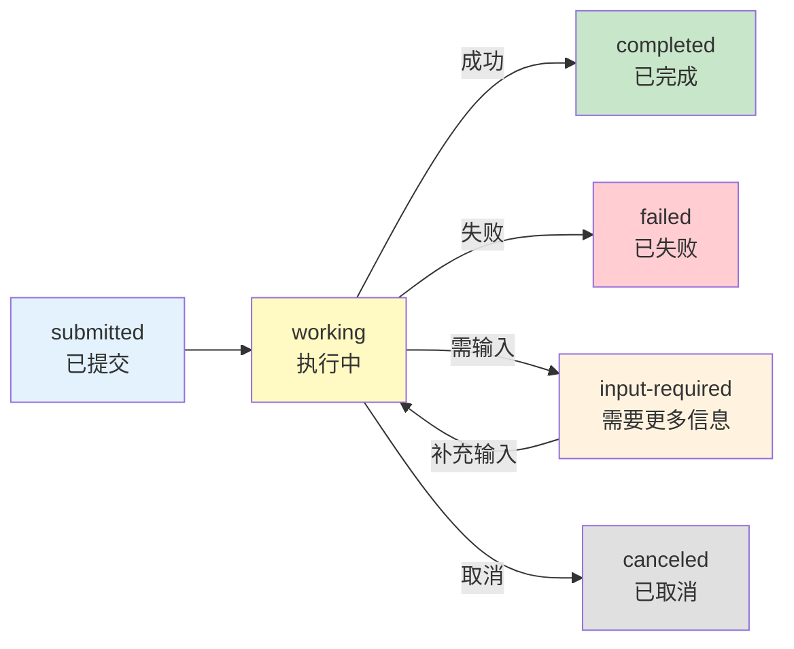

# A2A 协议交互图解

> 用图解理解 A2A 协议如何让不同框架的 Agent 互相通信，以及 A2A 与 MCP 的互补关系。

---

## 一、Agent孤岛问题

```mermaid
graph TB
    subgraph 孤岛 &#123;"Agent孤岛"&#125;
        A1["客服Agent<br/>LangGraph"]
        A2["分析Agent<br/>Dify"]
        A3["搜索Agent<br/>AutoGen"]
        A1 -.->|无法通信| A2
        A2 -.->|无法通信| A3
    end

    style 孤岛 fill:#FFCDD2
```

---

## 二、A2A vs MCP

```mermaid
graph TB
    subgraph MCP &#123;"MCP: Agent ↔ 工具"&#125;
        M1["Agent"] -->|"调用工具"| M2["MCP Server<br/>文件/数据库/API"]
    end

    subgraph A2A &#123;"A2A: Agent ↔ Agent"&#125;
        A1["Agent A<br/>委托方"] -->|"委派任务"| A2["Agent B<br/>执行方"]
        A2 -->|"返回结果"| A1
    end

    subgraph 组合 &#123;"两者组合"&#125;
        C1["Agent用MCP连工具<br/>用A2A连其他Agent"]
    end

    style MCP fill:#E3F2FD,stroke:#1565C0
    style A2A fill:#FFF3E0,stroke:#E65100
    style 组合 fill:#C8E6C9
```

---

## 三、A2A四大核心概念

```mermaid
graph TB
    subgraph 核心 &#123;"A2A四大概念"&#125;
        C1["Agent Card<br/>Agent名片<br/>JSON元数据<br/>描述能力"]
        C2["Task<br/>任务对象<br/>有生命周期"]
        C3["Message<br/>通信载体<br/>含文本/文件"]
        C4["Artifact<br/>任务产物<br/>结果输出"]
    end

    C1 --> C1D["name/url/skills<br/>capabilities"]
    C2 --> C2D["submitted→working<br/>→completed/failed"]
    C3 --> C3D["role + parts[]<br/>text/file/data"]
    C4 --> C4D["文件/结构化数据<br/>可多部分"]

    style 核心 fill:#E3F2FD
```

---

## 四、Task生命周期



---

## 五、通信时序

```mermaid
sequenceDiagram
    participant C as 委托Agent
    participant S as 执行Agent

    C->>S: GET /.well-known/agent.json
    S-->>C: Agent Card (能力描述)

    C->>S: POST tasks/send (创建任务)
    S-->>C: Task &#123;id, state: submitted&#125;

    loop SSE流式状态更新
        S-->>C: state=working (进度)
        S-->>C: state=working (进度)
    end

    S-->>C: state=completed
    S-->>C: Artifacts (结果产物)

    Note over C,S: 也可用 tasks/get 轮询状态
    Note over C,S: tasks/cancel 可取消任务
```



---

## 六、Agent Card结构

```mermaid
graph TB
    subgraph Card &#123;"Agent Card JSON结构"&#125;
        N["name: research-agent"]
        D["description: 深度研究Agent"]
        U["url: https://agent.example.com/a2a"]
        V["version: 1.0.0"]
        
        subgraph Capabilities &#123;"capabilities"&#125;
            CA1["streaming: true"]
            CA2["pushNotifications: false"]
        end

        subgraph Skills &#123;"skills[]"&#125;
            SK1["id: web-research<br/>name: 网络研究<br/>inputModes: text<br/>outputModes: text,file"]
            SK2["id: data-analysis<br/>name: 数据分析"]
        end
    end

    style Card fill:#E3F2FD
    style Capabilities fill:#FFF9C4
    style Skills fill:#C8E6C9
```

---

## 七、LangGraph编排多Agent协作

```mermaid
graph TB
    subgraph 编排 &#123;"LangGraph Supervisor编排"&#125;
        SUPER["Supervisor<br/>(LangGraph)"] --> C1["A2A Client<br/>→ Research Agent"]
        SUPER --> C2["A2A Client<br/>→ Analysis Agent"]
        SUPER --> C3["A2A Client<br/>→ Writer Agent"]
        C1 --> SUPER
        C2 --> SUPER
        C3 --> SUPER
        SUPER --> RESULT["综合报告"]
    end

    subgraph A2A交互 &#123;"每个A2A调用"&#125;
        A1["send_task()"] --> A2["wait_for_completion()"]
        A2 --> A3["提取Artifacts"]
    end

    style SUPER fill:#1565C0,color:#fff
    style RESULT fill:#C8E6C9
    style A2A交互 fill:#FFF3E0
```

---

## 八、安全要点

```mermaid
graph TB
    subgraph 安全 &#123;"A2A安全五要点"&#125;
        S1["身份验证<br/>API Key/OAuth<br/>验证Agent身份"]
        S2["权限控制<br/>限制可委派任务类型<br/>最小权限原则"]
        S3["输入验证<br/>防止指令注入<br/>净化委派内容"]
        S4["输出审查<br/>检查返回内容<br/>脱敏敏感信息"]
        S5["速率限制<br/>防止资源耗尽<br/>队列+限流"]
    end

    style 安全 fill:#FFCDD2
```

---

## 九、检查清单

| 检查项 | 状态 |
|--------|------|
| 理解A2A与MCP的区别 | ☐ |
| 掌握Agent Card结构 | ☐ |
| 理解Task生命周期 | ☐ |
| 能实现基本A2A通信 | ☐ |
| 能在LangGraph中编排 | ☐ |
| 考虑了安全风险 | ☐ |
| 有超时和降级方案 | ☐ |
