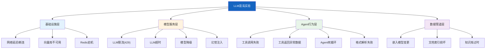

# 混沌工程实验图解

> 用图解理解 LLM 应用混沌实验的分类、故障注入原理、实验执行流程和自动化调度。

---

## 一、为什么LLM需要混沌工程

```mermaid
graph TB
    subgraph 传统 &#123;"传统混沌关注"&#125;
        T1["网络延迟"]
        T2["磁盘满"]
        T3["进程崩溃"]
    end

    subgraph LLM特有 &#123;"LLM特有故障"&#125;
        L1["LLM幻觉"]
        L2["Token限流429"]
        L3["工具调用超时"]
        L4["嵌入漂移"]
        L5["模型降级"]
        L6["输出格式错误"]
    end

    style 传统 fill:#E3F2FD
    style LLM特有 fill:#FFCDD2
```

---

## 二、实验分类



---

## 三、故障注入原理

```mermaid
graph LR
    subgraph 注入 &#123;"故障注入器工作原理"&#125;
        N1["正常请求"] --> INJ&#123;"拦截器<br/>检查是否有故障"&#125;
        INJ -->|有故障| FAULT["注入预设故障"]
        INJ -->|无故障| NORMAL["正常执行"]
        FAULT --> RESULT["观察系统行为"]
        NORMAL --> RESULT
    end

    subgraph 策略 &#123;"爆炸半径控制"&#125;
        B1["blast_radius=0.1<br/>10%请求被注入"]
        B2["blast_radius=1.0<br/>100%请求被注入"]
    end

    style INJ fill:#FFF9C4,stroke:#F9A825,stroke-width:3px
    style FAULT fill:#FFCDD2
    style NORMAL fill:#C8E6C9
```

---

## 四、六个核心实验

```mermaid
graph TB
    subgraph 实验库 &#123;"六大混沌实验"&#125;
        E1["实验1: LLM超时<br/>验证降级策略"]
        E2["实验2: 限流429<br/>验证重试退避"]
        E3["实验3: 工具失败<br/>验证Agent容错"]
        E4["实验4: 向量库宕机<br/>验证降级检索"]
        E5["实验5: 幻觉注入<br/>验证护栏检测"]
        E6["实验6: 格式错误<br/>验证解析容错"]
    end

    style 实验库 fill:#E3F2FD
```

---

## 五、实验执行流程

```mermaid
graph TB
    subgraph 执行 &#123;"实验执行流程"&#125;
        S1["定义实验<br/>故障类型+目标+参数"] --> S2["设定稳态假设<br/>期望不变的行为"]
        S2 --> S3["激活故障注入<br/>按爆炸半径"]
        S3 --> S4["执行测试函数<br/>正常业务流程"]
        S4 --> S5["采集指标"]
        S5 --> S6&#123;"验证稳态假设"&#125;
        S6 -->|保持| PASS["✅ 实验通过"]
        S6 -->|违反| FAIL["❌ 实验失败<br/>发现脆弱点"]
        S6 --> S7["自动回滚<br/>停止故障注入"]
    end

    style S3 fill:#FFCDD2
    style S6 fill:#FFF9C4
    style PASS fill:#C8E6C9
    style FAIL fill:#FFCDD2
    style S7 fill:#FFF9C4
```

---

## 六、稳态假设验证

```mermaid
graph TB
    subgraph 稳态 &#123;"稳态假设检查项"&#125;
        C1["响应是否存在？"]
        C2["类型是否正确？"]
        C3["延迟是否可接受？"]
        C4["内容是否非空？"]
        C5["降级是否触发？"]
        C6["错误是否被处理？"]
    end

    C1 & C2 & C3 & C4 & C5 & C6 --> RESULT&#123;"全部通过？"&#125;
    RESULT -->|是| STABLE["✅ 稳态保持"]
    RESULT -->|否| VIOLATED["❌ 稳态违反<br/>需修复"]

    style STABLE fill:#C8E6C9
    style VIOLATED fill:#FFCDD2
```

---

## 七、自动化调度

```mermaid
graph TB
    subgraph 调度 &#123;"混沌实验自动化"&#125;
        TRIGGER["触发器<br/>定时/发版前"] --> SELECT["选择实验"]
        SELECT --> NOTIFY["通知团队"]
        NOTIFY --> SNAP["记录稳态快照"]
        SNAP --> INJECT["注入故障<br/>小爆炸半径"]
        INJECT --> MONITOR["监控指标"]
        MONITOR --> VALIDATE&#123;"验证稳态"&#125;
        VALIDATE -->|通过| PASS["✅ PASS"]
        VALIDATE -->|违反| FAIL["❌ FAIL"]
        FAIL --> ALERT["告警+人工介入"]
        INJECT -->|超时| ROLLBACK["自动回滚"]
    end

    style TRIGGER fill:#E3F2FD
    style INJECT fill:#FFCDD2
    style PASS fill:#C8E6C9
    style FAIL fill:#FFCDD2
    style ROLLBACK fill:#FFF9C4
```

---

## 八、实验报告模板

```mermaid
graph TB
    subgraph 报告 &#123;"混沌实验报告"&#125;
        R1["总览<br/>实验数/通过率"]
        R2["每个实验详情<br/>故障类型/参数/耗时"]
        R3["稳态检查结果<br/>通过/违反"]
        R4["观察记录<br/>时间线日志"]
        R5["发现的问题<br/>+建议修复"]
    end

    style 报告 fill:#E3F2FD
```

---

## 九、安全原则

```mermaid
graph TB
    subgraph 原则 &#123;"混沌实验安全原则"&#125;
        P1["1.从小开始<br/>先1%流量<br/>确认安全再扩大"]
        P2["2.自动回滚<br/>超时自动停<br/>必须可逆"]
        P3["3.预发优先<br/>生产需授权<br/>分级执行"]
        P4["4.单故障注入<br/>一次一个<br/>便于归因"]
        P5["5.完整快照<br/>实验前后对比<br/>可追溯"]
    end

    style 原则 fill:#E8F5E9
```

---

## 十、检查清单

| 检查项 | 状态 |
|--------|------|
| 定义了至少5个LLM特有实验 | ☐ |
| 有故障注入器实现 | ☐ |
| 有稳态假设验证 | ☐ |
| 配置了自动回滚 | ☐ |
| 有爆炸半径控制 | ☐ |
| 有实验报告生成 | ☐ |
| 纳入定期执行计划 | ☐ |
