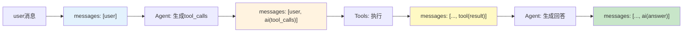
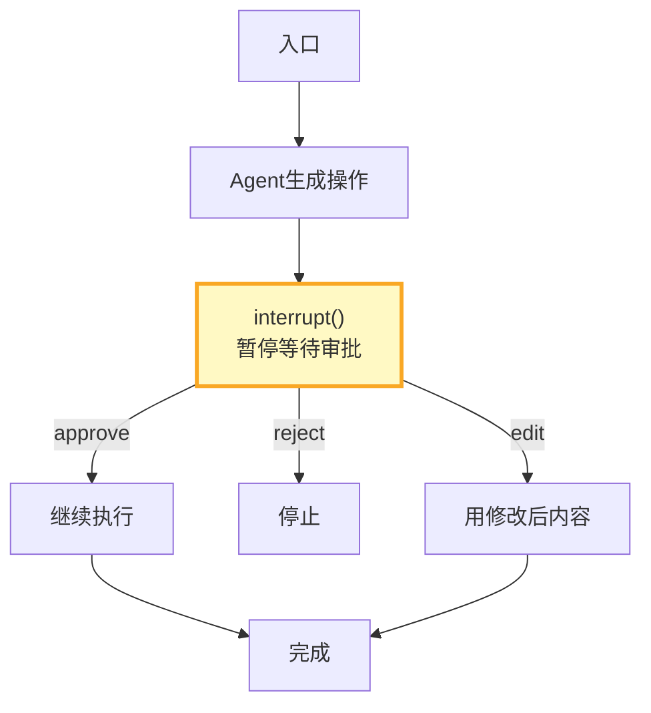
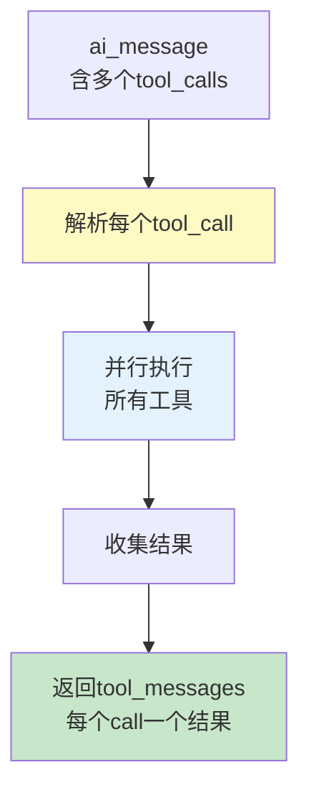

# 预构建 Agent 架构图解

> 用图解理解 create_react_agent 的执行流程、State 结构、配置选项和定制方法。

---

## 一、手动 vs 预构建

```mermaid
graph TB
    subgraph 手动 &#123;"手动构建ReAct Agent"&#125;
        M1["定义State"] --> M2["写agent节点"] --> M3["写tools节点"] --> M4["add_node"] --> M5["add_edge"] --> M6["条件边路由"] --> M7["compile()"]
    end

    subgraph 预构建 &#123;"create_react_agent"&#125;
        P1["create_react_agent(model, tools)"] --> P2["自动完成全部"]
    end

    style 手动 fill:#FFCDD2
    style 预构建 fill:#C8E6C9
```

---

## 二、执行流程

```mermaid
graph TB
    START["用户消息"] --> AGENT["Agent节点<br/>LLM推理+决定"]
    AGENT --> DECIDE&#123;"有tool_calls?"&#125;
    DECIDE -->|有| TOOLS["Tools节点<br/>执行所有工具调用"]
    TOOLS --> AGENT
    DECIDE -->|无| END["返回最终回答"]

    style AGENT fill:#E3F2FD
    style TOOLS fill:#FFF3E0
    style DECIDE fill:#FFF9C4
```

---

## 三、消息流转



---

## 四、配置选项

```mermaid
graph TB
    subgraph 配置 &#123;"create_react_agent配置项"&#125;
        C1["prompt<br/>系统提示<br/>支持字符串或函数"]
        C2["structured_response<br/>结构化输出<br/>Pydantic模型"]
        C3["checkpointer<br/>对话记忆<br/>MemorySaver/PostgresSaver"]
        C4["store<br/>长期记忆<br/>跨线程共享"]
        C5["messages_modifier<br/>消息截断<br/>控制上下文窗口"]
    end

    style 配置 fill:#E3F2FD
```

---

## 五、两层记忆

```mermaid
graph TB
    subgraph 记忆 &#123;"两层记忆体系"&#125;
        SHORT["短期记忆<br/>Checkpointer<br/>同一thread_id共享"]
        LONG["长期记忆<br/>Store<br/>所有线程共享"]
    end

    U1["对话A thread=1"] --> SHORT
    U2["对话B thread=1"] --> SHORT
    U3["对话C thread=2"] --> SHORT

    U1 & U2 & U3 --> LONG

    style SHORT fill:#E3F2FD
    style LONG fill:#FFF3E0
```

---

## 六、人机交互



---

## 七、ToolNode工作原理



---

## 八、定制模式

```mermaid
graph LR
    subgraph 包装 &#123;"预构建+包装节点"&#125;
        PRE["前置节点<br/>意图识别"] --> AGENT["预构建Agent"] --> POST["后置节点<br/>内容审查"] --> END["返回"]
    end

    style PRE fill:#FFF3E0
    style AGENT fill:#E3F2FD
    style POST fill:#C8E6C9
```

---

## 九、选型决策

```mermaid
graph TB
    Q1&#123;"需要标准ReAct循环？"&#125; -->|是| CRA["create_react_agent"]
    Q1 -->|需要定制逻辑| Q2&#123;"需要修改推理逻辑？"&#125;
    Q2 -->|是| CUSTOM["自定义StateGraph"]
    Q2 -->|只需前后处理| WRAP["预构建+包装"]
    Q3&#123;"多Agent协作？"&#125; -->|是| CUSTOM

    style CRA fill:#C8E6C9
    style CUSTOM fill:#FFF3E0
    style WRAP fill:#E3F2FD
```

---

## 十、检查清单

| 检查项 | 状态 |
|--------|------|
| 能用create_react_agent创建Agent | ☐ |
| 理解State的messages字段和reducer | ☐ |
| 能配置提示和结构化输出 | ☐ |
| 能配置checkpointer和store | ☐ |
| 能用interrupt实现人机交互 | ☐ |
| 能包装自定义前后处理节点 | ☐ |
| 能流式输出Agent响应 | ☐ |
