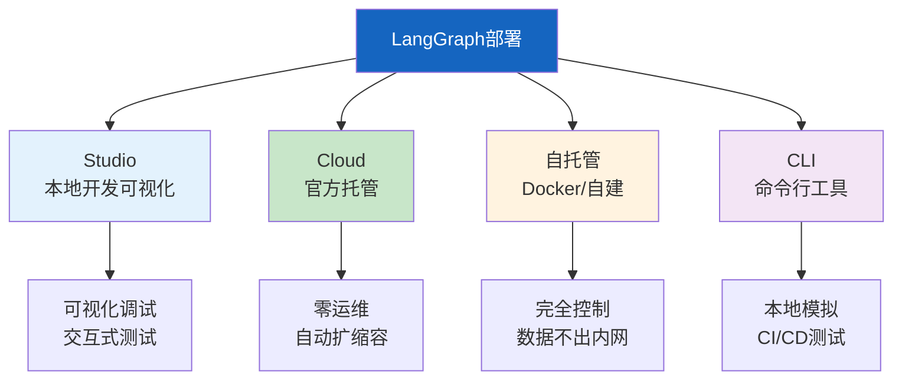
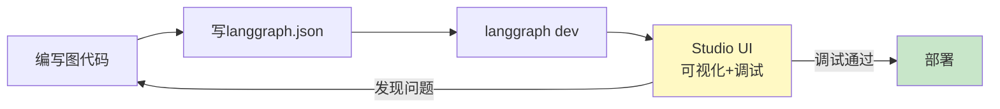
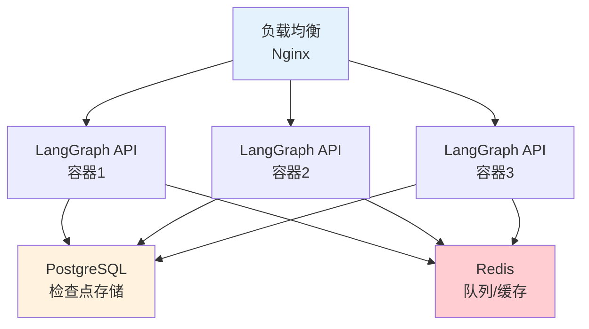

# LangGraph 部署架构图解

> 用图解理解四种部署方式、Studio 开发流程、Docker 生产架构和 API 设计。

---

## 一、四种部署方式



---

## 二、Studio开发流程



---

## 三、Studio功能

```mermaid
graph TB
    subgraph Studio &#123;"LangGraph Studio功能"&#125;
        F1["图结构可视化<br/>看到节点和边"]
        F2["交互式运行<br/>输入→运行→看结果"]
        F3["状态检查<br/>每步State快照"]
        F4["时间旅行<br/>回到任意步骤"]
        F5["断点调试<br/>节点前后暂停"]
        F6["对话测试<br/>多轮对话+记忆"]
    end

    style Studio fill:#E3F2FD
```

---

## 四、Docker生产架构



---

## 五、API端点

```mermaid
graph TB
    subgraph API &#123;"核心API端点"&#125;
        E1["POST /threads<br/>创建对话线程"]
        E2["POST /threads/&#123;id&#125;/runs<br/>运行图"]
        E3["GET /threads/&#123;id&#125;/state<br/>获取状态"]
        E4["POST /runs/stream<br/>流式运行(SSE)"]
        E5["GET /health<br/>健康检查"]
    end

    style API fill:#E3F2FD
```

---

## 六、流式API流程

```mermaid
sequenceDiagram
    participant C as 客户端
    participant API as API层
    participant AGENT as Agent
    participant LLM as LLM

    C->>API: POST /chat/stream
    API->>AGENT: 启动Agent
    AGENT->>LLM: 推理（流式）
    LLM-->>API: Token流
    API-->>C: SSE: data &#123;content&#125;
    LLM-->>API: Token流
    API-->>C: SSE: data &#123;content&#125;
    AGENT-->>API: 完成
    API-->>C: SSE: &#123;done: true&#125;
```



---

## 七、部署选型

```mermaid
graph TB
    Q1&#123;"开发阶段？"&#125; -->|原型| STUDIO["Studio"]
    Q1 -->|生产| Q2&#123;"数据敏感？"&#125;
    Q2 -->|可上云| Q3&#123;"有运维团队？"&#125;
    Q3 -->|无| CLOUD["Cloud<br/>零运维"]
    Q3 -->|有| SELF["自托管"]
    Q2 -->|敏感| SELF

    style STUDIO fill:#E3F2FD
    style CLOUD fill:#C8E6C9
    style SELF fill:#FFF3E0
```

---

## 八、监控体系

```mermaid
graph TB
    subgraph 监控 &#123;"部署后监控"&#125;
        M1["健康检查<br/>LLM/向量库/DB"]
        M2["指标<br/>延迟/吞吐/错误率"]
        M3["日志<br/>结构化+请求ID"]
        M4["追踪<br/>LangSmith自动采集"]
        M5["告警<br/>错误率/延迟/队列"]
    end

    style 监控 fill:#E3F2FD
```

---

## 九、检查清单

| 检查项 | 状态 |
|--------|------|
| 能配置langgraph.json | ☐ |
| 能用Studio调试 | ☐ |
| 理解四种部署方式 | ☐ |
| 能用Docker部署 | ☐ |
| 配置了PostgreSQL | ☐ |
| 有健康检查 | ☐ |
| 有流式API | ☐ |
