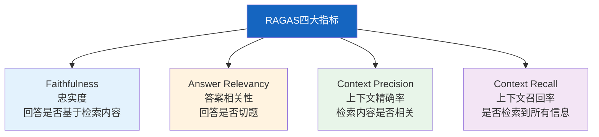
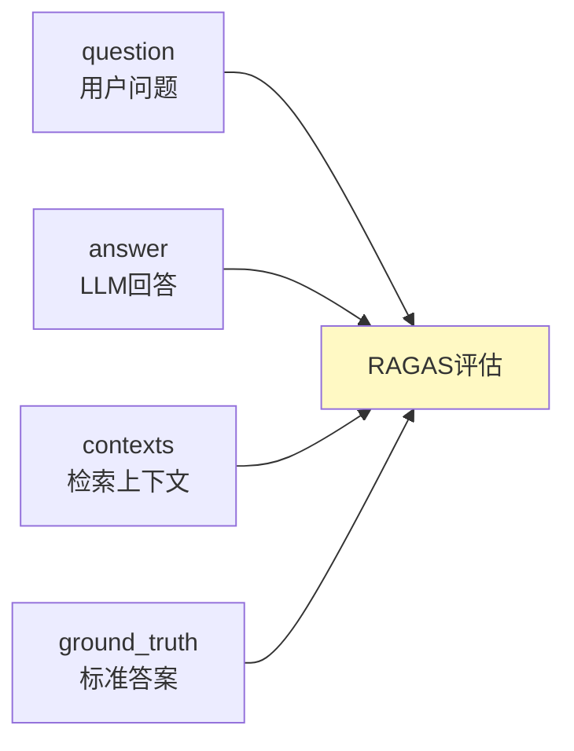
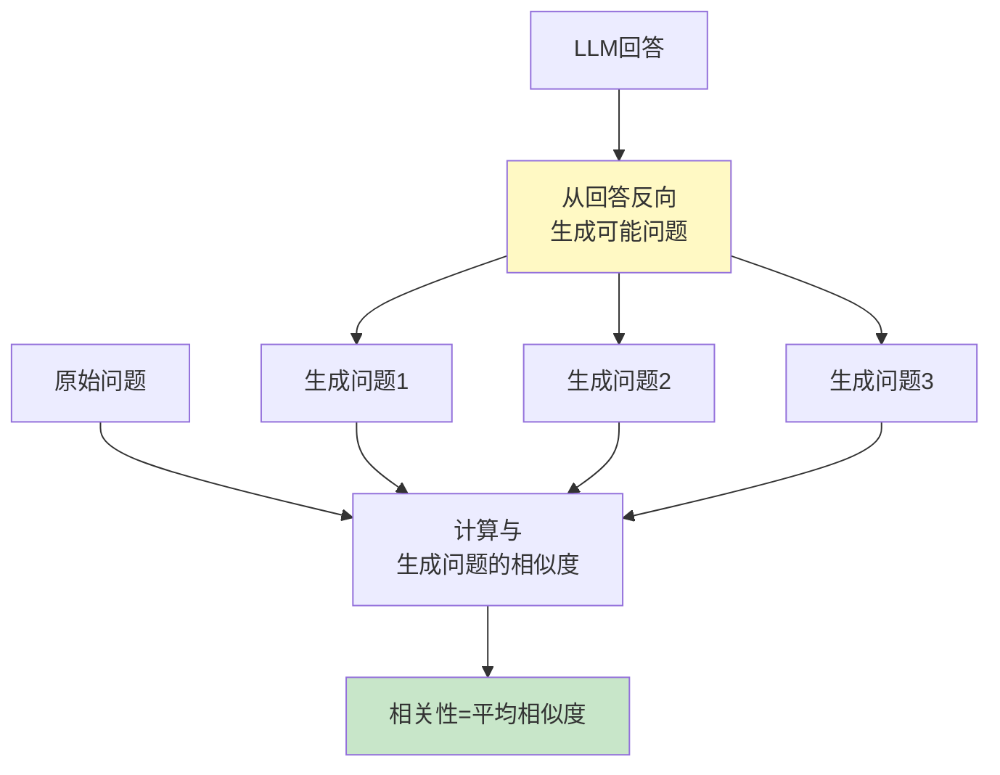
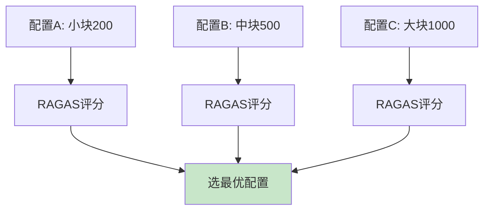

# RAGAS 评估框架图解

> 用图解理解 RAGAS 四大指标的计算原理、输入格式和评估流程。

---

## 一、为什么用RAGAS

```mermaid
graph TB
    subgraph 传统 &#123;"传统评估困难"&#125;
        T1["需人工标注"] --> T2["成本高"]
        T2 --> T3["不可扩展"]
    end

    subgraph RAGAS &#123;"RAGAS方案"&#125;
        R1["LLM-as-Judge"] --> R2["无需人工"]
        R2 --> R3["可扩展千条"]
    end

    style 传统 fill:#FFCDD2
    style RAGAS fill:#C8E6C9
```

---

## 二、四大核心指标



---

## 三、评估输入四元组



---

## 四、忠实度计算原理

```mermaid
graph TB
    A["LLM回答"] --> SPLIT["拆分为陈述句"]
    SPLIT --> S1["陈述1"]
    SPLIT --> S2["陈述2"]
    S1 --> CHECK1&#123;"能从上下文<br/>推断吗？"&#125;
    S2 --> CHECK2&#123;"能从上下文<br/>推断吗？"&#125;
    CHECK1 -->|是| Y1["支持"]
    CHECK2 -->|否| N1["不支持"]
    Y1 --> SCORE["忠实度=支持数/总数"]
    N1 --> SCORE

    style CHECK1 fill:#FFF9C4
    style CHECK2 fill:#FFF9C4
    style SCORE fill:#C8E6C9
```

---

## 五、答案相关性计算



---

## 六、精确率与召回率

```mermaid
graph TB
    subgraph 精确率 &#123;"Context Precision"&#125;
        C["检索N条上下文"] --> RANK["LLM按相关性排序"]
        G["标准答案"] --> RANK
        RANK --> P["相关的是否排在前面？"]
    end

    subgraph 召回率 &#123;"Context Recall"&#125;
        G2["标准答案"] --> SP["拆分信息点"]
        SP --> SP1["信息点1"]
        SP --> SP2["信息点2"]
        C2["检索上下文"] --> CV&#123;"每个信息点<br/>能找到吗？"&#125;
        SP1 --> CV
        SP2 --> CV
        CV --> R["召回率=找到数/总数"]
    end

    style 精确率 fill:#E3F2FD
    style 召回率 fill:#FFF3E0
```

---

## 七、配置对比调优



---

## 八、弱项诊断

```mermaid
graph TB
    SCORES["四大指标评分"] --> FIND&#123;"最弱项"&#125;
    FIND -->|Faithfulness低| F1["幻觉问题<br/>→优化检索质量<br/>→优化Prompt"]
    FIND -->|Relevancy低| F2["不切题<br/>→优化查询理解"]
    FIND -->|Precision低| F3["检索不精确<br/>→加重排序"]
    FIND -->|Recall低| F4["检索遗漏<br/>→增k值/优化分块"]

    style FIND fill:#FFF9C4
```

---

## 九、检查清单

| 检查项 | 状态 |
|--------|------|
| 理解四大指标 | ☐ |
| 能安装RAGAS运行评估 | ☐ |
| 能转LangChain RAG输出 | ☐ |
| 能对比不同RAG配置 | ☐ |
| 能生成评估报告 | ☐ |
