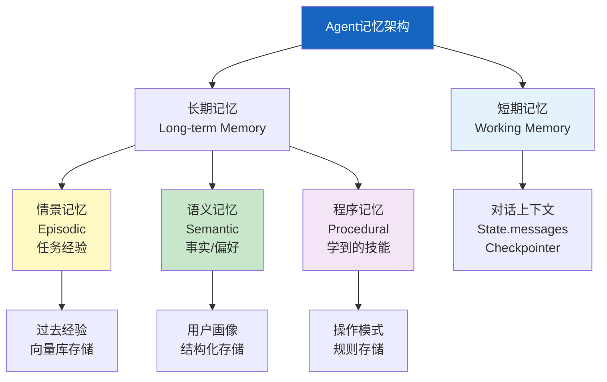
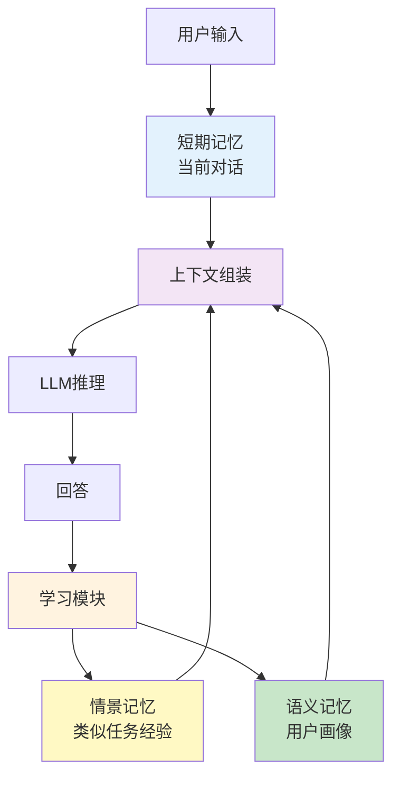

# Agent 记忆架构图解

> 用图解理解四种记忆类型、记忆整合流程、遗忘巩固策略和 LangGraph 集成。

---

## 一、四种记忆类型



---

## 二、记忆整合流程



---

## 三、短期记忆：State + Checkpointer

```mermaid
graph LR
    subgraph 短期记忆 &#123;"短期记忆机制"&#125;
        M1["messages字段<br/>对话历史"] 
        M2["task字段<br/>当前任务"]
        M3["context字段<br/>中间结果"]
        M1 & M2 & M3 --> CP["Checkpointer<br/>每步持久化"]
    end

    style CP fill:#FFF9C4
```

---

## 四、情景记忆：经验存储

```mermaid
graph TB
    subgraph 存储 &#123;"任务完成后存储经验"&#125;
        T["任务描述"] --> E1["记录任务"]
        TR["执行轨迹"] --> E2["记录步骤"]
        R["结果"] --> E3["记录结果"]
        S["成功/失败"] --> E4["记录状态"]
        L["经验教训"] --> E5["记录教训"]
        E1 & E2 & E3 & E4 & E5 --> VS["存入向量库<br/>可语义检索"]
    end

    subgraph 检索 &#123;"新任务时回忆"&#125;
        NT["新任务"] --> SEARCH["语义搜索<br/>相似经验"]
        SEARCH --> RECALL["返回Top-K经验"]
    end

    style 存储 fill:#E3F2FD
    style 检索 fill:#FFF3E0
    style VS fill:#FFF9C4
```

---

## 五、语义记忆：事实与偏好

```mermaid
graph TB
    subgraph 语义记忆 &#123;"语义记忆结构"&#125;
        F["事实库<br/>&#123;key: value&#125;"]
        P["偏好库<br/>&#123;category: value&#125;"]
        K["知识库<br/>[&#123;topic, content, confidence&#125;]"]
    end

    subgraph 提取 &#123;"自动提取流程"&#125;
        CONV["对话内容"] --> LLM["LLM提取<br/>事实和偏好"]
        LLM --> F
        LLM --> P
    end

    subgraph 使用 &#123;"使用方式"&#125;
        PROFILE["用户画像文本"] --> PROMPT["注入系统提示"]
    end

    F --> PROFILE
    P --> PROFILE

    style 语义记忆 fill:#C8E6C9
    style 提取 fill:#FFF3E0
    style 使用 fill:#E3F2FD
```

---

## 六、记忆遗忘与巩固

```mermaid
graph TB
    subgraph 遗忘巩固 &#123;"遗忘与巩固策略"&#125;
        F1["短期记忆遗忘<br/>超过窗口→摘要压缩"]
        F2["情景记忆遗忘<br/>低重要性+久未访问→降权"]
        F3["语义记忆巩固<br/>多次出现→置信度提升"]
        F4["冲突解决<br/>新事实覆盖旧事实<br/>保留版本历史"]
    end

    style F1 fill:#E3F2FD
    style F2 fill:#FFF9C4
    style F3 fill:#C8E6C9
    style F4 fill:#FFCDD2
```

---

## 七、短期记忆压缩

```mermaid
graph LR
    subgraph 压缩前 &#123;"超过20条消息"&#125;
        M1["msg 1-10<br/>早期对话"] 
        M2["msg 11-20<br/>最近对话"]
    end

    subgraph 压缩后 &#123;"压缩后"&#125;
        S["摘要: 早期对话要点..."]
        M2
    end

    M1 -->|LLM摘要| S
    M2 --> M2

    style M1 fill:#FFCDD2
    style S fill:#C8E6C9
```

---

## 八、LangGraph集成

```mermaid
graph TB
    subgraph 集成 &#123;"LangGraph记忆集成"&#125;
        S["State<br/>短期记忆"] --> CP["Checkpointer<br/>线程内持久化"]
        ST["Store<br/>长期记忆"] --> CROSS["跨线程共享<br/>用户级记忆"]
        CP --> S
        ST --> S
    end

    style CP fill:#E3F2FD
    style ST fill:#FFF3E0
```

---

## 九、检查清单

| 检查项 | 状态 |
|--------|------|
| 理解四种记忆类型 | ☐ |
| 实现短期记忆 | ☐ |
| 实现情景记忆 | ☐ |
| 实现语义记忆 | ☐ |
| 有遗忘巩固策略 | ☐ |
| 能从对话提取事实 | ☐ |
| Store跨线程共享 | ☐ |
