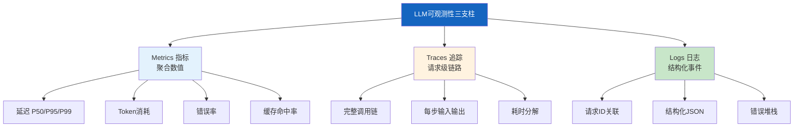
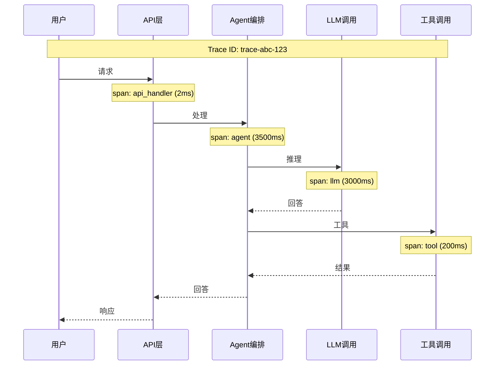

# 可观测性三支柱图解

> 用图解理解 LLM 应用可观测性的三支柱（指标/追踪/日志）、指标分类和分布式追踪原理。

---

## 一、三支柱



---

## 二、核心指标分类

```mermaid
graph TB
    subgraph 指标 &#123;"四大指标分类"&#125;
        P["性能"] --> P1["端到端延迟"]
        P --> P2["首Token延迟TTFT"]
        P --> P3["Token生成速率"]

        C["成本"] --> C1["每请求Token数"]
        C --> C2["日/月消耗"]
        C --> C3["每请求成本$"]

        Q["质量"] --> Q1["工具成功率"]
        Q --> Q2["解析成功率"]
        Q --> Q3["护栏触发率"]

        R["可靠性"] --> R1["错误率5xx"]
        R --> R2["超时率"]
        R --> R3["降级触发率"]
    end

    style 指标 fill:#E3F2FD
```

---

## 三、指标采集架构

```mermaid
graph LR
    subgraph 采集 &#123;"指标采集流程"&#125;
        REQ["请求进入"] --> INST["装饰器/中间件<br/>自动采集"]
        INST --> COLLECT["MetricsCollector"]
        COLLECT --> STORE["内存/Prometheus"]
        STORE --> DASH["仪表盘"]
        STORE --> ALERT["告警规则"]
    end

    style INST fill:#FFF9C4
    style COLLECT fill:#E3F2FD
```

---

## 四、分布式追踪



---

## 五、Span层级

```mermaid
graph TB
    subgraph 追踪层级 &#123;"追踪Span层级"&#125;
        L1["Level 1: 请求追踪<br/>端到端一次执行"]
        L1 --> L2["Level 2: 组件追踪<br/>LLM/工具/检索"]
        L2 --> L3["Level 3: 细节追踪<br/>Token/Prompt/返回"]
    end

    style 追踪层级 fill:#E3F2FD
```

---

## 六、结构化日志

```mermaid
graph TB
    subgraph 日志 &#123;"结构化日志JSON格式"&#125;
        L1["timestamp: 1700000000"]
        L2["level: INFO"]
        L3["message: LLM调用"]
        L4["request_id: req-123"]
        L5["model: gpt-4o"]
        L6["tokens: 350"]
        L7["latency_ms: 1200"]
    end

    日志 --> ELK["ELK/Loki<br/>搜索+聚合+可视化"]

    style 日志 fill:#C8E6C9
    style ELK fill:#E3F2FD
```

---

## 七、告警体系

```mermaid
graph TB
    subgraph 告警 &#123;"告警规则体系"&#125;
        A1["错误率 > 5%<br/>→ CRITICAL"]
        A2["P95延迟 > 10s<br/>→ WARNING"]
        A3["Token消耗 > 日预算<br/>→ CRITICAL"]
        A4["缓存命中率 < 20%<br/>→ INFO"]
        A5["工具失败率 > 10%<br/>→ WARNING"]
    end

    style 告警 fill:#FFCDD2
```

---

## 八、仪表盘设计

```mermaid
graph TB
    subgraph 仪表盘 &#123;"LLM应用监控仪表盘"&#125;
        D1["实时指标<br/>QPS/延迟/错误率"]
        D2["Token消耗<br/>日/周/月趋势"]
        D3["延迟分布<br/>P50/P95/P99"]
        D4["工具面板<br/>调用次数/成功率"]
        D5["告警面板<br/>活跃告警"]
    end

    style 仪表盘 fill:#E3F2FD
```

---

## 九、LangSmith集成

```mermaid
graph TB
    subgraph 集成 &#123;"LangSmith自动追踪"&#125;
        APP["应用代码"] --> ENV&#123;"环境变量<br/>LANGSMITH_TRACING=true"&#125;
        ENV --> AUTO["自动采集<br/>每次执行轨迹"]
        AUTO --> UI["LangSmith UI<br/>可视化追踪"]
        AUTO --> EVAL["评估数据集"]
    end

    style AUTO fill:#C8E6C9
    style UI fill:#E3F2FD
```

---

## 十、检查清单

| 检查项 | 状态 |
|--------|------|
| 实现了指标采集器 | ☐ |
| LLM调用有指标装饰器 | ☐ |
| 实现了结构化日志 | ☐ |
| 实现了分布式追踪 | ☐ |
| 集成了LangSmith | ☐ |
| 定义了告警规则 | ☐ |
| 有监控仪表盘 | ☐ |
| 延迟按P50/P95/P99展示 | ☐ |
