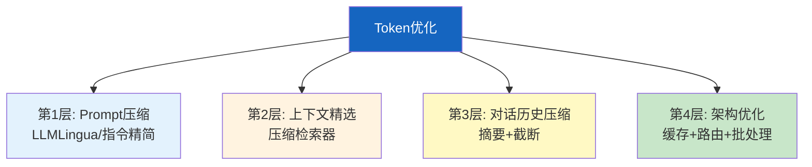
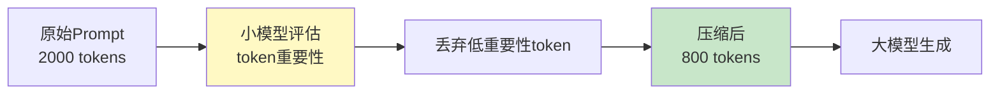

# Token 优化与上下文压缩图解

> 用图解理解 Token 成本来源、四层优化策略和对话历史压缩原理。

---

## 一、Token成本来源

```mermaid
graph TB
    subgraph 成本 &#123;"Token消耗"&#125;
        C1["系统提示 ~1000<br/>每次重复发送"]
        C2["检索上下文 ~5000<br/>RAG返回文档"]
        C3["对话历史 ~3000<br/>多轮累积"]
        C4["用户输入 ~200"]
        C5["LLM输出 ~500"]
    end

    style C2 fill:#FFCDD2,stroke:#C62828,stroke-width:3px
    style C3 fill:#FFE0B2,stroke:#E65100,stroke-width:3px
```

---

## 二、四层优化



---

## 三、LLMLingua压缩流程



---

## 四、上下文压缩检索

```mermaid
graph TB
    subgraph 传统 &#123;"传统RAG"&#125;
        Q1["查询"] --> S1["检索Top-K"] --> ALL["返回完整文档"] --> LLM1["全部发给LLM<br/>大量无关内容"]
    end

    subgraph 压缩 &#123;"压缩RAG"&#125;
        Q2["查询"] --> S2["检索Top-K"] --> COMP["LLM提取相关部分"] --> REL["只返回相关段落"] --> LLM2["精选内容<br/>Token减50-80%"]
    end

    style 传统 fill:#FFCDD2
    style 压缩 fill:#C8E6C9
    style COMP fill:#FFF9C4
```

---

## 五、对话历史压缩

```mermaid
graph TB
    subgraph 压缩前 &#123;"膨胀的对话历史"&#125;
        H1["轮1: 500t"]
        H2["轮2: 800t"]
        H3["轮3: 1200t"]
        H4["轮4: 2000t"]
        H1 & H2 & H3 & H4 --> T1["总计8000t<br/>每次重复发送"]
    end

    subgraph 压缩后 &#123;"摘要+保留近期"&#125;
        S["早期→摘要<br/>500t"]
        R["近2轮原文<br/>1500t"]
        S & R --> T2["总计2000t<br/>减少75%"]
    end

    style 压缩前 fill:#FFCDD2
    style 压缩后 fill:#C8E6C9
```

---

## 六、Token预算管理

```mermaid
graph TB
    M["计算消息总Token"] --> CHECK&#123;"超出预算？"&#125;
    CHECK -->|否| SEND["发送给LLM"]
    CHECK -->|是| TRIM["从最早消息裁剪"]
    TRIM --> KEEP["保留系统消息+近期对话"]
    KEEP --> CHECK

    style CHECK fill:#FFF9C4
    style TRIM fill:#FFCDD2
    style SEND fill:#C8E6C9
```

---

## 七、优化效果对比

```mermaid
graph TB
    subgraph 效果 &#123;"各层优化效果"&#125;
        E1["Prompt精简: -10~20%"]
        E2["上下文压缩: -30~50%"]
        E3["对话压缩: -50~70%"]
        E4["语义缓存: -20~40%"]
    end

    TOTAL["组合优化: -50~70%"]

    style 效果 fill:#E3F2FD
    style TOTAL fill:#C8E6C9
```

---

## 八、检查清单

| 检查项 | 状态 |
|--------|------|
| 精简了系统提示 | ☐ |
| 实现了上下文压缩检索 | ☐ |
| 实现了对话历史压缩 | ☐ |
| 有Token预算管理 | ☐ |
| 评估了优化效果 | ☐ |
