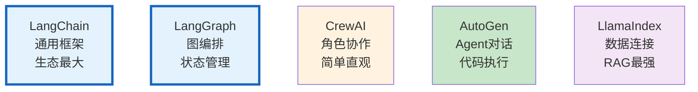
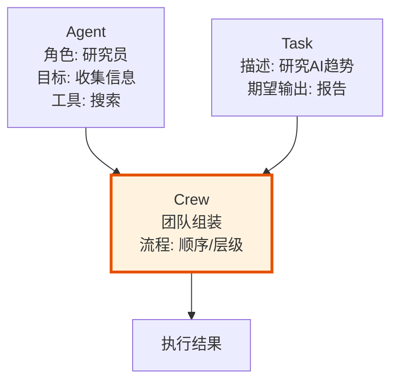
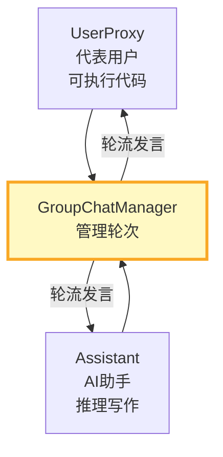
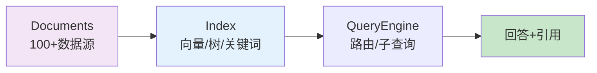
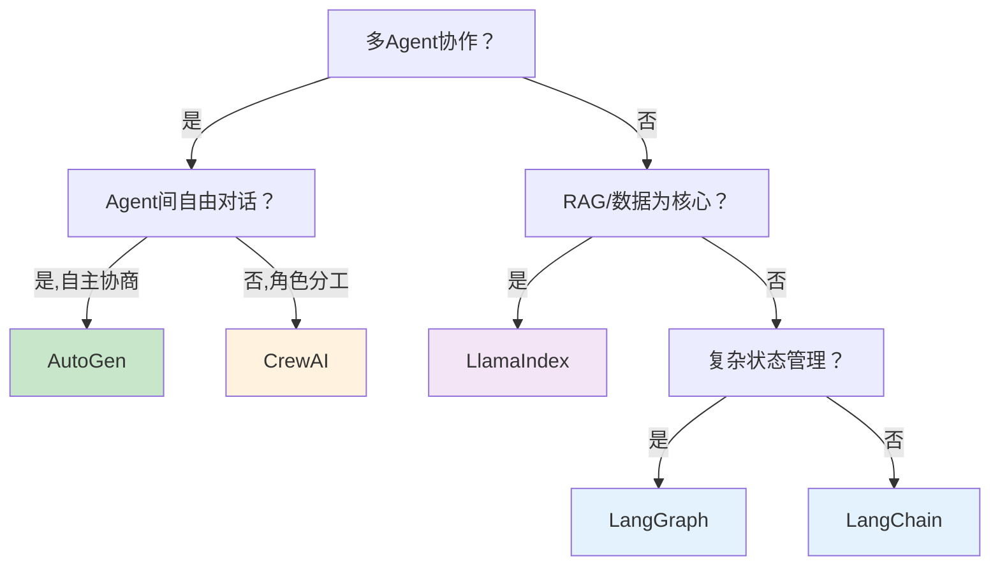

# LLM 框架竞品对比图解

> 用图解理解四大 LLM 框架的定位、架构理念和选型决策。

---

## 一、四大框架定位



---

## 二、架构理念

```mermaid
graph TB
    subgraph LC &#123;"LangChain: 组件化积木"&#125;
        L1["可组合组件<br/>Model/Prompt/Tool"] --> L2["LangGraph编排<br/>State→Node→Edge"]
    end

    subgraph CA &#123;"CrewAI: 模拟人类团队"&#125;
        C1["Agent(角色)<br/>+Task(任务)"] --> C2["Crew(团队)<br/>Sequential/Hierarchical"]
    end

    subgraph AG &#123;"AutoGen: Agent对话"&#125;
        A1["ConversableAgent"] --> A2["GroupChat<br/>自由协商"]
    end

    subgraph LI &#123;"LlamaIndex: 数据→索引→查询"&#125;
        I1["Document<br/>100+加载器"] --> I2["Index<br/>向量/树/关键词"] --> I3["QueryEngine"]
    end

    style LC fill:#E3F2FD
    style CA fill:#FFF3E0
    style AG fill:#C8E6C9
    style LI fill:#F3E5F5
```

---

## 三、CrewAI三要素



---

## 四、AutoGen对话模式



---

## 五、LlamaIndex数据管线



---

## 六、核心能力对比

```mermaid
graph TB
    subgraph 对比 &#123;"能力雷达"&#125;
        M1["多Agent: LC=✅ CA=✅ AG=✅ LI=⚠️"]
        M2["RAG: LC=✅ CA=⚠️ AG=⚠️ LI=✅✅"]
        M3["状态管理: LC=✅✅ CA=⚠️ AG=⚠️ LI=⚠️"]
        M4["代码执行: LC=✅ CA=✅ AG=✅✅ LI=✅"]
        M5["可观测: LC=✅✅ CA=⚠️ AG=⚠️ LI=✅"]
    end

    style 对比 fill:#E3F2FD
```

---

## 七、选型决策



---

## 八、混合使用

```mermaid
graph LR
    subgraph 混合 &#123;"取长补短"&#125;
        LI2["LlamaIndex<br/>检索+索引"] --> LG2["LangGraph<br/>编排+状态"]
        LG2 --> LC2["LangChain<br/>工具+组件"]
    end

    style 混合 fill:#C8E6C9
```

---

## 九、检查清单

| 检查项 | 状态 |
|--------|------|
| 理解四大框架定位 | ☐ |
| 知道CrewAI角色+任务模型 | ☐ |
| 知道AutoGen对话+代码执行 | ☐ |
| 知道LlamaIndex索引优势 | ☐ |
| 能根据场景选框架 | ☐ |
