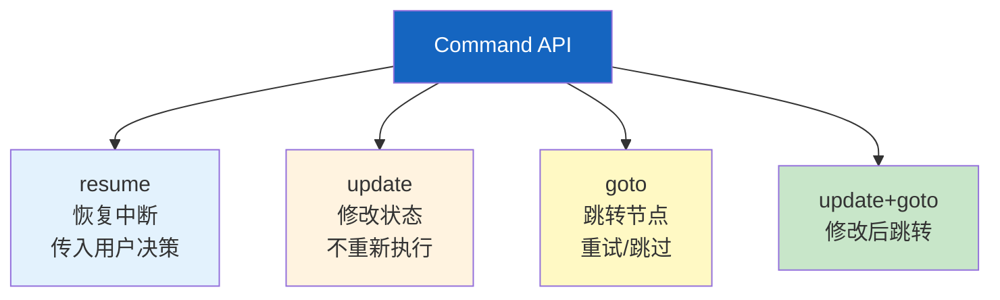
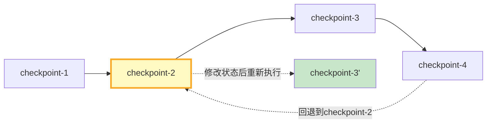
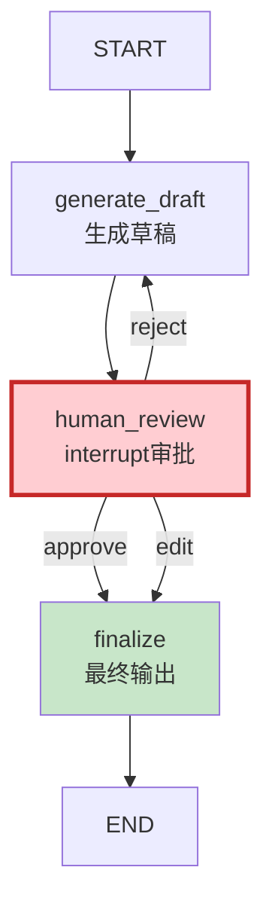

# LangGraph Command API 图解

> 用图解理解 Command 的四种模式、update_state 用法和时间旅行。

---

## 一、Command解决什么

```mermaid
graph TB
    subgraph 没有 &#123;"没有Command"&#125;
        N1["执行到一半"] --> N2["想改状态？❌ 重跑"]
        N3["interrupt后"] --> N4["想传数据？❌ 只能重跑"]
    end

    subgraph 有Command &#123;"有Command"&#125;
        C1["resume: 恢复+传数据 ✅"]
        C2["update: 修改状态 ✅"]
        C3["goto: 跳转节点 ✅"]
    end

    style 没有 fill:#FFCDD2
    style 有Command fill:#C8E6C9
```

---

## 二、四种模式



---

## 三、resume恢复流程

```mermaid
sequenceDiagram
    participant U as 用户
    participant A as Agent
    participant T as 工具

    U->>A: 请求
    A->>T: 调用工具
    T-->>A: interrupt()暂停
    A-->>U: 等待审批
    U->>A: Command(resume=&#123;approved:True&#125;)
    A->>T: 恢复执行
    T-->>A: 完成
    A-->>U: 结果
```



---

## 四、update修改状态

```mermaid
graph TB
    S1["当前状态: tier=standard"] --> UPDATE["Command(update=&#123;tier: vip&#125;)"]
    UPDATE --> S2["状态变为: tier=vip<br/>不重新执行"]
    S2 --> NEXT["下次invoke用新状态"]

    style UPDATE fill:#FFF9C4
    style S2 fill:#C8E6C9
```



---

## 五、goto跳转

```mermaid
graph TB
    A["step_a"] --> R["router"]
    R -->|正常| B["step_b"]
    R -->|Command(goto=step_a)| A
    R -->|Command(goto=step_c)| C["step_c"]

    style R fill:#FFF9C4
```

---

## 六、update_state外部修改

```mermaid
graph TB
    subgraph 用法 &#123;"update_state用法"&#125;
        S1["图已执行到step_c"] --> US["外部调用update_state"]
        US --> MOD["修改State字段"]
        MOD --> NEXT["下次invoke用新状态"]
    end

    subgraph 场景 &#123;"典型场景"&#125;
        SC1["人工修正中间结果"]
        SC2["调试注入测试数据"]
        SC3["管理员覆盖决策"]
    end

    style 用法 fill:#E3F2FD
    style 场景 fill:#FFF9C4
```

---

## 七、时间旅行



---

## 八、完整审批工作流



---

## 九、检查清单

| 检查项 | 状态 |
|--------|------|
| 理解四种Command模式 | ☐ |
| 能用resume恢复interrupt | ☐ |
| 能用update修改状态 | ☐ |
| 能用goto跳转 | ☐ |
| 理解update_state | ☐ |
| 能实现时间旅行 | ☐ |
| 能构建审批工作流 | ☐ |
