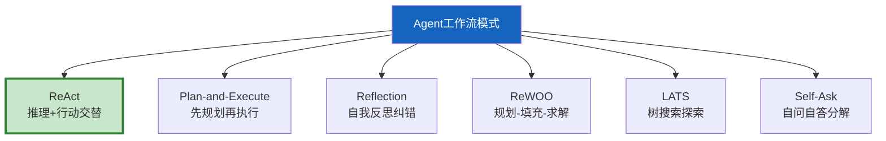
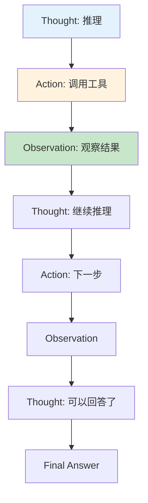
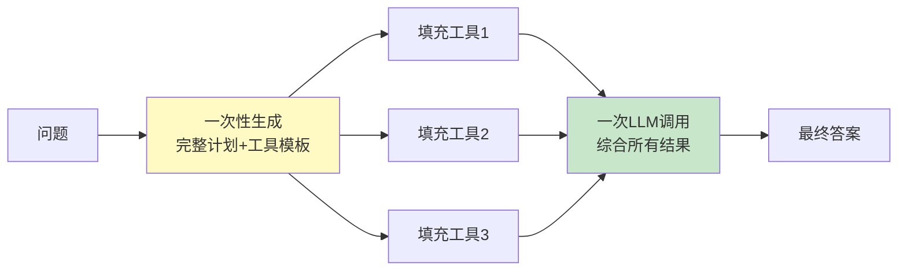
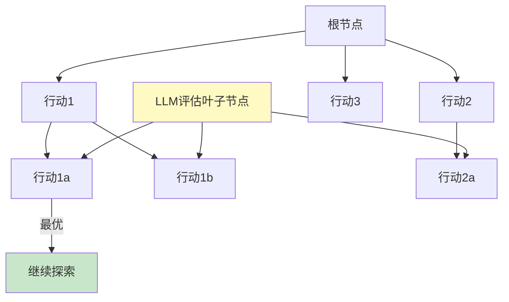
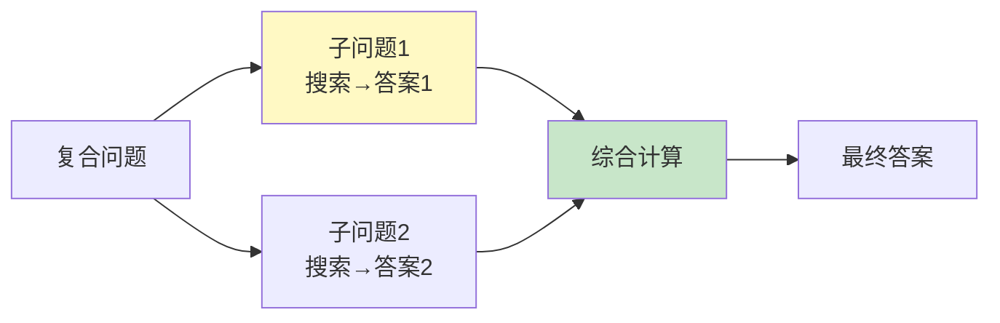
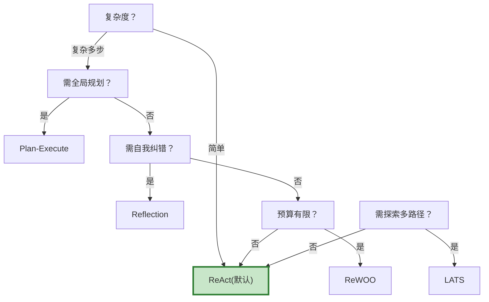

# Agent 工作流模式图解

> 用图解理解 6 种 Agent 推理模式的原理、流程和选型决策。

---

## 一、6种模式总览



---

## 二、ReAct循环



---

## 三、Plan-and-Execute

```mermaid
graph TB
    Q["问题"] --> PLANNER["Planner<br/>生成完整计划"]
    PLANNER --> S1["步骤1"]
    PLANNER --> S2["步骤2"]
    PLANNER --> S3["步骤3"]
    S1 --> EXEC["Executor<br/>逐步执行"]
    S2 --> EXEC
    S3 --> EXEC
    EXEC --> REPLAN&#123;"需要重新规划？"&#125;
    REPLAN -->|是| PLANNER
    REPLAN -->|否| FINAL["综合输出"]

    style PLANNER fill:#FFF9C4,stroke:#F9A825,stroke-width:3px
    style REPLAN fill:#FFF3E0
```

---

## 四、Reflection循环

```mermaid
graph TB
    Q["问题"] --> GEN["生成初始回答"]
    GEN --> REFLECT["反思评估"]
    REFLECT --> CHECK&#123;"有问题？"&#125;
    CHECK -->|是| REVISE["改进回答"]
    REVISE --> REFLECT
    CHECK -->|否| FINAL["输出"]
    CHECK -->|超过N次| FINAL

    style REFLECT fill:#FFF9C4,stroke:#F9A825,stroke-width:3px
    style REVISE fill:#FFCDD2
    style FINAL fill:#C8E6C9
```

---

## 五、ReWOO



---

## 六、LATS树搜索



---

## 七、Self-Ask



---

## 八、选型决策



---

## 九、模式对比

| 模式 | LLM调用 | 规划 | 纠错 | 场景 |
|------|---------|------|------|------|
| ReAct | 多 | 无 | 无 | 通用 |
| Plan-Execute | 中 | 全局 | 有 | 复杂任务 |
| Reflection | 多 | 无 | 强 | 高质量 |
| ReWOO | 少(2次) | 全局 | 无 | 预算有限 |
| LATS | 最多 | 全局 | 强 | 需最优解 |
| Self-Ask | 中 | 分解 | 无 | 事实问答 |

---

## 十、检查清单

| 检查项 | 状态 |
|--------|------|
| 理解6种模式区别 | ☐ |
| 能用ReAct(默认) | ☐ |
| 能实现Plan-Execute | ☐ |
| 能实现Reflection | ☐ |
| 知道何时选哪种 | ☐ |
