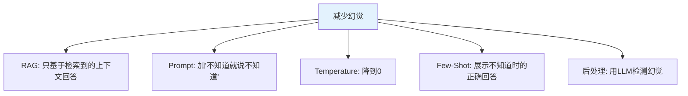
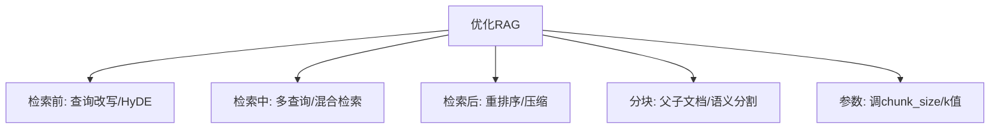
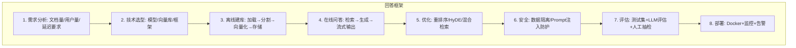

# 知识检验题库与面试准备

> 每学完一个阶段，用这套题库检验掌握程度。附详细答案解析。

---

## 一、基础篇检验（第 00-05 课）

### 选择题

**1. 以下关于 LLM 的说法，错误的是？**
- A. LLM 每次调用都是独立的，不记得上一次对话
- B. Token 是 LLM 处理文本的基本单位
- C. Temperature 越高，输出越确定
- D. 一个中文字大约消耗 1.5 个 Token

答案

C。Temperature 越高输出越不确定（更有创意/随机），越低越确定。

**2. LCEL 管道符 `prompt | llm | parser` 中，数据类型的正确流转是？**
- A. dict → str → dict
- B. dict → ChatPromptValue → AIMessage → str
- C. str → dict → str
- D. dict → AIMessage → ChatPromptValue → str

答案

B。PromptTemplate 输入 dict 输出 ChatPromptValue；ChatOpenAI 接收 ChatPromptValue 输出 AIMessage；StrOutputParser 接收 AIMessage 输出 str。

**3. 以下哪个不是 Runnable 接口的方法？**
- A. invoke
- B. stream
- C. batch
- D. parallel

答案

D。Runnable 有 invoke/stream/batch/ainvoke/abatch/astream，但没有 parallel。并行用 RunnableParallel 类。

### 判断题

**4. RunnableWithMessageHistory 可以自动管理对话历史。**

答案

√。它通过 session_id 自动加载和保存对话历史。

**5. Few-Shot Prompt 的示例越多效果越好。**

答案

×。通常 2-5 个示例效果最佳，太多会浪费 Token 且可能让 LLM 困惑。

### 简答题

**6. 解释 Chain 和 Agent 的核心区别。**

参考答案

Chain 是固定流程，步骤预先确定；Agent 是动态决策，LLM 根据输入决定使用哪些工具、执行什么操作。Chain 适合流程确定的场景，Agent 适合需要判断的场景。

**7. 为什么需要 StrOutputParser？**

参考答案

LLM 返回的是 AIMessage 对象（包含 content、metadata、tool_calls 等），StrOutputParser 只提取 content 字符串，简化后续处理。

---

## 二、进阶篇检验（第 06-08 课）

### 选择题

**8. Agent Executor 的 max_iterations 参数的作用是？**
- A. 设置 LLM 的最大输出 Token 数
- B. 限制 Agent 的最大循环次数，防止无限循环
- C. 设置并行执行的最大数量
- D. 设置重试次数

答案

B。max_iterations 限制 Agent 的"思考-行动"循环次数。

**9. RAG 中 chunk_overlap 的作用是？**
- A. 增加向量维度
- B. 确保相邻文本块有重叠，保持上下文连贯
- C. 减少检索结果数量
- D. 提高向量化速度

答案

B。overlap 让相邻块有重叠内容，防止在边界处断裂丢失上下文。

### 简答题

**10. 简述 RAG 的完整流程。**

参考答案

离线阶段：文档加载 → 文本分割 → 向量化 → 存入向量数据库。
在线阶段：用户问题向量化 → 向量数据库检索 Top-K → 将检索结果作为上下文传给 LLM → LLM 生成回答。

**11. 列举至少 3 种降低 LLM 调用成本的方法。**

参考答案

1. 使用更便宜的模型（GPT-4o-mini 代替 GPT-4o）
2. 启用缓存（InMemoryCache/SQLiteCache）
3. 截断对话历史（只保留最近 N 轮）
4. 减小 RAG 的 k 值
5. 设置 max_tokens 限制输出
6. 精简 System Prompt

---

## 三、LangGraph 篇检验（第 09-11 课）

### 选择题

**12. LangGraph 中 `Annotated[list, add]` 的含义是？**
- A. 列表类型的注解
- B. 使用 add 作为 Reducer，节点返回的新值会追加到列表
- C. 列表只能添加不能删除
- D. 列表的初始值为空

答案

B。add 是 Reducer，当节点返回 &#123;messages: [new_msg]&#125; 时，new_msg 会追加到现有列表而非替换。

**13. 以下哪种图模式不能在 LangGraph 中实现？**
- A. 线性流程
- B. 条件分支
- C. 循环
- D. 随机跳转（无规则）

答案

D。LangGraph 的路由由条件边的路由函数决定，必须有逻辑。不能随机跳转。

### 简答题

**14. 解释 Human-in-the-Loop 的实现方式。**

参考答案

使用 checkpointer + interrupt_before。图编译时指定要在哪个节点前暂停。运行时执行到该节点前会暂停，返回当前 State。人工审查后可以用 update_state 修改 State，再用 invoke(None) 继续执行。

**15. 什么是 Reducer？为什么需要它？**

参考答案

Reducer 定义了 State 字段被节点更新时的合并方式。默认是替换。使用 Annotated[list, add] 可以让新值追加而非替换。这在管理消息列表时很重要——每个节点返回新消息时需要追加到已有列表而非覆盖。

---

## 四、面试高频问题

### Q1: 如何减少 LLM 的幻觉？

### Q2: Chain vs Agent vs LangGraph 分别什么时候用？

| 场景 | 选择 | 原因 |
|------|------|------|
| 翻译/摘要（固定步骤） | Chain | 流程确定，简单高效 |
| 需要工具但不复杂 | Agent | LLM 决定用哪个工具 |
| 需要循环/分支/HIL | LangGraph | 支持复杂控制流 |
| 多Agent协作 | LangGraph | 支持多节点编排 |

### Q3: 如何优化 RAG 的检索质量？

### Q4: 如何评估 LLM 应用的质量？

1. 建立测试数据集（20-50 个问答对）
2. 规则评估（关键词检查、格式检查）
3. LLM 评估（用 GPT-4o-mini 评分）
4. 人工抽检（10% 人工复核）
5. 生产监控（LangSmith 持续追踪）

### Q5: 描述你如何从零构建一个企业级 RAG 系统

---

## 五、自测评分标准

| 得分 | 评价 | 建议 |
|------|------|------|
| 15/15 | 优秀 | 可以进入实战项目 |
| 12-14 | 良好 | 巩固薄弱点后继续 |
| 9-11 | 合格 | 重读相关课程 |
| <9 | 需要加强 | 重新学习，多做练习 |
