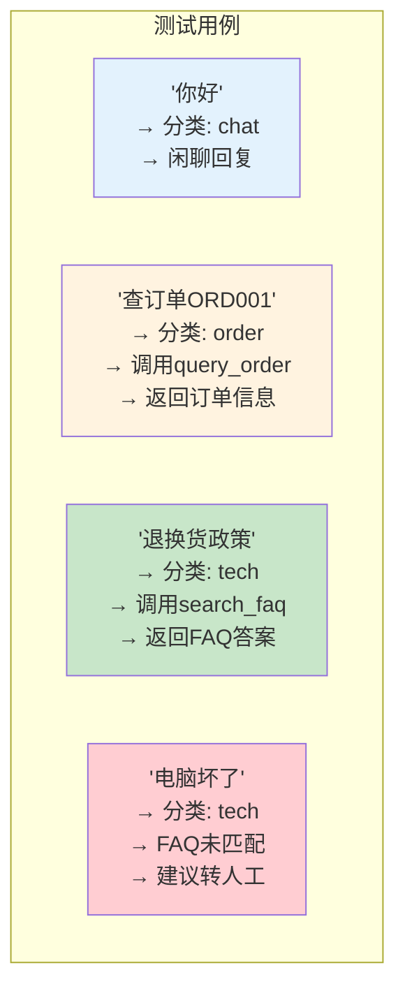

# 实战案例 01：智能客服机器人

> 用 LangChain + LangGraph 构建一个能处理多种问题的客服机器人，支持多轮对话、工具调用和智能路由。

---

## 一、项目背景与目标

### 背景

传统客服机器人的问题：只能按关键词匹配回复，无法理解上下文，无法调用外部系统。用 LLM 可以构建真正"智能"的客服。

### 目标

构建一个客服机器人，能够：

1. 多轮对话，记住用户信息
2. 根据问题类型智能路由（技术问题/订单查询/闲聊）
3. 调用工具（查询订单、搜索FAQ）
4. 无法回答时礼貌转人工

### 架构

```mermaid
graph TB
    U([用户输入]) --> CLASSIFY["分类节点<br/>判断问题类型"]

    CLASSIFY -->|"技术问题"| TECH["技术支持Agent<br/>+FAQ搜索工具"]
    CLASSIFY -->|"订单查询"| ORDER["订单Agent<br/>+订单查询工具"]
    CLASSIFY -->|"闲聊/其他"| CHAT["通用聊天Agent"]

    TECH --> CHECK&#123;"解决了吗?"&#125;
    ORDER --> CHECK
    CHAT --> CHECK

    CHECK -->|"是"| OUT([输出回复])
    CHECK -->|"否，需转人工"| HUMAN["转人工提示"]

    HUMAN --> OUT

    style U fill:#E3F2FD
    style CLASSIFY fill:#FFF9C4
    style TECH fill:#E3F2FD
    style ORDER fill:#FFF3E0
    style CHAT fill:#F3E5F5
    style CHECK fill:#FFE0B2
    style OUT fill:#C8E6C9
    style HUMAN fill:#FFCDD2
```

## 二、技术栈与依赖

```bash
pip install langchain langchain-openai langgraph python-dotenv
```

前置课程：第 04 课（Memory）、第 06 课（Agents）、第 09 课（LangGraph 入门）

## 三、完整代码实现

### 3.1 项目结构

```
customer_service_bot/
├── .env
├── main.py           ← 主入口与图定义
├── tools.py          ← 工具定义
├── state.py          ← State 定义
└── faq.txt           ← FAQ 知识库
```

### 3.2 State 定义

```python
# state.py
from typing import TypedDict, Annotated
from operator import add
from langchain_core.messages import AnyMessage

class CustomerServiceState(TypedDict):
    messages: Annotated[list[AnyMessage], add]  # 对话历史
    user_id: str                                  # 用户标识
    query_type: str                               # 问题类型: tech/order/chat
    resolved: bool                                # 是否已解决
    escalation: bool                              # 是否需要转人工
```

### 3.3 工具定义

```python
# tools.py
from langchain_core.tools import tool

# 模拟订单数据库
ORDERS_DB = &#123;
    "ORD001": &#123;"item": "无线蓝牙耳机", "status": "已发货", "eta": "明天送达", "amount": "299元"&#125;,
    "ORD002": &#123;"item": "手机壳", "status": "待发货", "eta": "1-2个工作日", "amount": "39元"&#125;,
    "ORD003": &#123;"item": "USB-C充电器", "status": "已签收", "eta": "已送达", "amount": "59元"&#125;,
&#125;

@tool
def query_order(order_id: str) -> str:
    """根据订单号查询订单状态。当用户询问订单进度、物流、发货状态时使用此工具。
    
    Args:
        order_id: 订单号，格式为ORD后跟3位数字，如ORD001
    """
    order = ORDERS_DB.get(order_id.upper())
    if order:
        return f"订单&#123;order_id&#125;：商品=&#123;order['item']&#125;，状态=&#123;order['status']&#125;，预计=&#123;order['eta']&#125;，金额=&#123;order['amount']&#125;"
    return f"未找到订单号 &#123;order_id&#125;，请确认订单号是否正确。"

@tool
def search_faq(query: str) -> str:
    """在FAQ知识库中搜索常见问题答案。当用户询问技术问题、使用方法、退换货政策时使用。
    
    Args:
        query: 搜索关键词
    """
    faqs = &#123;
        "退换货": "7天内无理由退换货，请保留商品完好和包装。在订单页面点击'申请退换'即可。",
        "保修": "电子产品提供1年免费保修，非人为损坏可免费维修或更换。",
        "支付方式": "支持微信、支付宝、银行卡支付，下单后24小时内完成支付。",
        "发票": "电子发票在订单完成后自动发送至注册邮箱，纸质发票需联系客服补发。",
        "配送": "全国大部分地区次日达，偏远地区3-5天。满99元免运费。",
    &#125;
    for keyword, answer in faqs.items():
        if keyword in query:
            return f"FAQ匹配结果：&#123;answer&#125;"
    return "未在FAQ中找到相关内容，建议转人工客服获取帮助。"
```

### 3.4 主程序与图定义

```python
# main.py
import sys
from dotenv import load_dotenv
from typing import TypedDict, Annotated
from operator import add
from langchain_openai import ChatOpenAI
from langchain_core.messages import SystemMessage, HumanMessage, AIMessage, AnyMessage
from langchain_core.prompts import ChatPromptTemplate
from langchain_core.output_parsers import StrOutputParser
from langgraph.graph import StateGraph, START, END
from langgraph.checkpoint.memory import MemorySaver

load_dotenv()
llm = ChatOpenAI(model="gpt-4o-mini", temperature=0)

from tools import query_order, search_faq
from state import CustomerServiceState

# ========== 节点定义 ==========

def classify_node(state: CustomerServiceState) -> dict:
    """分类节点：判断用户问题类型"""
    last_msg = state["messages"][-1].content
    prompt = ChatPromptTemplate.from_template(
        """分析用户问题，判断属于以下哪种类型，只返回类型名称：
        - tech: 技术问题、使用方法、退换货政策、保修等
        - order: 订单查询、物流跟踪、发货状态
        - chat: 闲聊、问候、其他一般性问题
        
        用户问题：&#123;question&#125;
        只返回 tech / order / chat 中的一个词。"""
    )
    chain = prompt | llm | StrOutputParser()
    result = chain.invoke(&#123;"question": last_msg&#125;).strip().lower()
    if result not in ("tech", "order", "chat"):
        result = "chat"
    return &#123;"query_type": result&#125;

def tech_agent_node(state: CustomerServiceState) -> dict:
    """技术支持Agent：使用FAQ搜索"""
    last_msg = state["messages"][-1].content
    faq_result = search_faq.invoke(&#123;"query": last_msg&#125;)
    
    prompt = ChatPromptTemplate.from_template(
        """你是技术支持客服。根据FAQ搜索结果回答用户问题。
        如果FAQ结果不能解决用户问题，说明可能需要转人工。
        
        FAQ搜索结果：&#123;faq_result&#125;
        用户问题：&#123;question&#125;
        
        请给出有帮助的回答。"""
    )
    chain = prompt | llm | StrOutputParser()
    answer = chain.invoke(&#123;"faq_result": faq_result, "question": last_msg&#125;)
    
    needs_human = "转人工" in answer or "无法" in answer
    return &#123;
        "messages": [AIMessage(content=answer)],
        "resolved": not needs_human,
        "escalation": needs_human,
    &#125;

def order_agent_node(state: CustomerServiceState) -> dict:
    """订单Agent：使用订单查询工具"""
    last_msg = state["messages"][-1].content
    
    # 让LLM提取订单号
    extract_prompt = ChatPromptTemplate.from_template(
        "从以下文本中提取订单号（ORD后跟数字）。如果没有订单号返回'NONE'。\n文本：&#123;text&#125;\n只返回订单号或NONE。"
    )
    extract_chain = extract_prompt | llm | StrOutputParser()
    order_id = extract_chain.invoke(&#123;"text": last_msg&#125;).strip()
    
    if order_id and order_id != "NONE":
        order_result = query_order.invoke(&#123;"order_id": order_id&#125;)
        answer = f"查询结果：&#123;order_result&#125;\n\n还有其他订单需要查询吗？"
        return &#123;
            "messages": [AIMessage(content=answer)],
            "resolved": True,
            "escalation": False,
        &#125;
    else:
        answer = "我可以帮您查询订单状态。请提供您的订单号（格式：ORD后跟数字，如ORD001）。"
        return &#123;
            "messages": [AIMessage(content=answer)],
            "resolved": False,
            "escalation": False,
        &#125;

def chat_agent_node(state: CustomerServiceState) -> dict:
    """通用聊天Agent"""
    prompt = ChatPromptTemplate.from_messages([
        ("system", "你是友好的客服助手。对于闲聊类问题给予热情回应。如果用户提到技术或订单问题，引导他们详细描述。"),
        ("human", "&#123;input&#125;"),
    ])
    chain = prompt | llm | StrOutputParser()
    answer = chain.invoke(&#123;"input": state["messages"][-1].content&#125;)
    return &#123;
        "messages": [AIMessage(content=answer)],
        "resolved": True,
        "escalation": False,
    &#125;

def escalation_node(state: CustomerServiceState) -> dict:
    """转人工节点"""
    return &#123;
        "messages": [AIMessage(
            content="抱歉，我暂时无法完全解决您的问题。"
                    "已为您转接人工客服，请稍候，客服人员将很快与您联系。"
                    "您也可以拨打客服热线 400-XXX-XXXX。"
        )],
        "escalation": True,
    &#125;

# ========== 路由函数 ==========

def route_by_type(state: CustomerServiceState) -> str:
    """根据分类结果路由"""
    qtype = state.get("query_type", "chat")
    return &#123;"tech": "tech_agent", "order": "order_agent", "chat": "chat_agent"&#125;.get(qtype, "chat_agent")

def route_after_agent(state: CustomerServiceState) -> str:
    """根据解决情况决定是否转人工"""
    if state.get("escalation", False):
        return "escalate"
    return "end"

# ========== 构建图 ==========

graph = StateGraph(CustomerServiceState)

graph.add_node("classify", classify_node)
graph.add_node("tech_agent", tech_agent_node)
graph.add_node("order_agent", order_agent_node)
graph.add_node("chat_agent", chat_agent_node)
graph.add_node("escalate", escalation_node)

graph.add_edge(START, "classify")

graph.add_conditional_edges(
    "classify",
    route_by_type,
    &#123;"tech_agent": "tech_agent", "order_agent": "order_agent", "chat_agent": "chat_agent"&#125;
)

for agent in ["tech_agent", "order_agent", "chat_agent"]:
    graph.add_conditional_edges(
        agent,
        route_after_agent,
        &#123;"escalate": "escalate", "end": END&#125;
    )

graph.add_edge("escalate", END)

app = graph.compile(checkpointer=MemorySaver())

# ========== 运行 ==========

def chat():
    print("=" * 50)
    print("  智能客服机器人 (输入 quit 退出)")
    print("=" * 50)
    
    config = &#123;"configurable": &#123;"thread_id": "customer_001"&#125;&#125;
    
    while True:
        user_input = input("\n👤 用户: ").strip()
        if user_input.lower() == "quit":
            print("👋 感谢使用，再见！")
            break
        if not user_input:
            continue
        
        result = app.invoke(
            &#123;
                "messages": [HumanMessage(content=user_input)],
                "user_id": "user_001",
                "query_type": "",
                "resolved": False,
                "escalation": False,
            &#125;,
            config=config
        )
        
        # 输出最后一条AI消息
        last_ai = [m for m in result["messages"] if isinstance(m, AIMessage)]
        if last_ai:
            print(f"\n🤖 客服: &#123;last_ai[-1].content&#125;")
            qtype = result.get("query_type", "")
            print(f"   [分类: &#123;qtype&#125; | 已解决: &#123;result.get('resolved', False)&#125;]")

if __name__ == "__main__":
    chat()
```

## 四、运行与测试

```bash
# 1. 配置 .env
echo "OPENAI_API_KEY=你的密钥" > .env

# 2. 运行
python main.py

# 3. 测试对话
# 输入: "你好"
# 输入: "帮我查一下订单 ORD001"
# 输入: "你们的退换货政策是什么？"
# 输入: "我的电脑开不了机怎么办"
```

### 测试矩阵



## 五、扩展方向

1. 接入真实订单数据库（MySQL/PostgreSQL）
2. 添加满意度评分节点（对话结束后自动评分）
3. 支持多语言（添加翻译节点）
4. 添加对话历史持久化（SQLite checkpointer）
5. 接入企业微信/钉钉 Webhook
