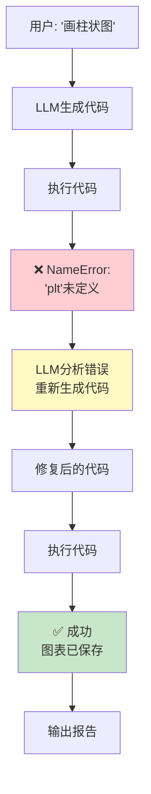

# 实战案例 04：数据分析对话助手

> 用 LangGraph + Python 工具构建一个能执行代码、分析数据、生成图表的对话助手。

---

## 一、项目背景与目标

### 背景

数据分析工作中大量重复性操作可以用 AI 自动化：用户描述需求 → AI 写代码执行 → 返回分析结果和图表。

### 目标

1. 用户用自然语言描述分析需求
2. AI 生成 Python 代码并执行
3. 自动生成数据分析和可视化
4. 支持多轮对话追问
5. 安全执行用户代码（沙箱隔离）

### 架构

```mermaid
graph TB
    U([用户: "分析这份数据的分布"]) --> UNDERSTAND

    subgraph 分析流程 ["LangGraph 工作流"]
        UNDERSTAND["理解节点<br/>分析用户意图<br/>确认数据文件"]
        UNDERSTAND --> CODE_GEN["代码生成节点<br/>LLM生成Python代码"]
        CODE_GEN --> EXEC["代码执行节点<br/>沙箱执行<br/>捕获输出/图表"]
        EXEC --> CHECK&#123;"执行成功?"&#125;
        CHECK -->|"成功"| REPORT["报告节点<br/>总结结果<br/>展示图表"]
        CHECK -->|"失败"| FIX["修复节点<br/>LLM分析错误<br/>重新生成代码"]
        FIX --> CODE_GEN
    end

    REPORT --> OUT([输出: 文本+图表])
    
    DATA[("📊 data.csv")] --> UNDERSTAND

    style U fill:#E3F2FD
    style UNDERSTAND fill:#FFF9C4
    style CODE_GEN fill:#FFE0B2
    style EXEC fill:#F3E5F5
    style CHECK fill:#FFE0B2
    style REPORT fill:#C8E6C9
    style FIX fill:#FFCDD2
    style DATA fill:#E3F2FD
```

## 二、技术栈与依赖

```bash
pip install langchain langchain-openai langgraph python-dotenv pandas matplotlib
```

前置课程：第 06 课（Agents/Tools）、第 09-10 课（LangGraph）

## 三、完整代码实现

### 3.1 项目结构

```
data_analyst/
├── .env
├── main.py              ← 主入口与图定义
├── state.py             ← State 定义
├── code_executor.py     ← 安全代码执行器
└── data/                ← 数据目录
    └── sales.csv        ← 示例数据
```

### 3.2 State 定义

```python
# state.py
from typing import TypedDict, Annotated
from operator import add
from langchain_core.messages import AnyMessage

class AnalysisState(TypedDict):
    messages: Annotated[list[AnyMessage], add]   # 对话历史
    user_request: str                              # 用户请求
    data_file: str                                  # 数据文件路径
    generated_code: str                             # 生成的Python代码
    execution_output: str                           # 执行输出
    chart_path: str                                  # 图表文件路径
    error: str                                       # 错误信息
    retry_count: int                                 # 重试次数
    final_report: str                               # 最终报告
```

### 3.3 安全代码执行器

```python
# code_executor.py
import io
import sys
import os
import contextlib
import traceback

def execute_python_code(code: str, output_dir: str = "output") -> dict:
    """
    安全执行Python代码。
    返回 &#123;"output": "...", "error": "...", "chart_path": "..."&#125;
    """
    os.makedirs(output_dir, exist_ok=True)
    
    # 重定向标准输出
    old_stdout = sys.stdout
    old_stderr = sys.stderr
    stdout_buffer = io.StringIO()
    
    # 注入环境变量
    chart_path = os.path.join(output_dir, "chart.png")
    exec_globals = &#123;
        "pd": __import__("pandas"),
        "plt": __import__("matplotlib.pyplot", fromlist=["pyplot"]),
        "np": __import__("numpy"),
        "os": os,
        "OUTPUT_DIR": output_dir,
        "CHART_PATH": chart_path,
    &#125;
    
    # matplotlib 非交互模式
    exec_globals["plt"].switch_backend("Agg")
    
    result = &#123;"output": "", "error": "", "chart_path": ""&#125;
    
    try:
        with contextlib.redirect_stdout(stdout_buffer):
            exec(code, exec_globals)
        
        result["output"] = stdout_buffer.getvalue()
        
        # 检查是否生成了图表
        if os.path.exists(chart_path):
            result["chart_path"] = chart_path
        
    except Exception as e:
        result["error"] = f"&#123;type(e).__name__&#125;: &#123;str(e)&#125;\n&#123;traceback.format_exc()&#125;"
    finally:
        sys.stdout = old_stdout
        sys.stderr = old_stderr
    
    return result
```

### 3.4 主程序与图定义

```python
# main.py
import os
from dotenv import load_dotenv
from typing import TypedDict, Annotated
from operator import add
from langchain_openai import ChatOpenAI
from langchain_core.prompts import ChatPromptTemplate
from langchain_core.output_parsers import StrOutputParser
from langchain_core.messages import HumanMessage, AIMessage, AnyMessage
from langgraph.graph import StateGraph, START, END
from langgraph.checkpoint.memory import MemorySaver

load_dotenv()
llm = ChatOpenAI(model="gpt-4o-mini", temperature=0)

from code_executor import execute_python_code

# ========== State ==========
class AnalysisState(TypedDict):
    messages: Annotated[list[AnyMessage], add]
    user_request: str
    data_file: str
    generated_code: str
    execution_output: str
    chart_path: str
    error: str
    retry_count: int
    final_report: str

# ========== 节点 ==========

def understand_node(state: AnalysisState) -> dict:
    """理解用户需求，确认数据文件"""
    request = state["user_request"]
    data_file = state.get("data_file", "data/sales.csv")
    
    prompt = ChatPromptTemplate.from_template(
        "用户想要分析数据。请求：&#123;request&#125;\n数据文件：&#123;data_file&#125;\n"
        "请用一句话确认分析任务。"
    )
    chain = prompt | llm | StrOutputParser()
    confirmation = chain.invoke(&#123;"request": request, "data_file": data_file&#125;)
    
    return &#123;
        "messages": [AIMessage(content=f"📊 &#123;confirmation&#125;")],
        "data_file": data_file,
    &#125;

def code_gen_node(state: AnalysisState) -> dict:
    """生成Python代码"""
    request = state["user_request"]
    data_file = state["data_file"]
    error = state.get("error", "")
    retry_count = state.get("retry_count", 0)
    
    error_hint = ""
    if error:
        error_hint = f"""
上次执行出错，请修复：
错误信息：&#123;error&#125;

请修正代码。"""
    
    prompt = ChatPromptTemplate.from_template(
        """你是数据分析专家。根据用户需求生成Python代码。

环境：
- pandas 已导入为 pd
- matplotlib.pyplot 已导入为 plt
- numpy 已导入为 np
- 数据文件路径：&#123;data_file&#125;
- 图表保存路径：CHART_PATH 变量（已定义）
- plt 已设为非交互模式（Agg后端）

要求：
1. 先用 pd.read_csv() 读取数据文件
2. 按用户需求分析
3. 如果需要图表，用 plt.savefig(CHART_PATH) 保存
4. 打印关键分析结果（用 print）
5. 只输出Python代码，不要解释

用户需求：&#123;request&#125;&#123;error_hint&#125;"""
    )
    chain = prompt | llm | StrOutputParser()
    code = chain.invoke(&#123;
        "request": request,
        "data_file": data_file,
        "error_hint": error_hint,
    &#125;)
    
    # 清理代码块标记
    code = code.replace("```python", "").replace("```", "").strip()
    
    return &#123;"generated_code": code, "retry_count": retry_count + 1&#125;

def execute_node(state: AnalysisState) -> dict:
    """执行代码"""
    code = state["generated_code"]
    result = execute_python_code(code)
    
    return &#123;
        "execution_output": result["output"],
        "chart_path": result["chart_path"],
        "error": result["error"],
    &#125;

def check_node(state: AnalysisState) -> dict:
    """检查执行结果（不修改State，只用于路由）"""
    return &#123;&#125;

def report_node(state: AnalysisState) -> dict:
    """生成最终报告"""
    output = state.get("execution_output", "")
    chart = state.get("chart_path", "")
    code = state.get("generated_code", "")
    
    report = f"📊 分析结果：\n\n&#123;output&#125;\n"
    if chart:
        report += f"\n📈 图表已保存：&#123;chart&#125;\n"
    report += f"\n📝 执行的代码：\n```python\n&#123;code&#125;\n```"
    
    return &#123;
        "final_report": report,
        "messages": [AIMessage(content=report)],
        "error": "",  # 清除错误
    &#125;

# ========== 路由 ==========

def route_after_check(state: AnalysisState) -> str:
    """执行成功→报告，失败→修复"""
    if state.get("error"):
        if state.get("retry_count", 0) >= 3:
            return "report"  # 超过重试，直接报告错误
        return "fix"
    return "report"

# ========== 构建图 ==========

graph = StateGraph(AnalysisState)

graph.add_node("understand", understand_node)
graph.add_node("code_gen", code_gen_node)
graph.add_node("execute", execute_node)
graph.add_node("check", check_node)
graph.add_node("report", report_node)

graph.add_edge(START, "understand")
graph.add_edge("understand", "code_gen")
graph.add_edge("code_gen", "execute")
graph.add_edge("execute", "check")

graph.add_conditional_edges(
    "check",
    route_after_check,
    &#123;"fix": "code_gen", "report": "report"&#125;
)

graph.add_edge("report", END)

app = graph.compile(checkpointer=MemorySaver())

# ========== 准备示例数据 ==========

def prepare_sample_data():
    """创建示例CSV数据"""
    data_dir = "data"
    os.makedirs(data_dir, exist_ok=True)
    
    csv_path = os.path.join(data_dir, "sales.csv")
    if not os.path.exists(csv_path):
        import csv
        import random
        
        with open(csv_path, "w", newline="", encoding="utf-8") as f:
            writer = csv.writer(f)
            writer.writerow(["date", "product", "region", "quantity", "price", "total"])
            
            products = ["耳机", "手机壳", "充电器", "数据线", "音箱"]
            regions = ["华北", "华东", "华南", "西南", "西北"]
            
            for month in range(1, 13):
                for day in range(1, 29, 7):
                    for _ in range(5):
                        product = random.choice(products)
                        region = random.choice(regions)
                        qty = random.randint(1, 50)
                        price = round(random.uniform(29, 499), 2)
                        total = round(qty * price, 2)
                        date = f"2024-&#123;month:02d&#125;-&#123;day:02d&#125;"
                        writer.writerow([date, product, region, qty, price, total])
        
        print(f"✅ 已创建示例数据：&#123;csv_path&#125;")
    
    return csv_path

# ========== 运行 ==========

def main():
    print("=" * 55)
    print("  数据分析对话助手")
    print("=" * 55)
    
    csv_path = prepare_sample_data()
    
    history = []
    config = &#123;"configurable": &#123;"thread_id": "analysis_001"&#125;&#125;
    
    print("\n💡 输入分析需求（quit退出）\n")
    print("示例：")
    print("  - 各产品销量排名")
    print("  - 各区域销售额对比，画柱状图")
    print("  - 月度销售趋势，画折线图\n")
    
    while True:
        user_input = input("👤 你: ").strip()
        if user_input.lower() == "quit":
            break
        if not user_input:
            continue
        
        result = app.invoke(
            &#123;
                "messages": [HumanMessage(content=user_input)] + history,
                "user_request": user_input,
                "data_file": csv_path,
                "generated_code": "",
                "execution_output": "",
                "chart_path": "",
                "error": "",
                "retry_count": 0,
                "final_report": "",
            &#125;,
            config=config
        )
        
        print(f"\n🤖 助手: &#123;result['final_report']&#125;\n")
        
        history.append(HumanMessage(content=user_input))
        history.append(AIMessage(content=result["final_report"]))

if __name__ == "__main__":
    main()
```

## 四、运行与测试

```bash
# 1. 配置
echo "OPENAI_API_KEY=你的密钥" > .env

# 2. 运行
python main.py

# 3. 测试
# 输入: "各产品销量排名"
# 输入: "各区域销售额对比，画柱状图"
# 输入: "月度销售趋势，画折线图"
```

### 代码自纠错流程



## 五、扩展方向

1. 支持更多数据格式（Excel、JSON、SQL数据库）
2. 添加数据清洗节点（自动检测缺失值、异常值）
3. 生成 HTML 交互式报告
4. 集成 seaborn/plotly 更丰富的可视化
5. 添加代码安全沙箱（subprocess + timeout）
