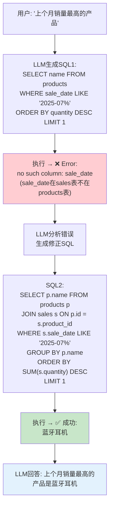

# 实战案例 06：SQL 数据分析 Agent

> 用 LangGraph 构建一个能用自然语言查询数据库的智能 Agent，支持 SQL 自纠错和多轮对话。

---

## 一、项目背景与目标

### 背景

非技术人员需要查数据但不会写 SQL。SQL Agent 让他们用自然语言提问，系统自动生成并执行 SQL，用自然语言返回结果。

### 目标

1. 用户用自然语言提问，自动生成 SQL 查询
2. SQL 执行失败时自动修复重试
3. 支持多轮对话追问（"那个产品的销售额呢？"）
4. 返回结果时附带 SQL 和数据

### 架构

```mermaid
graph TB
    U([用户提问]) --> SCHEMA["获取表结构"]
    SCHEMA --> GEN["LLM生成SQL"]
    GEN --> EXEC["执行SQL"]
    EXEC --> CHECK&#123;"成功?"&#125;
    CHECK -->|"是"| ANSWER["LLM基于结果回答"]
    CHECK -->|"否"| FIX["LLM分析错误"]
    FIX --> GEN
    ANSWER --> OUT([输出: 自然语言回答 + SQL])
    ANSWER --> HIST["更新对话历史"]

    style U fill:#E3F2FD
    style GEN fill:#FFF9C4
    style EXEC fill:#FFE0B2
    style CHECK fill:#FFF9C4
    style FIX fill:#FFCDD2
    style ANSWER fill:#C8E6C9
```

## 二、技术栈与依赖

```bash
pip install langchain langchain-openai langgraph python-dotenv
```

前置课程：第 06 课（Agents）、第 09-10 课（LangGraph）
关联知识库：[SQL 数据库 Agent](../知识库/22-SQL数据库Agent.md)

## 三、完整代码实现

```python
import sqlite3
import os
from dotenv import load_dotenv
from typing import TypedDict, Annotated
from operator import add
from langchain_openai import ChatOpenAI
from langchain_core.prompts import ChatPromptTemplate, MessagesPlaceholder
from langchain_core.output_parsers import StrOutputParser
from langchain_core.messages import HumanMessage, AIMessage, AnyMessage
from langgraph.graph import StateGraph, START, END
from langgraph.checkpoint.memory import MemorySaver

load_dotenv()
llm = ChatOpenAI(model="gpt-4o-mini", temperature=0)

# ========== 准备数据库 ==========

def create_sample_db(db_path: str = "sales.db"):
    """创建示例销售数据库"""
    if os.path.exists(db_path):
        return db_path

    conn = sqlite3.connect(db_path)
    cursor = conn.cursor()

    cursor.execute("""
        CREATE TABLE products (
            id INTEGER PRIMARY KEY,
            name TEXT NOT NULL,
            category TEXT,
            price REAL,
            stock INTEGER
        )
    """)

    cursor.execute("""
        CREATE TABLE sales (
            id INTEGER PRIMARY KEY,
            product_id INTEGER,
            quantity INTEGER,
            sale_date TEXT,
            region TEXT,
            total_amount REAL,
            FOREIGN KEY (product_id) REFERENCES products(id)
        )
    """)

    products = [
        (1, "蓝牙耳机", "电子产品", 299.0, 50),
        (2, "手机壳", "配件", 39.0, 200),
        (3, "USB充电器", "电子产品", 59.0, 100),
        (4, "数据线", "配件", 19.0, 300),
        (5, "智能音箱", "电子产品", 499.0, 30),
    ]

    import random
    from datetime import datetime, timedelta

    sales = []
    regions = ["华北", "华东", "华南", "西南", "西北"]
    for _ in range(200):
        pid = random.choice([1, 2, 3, 4, 5])
        qty = random.randint(1, 10)
        days_ago = random.randint(0, 90)
        date = (datetime.now() - timedelta(days=days_ago)).strftime("%Y-%m-%d")
        region = random.choice(regions)
        price = [p[3] for p in products if p[0] == pid][0]
        total = round(qty * price, 2)
        sales.append((None, pid, qty, date, region, total))

    cursor.executemany("INSERT INTO products VALUES (?,?,?,?,?)", products)
    cursor.executemany("INSERT INTO sales VALUES (?,?,?,?,?,?)", sales)
    conn.commit()
    conn.close()
    print(f"✅ 数据库创建完成: &#123;db_path&#125;")
    return db_path

db_path = create_sample_db()

def get_schema() -> str:
    """获取数据库表结构"""
    conn = sqlite3.connect(db_path)
    cursor = conn.cursor()

    schema_lines = []
    for table_name in ["products", "sales"]:
        cursor.execute(f"PRAGMA table_info(&#123;table_name&#125;)")
        columns = cursor.fetchall()
        col_defs = [f"&#123;c[1]&#125; &#123;c[2]&#125;" for c in columns]
        schema_lines.append(f"表 &#123;table_name&#125; (&#123;', '.join(col_defs)&#125;)")

        # 获取示例数据
        cursor.execute(f"SELECT * FROM &#123;table_name&#125; LIMIT 2")
        rows = cursor.fetchall()
        if rows:
            for row in rows:
                schema_lines.append(f"  示例: &#123;row&#125;")

    conn.close()
    return "\n".join(schema_lines)

def execute_sql(sql: str) -> tuple[str, str]:
    """执行SQL，返回(结果, 错误)"""
    try:
        conn = sqlite3.connect(db_path)
        cursor = conn.cursor()
        cursor.execute(sql)
        rows = cursor.fetchall()

        if not rows:
            return "(无数据)", ""

        # 获取列名
        col_names = [desc[0] for desc in cursor.description]
        result_lines = [" | ".join(col_names)]
        for row in rows[:20]:  # 限制返回行数
            result_lines.append(" | ".join(str(v) for v in row))

        conn.close()
        return "\n".join(result_lines), ""
    except Exception as e:
        return "", str(e)

# ========== State 定义 ==========

class SQLState(TypedDict):
    messages: Annotated[list[AnyMessage], add]
    question: str
    schema_info: str
    sql: str
    result: str
    error: str
    retry: int
    answer: str

# ========== 节点定义 ==========

def generate_sql_node(state: SQLState) -> dict:
    """LLM生成SQL"""
    schema = state.get("schema_info", get_schema())
    error_hint = ""

    if state.get("error"):
        error_hint = f"""
上次执行的SQL出错：
SQL: &#123;state.get('sql', '')&#125;
错误: &#123;state['error']&#125;
请修正SQL。"""

    # 包含对话历史以支持追问
    history = state.get("messages", [])
    history_text = ""
    for msg in history[-6:]:  # 最近3轮
        if hasattr(msg, 'content'):
            history_text += f"&#123;msg.type&#125;: &#123;msg.content[:200]&#125;\n"

    prompt = ChatPromptTemplate.from_template(
        """你是SQL专家。根据用户问题生成SQLite查询语句。

数据库表结构：
&#123;schema&#125;

对话历史：
&#123;history&#125;

规则：
1. 只输出SQL语句，不要解释
2. 使用SQLite兼容语法
3. 只查询(SELECT)，不修改数据
4. 结果限制最多20行(LIMIT 20)
5. 如果是追问，参考对话历史理解上下文

用户问题：&#123;question&#125;&#123;error_hint&#125;

SQL："""
    )
    chain = prompt | llm | StrOutputParser()
    sql = chain.invoke(&#123;
        "schema": schema,
        "history": history_text or "(无历史)",
        "question": state["question"],
        "error_hint": error_hint,
    &#125;).strip()

    # 清理SQL
    if "```" in sql:
        sql = sql.replace("```sql", "").replace("```", "").strip()
    sql = sql.split("\n")[0] if "\n" in sql and not sql.lower().startswith("select") else sql

    return &#123;"sql": sql, "retry": state.get("retry", 0) + 1&#125;

def execute_node(state: SQLState) -> dict:
    """执行SQL"""
    result, error = execute_sql(state["sql"])
    return &#123;"result": result, "error": error&#125;

def route_after_exec(state: SQLState) -> str:
    """路由：成功→回答，失败→修复"""
    if state.get("error"):
        if state.get("retry", 0) >= 3:
            return "answer"
        return "fix"
    return "answer"

def answer_node(state: SQLState) -> dict:
    """基于查询结果回答"""
    if state.get("error") and state.get("retry", 0) >= 3:
        answer = f"查询失败，已重试&#123;state['retry']&#125;次。错误：&#123;state['error']&#125;"
        return &#123;"answer": answer, "messages": [AIMessage(content=answer)]&#125;

    prompt = ChatPromptTemplate.from_template(
        """基于SQL查询结果回答用户问题。

用户问题：&#123;question&#125;
执行的SQL：&#123;sql&#125;
查询结果：
&#123;result&#125;

请用自然语言简洁回答（中文），包含关键数据。如果结果为空，说明可能没有相关数据。

回答："""
    )
    chain = prompt | llm | StrOutputParser()
    answer = chain.invoke(&#123;
        "question": state["question"],
        "sql": state["sql"],
        "result": state.get("result", "(无数据)"),
    &#125;)

    # 在回答中附带SQL
    full_answer = f"&#123;answer&#125;\n\n📝 SQL: `&#123;state['sql']&#125;`"

    return &#123;"answer": full_answer, "messages": [AIMessage(content=full_answer)]&#125;

# ========== 构建图 ==========

graph = StateGraph(SQLState)
graph.add_node("generate", generate_sql_node)
graph.add_node("execute", execute_node)
graph.add_node("answer", answer_node)

graph.add_edge(START, "generate")
graph.add_edge("generate", "execute")
graph.add_conditional_edges(
    "execute",
    route_after_exec,
    &#123;"fix": "generate", "answer": "answer"&#125;
)
graph.add_edge("answer", END)

app = graph.compile(checkpointer=MemorySaver())

# ========== 运行 ==========

def main():
    print("=" * 55)
    print("  SQL 数据分析 Agent")
    print("=" * 55)

    print("\n📋 数据库表结构：")
    print(get_schema())

    print("\n💡 输入自然语言查询（quit退出）\n")
    print("示例：")
    print("  - 销量最高的产品是什么？")
    print("  - 各区域的总销售额")
    print("  - 电子产品有多少库存？")
    print("  - 那个产品的利润呢？（追问）\n")

    config = &#123;"configurable": &#123;"thread_id": "sql_session_001"&#125;&#125;

    while True:
        user_input = input("👤 你: ").strip()
        if user_input.lower() == "quit":
            break
        if not user_input:
            continue

        result = app.invoke(
            &#123;
                "messages": [HumanMessage(content=user_input)],
                "question": user_input,
                "schema_info": get_schema(),
                "sql": "",
                "result": "",
                "error": "",
                "retry": 0,
                "answer": "",
            &#125;,
            config=config
        )

        print(f"\n🤖 助手: &#123;result['answer']&#125;")
        if result.get("retry", 0) > 1:
            print(f"   (SQL经过&#123;result['retry']&#125;次修复)")
        print()

if __name__ == "__main__":
    main()
```

## 四、运行与测试

```bash
# 1. 配置
echo "OPENAI_API_KEY=你的密钥" > .env

# 2. 运行
python main.py

# 3. 测试对话
# 问: "销量最高的产品是什么？"
# 问: "各区域的总销售额"
# 问: "电子产品的平均价格是多少？"
# 问: "那个产品卖了多少件？"（追问，测试多轮对话）
```

## 五、SQL 自纠错流程示例



## 六、扩展方向

1. 接入 MySQL/PostgreSQL（改连接字符串）
2. 添加图表生成（SQL结果→matplotlib图表）
3. 支持数据导出（CSV/Excel）
4. 添加表关系图可视化
5. 支持复杂分析（同环比、趋势预测）
6. 添加权限控制（按用户限制可查询的表）
