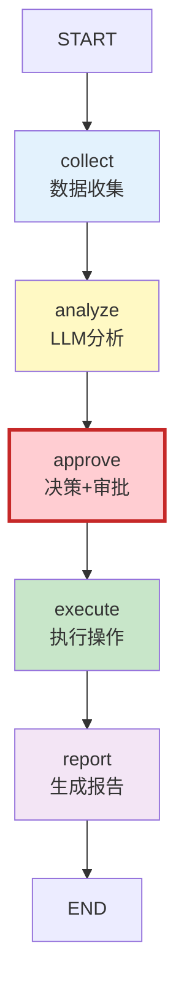
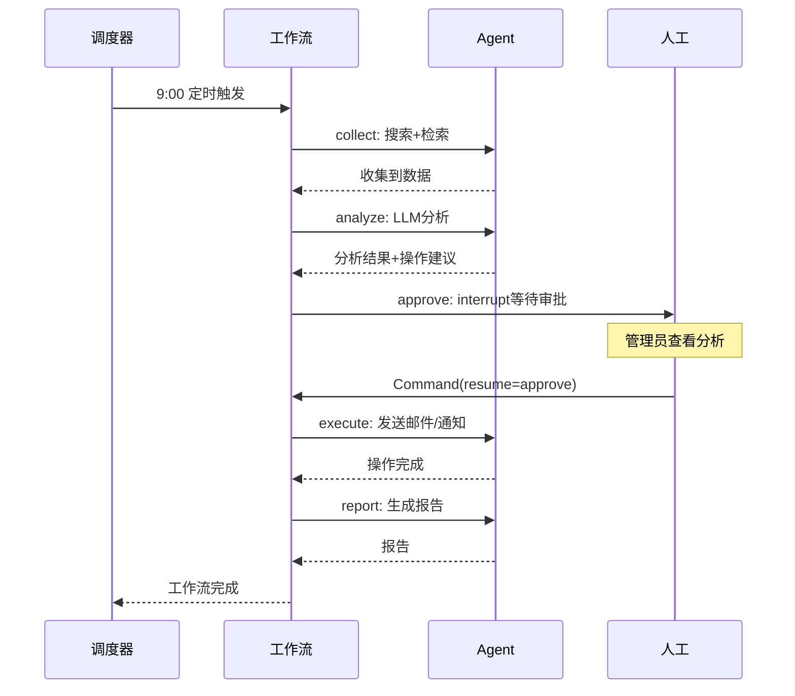

# 实战案例 09：自动化工作流 Agent

> 在企业环境中，大量日常任务需要多步骤编排：收集信息→分析决策→执行操作→通知结果。这个案例构建一个自动化工作流 Agent，能定时触发、多步执行、人工审批关键操作、自动发送通知。

---

## 一、案例概述

```mermaid
graph TB
    subgraph 场景 &#123;"自动化工作流场景"&#125;
        T["定时触发<br/>每日早上9点"] --> S1["收集数据<br/>搜索+检索知识库"]
        S1 --> S2["分析数据<br/>LLM分析趋势"]
        S2 --> S3&#123;"需要执行操作？"&#125;
        S3 -->|是| APPROVAL["人工审批<br/>interrupt"]
        APPROVAL -->|批准| EXEC["执行操作<br/>发送邮件/通知"]
        APPROVAL -->|拒绝| LOG["记录日志"]
        S3 -->|否| REPORT["生成报告"]
        EXEC --> REPORT
        REPORT --> NOTIFY["发送通知<br/>邮件/消息"]
    end

    style T fill:#E3F2FD
    style S1 fill:#FFF3E0
    style S2 fill:#FFF9C4
    style APPROVAL fill:#FFCDD2,stroke:#C62828,stroke-width:3px
    style EXEC fill:#C8E6C9
    style NOTIFY fill:#F3E5F5
```

**核心技术栈：** LangGraph 状态管理 + interrupt 人机交互 + Command 恢复 + 工具集成 + 定时调度

**适合学完：** 第 09-11 课 + 知识库 114（Functional API）+ 知识库 127（Command API）

---

## 二、系统架构

```mermaid
graph TB
    subgraph 架构 &#123;"自动化工作流Agent架构"&#125;
        SCHEDULER["调度器<br/>APScheduler<br/>定时触发"]

        subgraph WORKFLOW &#123;"LangGraph工作流"&#125;
            COLLECT["数据收集节点<br/>搜索+知识库检索"]
            ANALYZE["分析节点<br/>LLM分析"]
            DECIDE["决策节点<br/>是否需要操作"]
            APPROVE["审批节点<br/>interrupt暂停"]
            EXECUTE["执行节点<br/>发送邮件/通知"]
            REPORT["报告节点<br/>生成日报"]
        end

        TOOLS["工具层<br/>搜索/邮件/知识库"]
        CHECKPOINTER["检查点<br/>PostgreSQL"]
        STORE["长期存储<br/>历史报告"]

        SCHEDULER --> WORKFLOW
        WORKFLOW --> TOOLS
        WORKFLOW --> CHECKPOINTER
        WORKFLOW --> STORE
    end

    style SCHEDULER fill:#E3F2FD
    style WORKFLOW fill:#FFF3E0,stroke:#E65100,stroke-width:2px
    style APPROVE fill:#FFCDD2
    style TOOLS fill:#C8E6C9
```

---

## 三、State 定义

```python
from typing import TypedDict, Annotated
from langgraph.graph.message import add_messages
from datetime import datetime

class WorkflowState(TypedDict):
    # 输入
    task_id: str                           # 任务ID
    trigger_time: str                      # 触发时间
    workflow_config: dict                 # 工作流配置

    # 中间结果
    collected_data: Annotated[list[str], "add"]   # 收集的数据
    analysis_result: str                  # 分析结果
    action_items: list[dict]              # 待执行操作

    # 审批
    approval_status: str                  # pending/approved/rejected
    approval_feedback: str                # 审批反馈

    # 输出
    report: str                           # 最终报告
    notifications_sent: list[str]         # 已发送通知

    # 元数据
    started_at: str
    completed_at: str
```

---

## 四、节点实现

### 4.1 数据收集节点

```python
from langchain_core.tools import tool
from langchain_openai import ChatOpenAI

llm = ChatOpenAI(model="gpt-4o")

@tool
def search_web(query: str) -> str:
    """搜索网络获取最新信息"""
    # 实际接入搜索API（如Tavily, SerpAPI等）
    from langchain_community.tools.tavily_search import TavilySearchResults
    search = TavilySearchResults(max_results=3)
    results = search.invoke(query)
    return "\n".join([r["content"] for r in results])

@tool
def search_knowledge_base(query: str) -> str:
    """搜索内部知识库"""
    # 实际接入向量库
    from langchain_community.vectorstores import FAISS
    from langchain_openai import OpenAIEmbeddings
    # vectorstore = FAISS.load_local("kb_index", OpenAIEmbeddings())
    # docs = vectorstore.similarity_search(query, k=3)
    # return "\n".join([d.page_content for d in docs])
    return f"知识库检索结果: &#123;query&#125;"

async def collect_data(state: WorkflowState) -> dict:
    """数据收集节点：搜索网络+知识库"""
    config = state.get("workflow_config", &#123;&#125;)
    topics = config.get("topics", ["AI行业动态"])

    collected = []
    for topic in topics:
        # 网络搜索
        web_result = await search_web.ainvoke(&#123;"query": f"&#123;topic&#125; 最新动态 &#123;datetime.now().strftime('%Y-%m')&#125;"&#125;)
        collected.append(f"[Web搜索-&#123;topic&#125;]\n&#123;web_result[:500]&#125;")

        # 知识库检索
        kb_result = await search_knowledge_base.ainvoke(&#123;"query": topic&#125;)
        collected.append(f"[知识库-&#123;topic&#125;]\n&#123;kb_result[:500]&#125;")

    return &#123;
        "collected_data": collected,
        "started_at": datetime.now().isoformat(),
    &#125;
```

### 4.2 分析节点

```python
from langchain_core.messages import HumanMessage, SystemMessage

ANALYSIS_PROMPT = """你是一个数据分析师。请分析以下收集到的数据，输出：

1. 关键发现（3-5条）
2. 趋势分析
3. 需要执行的操作建议（如果有）
4. 风险提示

## 收集到的数据
&#123;data&#125;

## 输出格式
```json
&#123;&#123;
  "key_findings": ["发现1", "发现2"],
  "trends": "趋势分析...",
  "action_items": [
    &#123;&#123;"action": "发送邮件", "target": "manager@company.com", "reason": "..."&#125;&#125;
  ],
  "risks": ["风险1", "风险2"]
&#125;&#125;
```"""

async def analyze_data(state: WorkflowState) -> dict:
    """分析节点：LLM分析收集的数据"""
    data_text = "\n\n".join(state.get("collected_data", []))

    prompt = ANALYSIS_PROMPT.format(data=data_text[:3000])
    response = await llm.ainvoke([HumanMessage(content=prompt)])

    # 解析结构化输出
    import json, re
    json_match = re.search(r'\&#123;.*\&#125;', response.content, re.DOTALL)
    if json_match:
        analysis = json.loads(json_match.group())
    else:
        analysis = &#123;
            "key_findings": ["分析完成"],
            "trends": response.content[:500],
            "action_items": [],
            "risks": [],
        &#125;

    return &#123;
        "analysis_result": response.content,
        "action_items": analysis.get("action_items", []),
    &#125;
```

### 4.3 决策与审批节点

```python
from langgraph.types import interrupt, Command

async def decide_and_approve(state: WorkflowState) -> dict:
    """决策+审批节点：如果有操作则中断等待人工审批"""
    action_items = state.get("action_items", [])

    if not action_items:
        # 无需操作，直接进入报告
        return &#123;"approval_status": "not_required"&#125;

    # 有操作需要审批——中断
    approval = interrupt(&#123;
        "type": "workflow_approval",
        "task_id": state["task_id"],
        "actions": action_items,
        "analysis": state.get("analysis_result", "")[:500],
        "question": "以下操作需要您的审批，是否执行？",
    &#125;)

    action = approval.get("action", "reject")

    if action == "approve":
        return &#123;
            "approval_status": "approved",
            "approval_feedback": approval.get("feedback", ""),
        &#125;
    elif action == "edit":
        return &#123;
            "approval_status": "approved",
            "action_items": approval.get("modified_actions", action_items),
            "approval_feedback": "用户修改了操作内容",
        &#125;
    else:
        return &#123;
            "approval_status": "rejected",
            "approval_feedback": approval.get("feedback", "用户拒绝"),
        &#125;
```

### 4.4 执行节点

```python
@tool
def send_email(to: str, subject: str, body: str) -> str:
    """发送邮件"""
    # 实际接入邮件服务（如SMTP/SendGrid等）
    print(f"[邮件] 发送给: &#123;to&#125;, 主题: &#123;subject&#125;")
    return f"邮件已发送给&#123;to&#125;"

@tool
def send_message(channel: str, message: str) -> str:
    """发送消息通知（飞书/钉钉/Slack等）"""
    # 实际接入消息服务
    print(f"[通知] 频道: &#123;channel&#125;, 消息: &#123;message[:100]&#125;")
    return f"通知已发送到&#123;channel&#125;"

async def execute_actions(state: WorkflowState) -> dict:
    """执行节点：根据审批结果执行操作"""
    if state.get("approval_status") != "approved":
        return &#123;"notifications_sent": []&#125;

    notifications = []
    for item in state.get("action_items", []):
        action = item.get("action", "")

        if "邮件" in action or "email" in action.lower():
            result = await send_email.ainvoke(&#123;
                "to": item.get("target", ""),
                "subject": item.get("subject", "自动化工作流通知"),
                "body": item.get("reason", ""),
            &#125;)
            notifications.append(result)

        elif "通知" in action or "消息" in action:
            result = await send_message.ainvoke(&#123;
                "channel": item.get("target", ""),
                "message": item.get("reason", ""),
            &#125;)
            notifications.append(result)

    return &#123;"notifications_sent": notifications&#125;
```

### 4.5 报告节点

```python
REPORT_PROMPT = """基于以下信息生成一份简洁的工作流执行报告：

## 任务信息
- 任务ID: &#123;task_id&#125;
- 触发时间: &#123;trigger_time&#125;

## 数据分析
&#123;analysis&#125;

## 审批结果
- 状态: &#123;approval_status&#125;
- 反馈: &#123;feedback&#125;

## 执行的操作
&#123;actions&#125;

## 通知发送
&#123;notifications&#125;

请生成一份200字以内的执行摘要。"""

async def generate_report(state: WorkflowState) -> dict:
    """报告节点：生成执行报告"""
    actions_text = "\n".join(
        f"- &#123;a.get('action', '')&#125;: &#123;a.get('reason', '')&#125;"
        for a in state.get("action_items", [])
    ) or "无操作"

    notifications_text = "\n".join(
        f"- &#123;n&#125;" for n in state.get("notifications_sent", [])
    ) or "无通知"

    prompt = REPORT_PROMPT.format(
        task_id=state.get("task_id", ""),
        trigger_time=state.get("trigger_time", ""),
        analysis=state.get("analysis_result", "")[:500],
        approval_status=state.get("approval_status", ""),
        feedback=state.get("approval_feedback", ""),
        actions=actions_text,
        notifications=notifications_text,
    )

    response = await llm.ainvoke([HumanMessage(content=prompt)])

    return &#123;
        "report": response.content,
        "completed_at": datetime.now().isoformat(),
    &#125;
```

---

## 五、组装工作流

```python
from langgraph.graph import StateGraph, START, END
from langgraph.checkpoint.memory import MemorySaver

def build_workflow():
    """构建自动化工作流图"""
    graph = StateGraph(WorkflowState)

    # 注册节点
    graph.add_node("collect", collect_data)
    graph.add_node("analyze", analyze_data)
    graph.add_node("approve", decide_and_approve)
    graph.add_node("execute", execute_actions)
    graph.add_node("report", generate_report)

    # 连接边
    graph.add_edge(START, "collect")
    graph.add_edge("collect", "analyze")
    graph.add_edge("analyze", "approve")
    graph.add_edge("approve", "execute")
    graph.add_edge("execute", "report")
    graph.add_edge("report", END)

    return graph.compile(checkpointer=MemorySaver())

workflow = build_workflow()
```



---

## 六、定时调度

```python
from apscheduler.schedulers.asyncio import AsyncIOScheduler
from langgraph.types import Command
import asyncio

class WorkflowScheduler:
    """工作流调度器"""

    def __init__(self, workflow):
        self.workflow = workflow
        self.scheduler = AsyncIOScheduler()

    def add_daily_job(
        self,
        hour: int = 9,
        minute: int = 0,
        config: dict = None,
    ):
        """添加每日定时任务"""
        self.scheduler.add_job(
            self._run_workflow,
            "cron",
            hour=hour,
            minute=minute,
            args=[config or &#123;&#125;],
            id="daily_workflow",
        )

    async def _run_workflow(self, config: dict):
        """执行工作流"""
        import uuid
        task_id = str(uuid.uuid4())[:8]

        config_with_thread = &#123;
            "configurable": &#123;"thread_id": f"wf-&#123;task_id&#125;"&#125;,
        &#125;

        initial_state = &#123;
            "task_id": task_id,
            "trigger_time": datetime.now().isoformat(),
            "workflow_config": config,
            "collected_data": [],
            "action_items": [],
            "approval_status": "",
            "approval_feedback": "",
            "report": "",
            "notifications_sent": [],
            "started_at": "",
            "completed_at": "",
        &#125;

        # 执行工作流——可能会中断在审批节点
        result = await self.workflow.ainvoke(
            initial_state,
            config_with_thread,
        )

        # 检查是否中断
        if "__interrupt__" in result:
            print(f"[工作流 &#123;task_id&#125;] 等待审批...")
            # 通知审批人有待审批
            # 实际接入消息通知

        return result

    async def approve_workflow(self, thread_id: str, action: str, feedback: str = ""):
        """审批工作流"""
        config = &#123;"configurable": &#123;"thread_id": thread_id&#125;&#125;
        result = await self.workflow.ainvoke(
            Command(resume=&#123;"action": action, "feedback": feedback&#125;),
            config,
        )
        return result

    def start(self):
        self.scheduler.start()
        print("调度器已启动")

    def stop(self):
        self.scheduler.shutdown()
        print("调度器已停止")
```

---

## 七、使用示例

```python
# 初始化
scheduler = WorkflowScheduler(workflow)

# 配置：每天早上9点执行，关注AI和科技行业
scheduler.add_daily_job(
    hour=9,
    minute=0,
    config=&#123;
        "topics": ["AI行业动态", "科技行业趋势", "竞品分析"],
    &#125;,
)

scheduler.start()

# --- 模拟审批流程 ---
# 工作流在审批节点中断后，通过API恢复

# 审批通过
# result = await scheduler.approve_workflow(
#     thread_id="wf-abc123",
#     action="approve",
#     feedback="同意执行",
# )

# 审批拒绝
# result = await scheduler.approve_workflow(
#     thread_id="wf-abc123",
#     action="reject",
#     feedback="暂不执行，数据不够充分",
# )

# 修改后批准
# result = await scheduler.approve_workflow(
#     thread_id="wf-abc123",
#     action="edit",
#     modified_actions=[&#123;"action": "发送邮件", "target": "boss@company.com", "subject": "日报"&#125;],
# )
```

---

## 八、完整执行时序



---

## 九、扩展方向

| 扩展 | 说明 | 难度 |
|------|------|------|
| 多渠道通知 | 飞书/钉钉/Slack/邮件 | ★☆☆ |
| 多级审批 | 超过阈值需多人审批 | ★★☆ |
| 条件分支 | 根据分析结果走不同路径 | ★★☆ |
| 历史报告对比 | 与上次报告对比变化 | ★★☆ |
| 异常告警 | 工作流失败时自动告警 | ★☆☆ |
| Web Dashboard | 可视化查看执行状态 | ★★★ |

---

## 十、检查清单

| 检查项 | 状态 |
|--------|------|
| 理解工作流的整体架构 | ☐ |
| 实现了数据收集节点 | ☐ |
| 实现了LLM分析节点 | ☐ |
| 实现了interrupt审批流程 | ☐ |
| 能用Command恢复执行 | ☐ |
| 实现了定时调度 | ☐ |
| 有报告生成 | ☐ |
| 理解扩展方向 | ☐ |
