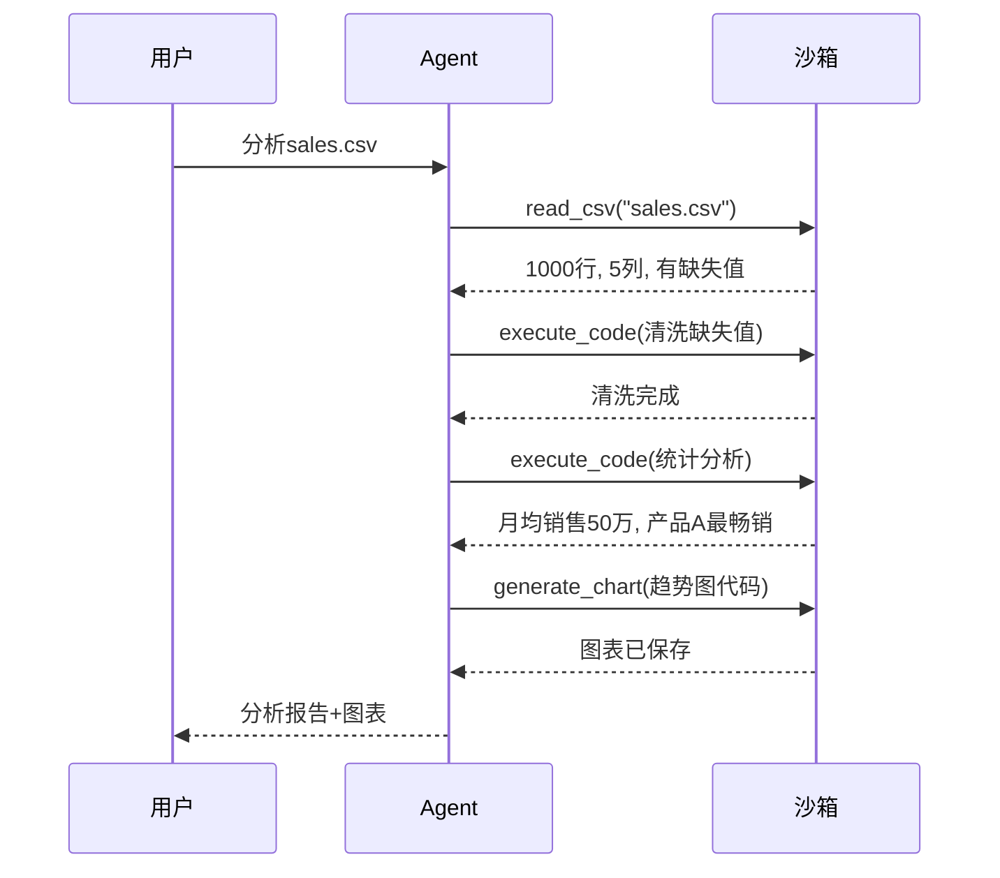

# 实战案例 12：数据科学分析 Agent

> 数据科学家日常：加载数据→清洗→分析→可视化→写报告——每步都写代码。如果 Agent 能自动完成这个流程呢？这个案例构建一个数据科学 Agent，能自主加载数据、执行分析代码、生成图表、撰写洞察报告。综合运用代码执行沙箱、工具调用和结果验证。

---

## 一、案例概述

```mermaid
graph TB
    subgraph 系统 &#123;"数据科学分析Agent"&#125;
        U["用户: '分析这个CSV'"] --> AGENT["Agent"]
        AGENT --> LOAD["加载数据<br/>pandas读取"]
        AGENT --> CLEAN["数据清洗<br/>处理缺失值/异常值"]
        AGENT --> ANALYZE["统计分析<br/>描述统计/相关性"]
        AGENT --> VIZ["可视化<br/>matplotlib画图"]
        AGENT --> REPORT["生成报告<br/>文字+图表+洞察"]
        LOAD & CLEAN & ANALYZE & VIZ --> REPORT
        REPORT --> OUT["分析报告"]
    end

    style AGENT fill:#1565C0,color:#fff
    style VIZ fill:#FFF3E0
    style REPORT fill:#C8E6C9
```

**核心技术栈：** 代码执行沙箱（知识库134）+ Agent 工具调用 + pandas/matplotlib + 报告生成

**适合学完：** 知识库 134（代码沙箱）+ 知识库 118（预构建Agent）

---

## 二、系统架构

```mermaid
graph TB
    subgraph 架构 &#123;"数据科学Agent架构"&#125;
        USER["用户上传数据"] --> AGENT["LangGraph Agent<br/>create_react_agent"]
        AGENT --> TOOLS["工具集"]
        TOOLS --> T1["execute_code<br/>沙箱执行Python"]
        TOOLS --> T2["read_data<br/>读取CSV/Excel"]
        TOOLS --> T3["generate_chart<br/>生成图表"]
        AGENT --> SANDBOX["代码沙箱<br/>Docker隔离"]
        SANDBOX --> T1
        AGENT --> REPORT["报告生成<br/>Markdown+图表"]
    end

    style AGENT fill:#1565C0,color:#fff
    style SANDBOX fill:#C8E6C9,stroke:#2E7D32,stroke-width:3px
```

---

## 三、工具实现

### 3.1 代码执行工具

```python
from langchain_core.tools import tool
import subprocess
import tempfile
import os

@tool
def execute_code(code: str) -> str:
    """执行Python代码并返回结果。

    可用于数据分析、计算、可视化。
    支持pandas、numpy、matplotlib等库。

    Args:
        code: Python代码

    Returns:
        执行输出（stdout + stderr）
    """
    # 创建临时文件
    with tempfile.NamedTemporaryFile(
        mode="w", suffix=".py", delete=False
    ) as f:
        f.write(code)
        code_file = f.name

    try:
        # 在沙箱中执行（简化版，生产用Docker沙箱）
        result = subprocess.run(
            ["python3", code_file],
            capture_output=True,
            text=True,
            timeout=30,
            env=&#123;
                "PATH": os.environ.get("PATH", ""),
                "HOME": "/tmp",
                "MPLBACKEND": "Agg",  # matplotlib无显示模式
            &#125;,
        )

        output = ""
        if result.stdout:
            output += f"输出:\n&#123;result.stdout[:5000]&#125;\n"
        if result.stderr:
            output += f"错误:\n&#123;result.stderr[:2000]&#125;\n"
        output += f"退出码: &#123;result.returncode&#125;"

        return output

    except subprocess.TimeoutExpired:
        return "错误: 代码执行超时（30秒）"
    finally:
        os.unlink(code_file)
```

### 3.2 数据读取工具

```python
@tool
def read_csv(file_path: str) -> str:
    """读取CSV文件并返回数据概览。

    Args:
        file_path: CSV文件路径

    Returns:
        数据概览：行数、列名、前5行、数据类型
    """
    code = f"""
import pandas as pd
df = pd.read_csv("&#123;file_path&#125;")
print(f"行数: &#123;&#123;len(df)&#125;&#125;")
print(f"列数: &#123;&#123;len(df.columns)&#125;&#125;")
print(f"\\n列名和数据类型:")
print(df.dtypes)
print(f"\\n前5行:")
print(df.head().to_string())
print(f"\\n数值列统计:")
print(df.describe().to_string())
print(f"\\n缺失值:")
print(df.isnull().sum())
"""
    return execute_code.invoke(&#123;"code": code&#125;)
```

### 3.3 图表生成工具

```python
@tool
def generate_chart(
    code: str,
    output_path: str = "/tmp/chart.png",
) -> str:
    """生成图表并保存。

    代码中应包含matplotlib绘图代码。
    图表会保存到output_path。

    Args:
        code: matplotlib绘图代码
        output_path: 输出路径

    Returns:
        执行结果
    """
    full_code = f"""
import matplotlib
matplotlib.use('Agg')
import matplotlib.pyplot as plt
import pandas as pd
import numpy as np

&#123;code&#125;

plt.tight_layout()
plt.savefig("&#123;output_path&#125;", dpi=150, bbox_inches='tight')
print(f"图表已保存: &#123;output_path&#125;")
"""
    return execute_code.invoke(&#123;"code": full_code&#125;)
```

---

## 四、Agent 构建

```python
from langgraph.prebuilt import create_react_agent
from langchain_openai import ChatOpenAI

SYSTEM_PROMPT = """你是一个数据科学分析助手。你可以：

1. 用read_csv读取数据文件
2. 用execute_code执行Python代码进行分析
3. 用generate_chart生成可视化图表

## 工作流程
1. 先读取数据，了解数据概况
2. 进行数据清洗（处理缺失值、异常值）
3. 进行统计分析（描述统计、相关性分析）
4. 生成可视化图表
5. 总结分析结果和洞察

## 注意事项
- 每次代码执行后检查输出
- 如果出错，分析原因并修改代码重试
- 图表要有标题和标签
- 最终给出文字总结"""

def create_data_science_agent():
    """创建数据科学分析Agent。"""
    llm = ChatOpenAI(model="gpt-4o", temperature=0)

    tools = [execute_code, read_csv, generate_chart]

    agent = create_react_agent(
        llm,
        tools,
        prompt=SYSTEM_PROMPT,
    )

    return agent

ds_agent = create_data_science_agent()
```

---

## 五、使用示例

```python
import asyncio

async def main():
    # 场景1: 分析CSV数据
    result = await ds_agent.ainvoke(&#123;
        "messages": [&#123;
            "role": "user",
            "content": """请分析 /tmp/sales_data.csv 这个销售数据文件。
            1. 查看数据概况
            2. 分析月度销售趋势
            3. 找出最畅销的产品
            4. 生成销售趋势图
            5. 总结分析结果"""
        &#125;]
    &#125;)

    # 打印Agent的执行过程
    for msg in result["messages"]:
        if hasattr(msg, "tool_calls") and msg.tool_calls:
            for tc in msg.tool_calls:
                print(f"[工具调用] &#123;tc['name']&#125;")
        elif hasattr(msg, "content") and msg.content:
            print(f"[&#123;msg.__class__.__name__&#125;] &#123;msg.content[:200]&#125;")

asyncio.run(main())
```

---

## 六、完整执行时序



---

## 七、安全考量

```mermaid
graph TB
    subgraph 安全 &#123;"数据科学Agent安全"&#125;
        S1["代码沙箱隔离<br/>防止恶意代码"]
        S2["文件路径限制<br/>只允许指定目录"]
        S3["超时限制<br/>防止死循环"]
        S4["资源限制<br/>CPU/内存"]
        S5["输出大小限制<br/>防止日志爆炸"]
    end

    style 安全 fill:#FFCDD2
```

---

## 八、扩展方向

| 扩展 | 说明 | 难度 |
|------|------|------|
| 支持Excel/JSON | 多种数据格式 | ★☆☆ |
| 交互式图表 | Plotly交互可视化 | ★★☆ |
| 自动报告导出 | 生成PDF/HTML报告 | ★★☆ |
| 多数据集关联 | 跨表分析 | ★★★ |
| 预测建模 | Agent自主建模 | ★★★ |
| 数据库直连 | 直接SQL查询 | ★★☆ |

---

## 九、检查清单

| 检查项 | 状态 |
|--------|------|
| 实现了代码执行工具 | ☐ |
| 实现了数据读取工具 | ☐ |
| 实现了图表生成工具 | ☐ |
| 有沙箱安全隔离 | ☐ |
| 有超时和资源限制 | ☐ |
| Agent能自主分析+可视化 | ☐ |
