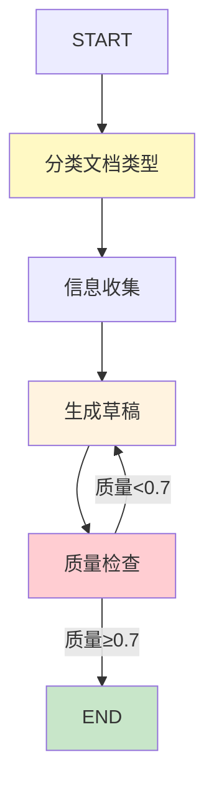

# 实战案例 14：智能文档生成 Agent

> 写文档是高频但耗时的工作——周报、技术文档、需求文档、API 文档。如果 Agent 能自动从代码/数据/知识库提取信息并生成结构化文档呢？这个案例构建一个文档生成 Agent，综合运用 RAG、多步推理和模板化生成。

---

## 一、案例概述

```mermaid
graph TB
    subgraph 系统 &#123;"智能文档生成Agent"&#125;
        U["用户: '生成API文档'"] --> AGENT["Agent"]
        AGENT --> SOURCE["数据源采集<br/>代码/数据库/知识库"]
        SOURCE --> DRAFT["草稿生成<br/>按模板填充"]
        DRAFT --> REVIEW&#123;"质量检查<br/>格式/内容/引用"&#125;
        REVIEW -->|通过| OUTPUT["文档输出<br/>Markdown/HTML"]
        REVIEW -->|不通过| DRAFT
    end

    style AGENT fill:#1565C0,color:#fff
    style REVIEW fill:#FFF9C4
    style OUTPUT fill:#C8E6C9
```

**核心技术栈：** RAG检索 + 模板化生成 + 质量检查 + 多文档类型支持

**适合学完：** 知识库 119（分块策略）+ 第 07 课（RAG）+ 知识库 129（工作流模式）

---

## 二、系统架构

```mermaid
graph TB
    subgraph 架构 &#123;"文档生成Agent架构"&#125;
        INPUT["用户输入<br/>文档类型+主题"] --> CLASSIFY["文档类型分类"]
        CLASSIFY --> TEMPLATE["选择文档模板"]
        TEMPLATE --> COLLECT["信息收集<br/>RAG检索+代码分析"]
        COLLECT --> GENERATE["按模板生成"]
        GENERATE --> CHECK["质量检查<br/>格式/完整性/引用"]
        CHECK -->|通过| OUTPUT["输出文档"]
        CHECK -->|不通过| GENERATE
    end

    style CLASSIFY fill:#FFF9C4
    style COLLECT fill:#E3F2FD
    style GENERATE fill:#FFF3E0
    style CHECK fill:#FFCDD2
    style OUTPUT fill:#C8E6C9
```

---

## 三、文档模板系统

```python
from dataclasses import dataclass
from enum import Enum

class DocType(str, Enum):
    API_DOC = "api_doc"
    TECH_SPEC = "tech_spec"
    WEEKLY_REPORT = "weekly_report"
    REQUIREMENT = "requirement"
    README = "readme"

@dataclass
class DocTemplate:
    """文档模板。"""
    doc_type: DocType
    sections: list[str]          # 章节列表
    system_prompt: str           # 生成Prompt
    example: str                 # 示例文档

TEMPLATES = &#123;
    DocType.API_DOC: DocTemplate(
        doc_type=DocType.API_DOC,
        sections=["概述", "认证方式", "接口列表", "请求示例", "错误码", "变更记录"],
        system_prompt="你是API文档工程师。请按标准格式生成API文档，包含请求方法、路径、参数、响应格式。",
        example="## 用户接口\n### POST /api/users\n创建用户\n\n**参数**\n| 名称 | 类型 | 必填 |",
    ),
    DocType.TECH_SPEC: DocTemplate(
        doc_type=DocType.TECH_SPEC,
        sections=["背景", "目标", "架构设计", "技术选型", "实现方案", "风险", "排期"],
        system_prompt="你是技术架构师。请生成技术方案文档，每节要有实质内容。",
        example="## 背景\n...",
    ),
    DocType.WEEKLY_REPORT: DocTemplate(
        doc_type=DocType.WEEKLY_REPORT,
        sections=["本周完成", "遇到的问题", "下周计划", "风险项"],
        system_prompt="你是项目经理。请基于工作记录生成周报，简洁明了。",
        example="## 本周完成\n- 完成A功能\n- 修复B问题",
    ),
    DocType.README: DocTemplate(
        doc_type=DocType.README,
        sections=["简介", "安装", "使用", "配置", "贡献", "许可证"],
        system_prompt="你是开源维护者。请生成README文档，让新用户快速上手。",
        example="# 项目名\n\n简介...",
    ),
&#125;
```

---

## 四、State 定义与节点

```python
from typing import TypedDict, Annotated
from langgraph.graph.message import add_messages

class DocGenState(TypedDict):
    messages: Annotated[list, add_messages]
    doc_type: str
    topic: str
    template_sections: list[str]
    collected_info: list[str]
    draft: str
    quality_score: float
    final_doc: str

from langchain_core.messages import HumanMessage, SystemMessage
from langchain_openai import ChatOpenAI

llm = ChatOpenAI(model="gpt-4o", temperature=0.3)

async def classify_doc_type(state: DocGenState) -> dict:
    """分类文档类型。"""
    user_msg = state["messages"][-1].content

    prompt = f"""判断用户要生成什么类型的文档。

用户输入: &#123;user_msg&#125;

可选类型: &#123;[t.value for t in DocType]&#125;

只输出类型名称:"""

    response = await llm.ainvoke([HumanMessage(content=prompt)])
    doc_type = response.content.strip()

    template = TEMPLATES.get(DocType(doc_type), TEMPLATES[DocType.TECH_SPEC])
    return &#123;
        "doc_type": doc_type,
        "template_sections": template.sections,
    &#125;

async def collect_info(state: DocGenState) -> dict:
    """信息收集节点。"""
    doc_type = state.get("doc_type", "tech_spec")
    topic = state["messages"][-1].content

    template = TEMPLATES.get(DocType(doc_type), TEMPLATES[DocType.TECH_SPEC])

    # 从知识库检索相关信息（简化版）
    collected = [f"关于'&#123;topic&#125;'的检索信息"]
    collected.append(f"文档类型: &#123;doc_type&#125;")
    collected.append(f"章节: &#123;template.sections&#125;")

    return &#123;"collected_info": collected&#125;

async def generate_draft(state: DocGenState) -> dict:
    """草稿生成节点。"""
    template = TEMPLATES.get(DocType(state.get("doc_type", "tech_spec")))
    info = "\n".join(state.get("collected_info", []))
    sections = template.sections

    prompt = f"""&#123;template.system_prompt&#125;

请生成以下章节的文档内容：
&#123;chr(10).join(f'&#123;i+1&#125;. &#123;s&#125;' for i, s in enumerate(sections))&#125;

参考信息:
&#123;info&#125;

每节至少3-5句话，使用Markdown格式。"""

    response = await llm.ainvoke([
        SystemMessage(content=template.system_prompt),
        HumanMessage(content=prompt),
    ])

    return &#123;"draft": response.content&#125;

async def quality_check(state: DocGenState) -> dict:
    """质量检查节点。"""
    template = TEMPLATES.get(DocType(state.get("doc_type", "tech_spec")))
    draft = state.get("draft", "")
    sections = template.sections

    # 检查每个章节是否都有内容
    missing = [s for s in sections if s not in draft]

    prompt = f"""评估以下文档的质量。

文档类型: &#123;state.get("doc_type")&#125;
应有章节: &#123;sections&#125;
缺失章节: &#123;missing&#125;

文档内容:
&#123;draft[:1000]&#125;

评分标准:
- 0.9+: 所有章节完整，内容充实
- 0.7-0.9: 大部分完整，小问题
- <0.7: 缺失重要章节

只输出评分(0-1):"""

    response = await llm.ainvoke([HumanMessage(content=prompt)])

    import re
    match = re.search(r'0\.\d+|[01]', response.content)
    score = float(match.group()) if match else 0.7

    return &#123;"quality_score": score&#125;
```

---

## 五、组装图

```python
from langgraph.graph import StateGraph, START, END

def build_doc_gen_agent():
    """构建文档生成Agent。"""
    graph = StateGraph(DocGenState)

    graph.add_node("classify", classify_doc_type)
    graph.add_node("collect", collect_info)
    graph.add_node("generate", generate_draft)
    graph.add_node("check", quality_check)

    graph.add_edge(START, "classify")
    graph.add_edge("classify", "collect")
    graph.add_edge("collect", "generate")
    graph.add_edge("generate", "check")

    def route_quality(state: DocGenState) -> str:
        if state.get("quality_score", 0) >= 0.7:
            return "done"
        return "regenerate"

    graph.add_conditional_edges("check", route_quality, &#123;
        "done": END,
        "regenerate": "generate",
    &#125;)

    return graph.compile()

doc_agent = build_doc_gen_agent()
```



---

## 六、使用示例

```python
import asyncio

async def main():
    # 生成API文档
    result = await doc_agent.ainvoke(&#123;
        "messages": [&#123;"role": "user", "content": "为用户管理模块生成API文档"&#125;],
        "doc_type": "", "topic": "", "template_sections": [],
        "collected_info": [], "draft": "", "quality_score": 0, "final_doc": "",
    &#125;)

    print("=== 生成的文档 ===")
    print(result["draft"][:2000])
    print(f"\n质量评分: &#123;result.get('quality_score', 0)&#125;")

asyncio.run(main())
```

---

## 七、扩展方向

| 扩展 | 说明 | 难度 |
|------|------|------|
| 代码分析 | 从代码自动提取API | ★★☆ |
| 图表插入 | 自动生成配图 | ★★★ |
| 多文档关联 | 文档间引用链接 | ★★☆ |
| 导出格式 | PDF/HTML/Confluence | ★★☆ |
| 版本管理 | 文档版本追踪 | ★☆☆ |
| 人工审批 | 生成后人工审核 | ★☆☆ |

---

## 八、检查清单

| 检查项 | 状态 |
|--------|------|
| 有文档模板系统 | ☐ |
| 有信息收集节点 | ☐ |
| 有草稿生成节点 | ☐ |
| 有质量检查节点 | ☐ |
| 有条件路由（质量不达标重生成） | ☐ |
| 支持多种文档类型 | ☐ |
