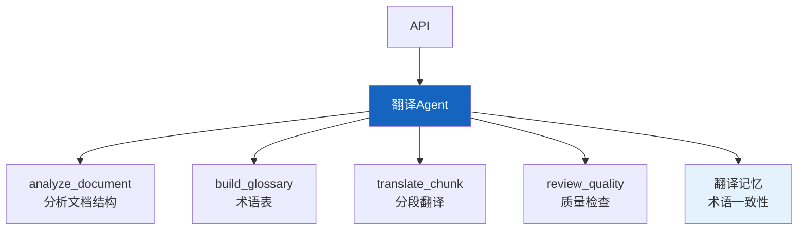

# 实战案例 18：智能翻译 Agent

> 传统翻译工具逐句翻译，不懂上下文。智能翻译 Agent 理解全文语境、保持术语一致、适配目标文化。这个案例构建一个文档级翻译 Agent，综合运用长文档处理、术语管理和多语言能力。

---

## 一、案例概述

```mermaid
graph TB
    subgraph 系统 &#123;"智能翻译Agent"&#125;
        INPUT["源文档<br/>(任意语言)"] --> ANALYZE["文档分析<br/>领域/术语/风格"]
        ANALYZE --> GLOSSARY["术语表生成<br/>提取核心术语"]
        GLOSSARY --> TRANSLATE["分段翻译<br/>保持术语一致"]
        TRANSLATE --> REVIEW["质量检查<br/>术语一致/风格统一"]
        REVIEW --> OUTPUT["译文+术语表"]
    end

    style ANALYZE fill:#FFF9C4,stroke:#F9A825,stroke-width:3px
    style GLOSSARY fill:#E3F2FD
    style OUTPUT fill:#C8E6C9
```

**核心技术：** 长文档分块 + 术语管理 + 上下文一致性 + 风格适配

---

## 二、系统架构



---

## 三、核心实现

### 3.1 文档分析

```python
from langchain_core.language_models import BaseChatModel
from langchain_core.messages import HumanMessage
from dataclasses import dataclass, field
import json, re

@dataclass
class DocumentAnalysis:
    """文档分析结果。"""
    language: str          # 源语言
    domain: str            # 领域（技术/法律/医学等）
    style: str             # 风格（正式/口语/学术）
    key_terms: dict = field(default_factory=dict)  # 术语表
    total_chunks: int = 0

ANALYZE_PROMPT = """分析以下文档的语言、领域、风格和核心术语。

文档内容（前2000字）:
&#123;content&#125;

输出JSON格式:
```json
&#123;&#123;
  "language": "zh/en/ja/...",
  "domain": "技术/法律/医学/商业/...",
  "style": "正式/口语/学术/...",
  "key_terms": &#123;&#123;"源语言术语": "建议翻译"&#125;&#125;
&#125;&#125;
```"""

class DocumentAnalyzer:
    """文档分析器。"""

    def __init__(self, llm: BaseChatModel):
        self.llm = llm

    async def analyze(self, content: str) -> DocumentAnalysis:
        """分析文档。"""
        prompt = ANALYZE_PROMPT.format(content=content[:2000])
        response = await self.llm.ainvoke([HumanMessage(content=prompt)])

        json_match = re.search(r'\&#123;.*\&#125;', response.content, re.DOTALL)
        if json_match:
            data = json.loads(json_match.group())
            return DocumentAnalysis(
                language=data.get("language", "unknown"),
                domain=data.get("domain", "通用"),
                style=data.get("style", "正式"),
                key_terms=data.get("key_terms", &#123;&#125;),
            )
        return DocumentAnalysis(language="unknown", domain="通用", style="正式")
```

### 3.2 术语表管理

```python
class GlossaryManager:
    """术语表管理器。

    确保同一术语在全文中翻译一致。
    """

    def __init__(self):
        self.terms: dict[str, str] = &#123;&#125;  # 源语言→目标语言

    def add_terms(self, terms: dict[str, str]):
        """添加术语。"""
        self.terms.update(terms)

    def get_translation(self, term: str) -> str | None:
        """获取术语的标准翻译。"""
        return self.terms.get(term)

    def format_for_prompt(self) -> str:
        """格式化术语表供Prompt使用。"""
        if not self.terms:
            return "无"
        return "\n".join(f"- &#123;k&#125; → &#123;v&#125;" for k, v in self.terms.items())

    def check_consistency(self, translations: list[str]) -> dict:
        """检查翻译中术语一致性。"""
        inconsistencies = []
        for term, expected_translation in self.terms.items():
            for i, trans in enumerate(translations):
                if term in trans and expected_translation not in trans:
                    inconsistencies.append(&#123;
                        "chunk": i,
                        "term": term,
                        "expected": expected_translation,
                    &#125;)
        return &#123;
            "total_terms": len(self.terms),
            "inconsistencies": len(inconsistencies),
            "details": inconsistencies[:5],
        &#125;
```

### 3.3 分段翻译

```python
TRANSLATE_PROMPT = """你是专业翻译。请将以下文本从&#123;source_lang&#125;翻译为&#123;target_lang&#125;。

## 翻译要求
1. 保持术语一致性（参考术语表）
2. 适配&#123;style&#125;风格
3. 领域：&#123;domain&#125;
4. 自然流畅，不要逐字翻译
5. 保持原文的段落结构

## 术语表
&#123;glossary&#125;

## 上下文（前一段翻译，用于保持连贯）
&#123;previous_context&#125;

## 待翻译文本
&#123;text&#125;

## 翻译:"""

class TranslationEngine:
    """翻译引擎。"""

    def __init__(self, llm: BaseChatModel):
        self.llm = llm

    async def translate_chunk(
        self,
        text: str,
        source_lang: str,
        target_lang: str,
        glossary: GlossaryManager,
        analysis: DocumentAnalysis,
        previous_context: str = "",
    ) -> str:
        """翻译单个文本块。"""
        prompt = TRANSLATE_PROMPT.format(
            source_lang=source_lang,
            target_lang=target_lang,
            style=analysis.style,
            domain=analysis.domain,
            glossary=glossary.format_for_prompt(),
            previous_context=previous_context[:200],
            text=text,
        )

        response = await self.llm.ainvoke([HumanMessage(content=prompt)])
        return response.content

    async def translate_document(
        self,
        content: str,
        source_lang: str,
        target_lang: str,
        glossary: GlossaryManager,
        analysis: DocumentAnalysis,
        chunk_size: int = 1000,
    ) -> dict:
        """翻译完整文档。"""
        from langchain_text_splitters import RecursiveCharacterTextSplitter

        splitter = RecursiveCharacterTextSplitter(
            chunk_size=chunk_size,
            chunk_overlap=100,
        )
        chunks = splitter.split_text(content)

        translations = []
        for i, chunk in enumerate(chunks):
            previous = translations[-1][-200:] if translations else ""
            translated = await self.translate_chunk(
                chunk, source_lang, target_lang, glossary, analysis, previous
            )
            translations.append(translated)

        # 术语一致性检查
        consistency = glossary.check_consistency(translations)

        return &#123;
            "translation": "\n\n".join(translations),
            "total_chunks": len(chunks),
            "consistency_check": consistency,
        &#125;
```

### 3.4 Agent 组装

```python
from langgraph.prebuilt import create_react_agent
from langchain_openai import ChatOpenAI

SYSTEM_PROMPT = """你是智能翻译Agent。你可以：

1. **analyze_document**: 分析文档的语言、领域、风格和核心术语
2. **translate_document**: 翻译完整文档（自动分段+保持术语一致）

## 工作流程
1. 先分析文档，提取术语表
2. 分段翻译，每段参考术语表和前文
3. 最后检查术语一致性

## 翻译原则
- 术语全文一致
- 风格适配原文
- 自然流畅
- 保持原文结构"""

@tool
async def analyze_document(content: str) -> dict:
    """分析文档的语言、领域和术语。"""
    analyzer = DocumentAnalyzer(llm)
    result = await analyzer.analyze(content)
    return &#123;
        "language": result.language,
        "domain": result.domain,
        "style": result.style,
        "key_terms": result.key_terms,
    &#125;

@tool
async def translate_document(
    content: str,
    source_lang: str,
    target_lang: str,
    key_terms: dict = None,
) -> dict:
    """翻译完整文档。"""
    analysis = DocumentAnalysis(
        language=source_lang, domain="通用", style="正式",
        key_terms=key_terms or &#123;&#125;,
    )
    glossary = GlossaryManager()
    if key_terms:
        glossary.add_terms(key_terms)

    engine = TranslationEngine(llm)
    return await engine.translate_document(
        content, source_lang, target_lang, glossary, analysis
    )

llm = ChatOpenAI(model="gpt-4o", temperature=0.3)
translator_agent = create_react_agent(
    llm,
    [analyze_document, translate_document],
    prompt=SYSTEM_PROMPT,
)
```

---

## 四、使用示例

```python
import asyncio

async def main():
    document = """
    LangChain是一个用于开发LLM应用的开源框架。
    它提供了链式调用（Chains）、智能代理（Agents）、
    检索增强生成（RAG）等核心组件。
    LangGraph是LangChain的图式编排框架，
    支持复杂工作流和状态管理。
    """

    result = await translator_agent.ainvoke(&#123;
        "messages": [&#123;
            "role": "user",
            "content": f"将以下文档翻译为英文:\n\n&#123;document&#125;"
        &#125;]
    &#125;)

    print("=== 翻译结果 ===")
    print(result["messages"][-1].content[:500])

asyncio.run(main())
```

---

## 五、扩展方向

| 扩展 | 说明 | 难度 |
|------|------|------|
| 翻译记忆库 | 相似句子复用翻译 | ★★☆ |
| 多文档术语统一 | 跨文档术语一致 | ★★★ |
| 风格迁移 | 正式↔口语转换 | ★★☆ |
| 实时翻译 | 流式翻译输出 | ★☆☆ |
| 翻译质量评分 | BLEU/人工评估 | ★★☆ |

---

## 六、检查清单

| 检查项 | 状态 |
|--------|------|
| 有文档分析 | ☐ |
| 有术语表管理 | ☐ |
| 有分段翻译 | ☐ |
| 有术语一致性检查 | ☐ |
| 有上下文传递 | ☐ |
