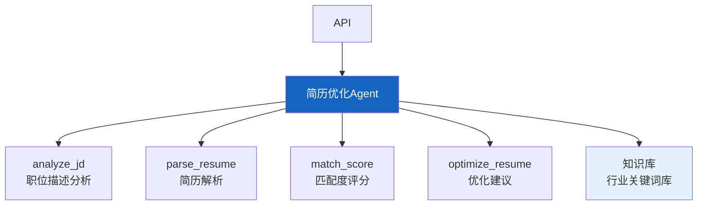

# 实战案例 19：智能简历优化 Agent

> 求职者写简历靠经验猜——猜不准 ATS 关键词、猜不准 HR 偏好。智能简历 Agent 分析职位描述、提取关键词、优化简历内容、匹配度评分。这个案例综合运用 RAG、结构化分析和 LLM 生成。

---

## 一、案例概述

```mermaid
graph TB
    subgraph 系统 &#123;"简历优化Agent"&#125;
        JD["职位描述"] --> ANALYZE["JD分析<br/>提取关键词/要求"]
        RESUME["用户简历"] --> PARSE["简历解析<br/>结构化提取"]
        ANALYZE & PARSE --> MATCH["匹配度分析<br/>关键词覆盖/差距"]
        MATCH --> OPTIMIZE["优化建议<br/>具体修改方案"]
        OPTIMIZE --> SCORE&#123;"匹配度评分"&#125;
        SCORE -->|<80%| OPTIMIZE
        SCORE -->|≥80%| OUT["输出优化简历"]
    end

    style ANALYZE fill:#FFF9C4,stroke:#F9A825,stroke-width:3px
    style MATCH fill:#E3F2FD
    style OUT fill:#C8E6C9
```

**核心技术：** JD分析 + 简历结构化 + 关键词匹配 + LLM优化

---

## 二、系统架构



---

## 三、核心实现

### 3.1 JD 分析工具

```python
from langchain_core.tools import tool
from langchain_core.messages import HumanMessage
from langchain_openai import ChatOpenAI
import json, re

llm = ChatOpenAI(model="gpt-4o-mini", temperature=0)

JD_ANALYZE_PROMPT = """分析以下职位描述，提取关键信息。

职位描述:
&#123;jd&#125;

输出JSON格式:
```json
&#123;&#123;
  "title": "职位名称",
  "required_skills": ["必须技能1", "必须技能2"],
  "preferred_skills": ["加分技能1"],
  "keywords": ["ATS关键词1", "关键词2"],
  "experience_years": "要求年限",
  "education": "学历要求",
  "responsibilities": ["职责1", "职责2"],
  "industry": "行业"
&#125;&#125;
```"""

@tool
async def analyze_jd(jd_text: str) -> dict:
    """分析职位描述，提取关键技能、关键词和要求。

    Args:
        jd_text: 职位描述文本
    """
    prompt = JD_ANALYZE_PROMPT.format(jd=jd_text[:2000])
    response = await llm.ainvoke([HumanMessage(content=prompt)])

    json_match = re.search(r'\&#123;.*\&#125;', response.content, re.DOTALL)
    if json_match:
        return json.loads(json_match.group())
    return &#123;"error": "解析失败"&#125;

@tool
async def parse_resume(resume_text: str) -> dict:
    """解析简历，结构化提取信息。

    Args:
        resume_text: 简历文本
    """
    prompt = f"""解析以下简历，提取结构化信息。

简历:
&#123;resume_text[:3000]&#125;

输出JSON:
```json
&#123;&#123;
  "name": "姓名",
  "skills": ["技能1", "技能2"],
  "experience": [&#123;&#123;"company": "公司", "role": "职位", "duration": "时长", "description": "描述"&#125;&#125;],
  "education": [&#123;&#123;"school": "学校", "degree": "学位", "major": "专业"&#125;&#125;],
  "projects": [&#123;&#123;"name": "项目名", "description": "描述"&#125;&#125;]
&#125;&#125;
```"""

    response = await llm.ainvoke([HumanMessage(content=prompt)])
    json_match = re.search(r'\&#123;.*\&#125;', response.content, re.DOTALL)
    if json_match:
        return json.loads(json_match.group())
    return &#123;"error": "解析失败"&#125;

@tool
async def match_score(jd_analysis: dict, resume_analysis: dict) -> dict:
    """计算简历与职位的匹配度。

    Args:
        jd_analysis: 职位分析结果
        resume_analysis: 简历分析结果
    """
    required_skills = set(s.lower() for s in jd_analysis.get("required_skills", []))
    resume_skills = set(s.lower() for s in resume_analysis.get("skills", []))

    # 技能匹配
    matched_skills = required_skills & resume_skills
    missing_skills = required_skills - resume_skills
    skill_match_rate = len(matched_skills) / len(required_skills) if required_skills else 0

    # 关键词覆盖
    keywords = set(k.lower() for k in jd_analysis.get("keywords", []))
    resume_text = json.dumps(resume_analysis, ensure_ascii=False).lower()
    covered_keywords = [k for k in keywords if k in resume_text]
    keyword_coverage = len(covered_keywords) / len(keywords) if keywords else 0

    # 综合评分
    overall_score = (skill_match_rate * 0.5 + keyword_coverage * 0.3 + 0.2) * 100

    return &#123;
        "overall_score": round(overall_score, 1),
        "skill_match": &#123;
            "matched": list(matched_skills),
            "missing": list(missing_skills),
            "rate": round(skill_match_rate * 100, 1),
        &#125;,
        "keyword_coverage": &#123;
            "covered": covered_keywords,
            "missing": list(keywords - set(covered_keywords)),
            "rate": round(keyword_coverage * 100, 1),
        &#125;,
        "recommendation": "优化" if overall_score < 80 else "可投递",
    &#125;

@tool
async def optimize_resume(
    jd_analysis: dict,
    resume_analysis: dict,
    match_result: dict,
) -> dict:
    """基于匹配分析生成简历优化建议。

    Args:
        jd_analysis: 职位分析
        resume_analysis: 简历分析
        match_result: 匹配结果
    """
    missing_skills = match_result.get("skill_match", &#123;&#125;).get("missing", [])
    missing_keywords = match_result.get("keyword_coverage", &#123;&#125;).get("missing", [])

    prompt = f"""你是简历优化专家。基于以下分析，给出具体优化建议。

## 职位要求
- 必须技能: &#123;jd_analysis.get('required_skills')&#125;
- 关键词: &#123;jd_analysis.get('keywords')&#125;
- 职责: &#123;jd_analysis.get('responsibilities')&#125;

## 简历现状
- 已有技能: &#123;resume_analysis.get('skills')&#125;
- 工作经历: &#123;resume_analysis.get('experience')&#125;

## 匹配差距
- 缺少技能: &#123;missing_skills&#125;
- 缺少关键词: &#123;missing_keywords&#125;

## 优化建议要求
1. 针对每个缺少的技能，建议如何在简历中体现（项目/经历中）
2. 建议添加的关键词及添加位置
3. 工作经历描述的优化建议
4. 具体到段落的修改建议

输出优化建议:"""

    response = await llm.ainvoke([HumanMessage(content=prompt)])
    return &#123;
        "suggestions": response.content,
        "missing_skills": missing_skills,
        "missing_keywords": missing_keywords,
    &#125;
```

### 3.2 Agent 组装

```python
from langgraph.prebuilt import create_react_agent

SYSTEM_PROMPT = """你是智能简历优化助手。你可以：

1. **analyze_jd**: 分析职位描述，提取关键技能和关键词
2. **parse_resume**: 解析简历，结构化提取信息
3. **match_score**: 计算简历与职位的匹配度
4. **optimize_resume**: 基于匹配分析给出优化建议

## 工作流程
1. 先分析职位描述
2. 解析用户简历
3. 计算匹配度
4. 如果匹配度<80%，给出优化建议
5. 用户修改后重新评分

## 回答要求
- 给出具体可执行的优化建议
- 指出缺少的技能和关键词
- 建议在简历哪个部分添加什么内容"""

resume_agent = create_react_agent(
    llm,
    [analyze_jd, parse_resume, match_score, optimize_resume],
    prompt=SYSTEM_PROMPT,
)
```

---

## 四、使用示例

```python
import asyncio

async def main():
    jd = """
    高级Python开发工程师
    要求：
    - 5年以上Python开发经验
    - 熟悉FastAPI/Django框架
    - 熟悉PostgreSQL/Redis
    - 了解Docker/Kubernetes
    - 有LLM应用开发经验优先
    """

    resume = """
    张三，3年后端开发经验
    技能：Python, Flask, MySQL, Docker
    工作经历：XX公司后端工程师，负责API开发和数据库设计
    """

    result = await resume_agent.ainvoke(&#123;
        "messages": [&#123;
            "role": "user",
            "content": f"帮我分析这个职位和我的简历匹配度，并给出优化建议。\n\n职位描述:\n&#123;jd&#125;\n\n我的简历:\n&#123;resume&#125;"
        &#125;]
    &#125;)

    print(result["messages"][-1].content[:1000])

asyncio.run(main())
```

---

## 五、检查清单

| 检查项 | 状态 |
|--------|------|
| 有JD分析工具 | ☐ |
| 有简历解析工具 | ☐ |
| 有匹配度评分 | ☐ |
| 有优化建议 | ☐ |
| 有Agent编排 | ☐ |
