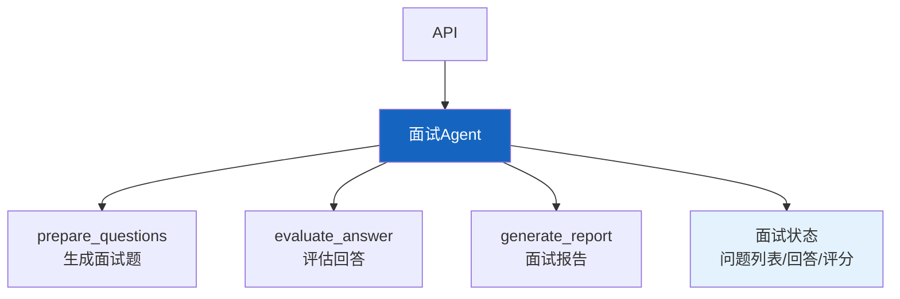

# 实战案例 20：智能面试 Agent

> AI 面试官——不是替代人类面试官，而是辅助初筛。根据候选人简历和职位要求，自动生成针对性面试题、评估回答质量、给出录用建议。这个案例综合运用结构化分析、LLM 评估和反馈生成。

---

## 一、案例概述

```mermaid
graph TB
    subgraph 系统 &#123;"智能面试Agent"&#125;
        JD["职位要求"] + RESUME["候选人简历"] --> PREP["面试准备<br/>生成针对性问题"]
        PREP --> INTERVIEW["面试交互<br/>提问→回答→评估"]
        INTERVIEW --> EVAL&#123;"回答评估"&#125;
        EVAL -->|通过| NEXT["下一题"]
        EVAL -->|不通过| PROBE["追问"]
        NEXT & PROBE --> INTERVIEW
        INTERVIEW --> REPORT["面试报告<br/>能力评估+录用建议"]
    end

    style PREP fill:#FFF9C4,stroke:#F9A825,stroke-width:3px
    style REPORT fill:#C8E6C9
```

**核心技术：** JD/简历分析 + 动态问题生成 + 回答评估 + 能力雷达图

---

## 二、系统架构



---

## 三、核心实现

### 3.1 面试问题生成

```python
from langchain_core.tools import tool
from langchain_core.messages import HumanMessage
from langchain_openai import ChatOpenAI
import json, re

llm = ChatOpenAI(model="gpt-4o-mini", temperature=0.3)

QUESTION_GEN_PROMPT = """你是技术面试官。基于以下信息生成面试问题。

## 职位要求
&#123;jd_analysis&#125;

## 候选人简历
&#123;resume_analysis&#125;

## 要求
1. 生成5个面试问题，覆盖不同技能维度
2. 问题应针对候选人简历中的具体经历
3. 包含1-2个深度技术问题
4. 包含1个项目经验问题
5. 包含1个行为面试问题

输出JSON:
```json
&#123;&#123;
  "questions": [
    &#123;&#123;
      "id": 1,
      "category": "技术深度",
      "question": "问题内容",
      "expected_points": ["期望回答要点1", "要点2"],
      "difficulty": "medium"
    &#125;&#125;
  ]
&#125;&#125;
```"""

@tool
async def prepare_questions(jd_text: str, resume_text: str) -> dict:
    """基于职位和简历生成面试问题。

    Args:
        jd_text: 职位描述
        resume_text: 候选人简历
    """
    prompt = QUESTION_GEN_PROMPT.format(
        jd_analysis=jd_text[:1000],
        resume_analysis=resume_text[:1000],
    )
    response = await llm.ainvoke([HumanMessage(content=prompt)])

    json_match = re.search(r'\&#123;.*\&#125;', response.content, re.DOTALL)
    if json_match:
        return json.loads(json_match.group())
    return &#123;"questions": []&#125;

EVALUATE_PROMPT = """评估候选人的面试回答。

## 面试问题
&#123;question&#125;

## 期望回答要点
&#123;expected_points&#125;

## 候选人回答
&#123;answer&#125;

## 评估维度
1. 技术准确性 (0-10)
2. 表达清晰度 (0-10)
3. 深度理解 (0-10)
4. 实践经验 (0-10)

输出JSON:
```json
&#123;&#123;
  "scores": &#123;&#123;"technical": 8, "clarity": 7, "depth": 6, "experience": 7&#125;&#125;,
  "overall_score": 7.0,
  "strengths": ["优点1"],
  "weaknesses": ["不足1"],
  "passed": true,
  "follow_up": "追问问题（如果passed=false）"
&#125;&#125;
```"""

@tool
async def evaluate_answer(
    question: str,
    expected_points: list,
    answer: str,
) -> dict:
    """评估候选人回答质量。

    Args:
        question: 面试问题
        expected_points: 期望回答要点
        answer: 候选人回答
    """
    prompt = EVALUATE_PROMPT.format(
        question=question,
        expected_points=expected_points,
        answer=answer[:1000],
    )
    response = await llm.ainvoke([HumanMessage(content=prompt)])

    json_match = re.search(r'\&#123;.*\&#125;', response.content, re.DOTALL)
    if json_match:
        return json.loads(json_match.group())
    return &#123;"overall_score": 5.0, "passed": True&#125;

REPORT_PROMPT = """基于面试评分生成面试报告。

## 面试结果
&#123;results&#125;

## 职位要求
&#123;jd_text&#125;

## 要求
1. 能力雷达图描述（技术/表达/深度/经验/文化匹配）
2. 各维度评分
3. 优势分析
4. 风险提示
5. 录用建议（推荐/待定/不推荐）
6. 建议薪资范围

输出:"""

@tool
async def generate_report(
    results: list,
    jd_text: str,
) -> dict:
    """生成面试评估报告。

    Args:
        results: 各问题评估结果
        jd_text: 职位描述
    """
    prompt = REPORT_PROMPT.format(
        results=json.dumps(results, ensure_ascii=False)[:2000],
        jd_text=jd_text[:500],
    )
    response = await llm.ainvoke([HumanMessage(content=prompt)])
    return &#123;"report": response.content&#125;
```

### 3.2 Agent 组装

```python
from langgraph.prebuilt import create_react_agent

SYSTEM_PROMPT = """你是智能面试Agent。你可以：

1. **prepare_questions**: 基于职位和简历生成面试问题
2. **evaluate_answer**: 评估候选人的回答质量
3. **generate_report**: 生成面试评估报告

## 面试流程
1. 接收职位描述和简历
2. 生成5个针对性问题
3. 逐一提问→候选人回答→评估
4. 评估不通过时生成追问
5. 所有问题完成后生成面试报告

## 评估原则
- 基于事实判断，不带偏见
- 评分要具体，有依据
- 给出可操作的录用建议"""

interview_agent = create_react_agent(
    llm,
    [prepare_questions, evaluate_answer, generate_report],
    prompt=SYSTEM_PROMPT,
)
```

---

## 四、使用示例

```python
import asyncio

async def main():
    jd = "高级Python工程师，5年经验，熟悉FastAPI/Docker/LLM应用"
    resume = "张三，3年Python经验，Flask/MySQL/Docker，做过RAG项目"

    result = await interview_agent.ainvoke(&#123;
        "messages": [&#123;
            "role": "user",
            "content": f"请为这位候选人准备面试问题。\n\n职位: &#123;jd&#125;\n简历: &#123;resume&#125;"
        &#125;]
    &#125;)
    print(result["messages"][-1].content[:1000])

asyncio.run(main())
```

---

## 五、扩展方向

| 扩展 | 说明 | 难度 |
|------|------|------|
| 语音面试 | ASR+TTS实时面试 | ★★★ |
| 编程题 | 自动出题+代码评估 | ★★☆ |
| 多轮追问 | 根据回答深度追问 | ★★☆ |
| 反偏见检测 | 检测评估偏差 | ★★☆ |
| 面试训练 | 求职者练习模式 | ★☆☆ |

---

## 六、检查清单

| 检查项 | 状态 |
|--------|------|
| 有问题生成 | ☐ |
| 有回答评估 | ☐ |
| 有面试报告 | ☐ |
| 有多维度评分 | ☐ |
| 有Agent编排 | ☐ |
