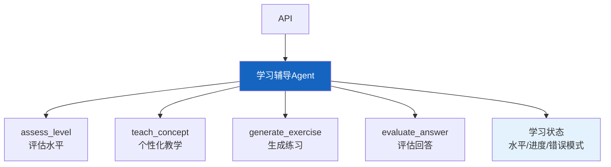

# 实战案例 21：智能学习辅导 Agent

> 学生学习有个性化需求——有人需要图解，有人需要代码示例，有人需要反复练习。智能学习辅导 Agent 根据学生水平动态调整教学内容、生成练习题、给出针对性反馈。

---

## 一、案例概述

```mermaid
graph TB
    subgraph 系统 &#123;"学习辅导Agent"&#125;
        S["学生: '讲讲递归'"] --> LEVEL["评估水平<br/>前置知识检查"]
        LEVEL --> TEACH["个性化教学<br/>按水平调整深度"]
        TEACH --> PRACTICE["生成练习<br/>针对性题目"]
        PRACTICE --> GRADE&#123;"评估回答"&#125;
        GRADE -->|正确| NEXT["下一知识点"]
        GRADE -->|错误| HINT["给提示<br/>针对性讲解"]
        HINT --> PRACTICE
    end

    style LEVEL fill:#FFF9C4,stroke:#F9A825,stroke-width:3px
    style NEXT fill:#C8E6C9
```

**核心技术：** 水平评估 + 个性化教学 + 练习生成 + 反馈循环

---

## 二、系统架构



---

## 三、核心实现

### 3.1 水平评估

```python
from langchain_core.tools import tool
from langchain_core.messages import HumanMessage
from langchain_openai import ChatOpenAI
import json, re

llm = ChatOpenAI(model="gpt-4o-mini", temperature=0.3)

ASSESS_PROMPT = """评估学生对以下知识点的掌握水平。

知识点: &#123;topic&#125;
学生自述: &#123;student_description&#125;

评估维度:
1. 前置知识: 是否具备必要基础
2. 当前水平: beginner/intermediate/advanced
3. 学习风格: visual/example/practice/theory
4. 知识缺口: 缺少哪些前置知识

输出JSON:
```json
&#123;&#123;
  "level": "beginner/intermediate/advanced",
  "prerequisites_met": true/false,
  "learning_style": "visual/example/practice/theory",
  "knowledge_gaps": ["缺口1"],
  "recommended_approach": "教学建议"
&#125;&#125;
```"""

@tool
async def assess_level(topic: str, student_description: str = "") -> dict:
    """评估学生对知识点的掌握水平。

    Args:
        topic: 要学习的知识点
        student_description: 学生自述（已学过什么）
    """
    prompt = ASSESS_PROMPT.format(topic=topic, student_description=student_description or "无")
    response = await llm.ainvoke([HumanMessage(content=prompt)])
    json_match = re.search(r'\&#123;.*\&#125;', response.content, re.DOTALL)
    if json_match:
        return json.loads(json_match.group())
    return &#123;"level": "beginner"&#125;
```

### 3.2 个性化教学

```python
TEACH_PROMPT = """你是学习导师。请根据学生水平讲解知识点。

知识点: &#123;topic&#125;
学生水平: &#123;level&#125;
学习风格: &#123;style&#125;
知识缺口: &#123;gaps&#125;

教学要求:
1. 适配学生水平（beginner用简单类比，advanced讲原理）
2. 适配学习风格（visual用图解描述，example用代码示例）
3. 补充知识缺口
4. 控制300字以内
5. 最后给一个小问题检验理解

讲解:"""

@tool
async def teach_concept(topic: str, level: str = "beginner", style: str = "example", gaps: list = None) -> str:
    """根据学生水平个性化讲解知识点。

    Args:
        topic: 知识点
        level: 学生水平
        style: 学习风格
        gaps: 知识缺口
    """
    prompt = TEACH_PROMPT.format(
        topic=topic, level=level, style=style,
        gaps=gaps or [],
    )
    response = await llm.ainvoke([HumanMessage(content=prompt)])
    return response.content
```

### 3.3 练习生成与评估

```python
EXERCISE_PROMPT = """生成一道&#123;topic&#125;的练习题。

学生水平: &#123;level&#125;
练习类型: &#123;exercise_type&#125;

要求:
1. 难度匹配学生水平
2. 题目清晰
3. 附带标准答案和评分标准

输出JSON:
```json
&#123;&#123;
  "question": "题目内容",
  "expected_answer": "标准答案",
  "scoring_criteria": ["评分要点1", "要点2"]
&#125;&#125;
```"""

@tool
async def generate_exercise(topic: str, level: str = "beginner", exercise_type: str = "coding") -> dict:
    """生成针对性练习题。

    Args:
        topic: 知识点
        level: 学生水平
        exercise_type: 题目类型(coding/concept/application)
    """
    prompt = EXERCISE_PROMPT.format(topic=topic, level=level, exercise_type=exercise_type)
    response = await llm.ainvoke([HumanMessage(content=prompt)])
    json_match = re.search(r'\&#123;.*\&#125;', response.content, re.DOTALL)
    if json_match:
        return json.loads(json_match.group())
    return &#123;"question": "练习题", "expected_answer": "答案"&#125;

EVALUATE_PROMPT = """评估学生的练习回答。

题目: &#123;question&#125;
标准答案: &#123;expected_answer&#125;
学生回答: &#123;student_answer&#125;
评分标准: &#123;criteria&#125;

输出JSON:
```json
&#123;&#123;
  "score": 0-10,
  "correct": true/false,
  "feedback": "针对性反馈",
  "hint": "如果错误，给提示（不要直接给答案）"
&#125;&#125;
```"""

@tool
async def evaluate_answer(question: str, expected_answer: str, student_answer: str, criteria: list = None) -> dict:
    """评估学生练习回答。

    Args:
        question: 题目
        expected_answer: 标准答案
        student_answer: 学生回答
        criteria: 评分标准
    """
    prompt = EVALUATE_PROMPT.format(
        question=question, expected_answer=expected_answer,
        student_answer=student_answer[:500], criteria=criteria or [],
    )
    response = await llm.ainvoke([HumanMessage(content=prompt)])
    json_match = re.search(r'\&#123;.*\&#125;', response.content, re.DOTALL)
    if json_match:
        return json.loads(json_match.group())
    return &#123;"score": 5, "correct": True&#125;
```

### 3.4 Agent 组装

```python
from langgraph.prebuilt import create_react_agent

SYSTEM_PROMPT = """你是智能学习辅导助手。你可以：

1. **assess_level**: 评估学生的知识水平和学习风格
2. **teach_concept**: 根据水平个性化讲解知识点
3. **generate_exercise**: 生成针对性练习题
4. **evaluate_answer**: 评估学生练习回答

## 辅导流程
1. 先评估学生水平
2. 根据水平个性化讲解
3. 生成练习题让学生做
4. 评估回答：正确→下一知识点；错误→给提示→再练习
5. 追踪学习进度

## 教学原则
- 因材施教，适配水平
- 循序渐进，不要太难
- 错误时不直接给答案，给提示引导
- 鼓励为主，指出进步"""

tutor_agent = create_react_agent(
    llm,
    [assess_level, teach_concept, generate_exercise, evaluate_answer],
    prompt=SYSTEM_PROMPT,
)
```

---

## 四、使用示例

```python
import asyncio

async def main():
    result = await tutor_agent.ainvoke(&#123;
        "messages": [&#123;
            "role": "user",
            "content": "我想学Python递归，之前学过函数和循环"
        &#125;]
    &#125;)
    print(result["messages"][-1].content[:1000])

asyncio.run(main())
```

---

## 五、检查清单

| 检查项 | 状态 |
|--------|------|
| 有水平评估工具 | ☐ |
| 有个性化教学 | ☐ |
| 有练习生成 | ☐ |
| 有回答评估 | ☐ |
| 有Agent编排 | ☐ |
