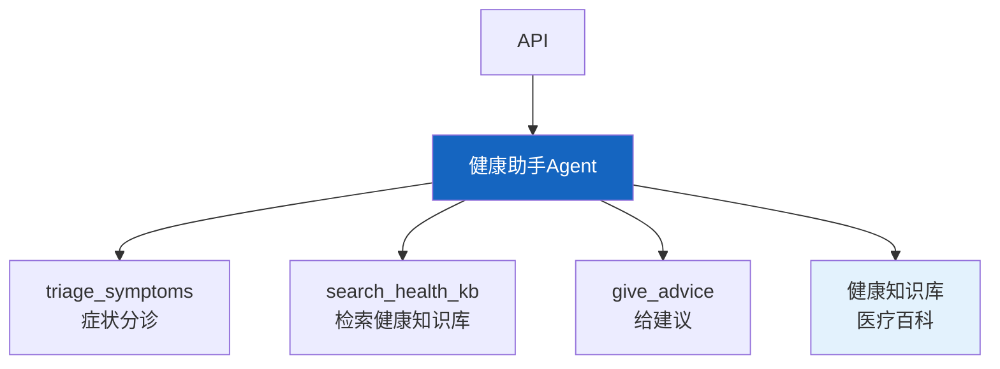

# 实战案例 22：智能健康助手 Agent

> 用户咨询健康问题——Agent 需要理解症状、提供初步建议、区分紧急程度、推荐就医。注意：AI 健康助手不能替代医生，但可以做初步分诊和健康咨询。

---

## 一、案例概述

```mermaid
graph TB
    subgraph 系统 &#123;"健康助手Agent"&#125;
        U["用户: '头痛发烧'"] --> TRIAGE["症状分诊<br/>紧急程度评估"]
        TRIAGE -->|紧急| EMERGENCY["⚠️ 建议立即就医<br/>不提建议"]
        TRIAGE -->|非紧急| CONSULT["健康咨询<br/>症状分析+建议"]
        CONSULT --> DISCLAIMER["免责声明<br/>'不替代医生'"]
        DISCLAIMER --> TRACK["症状追踪<br/>记录变化"]
    end

    style TRIAGE fill:#FFF9C4,stroke:#F9A825,stroke-width:3px
    style EMERGENCY fill:#FFCDD2,stroke:#C62828,stroke-width:3px
    style DISCLAIMER fill:#C8E6C9
```

**核心技术：** 症状分诊 + 健康知识库 RAG + 免责声明 + 紧急程度判断

---

## 二、系统架构



---

## 三、核心实现

### 3.1 症状分诊

```python
from langchain_core.tools import tool
from langchain_core.messages import HumanMessage
from langchain_openai import ChatOpenAI
import json, re

llm = ChatOpenAI(model="gpt-4o-mini", temperature=0)

TRIAGE_PROMPT = """你是医疗分诊助手。评估用户描述的症状的紧急程度。

用户描述: &#123;symptoms&#125;

评估维度:
1. 紧急程度: emergency(紧急)/urgent(急)/normal(普通)
2. 可能的疾病方向（不诊断，只提示）
3. 是否建议立即就医
4. 需要关注的危险信号

注意：
- 你不是医生，不能做诊断
- 严重症状必须建议就医
- 胸痛/呼吸困难/意识模糊=emergency

输出JSON:
```json
&#123;&#123;
  "urgency": "emergency/urgent/normal",
  "possible_conditions": ["提示1"],
  "should_see_doctor": true/false,
  "warning_signs": ["危险信号1"],
  "advice": "初步建议"
&#125;&#125;
```"""

@tool
async def triage_symptoms(symptoms: str) -> dict:
    """评估症状紧急程度，给出初步建议。

    Args:
        symptoms: 用户描述的症状
    """
    prompt = TRIAGE_PROMPT.format(symptoms=symptoms[:500])
    response = await llm.ainvoke([HumanMessage(content=prompt)])
    json_match = re.search(r'\&#123;.*\&#125;', response.content, re.DOTALL)
    if json_match:
        return json.loads(json_match.group())
    return &#123;"urgency": "normal", "advice": "建议观察"&#125;

@tool
async def search_health_kb(query: str) -> str:
    """搜索健康知识库获取相关信息。

    Args:
        query: 搜索查询
    """
    # 实际接入健康知识库向量检索
    return f"知识库结果: &#123;query&#125;的相关健康信息"

ADVICE_PROMPT = """基于以下信息给用户健康建议。

症状分析: &#123;triage&#125;
知识库信息: &#123;kb_info&#125;

要求:
1. 不做诊断，只给建议
2. 必须包含免责声明
3. 如果紧急，强调就医
4. 建议要具体可操作（休息/饮水/观察等）

建议:"""

@tool
async def give_advice(triage: dict, kb_info: str) -> str:
    """基于分诊结果和知识库信息给出健康建议。

    Args:
        triage: 分诊结果
        kb_info: 知识库信息
    """
    prompt = ADVICE_PROMPT.format(
        triage=json.dumps(triage, ensure_ascii=False),
        kb_info=kb_info[:500],
    )
    response = await llm.ainvoke([HumanMessage(content=prompt)])
    return response.content + "\n\n⚠️ 以上建议仅供参考，不替代专业医疗诊断。如有不适请及时就医。"
```

### 3.2 Agent 组装

```python
from langgraph.prebuilt import create_react_agent

SYSTEM_PROMPT = """你是智能健康助手。你可以：

1. **triage_symptoms**: 评估症状紧急程度
2. **search_health_kb**: 搜索健康知识库
3. **give_advice**: 给出健康建议

## 重要原则
- 你不是医生，不能做诊断
- 紧急症状（胸痛/呼吸困难/意识模糊）必须建议立即就医
- 所有建议必须包含免责声明
- 不要推荐具体药物
- 鼓励用户在不确定时就医

## 工作流程
1. 先评估症状紧急程度
2. 紧急→建议立即就医
3. 非紧急→搜索知识库→给建议
4. 所有回答必须含免责声明"""

health_agent = create_react_agent(
    llm,
    [triage_symptoms, search_health_kb, give_advice],
    prompt=SYSTEM_PROMPT,
)
```

---

## 四、使用示例

```python
import asyncio

async def main():
    result = await health_agent.ainvoke(&#123;
        "messages": [&#123;"role": "user", "content": "我头痛两天了，还有点低烧37.5度"&#125;]
    &#125;)
    print(result["messages"][-1].content[:1000])

asyncio.run(main())
```

---

## 五、安全边界

```mermaid
graph TB
    subgraph 安全 &#123;"健康助手安全边界"&#125;
        S1["不诊断疾病"]
        S2["不推荐药物"]
        S3["紧急症状→立即就医"]
        S4["必含免责声明"]
        S5["不替代医生"]
    end

    style 安全 fill:#FFCDD2,stroke:#C62828,stroke-width:3px
```

---

## 六、检查清单

| 检查项 | 状态 |
|--------|------|
| 有症状分诊工具 | ☐ |
| 有知识库检索 | ☐ |
| 有建议生成 | ☐ |
| 有免责声明 | ☐ |
| 有紧急症状处理 | ☐ |
