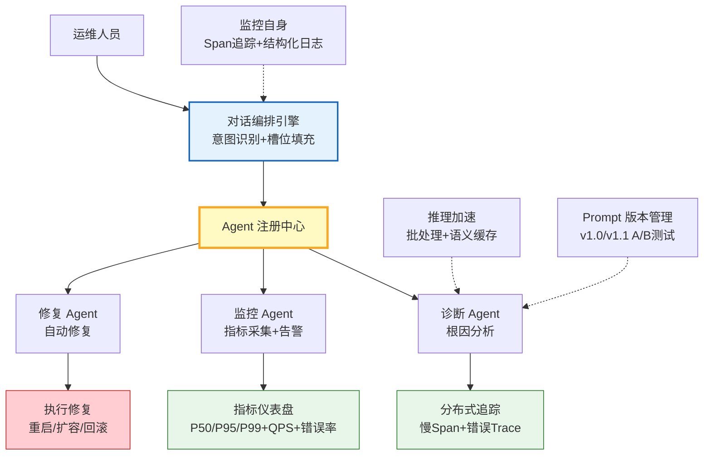

# 智能运维监控 Agent 实战

> 一个完整的运维监控 Agent，集成 Agent 监控可观测性、推理加速批处理、Prompt 版本管理、Agent 注册中心服务发现和对话编排状态管理。覆盖从故障发现到自动修复的全流程。

---

## 1. 项目概述

### 业务场景

```
运维人员："线上 API 延迟突然升高，帮我排查"
  ↓
Agent：查询监控指标 → 识别异常 → 调用诊断工具 → 定位根因 → 执行修复 → 确认恢复
```

### 技术要点

| 组件 | 技术 | 对应知识库 |
|------|------|-----------|
| 全链路监控 | 指标+日志+追踪三支柱 | 417 |
| 批量诊断 | 推理加速与批处理 | 418 |
| 诊断 Prompt | 版本管理与 A/B 测试 | 419 |
| 多 Agent 协作 | 注册中心与服务发现 | 420 |
| 多轮交互 | 对话编排与状态管理 | 421 |

---

## 2. 架构设计



---

## 3. 完整实现

### 3.1 Agent 监控指标采集

```python
from dataclasses import dataclass, field
from collections import defaultdict
import time
import json
from typing import Any

@dataclass
class MetricPoint:
    name: str
    value: float
    timestamp: float = field(default_factory=time.time)
    tags: dict[str, str] = field(default_factory=dict)


class OpsMetricsCollector:
    """运维监控指标采集器"""

    def __init__(self):
        self.histograms: dict[str, list[float]] = defaultdict(list)
        self.counters: dict[str, float] = defaultdict(float)
        self.gauges: dict[str, float] = &#123;&#125;
        self.alerts: list[dict] = []

    def observe(self, name: str, value: float, **tags):
        self.histograms[name].append(value)

    def increment(self, name: str, value: float = 1):
        self.counters[name] += value

    def set_gauge(self, name: str, value: float):
        self.gauges[name] = value
        # 自动检查告警
        self._check_alert(name, value)

    def _check_alert(self, metric: str, value: float):
        rules = &#123;
            "api_latency_p99_ms": (10000, "warning", "P99延迟>10s"),
            "error_rate": (0.05, "critical", "错误率>5%"),
            "cpu_usage_pct": (90, "warning", "CPU>90%"),
            "memory_usage_pct": (85, "warning", "内存>85%"),
            "active_connections": (1000, "warning", "连接数>1000"),
        &#125;
        if metric in rules:
            threshold, severity, msg = rules[metric]
            if value > threshold:
                self.alerts.append(&#123;
                    "metric": metric, "value": value,
                    "threshold": threshold, "severity": severity,
                    "message": msg, "timestamp": time.time(),
                &#125;)

    def summary(self) -> dict:
        import numpy as np
        result = &#123;&#125;
        for name, values in self.histograms.items():
            if values:
                result[name] = &#123;
                    "count": len(values),
                    "mean": float(np.mean(values)),
                    "p50": float(np.percentile(values, 50)),
                    "p95": float(np.percentile(values, 95)),
                    "p99": float(np.percentile(values, 99)),
                &#125;
        result["counters"] = dict(self.counters)
        result["gauges"] = dict(self.gauges)
        result["alerts"] = self.alerts[-10:]
        return result


metrics = OpsMetricsCollector()

# 模拟监控数据
metrics.set_gauge("api_latency_p99_ms", 12000)  # 触发告警
metrics.set_gauge("error_rate", 0.08)           # 触发告警
metrics.set_gauge("cpu_usage_pct", 75)
metrics.set_gauge("memory_usage_pct", 68)
metrics.set_gauge("active_connections", 850)

print(f"告警数量: &#123;len(metrics.alerts)&#125;")
for a in metrics.alerts:
    print(f"  [&#123;a['severity']&#125;] &#123;a['message']&#125; (值=&#123;a['value']&#125;)")
```

### 3.2 Agent 注册中心与多 Agent 协作

```python
from dataclasses import dataclass, field
from enum import Enum
import time

class AgentStatus(Enum):
    ONLINE = "online"
    OFFLINE = "offline"

@dataclass
class AgentInfo:
    id: str
    name: str
    capabilities: list[str]
    endpoint: str
    status: AgentStatus = AgentStatus.ONLINE
    current_load: int = 0
    last_heartbeat: float = field(default_factory=time.time)


class OpsAgentRegistry:
    """运维 Agent 注册中心"""

    def __init__(self):
        self.agents: dict[str, AgentInfo] = &#123;&#125;
        self.capability_index: dict[str, list[str]] = &#123;&#125;

    def register(self, agent: AgentInfo):
        self.agents[agent.id] = agent
        for cap in agent.capabilities:
            if cap not in self.capability_index:
                self.capability_index[cap] = []
            self.capability_index[cap].append(agent.id)

    def discover(self, capability: str) -> AgentInfo | None:
        ids = self.capability_index.get(capability, [])
        for aid in ids:
            agent = self.agents[aid]
            if agent.status == AgentStatus.ONLINE:
                return agent
        return None

    def heartbeat(self, agent_id: str):
        if agent_id in self.agents:
            self.agents[agent_id].last_heartbeat = time.time()

    def snapshot(self) -> dict:
        return &#123;
            "total": len(self.agents),
            "online": len([a for a in self.agents.values() if a.status == AgentStatus.ONLINE]),
            "capabilities": &#123;k: len(v) for k, v in self.capability_index.items()&#125;,
        &#125;


# 注册三个运维 Agent
registry = OpsAgentRegistry()
registry.register(AgentInfo(
    id="monitor-1", name="监控Agent",
    capabilities=["query_metrics", "check_alerts", "set_threshold"],
    endpoint="http://monitor:8001",
))
registry.register(AgentInfo(
    id="diag-1", name="诊断Agent",
    capabilities=["analyze_logs", "trace_analysis", "root_cause"],
    endpoint="http://diag:8002",
))
registry.register(AgentInfo(
    id="fix-1", name="修复Agent",
    capabilities=["restart_service", "scale_out", "rollback_deploy"],
    endpoint="http://fix:8003",
))
```

### 3.3 Prompt 版本管理

```python
import hashlib

@dataclass
class OpsPromptVersion:
    id: str = ""
    prompt_id: str = ""
    version: str = ""
    system_prompt: str = ""
    user_template: str = ""
    author: str = ""
    status: str = "draft"
    created_at: float = field(default_factory=time.time)
    metrics: dict = field(default_factory=dict)

    def __post_init__(self):
        if not self.id:
            content = f"&#123;self.system_prompt&#125;:&#123;self.user_template&#125;"
            self.id = hashlib.sha256(content.encode()).hexdigest()[:8]


class OpsPromptRegistry:
    """运维 Prompt 版本注册中心"""

    def __init__(self):
        self.versions: dict[str, list[OpsPromptVersion]] = &#123;&#125;
        self.active: dict[str, str] = &#123;&#125;

    def register(self, pv: OpsPromptVersion) -> OpsPromptVersion:
        if pv.prompt_id not in self.versions:
            self.versions[pv.prompt_id] = []
        self.versions[pv.prompt_id].append(pv)
        if pv.prompt_id not in self.active:
            self.active[pv.prompt_id] = pv.id
            pv.status = "active"
        return pv

    def activate(self, prompt_id: str, version_id: str):
        if prompt_id in self.versions:
            for v in self.versions[prompt_id]:
                v.status = "archived" if v.id != version_id else "active"
            self.active[prompt_id] = version_id

    def get_active(self, prompt_id: str) -> OpsPromptVersion | None:
        vid = self.active.get(prompt_id)
        if vid:
            for v in self.versions.get(prompt_id, []):
                if v.id == vid:
                    return v
        return None

    def rollback(self, prompt_id: str) -> bool:
        versions = self.versions.get(prompt_id, [])
        if len(versions) < 2:
            return False
        # 回滚到倒数第二个
        sorted_v = sorted(versions, key=lambda v: v.created_at)
        self.activate(prompt_id, sorted_v[-2].id)
        return True


# 注册诊断 Prompt
prompt_reg = OpsPromptRegistry()

prompt_reg.register(OpsPromptVersion(
    prompt_id="diagnose",
    version="1.0.0",
    system_prompt="你是运维诊断专家。根据监控指标分析异常原因。",
    user_template="告警信息：&#123;alerts&#125;\n指标摘要：&#123;metrics&#125;",
    author="ops_team",
))

prompt_reg.register(OpsPromptVersion(
    prompt_id="diagnose",
    version="1.1.0",
    system_prompt="""你是运维诊断专家。按以下步骤分析：
1. 识别异常指标
2. 关联可能的原因
3. 排查顺序建议
4. 给出初步诊断和修复建议

输出 JSON：&#123;"diagnosis": "...", "root_cause": "...", "suggestions": [...]&#125;""",
    user_template="告警信息：&#123;alerts&#125;\n指标摘要：&#123;metrics&#125;\n服务名：&#123;service&#125;",
    author="ops_team",
))
```

### 3.4 对话编排与状态管理

```python
from langgraph.graph import StateGraph, START, END
from langgraph.graph.message import add_messages
from typing import TypedDict, Annotated
from langchain_core.messages import HumanMessage, AIMessage
from langchain_openai import ChatOpenAI
from langchain_core.prompts import ChatPromptTemplate
import json


class OpsDialogState(TypedDict):
    messages: Annotated[list, add_messages]
    phase: str          # intent/diagnose/fix/confirm
    alerts: list[dict]
    diagnosis: str
    fix_action: str
    fix_confirmed: bool
    response: str


def build_ops_orchestrator(llm: ChatOpenAI, metrics: OpsMetricsCollector,
                            registry: OpsAgentRegistry, prompt_reg: OpsPromptRegistry):
    """构建运维对话编排引擎"""

    def intent_node(state: OpsDialogState) -> dict:
        """意图识别"""
        user_input = state["messages"][-1].content
        alerts = metrics.alerts

        if alerts:
            return &#123;
                "phase": "diagnose",
                "alerts": alerts,
                "response": f"检测到 &#123;len(alerts)&#125; 个告警，开始诊断...",
            &#125;
        elif "排查" in user_input or "诊断" in user_input:
            return &#123;"phase": "diagnose", "response": "开始排查，请稍等..."&#125;
        elif "修复" in user_input or "解决" in user_input:
            return &#123;"phase": "fix", "response": "执行修复操作..."&#125;
        else:
            return &#123;"phase": "query", "response": "请问需要什么帮助？"&#125;

    def diagnose_node(state: OpsDialogState) -> dict:
        """诊断：使用版本管理的 Prompt + 批处理"""
        # 获取活跃 Prompt 版本
        pv = prompt_reg.get_active("diagnose")

        # 构造诊断请求
        alerts_str = json.dumps(state.get("alerts", []), ensure_ascii=False, indent=2)
        metrics_summary = json.dumps(metrics.summary(), ensure_ascii=False, default=str)

        prompt = ChatPromptTemplate.from_messages([
            ("system", pv.system_prompt),
            ("human", pv.user_template),
        ])

        chain = prompt | llm
        result = chain.invoke(&#123;
            "alerts": alerts_str,
            "metrics": metrics_summary[:500],
            "service": "api-service",
        &#125;)

        try:
            diag = json.loads(result.content)
            diagnosis = diag.get("diagnosis", result.content[:200])
            suggestions = diag.get("suggestions", [])
        except json.JSONDecodeError:
            diagnosis = result.content[:300]
            suggestions = []

        return &#123;
            "phase": "fix",
            "diagnosis": diagnosis,
            "response": f"诊断结果：&#123;diagnosis&#125;\n建议操作：&#123;', '.join(suggestions[:3])&#125;",
        &#125;

    def fix_node(state: OpsDialogState) -> dict:
        """修复：需要人工确认"""
        if not state.get("fix_confirmed"):
            return &#123;
                "phase": "confirm",
                "fix_action": "restart_service",
                "response": "建议执行：重启 api-service。确认执行吗？(yes/no)",
            &#125;

        # 执行修复
        fix_agent = registry.discover("restart_service")
        if fix_agent:
            # 实际调用修复 Agent
            result = f"已通过 &#123;fix_agent.name&#125; 执行重启"
        else:
            result = "修复 Agent 不可用"

        return &#123;
            "phase": "done",
            "response": result,
        &#125;

    def route(state: OpsDialogState) -> str:
        phase = state.get("phase", "intent")
        if phase == "diagnose":
            return "diagnose"
        elif phase == "fix" and not state.get("fix_confirmed"):
            return "fix"
        elif phase == "confirm":
            return "response"
        elif phase == "done":
            return "response"
        elif phase == "query":
            return "response"
        return "response"

    def response_node(state: OpsDialogState) -> dict:
        return &#123;
            "messages": [AIMessage(content=state.get("response", "完成"))],
            "phase": "done",
        &#125;

    graph = StateGraph(OpsDialogState)
    graph.add_node("intent", intent_node)
    graph.add_node("diagnose", diagnose_node)
    graph.add_node("fix", fix_node)
    graph.add_node("response", response_node)

    graph.add_edge(START, "intent")
    graph.add_conditional_edges("intent", route)
    graph.add_conditional_edges("diagnose", route)
    graph.add_conditional_edges("fix", route)
    graph.add_edge("response", END)

    return graph.compile()


# 使用
llm = ChatOpenAI(model="gpt-4o-mini", temperature=0)
orchestrator = build_ops_orchestrator(llm, metrics, registry, prompt_reg)

# 第一轮：自动检测到告警
result = orchestrator.invoke(&#123;
    "messages": [HumanMessage("线上有问题吗？")],
    "phase": "intent",
    "alerts": [],
    "diagnosis": "",
    "fix_action": "",
    "fix_confirmed": False,
    "response": "",
&#125;)
print(f"[轮1] Agent: &#123;result['response']&#125;")

# 第二轮：诊断
result = orchestrator.invoke(&#123;
    "messages": [HumanMessage("帮我诊断")],
    "phase": "intent",
    "alerts": metrics.alerts,
    "diagnosis": "",
    "fix_action": "",
    "fix_confirmed": False,
    "response": "",
&#125;)
print(f"[轮2] Agent: &#123;result['response'][:300]&#125;")

# 第三轮：确认修复
result = orchestrator.invoke(&#123;
    "messages": [HumanMessage("yes")],
    "phase": "confirm",
    "alerts": metrics.alerts,
    "diagnosis": result.get("diagnosis", ""),
    "fix_action": "restart_service",
    "fix_confirmed": True,
    "response": "",
&#125;)
print(f"[轮3] Agent: &#123;result['response']&#125;")
```

### 3.5 推理加速：批处理诊断

```python
import asyncio

class BatchDiagnosticsProcessor:
    """批量诊断处理器"""

    def __init__(self, llm: ChatOpenAI, batch_size: int = 10):
        self.llm = llm
        self.batch_size = batch_size

    async def batch_diagnose(self, alert_batch: list[dict]) -> list[str]:
        """批量诊断多个告警"""
        # 构造批量输入
        prompts = [
            f"告警：&#123;a.get('message', '')&#125;，指标：&#123;a.get('metric', '')&#125;，值：&#123;a.get('value', '')&#125;"
            for a in alert_batch
        ]

        # 批量调用 LLM
        results = await self.llm.abatch(prompts)
        return [r.content for r in results]

    async def process_all(self, alerts: list[dict]) -> list[dict]:
        """处理所有告警（分批）"""
        all_results = []
        for i in range(0, len(alerts), self.batch_size):
            batch = alerts[i:i + self.batch_size]
            diagnoses = await self.batch_diagnose(batch)
            for alert, diag in zip(batch, diagnoses):
                all_results.append(&#123;
                    "alert": alert,
                    "diagnosis": diag[:200],
                &#125;)
        return all_results
```

---

## 4. 运行效果

```python
print("=" * 60)
print("智能运维监控 Agent")
print("=" * 60)

# 监控摘要
print("\n[1] 监控指标摘要:")
summary = metrics.summary()
print(f"  告警数: &#123;len(summary.get('alerts', []))&#125;")
print(f"  在线 Agent: &#123;registry.snapshot()['online']&#125;")
print(f"  活跃 Prompt: diagnose v&#123;prompt_reg.get_active('diagnose').version&#125;")

print("\n[2] 多轮对话编排:")
print("  轮1: 检测告警 → 自动诊断")
print("  轮2: LLM 分析根因（使用版本管理的 Prompt）")
print("  轮3: 人工确认 → 执行修复")

print("\n[3] 技术集成:")
print("  ✓ 监控可观测性（指标+告警）")
print("  ✓ 推理加速（批处理诊断）")
print("  ✓ Prompt 版本管理（v1.0→v1.1）")
print("  ✓ Agent 注册中心（3 个 Agent）")
print("  ✓ 对话编排（意图→诊断→确认→修复）")
```

---

## 5. 检查清单

| 检查项 | 状态 |
|--------|------|
| 有指标采集器 | ☐ |
| 有告警规则 | ☐ |
| 有 Agent 注册中心 | ☐ |
| 有 Prompt 版本管理 | ☐ |
| 有对话编排引擎 | ☐ |
| 有多轮状态管理 | ☐ |
| 有批处理诊断 | ☐ |
| 有人工确认修复 | ☐ |
| 有根因分析 | ☐ |
| 有修复执行 | ☐ |
