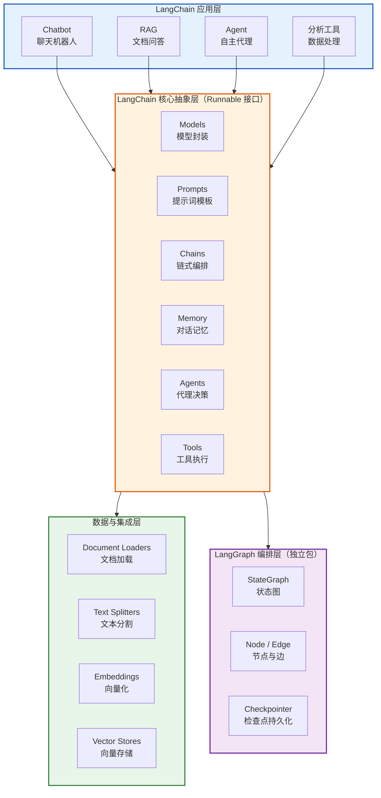
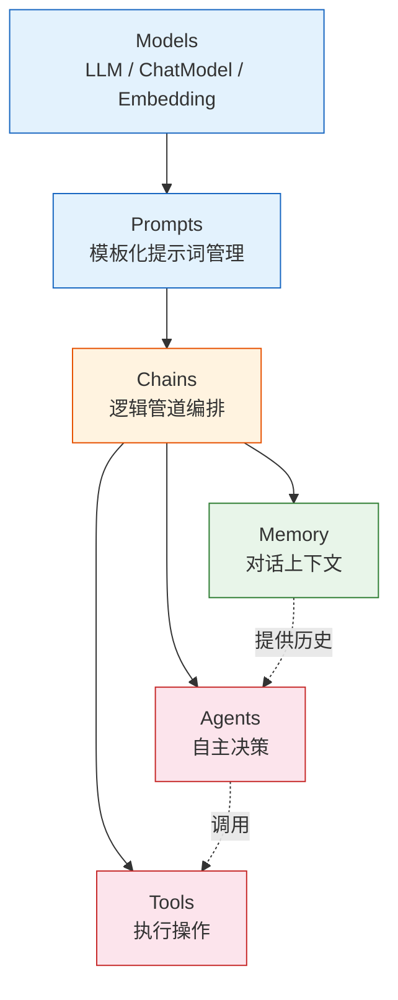
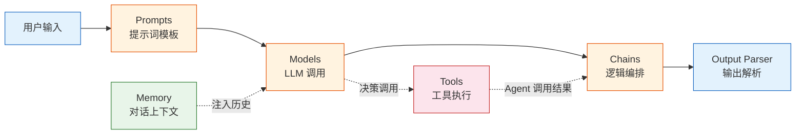
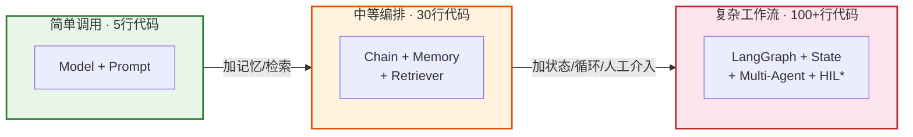
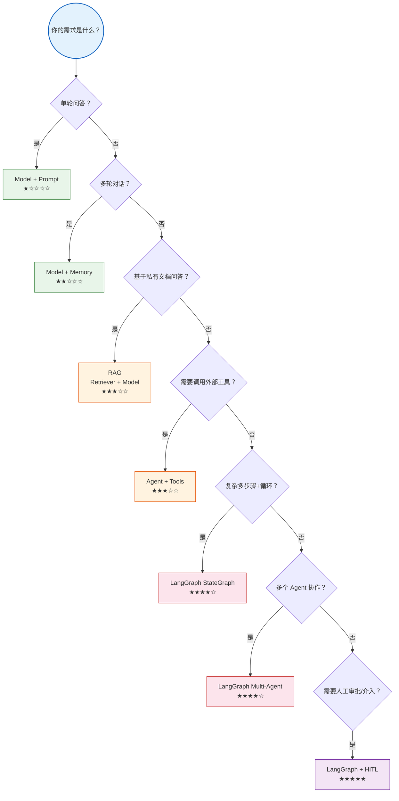

# LangChain 核心架构技术参考

> **定位**：本文档是 LangChain 框架的架构级技术参考，涵盖整体设计哲学、模块拆解、核心抽象与版本演进，供开发者快速建立全局认知。

---

## 1. 框架概述

### 1.1 什么是 LangChain

LangChain 是一个用于构建**大语言模型（LLM）应用**的开源框架，由 Harrison Chase 于 2022 年 10 月创建。它的核心目标是：

| 维度 | 说明 |
|------|------|
| **定位** | LLM 应用开发框架（非模型本身） |
| **语言** | Python（主）/ TypeScript（社区维护） |
| **许可** | MIT 开源协议 |
| **核心价值** | 将 LLM 与外部数据源、工具、记忆等能力组合为完整应用 |
| **适用场景** | 聊天机器人、RAG 问答、Agent 自动化、文档分析、代码助手等 |

### 1.2 为什么需要 LangChain

裸调用 LLM API 存在以下痛点，LangChain 逐一解决：

| 痛点 | 裸 API 调用 | LangChain 解决方案 |
|------|------------|-------------------|
| 模型切换成本高 | 每个提供商 API 不同 | 统一抽象层，一行代码切换 |
| 无法记住上下文 | 每次调用无状态 | Memory 模块管理对话历史 |
| 无法访问外部数据 | 模型只有训练数据 | Retrieval / Document Loader |
| 无法执行操作 | 只能生成文本 | Tools / Agent 执行真实操作 |
| 提示词难复用 | 硬编码在代码中 | Prompt Template 模板化 |
| 流程难以组合 | 逻辑散落各处 | Chain / Graph 组件化编排 |

### 1.3 版本演进

| 版本阶段 | 时间 | 关键变化 |
|----------|------|---------|
| v0.1 | 2024.01 | 首个稳定版，Pydantic 1.x |
| v0.2 | 2024.05 | 移除 `langchain_community` 依赖耦合 |
| v0.3 | 2024.09 | Pydantic 2.x，性能提升，类型提示完善 |
| LangGraph | 2024.01+ | 独立包，图结构编排复杂 Agent 工作流 |

> **重要提示**：LangChain v0.3 是当前推荐版本。本文档所有代码基于 v0.3 语法。

---

## 2. 核心架构分层

### 2.1 架构全景图



> **图解说明**：LangChain 采用四层架构——上层应用调用核心抽象层的能力，核心层向下连接数据集成层获取外部知识，同时可借助 LangGraph 层实现复杂的有状态工作流编排。每一层都通过统一的 `Runnable` 接口串联，组件间可自由组合。

### 2.2 包结构

LangChain v0.3 采用模块化包结构：

| 包名 | 用途 | 安装命令 |
|------|------|---------|
| `langchain-core` | 核心抽象与接口 | `pip install langchain-core` |
| `langchain` | 高级链和 Agent | `pip install langchain` |
| `langgraph` | 图结构工作流编排 | `pip install langgraph` |
| `langchain-community` | 第三方集成 | `pip install langchain-community` |
| `langchain-openai` | OpenAI 集成 | `pip install langchain-openai` |
| `langchain-anthropic` | Anthropic 集成 | `pip install langchain-anthropic` |
| `langchain-experimental` | 实验性功能 | `pip install langchain-experimental` |

### 2.3 核心抽象层详解

#### 2.3.1 Runnable 接口

`Runnable` 是 LangChain v0.3 的**根基接口**，所有组件都实现了它：

```python
from langchain_core.runnables import Runnable

# 所有核心组件都是 Runnable
# Runnable 定义了统一的调用协议：
# - invoke()      : 单次调用
# - batch()       : 批量调用
# - stream()      : 流式输出
# - ainvoke()     : 异步单次调用
# - abatch()      : 异步批量
# - astream()     : 异步流式
# - astream_events() : 异步事件流（用于精细控制）
```

| 方法 | 同步/异步 | 用途 | 返回类型 |
|------|----------|------|---------|
| `invoke(input)` | 同步 | 单次调用 | 完整输出 |
| `batch(inputs)` | 同步 | 批量并行 | 输出列表 |
| `stream(input)` | 同步 | 逐 token 输出 | 迭代器 |
| `ainvoke(input)` | 异步 | 异步单次 | 完整输出 |
| `astream(input)` | 异步 | 异步逐 token | 异步迭代器 |

**设计意义**：任何实现了 `Runnable` 的组件都可以用相同方式调用、组合、编排。

#### 2.3.2 LCEL（LangChain Expression Language）

LCEL 是 LangChain 的**声明式组合语法**，使用管道符 `|` 连接组件：

```python
from langchain_openai import ChatOpenAI
from langchain_core.prompts import ChatPromptTemplate
from langchain_core.output_parsers import StrOutputParser

# LCEL 声明式链
chain = (
    ChatPromptTemplate.from_template("告诉我关于{topic}的知识")
    | ChatOpenAI(model="gpt-4o-mini")
    | StrOutputParser()
)

# 统一调用方式
result = chain.invoke({"topic": "LangChain"})
print(result)
```

**LCEL 的核心优势**：

| 特性 | 说明 |
|------|------|
| 流式支持 | 自动获得流式输出能力 |
| 异步支持 | 自动支持 async/await |
| 批量支持 | 自动并行处理多个输入 |
| 回退机制 | `.with_fallbacks()` 实现容错 |
| 可观测性 | 自动集成 LangSmith 追踪 |
| 类型安全 | 输入输出类型可推断 |

---

## 3. 六大核心模块

### 3.1 模块总览



> **图解说明**：六大模块呈自上而下的流水线结构——Models 封装 LLM 调用，Prompts 管理提示词，Chains 负责编排。Memory 为对话提供历史上下文，Agents 自主决策调用哪些 Tools 执行操作。虚线表示间接依赖关系。

### 3.2 各模块职责

| 模块 | 核心类/接口 | 职责 | 典型用法 |
|------|-----------|------|---------|
| **Models** | `LLM`, `ChatModel`, `Embeddings` | 封装模型调用 | 调用 GPT/Claude 等 |
| **Prompts** | `PromptTemplate`, `ChatPromptTemplate` | 管理提示词模板 | 动态生成提示 |
| **Chains** | `RunnableSequence`（LCEL） | 组合多个步骤 | 多步推理流程 |
| **Memory** | `BaseMemory` → `BaseChatMessageHistory` | 管理对话上下文 | 聊天记忆 |
| **Agents** | `create_tool_calling_agent` | LLM 自主决策调用工具 | 自主完成任务 |
| **Tools** | `BaseTool`, `@tool` 装饰器 | 封装可执行操作 | 搜索/计算/API调用 |

### 3.3 模块间数据流



> **图解说明**：数据从左到右流动——用户输入经提示词模板格式化后送入模型，模型输出经链编排后由解析器提取最终结果。Memory 在模型调用时注入历史上下文，Tools 被 Agent 按需调用后将结果回传给链。

---

## 4. 设计哲学

### 4.1 核心设计原则

| 原则 | 体现 | 好处 |
|------|------|------|
| **组合优于继承** | Runnable 管道组合 | 灵活拼接、易于测试 |
| **抽象优于具体** | 统一接口屏蔽差异 | 模型/组件可替换 |
| **声明式优于命令式** | LCEL 语法 | 代码简洁、可读性强 |
| **可观测性优先** | LangSmith 集成 | 调试/监控/优化 |
| **渐进式复杂度** | 简单到复杂平滑过渡 | 新手友好 |

### 4.2 从简单到复杂的演进路径



> *HIL = Human-in-the-Loop（人类介入）。随着需求复杂度增长，从 5 行代码的简单调用逐步演进到 100+ 行代码的复杂多 Agent 工作流，LangChain 的设计保证了这条路径的平滑过渡。

### 4.3 LangChain vs LangGraph 的关系

| 维度 | LangChain | LangGraph |
|------|-----------|----------|
| **定位** | 组件库 + 简单编排 | 复杂工作流编排引擎 |
| **编排方式** | 线性管道（LCEL） | 有向图（StateGraph） |
| **状态管理** | 无状态 / Memory | 显式 State 对象 |
| **循环支持** | 不支持 | 原生支持循环 |
| **条件分支** | 有限（RunnableBranch） | 原生条件边 |
| **人工介入** | 不支持 | 内置 interrupt |
| **持久化** | 需手动实现 | Checkpointer 内置 |
| **适用场景** | 单轮/简单多步 | 复杂 Agent、多轮对话 |
| **关系** | 提供基础组件 | 构建在 LangChain 之上 |

> **总结**：LangChain 是"零件库"，LangGraph 是"组装车间"。两者配合使用，而非替代关系。

---

## 5. 依赖与安装

### 5.1 完整安装

```bash
# 基础安装（推荐）
pip install langchain langgraph

# 按需安装模型提供商
pip install langchain-openai      # OpenAI
pip install langchain-anthropic   # Anthropic Claude
pip install langchain-google-genai # Google Gemini
pip install langchain-ollama      # Ollama（本地模型）

# 按需安装社区集成
pip install langchain-community    # 社区集成（向量库、文档加载器等）

# 可选：向量数据库
pip install chromadb              # 本地向量库
pip install faiss-cpu            # FAISS 向量检索

# 可选：可观测性
pip install langsmith            # LangSmith 追踪
```

### 5.2 环境配置

```python
import os

# 模型 API Key
os.environ["OPENAI_API_KEY"] = "sk-..."

# LangSmith 追踪（可选但推荐）
os.environ["LANGSMITH_API_KEY"] = "ls-..."
os.environ["LANGSMITH_TRACING"] = "true"
os.environ["LANGSMITH_PROJECT"] = "langchain-learning"
```

### 5.3 版本验证

```python
import langchain
import langgraph
import langchain_core

print(f"LangChain: {langchain.__version__}")
print(f"LangGraph: {langgraph.__version__}")
print(f"LangChain Core: {langchain_core.__version__}")
# 预期输出:
# LangChain: 0.3.x
# LangGraph: 0.2.x
# LangChain Core: 0.3.x
```

---

## 6. 核心概念速查表

| 概念 | 一句话解释 | 对应代码 | 详细文档 |
|------|-----------|---------|---------|
| **Runnable** | 所有组件的统一接口 | `Runnable.invoke()` | 02_组件详解 |
| **LCEL** | 声明式组合语法 | `prompt \| model \| parser` | 02_组件详解 |
| **ChatModel** | 对话模型封装 | `ChatOpenAI()` | 02_组件详解 |
| **PromptTemplate** | 提示词模板 | `ChatPromptTemplate` | 02_组件详解 |
| **OutputParser** | 输出解析器 | `StrOutputParser()` | 02_组件详解 |
| **Chain** | 多步逻辑管道 | LCEL 管道 | 02_组件详解 |
| **Memory** | 对话上下文 | `BaseChatMessageHistory` | 02_组件详解 |
| **Agent** | 自主决策器 | `create_tool_calling_agent` | 02_组件详解 |
| **Tool** | 可执行操作 | `@tool` 装饰器 | 02_组件详解 |
| **Retriever** | 检索器 | `vectorstore.as_retriever()` | 03_RAG技术手册 |
| **StateGraph** | 状态图 | `StateGraph(State)` | 04_LangGraph技术参考 |
| **Checkpointer** | 状态持久化 | `MemorySaver()` | 04_LangGraph技术参考 |

---

## 7. 常见架构模式

### 7.1 模式速览

| 模式 | 适用场景 | 核心组件 | 复杂度 |
|------|---------|---------|--------|
| 简单问答 | 单轮知识查询 | Model + Prompt | ★☆☆☆☆ |
| 聊天机器人 | 多轮对话 | Model + Memory | ★★☆☆☆ |
| RAG 问答 | 基于文档的问答 | Retriever + Model | ★★★☆☆ |
| 工具调用 Agent | 自主完成任务 | Agent + Tools | ★★★☆☆ |
| 多 Agent 协作 | 复杂任务分解 | LangGraph + Multi-Agent | ★★★★☆ |
| 人机协作工作流 | 需要人工审批 | LangGraph + Interrupt | ★★★★★ |

### 7.2 架构选型决策树



> **图解说明**：从需求出发逐级判断——单轮问答只需 Model+Prompt，多轮对话加 Memory，文档问答用 RAG，需要执行操作用 Agent+Tools，复杂循环用 LangGraph，多 Agent 或人机协作则需 LangGraph 的高级特性。星级表示复杂度。

---

## 8. 与相关框架对比

| 维度 | LangChain | LlamaIndex | Semantic Kernel | AutoGPT |
|------|-----------|------------|-----------------|---------|
| **定位** | 通用 LLM 应用框架 | RAG 专用框架 | 微软 AI 编排框架 | 自主 Agent |
| **语言** | Python/TS | Python/TS | C#/Python/Java | Python |
| **核心优势** | 生态最大、组件最全 | RAG 能力最强 | 企业级集成 | 全自主 |
| **学习曲线** | 中等 | 较低 | 较高 | 较高 |
| **适用规模** | 小到大项目 | 中小型 RAG | 企业级 | 实验性 |
| **图编排** | LangGraph | 无 | 无 | 无 |
| **社区活跃度** | ★★★★★ | ★★★★☆ | ★★★☆☆ | ★★★☆☆ |

---

## 参考文献

- [LangChain 官方文档](https://python.langchain.com/docs/)
- [LangGraph 官方文档](https://langchain-ai.github.io/langgraph/)
- [LangChain GitHub](https://github.com/langchain-ai/langchain)
- [LangSmith 文档](https://docs.smith.langchain.com/)

---

> **配套学习课程**：请阅读 `学习课程/第01课_大语言模型应用开发入门.md` 和 `第02课_LangChain初体验.md`
