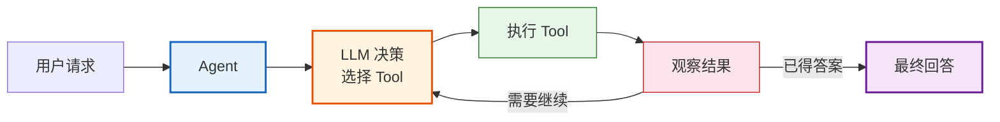

# LangChain 组件详解技术手册

> **定位**：本文档详细拆解 LangChain 六大核心组件（Models / Prompts / Chains / Memory / Agents / Tools）的接口、参数、代码用法与适用场景。

---

## 目录

1. [Models（模型层）](#1-models模型层)
2. [Prompts（提示词层）](#2-prompts提示词层)
3. [Chains（链式编排层）](#3-chains链式编排层)
4. [Memory（记忆层）](#4-memory记忆层)
5. [Agents（代理层）](#5-agents代理层)
6. [Tools（工具层）](#6-tools工具层)
7. [Output Parsers（输出解析器）](#7-output-parsers输出解析器)

---

## 1. Models（模型层）

### 1.1 模型类型对比

| 类型 | 基类 | 输入 | 输出 | 典型场景 |
|------|------|------|------|---------|
| **LLM** | `BaseLLM` | 纯文本字符串 | 纯文本字符串 | 补全式任务 |
| **ChatModel** | `BaseChatModel` | 消息列表 | `AIMessage` 对象 | 对话式任务（主流） |
| **Embeddings** | `Embeddings` | 文本 | 浮点向量 | 向量检索/相似度计算 |

> **推荐**：新项目统一使用 `ChatModel`，它是当前主流，所有新功能优先在此接口上实现。

### 1.2 ChatModel 详解

#### 基本使用

```python
from langchain_openai import ChatOpenAI

# 创建模型实例
model = ChatOpenAI(
    model="gpt-4o-mini",
    temperature=0.7,
    max_tokens=1000,
    timeout=30,
    max_retries=2,
)

# 基本调用
response = model.invoke("你好，请介绍一下你自己")
print(response.content)        # 获取文本内容
print(response.usage_metadata) # 查看 token 用量
```

#### 消息类型

```python
from langchain_core.messages import (
    SystemMessage,    # 系统指令
    HumanMessage,     # 用户消息
    AIMessage,        # AI 回复
    ToolMessage,      # 工具返回结果
)

messages = [
    SystemMessage(content="你是一个 Python 编程助手"),
    HumanMessage(content="如何读取 CSV 文件？"),
]

response = model.invoke(messages)
```

| 消息类型 | 作用 | 必须包含字段 |
|----------|------|-------------|
| `SystemMessage` | 设定角色和行为规则 | `content` |
| `HumanMessage` | 用户输入 | `content` |
| `AIMessage` | AI 回复（用于历史） | `content` |
| `ToolMessage` | 工具执行结果 | `content`, `tool_call_id` |

#### 核心参数

| 参数 | 类型 | 说明 | 推荐值 |
|------|------|------|--------|
| `model` | str | 模型名称 | `"gpt-4o-mini"` / `"gpt-4o"` |
| `temperature` | float | 随机性 0~2 | 0（精确）/ 0.7（均衡）/ 1.0（创意） |
| `max_tokens` | int | 最大输出长度 | 根据需求设定 |
| `timeout` | int | 超时秒数 | 30~60 |
| `max_retries` | int | 重试次数 | 2~3 |
| `streaming` | bool | 是否流式 | True（聊天场景） |

#### 流式输出

```python
# 方式一：stream 方法
for chunk in model.stream("写一首关于编程的诗"):
    print(chunk.content, end="", flush=True)

# 方式二：异步流式
async for chunk in model.astream("写一首关于编程的诗"):
    print(chunk.content, end="", flush=True)
```

#### 多模型提供商切换

```python
# OpenAI
from langchain_openai import ChatOpenAI
model = ChatOpenAI(model="gpt-4o-mini")

# Anthropic Claude
from langchain_anthropic import ChatAnthropic
model = ChatAnthropic(model="claude-sonnet-4-20250514")

# Google Gemini
from langchain_google_genai import ChatGoogleGenerativeAI
model = ChatGoogleGenerativeAI(model="gemini-2.0-flash")

# 本地 Ollama
from langchain_ollama import ChatOllama
model = ChatOllama(model="llama3.1", temperature=0.7)
```

> **关键**：切换模型只需改 import 和初始化，下游代码完全不变——这就是抽象层的价值。

### 1.3 Embeddings 详解

```python
from langchain_openai import OpenAIEmbeddings

# 创建 Embedding 模型
embeddings = OpenAIEmbeddings(model="text-embedding-3-small")

# 嵌入单条文本
vector = embeddings.embed_query("LangChain 是什么？")
print(f"维度: {len(vector)}")  # 1536

# 批量嵌入
texts = ["LangChain", "LangGraph", "RAG"]
vectors = embeddings.embed_documents(texts)
print(f"数量: {len(vectors)}, 维度: {len(vectors[0])}")
```

| Embedding 模型 | 提供商 | 维度 | 特点 |
|----------------|--------|------|------|
| `text-embedding-3-small` | OpenAI | 1536 | 性价比高 |
| `text-embedding-3-large` | OpenAI | 3072 | 精度更高 |
| `text-embedding-ada-002` | OpenAI | 1536 | 旧版，不推荐 |
| `bge-large-zh` | 智源 | 1024 | 中文效果好，开源 |
| `nomic-embed-text` | Ollama | 768 | 本地运行，免费 |

---

## 2. Prompts（提示词层）

### 2.1 PromptTemplate

```python
from langchain_core.prompts import PromptTemplate

# 基础模板
template = PromptTemplate.from_template(
    "请用{language}语言编写一个{task}的函数"
)

# 格式化
prompt = template.format(language="Python", task="排序")
print(prompt)  # 请用Python语言编写一个排序的函数
```

### 2.2 ChatPromptTemplate（推荐）

```python
from langchain_core.prompts import ChatPromptTemplate

# 创建对话模板
prompt = ChatPromptTemplate.from_messages([
    ("system", "你是一个{role}，用{style}的风格回答问题"),
    ("human", "{question}"),
])

# 格式化
messages = prompt.invoke({
    "role": "Python老师",
    "style": "幽默",
    "question": "什么是装饰器？"
})
```

### 2.3 模板变量与部分填充

```python
# 部分填充（绑定固定值）
prompt = ChatPromptTemplate.from_messages([
    ("system", "你是{company}的{role}"),
    ("human", "{question}"),
])

# 先固定 company，后续再填 role 和 question
partial_prompt = prompt.partial(company="百度")
result = partial_prompt.invoke({"role": "工程师", "question": "什么是云？"})
```

### 2.4 Few-Shot 提示

```python
from langchain_core.prompts import FewShotChatMessagePromptTemplate

# 示例
examples = [
    {"input": "高兴", "output": "😊"},
    {"input": "悲伤", "output": "😢"},
    {"input": "愤怒", "output": "😠"},
]

example_prompt = ChatPromptTemplate.from_messages([
    ("human", "{input}"),
    ("ai", "{output}"),
])

few_shot_prompt = FewShotChatMessagePromptTemplate(
    example_prompt=example_prompt,
    examples=examples,
)

final_prompt = ChatPromptTemplate.from_messages([
    ("system", "将情绪词转换为对应的 emoji"),
    few_shot_prompt,
    ("human", "{input}"),
])
```

---

## 3. Chains（链式编排层）

### 3.1 LCEL 基础

```python
from langchain_openai import ChatOpenAI
from langchain_core.prompts import ChatPromptTemplate
from langchain_core.output_parsers import StrOutputParser

# 最简链
chain = (
    ChatPromptTemplate.from_template("用一句话解释{topic}")
    | ChatOpenAI(model="gpt-4o-mini", temperature=0)
    | StrOutputParser()
)

result = chain.invoke({"topic": "量子计算"})
```

### 3.2 链的组合方式

#### 顺序组合

```python
# prompt → model → parser
chain = prompt | model | parser
```

#### 并行组合（RunnableParallel）

```python
from langchain_core.runnables import RunnableParallel

# 同时执行多条链
chain = RunnableParallel(
    summary=prompt1 | model | parser,
    translation=prompt2 | model | parser,
)

result = chain.invoke({"topic": "LangChain"})
# result = {"summary": "...", "translation": "..."}
```

#### 条件分支（RunnableBranch）

```python
from langchain_core.runnables import RunnableBranch

branch = RunnableBranch(
    (lambda x: x["language"] == "Python", python_chain),
    (lambda x: x["language"] == "Java", java_chain),
    default_chain,  # 默认分支
)
```

#### 管道串联（管道符 |）

```python
# 多条链串联
full_chain = chain1 | chain2 | chain3
```

### 3.3 高级特性

| 特性 | 方法 | 用途 |
|------|------|------|
| 流式 | `chain.stream(input)` | 逐 token 输出 |
| 批量 | `chain.batch([input1, input2])` | 并行处理 |
| 异步 | `await chain.ainvoke(input)` | 异步调用 |
| 容错 | `chain.with_fallbacks([backup_chain])` | 失败回退 |
| 配置 | `chain.with_config(tags=["v1"])` | 可观测性标签 |
| 结构化输出 | `model.with_structured_output(schema)` | 强制 JSON 输出 |

---

## 4. Memory（记忆层）

### 4.1 架构演进

> **重要变更**：LangChain v0.3 中，传统 `ConversationChain` + `ConversationBufferMemory` 已**不推荐**。新方案使用 `RunnableWithMessageHistory` + `BaseChatMessageHistory`。

### 4.2 新架构（推荐）

```python
from langchain_core.chat_history import BaseChatMessageHistory
from langchain_core.runnables.history import RunnableWithMessageHistory
from langchain_community.chat_message_histories import ChatMessageHistory

# 会话历史存储
message_history = ChatMessageHistory()

# 带历史的链
chain_with_history = RunnableWithMessageHistory(
    chain,
    lambda session_id: message_history,
    input_messages_key="input",
    history_messages_key="history",
)

# 调用（指定 session_id）
result = chain_with_history.invoke(
    {"input": "我叫张三"},
    config={"configurable": {"session_id": "user_123"}}
)
```

### 4.3 历史存储后端

| 后端 | 类名 | 持久化 | 适用场景 |
|------|------|--------|---------|
| 内存 | `InMemoryChatMessageHistory` | 否 | 开发测试 |
| 文件 | `FileChatMessageHistory` | 是 | 单机简单场景 |
| Redis | `RedisChatMessageHistory` | 是 | 生产环境 |
| SQLite | `SQLChatMessageHistory` | 是 | 轻量生产 |
| PostgreSQL | `PostgresChatMessageHistory` | 是 | 企业级生产 |

### 4.4 上下文管理策略

当对话历史过长时，需要策略控制 token 数量：

| 策略 | 原理 | 适用场景 |
|------|------|---------|
| **Buffer（全量保留）** | 保留所有消息 | 短对话 |
| **Buffer Window** | 只保留最近 N 轮 | 中等对话 |
| **Summary** | 定期总结历史 | 长对话 |
| **Summary + Buffer** | 总结 + 最近 N 轮 | 超长对话 |
| **Token Buffer** | 按 token 数截断 | 精确控制 |

```python
# 窗口策略示例：只保留最近 5 条
from langchain_core.messages import trim_messages

trimmer = trim_messages(
    max_tokens=500,
    strategy="last",        # 保留最后的消息
    token_counter=model,     # 用模型计算 token
    include_system=True,     # 保留 system 消息
)
```

---

## 5. Agents（代理层）

### 5.1 什么是 Agent

Agent = LLM + Tools + 推理循环



> **图解说明**：Agent 的核心是一个推理循环——LLM 根据用户请求决策调用哪个工具，执行后观察结果，再决定是否继续调用工具或给出最终回答。这种"思考→行动→观察"的循环使 Agent 能自主完成复杂任务。

### 5.2 Agent 类型对比

| 类型 | 创建函数 | 特点 | 推荐度 |
|------|---------|------|--------|
| **Tool Calling Agent** | `create_tool_calling_agent()` | 原生函数调用，最可靠 | ★★★★★ |
| **ReAct Agent** | `create_react_agent()` (LangGraph) | 推理+行动模式 | ★★★★☆ |
| **OpenAI Functions** | `create_openai_functions_agent()` | 旧版，兼容用 | ★★☆☆☆ |

### 5.3 创建 Tool Calling Agent

```python
from langchain.agents import create_tool_calling_agent, AgentExecutor
from langchain_openai import ChatOpenAI
from langchain_core.prompts import ChatPromptTemplate

# 定义工具
from langchain_core.tools import tool

@tool
def search_web(query: str) -> str:
    """搜索网络获取最新信息"""
    # 实际搜索逻辑...
    return f"搜索结果: {query}"

@tool
def calculate(expression: str) -> str:
    """计算数学表达式"""
    try:
        return str(eval(expression))
    except:
        return "无法计算"

tools = [search_web, calculate]

# 创建 Agent
llm = ChatOpenAI(model="gpt-4o-mini", temperature=0)
prompt = ChatPromptTemplate.from_messages([
    ("system", "你是一个有用的助手，可以使用工具完成任务"),
    ("human", "{input}"),
    ("placeholder", "{agent_scratchpad}"),
])

agent = create_tool_calling_agent(llm, tools, prompt)
agent_executor = AgentExecutor(agent=agent, tools=tools, verbose=True)

# 执行
result = agent_executor.invoke({"input": "3的5次方是多少？"})
```

### 5.4 AgentExecutor 参数

| 参数 | 类型 | 说明 | 推荐值 |
|------|------|------|--------|
| `agent` | Agent | Agent 对象 | - |
| `tools` | list | 工具列表 | - |
| `verbose` | bool | 打印执行过程 | True（调试）/ False（生产） |
| `max_iterations` | int | 最大迭代次数 | 5~10 |
| `handle_parsing_errors` | bool | 解析错误时继续 | True |
| `return_intermediate_steps` | bool | 返回中间步骤 | False（生产） |

### 5.5 LangGraph 版 Agent（推荐）

```python
from langgraph.prebuilt import create_react_agent

# 一行创建 ReAct Agent
agent = create_react_agent(llm, tools)

# 调用
result = agent.invoke({"messages": [("user", "北京今天天气如何？")]})
```

> **趋势**：LangGraph 版 `create_react_agent` 更简洁、更强大，是新项目首选。

---

## 6. Tools（工具层）

### 6.1 工具定义方式

#### 方式一：@tool 装饰器（推荐）

```python
from langchain_core.tools import tool

@tool
def get_weather(city: str) -> str:
    """获取指定城市的天气信息。
    
    Args:
        city: 城市名称，如"北京"、"上海"
    
    Returns:
        天气描述字符串
    """
    # 实际天气查询逻辑
    return f"{city}今天晴，25°C"

# 工具自动从 docstring 提取描述和参数
print(get_weather.name)        # get_weather
print(get_weather.description) # 获取指定城市的天气信息...
print(get_weather.args)       # {'city': {'type': 'string', ...}}
```

#### 方式二：BaseTool 子类

```python
from langchain_core.tools import BaseTool
from pydantic import BaseModel, Field

class SearchInput(BaseModel):
    query: str = Field(description="搜索关键词")
    max_results: int = Field(default=5, description="最大返回数量")

class SearchTool(BaseTool):
    name: str = "search"
    description: str = "搜索引擎搜索"
    args_schema: type = SearchInput
    
    def _run(self, query: str, max_results: int = 5) -> str:
        return f"搜索 '{query}'，返回 {max_results} 条结果"
    
    async def _arun(self, query: str, max_results: int = 5) -> str:
        # 异步实现
        return self._run(query, max_results)
```

#### 方式三：StructuredTool.from_function

```python
from langchain_core.tools import StructuredTool

def multiply(a: float, b: float) -> float:
    """两个数相乘"""
    return a * b

multiply_tool = StructuredTool.from_function(multiply)
```

### 6.2 内置工具

| 工具包 | 包名 | 典型工具 |
|--------|------|---------|
| 搜索引擎 | `langchain-community` | DuckDuckGoSearchRun, GoogleSearchRun |
| Python REPL | `langchain-experimental` | PythonREPLTool |
| 维基百科 | `langchain-community` | WikipediaQueryRun |
| 计算器 | `langchain-community` | Calculator |
| 文件操作 | `langchain-community` | ReadFileTool, WriteFileTool |
| Shell 命令 | `langchain-community` | ShellTool |
| SQL 查询 | `langchain-community` | QuerySQLDataBaseTool |

### 6.3 工具调用结果处理

```python
# 工具返回带图片
from langchain_core.tools import tool

@tool
def generate_chart(description: str) -> str:
    """根据描述生成图表"""
    # 生成图片并保存
    return "图表已生成，路径: /tmp/chart.png"
    # 也可以返回 base64 编码的图片

# 工具返回结构化数据
@tool
def get_stock_price(symbol: str) -> dict:
    """获取股票价格"""
    return {"symbol": symbol, "price": 150.25, "change": "+2.5%"}
```

---

## 7. Output Parsers（输出解析器）

### 7.1 解析器类型

| 解析器 | 类名 | 用途 |
|--------|------|------|
| 字符串 | `StrOutputParser` | 直接提取文本 |
| JSON | `JsonOutputParser` | 解析 JSON |
| Pydantic | `PydanticOutputParser` | 解析为 Pydantic 模型 |
| 列表 | `CommaSeparatedListOutputParser` | 逗号分隔列表 |
| 日期 | `DatetimeOutputParser` | 解析日期 |

### 7.2 使用示例

```python
from langchain_core.output_parsers import (
    StrOutputParser,
    JsonOutputParser,
)
from pydantic import BaseModel, Field

# Pydantic 解析器
class BookInfo(BaseModel):
    title: str = Field(description="书名")
    author: str = Field(description="作者")
    year: int = Field(description="出版年份")

# 结构化输出（推荐方式，比 Parser 更可靠）
model = ChatOpenAI(model="gpt-4o-mini")
structured_model = model.with_structured_output(BookInfo)

result = structured_model.invoke("请提取《三体》的书籍信息")
# result 是 BookInfo 对象，类型安全
print(result.title)   # 三体
print(result.author)  # 刘慈欣
print(result.year)    # 2008
```

### 7.3 结构化输出对比

| 方式 | 可靠性 | 易用性 | 适用场景 |
|------|--------|--------|---------|
| `with_structured_output()` | ★★★★★ | ★★★★★ | 首选方案 |
| `PydanticOutputParser` | ★★★★☆ | ★★★☆☆ | 需要格式指令时 |
| `JsonOutputParser` | ★★★☆☆ | ★★★★☆ | 简单 JSON |
| 手动 `json.loads()` | ★☆☆☆☆ | ★☆☆☆☆ | 不推荐 |

---

## 组件速查表

| 组件 | 创建方式 | 一句话用途 |
|------|---------|-----------|
| `ChatOpenAI` | `ChatOpenAI(model="gpt-4o-mini")` | 调用 OpenAI 对话模型 |
| `ChatPromptTemplate` | `.from_messages([...])` | 创建对话提示模板 |
| `StrOutputParser` | `StrOutputParser()` | 提取纯文本输出 |
| `RunnableParallel` | `RunnableParallel(a=..., b=...)` | 并行执行 |
| `RunnableWithMessageHistory` | `RunnableWithMessageHistory(chain, ...)` | 添加对话记忆 |
| `create_tool_calling_agent` | `create_tool_calling_agent(llm, tools, prompt)` | 创建工具调用 Agent |
| `AgentExecutor` | `AgentExecutor(agent, tools)` | 执行 Agent |
| `@tool` | `@tool def func(): ...` | 定义工具 |
| `with_structured_output` | `model.with_structured_output(Schema)` | 结构化输出 |

---

> **配套学习课程**：请阅读 `学习课程/第03课_Prompt工程与模板化设计.md` 至 `第06课_工具与代理Agent_让AI行动起来.md`
