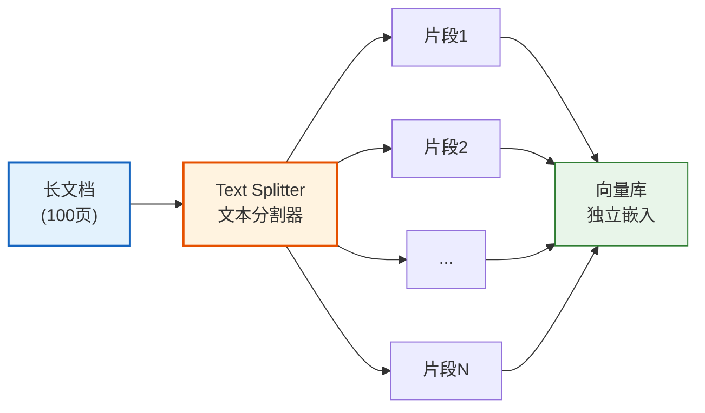
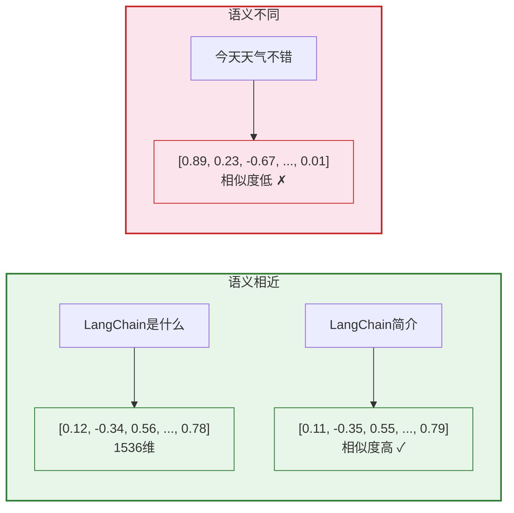
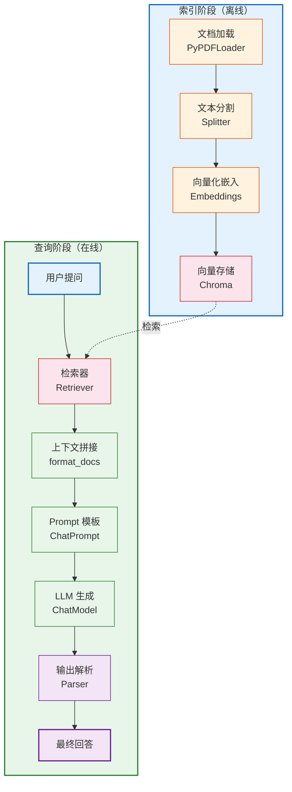

# 数据连接与 RAG 技术手册

> **定位**：本文档系统讲解 LangChain 数据连接层（Document Loaders / Text Splitters / Embeddings / Vector Stores / Retrievers）和 RAG（检索增强生成）的完整技术栈。

---

## 目录

1. [RAG 概述](#1-rag-概述)
2. [Document Loaders（文档加载器）](#2-document-loaders文档加载器)
3. [Text Splitters（文本分割器）](#3-text-splitters文本分割器)
4. [Embeddings（向量化）](#4-embeddings向量化)
5. [Vector Stores（向量存储）](#5-vector-stores向量存储)
6. [Retrievers（检索器）](#6-retrievers检索器)
7. [完整 RAG 管道](#7-完整-rag-管道)
8. [高级 RAG 技术](#8-高级-rag-技术)

---

## 1. RAG 概述

### 1.1 什么是 RAG

RAG（Retrieval-Augmented Generation，检索增强生成）= **先检索相关知识，再让 LLM 基于知识回答**。


> **图解说明**：RAG 的核心思路——用户提问后不直接让 LLM 回答，而是先用检索器从知识库中找到相关的文档片段，再把片段和问题一起发给 LLM，让 LLM 基于真实文档生成回答，从而减少幻觉、支持私有数据和实时更新。

### 1.2 为什么需要 RAG

| 问题 | 不用 RAG | 用 RAG |
|------|---------|--------|
| 知识过时 | 模型训练数据有截止日期 | 实时从最新文档检索 |
| 幻觉问题 | 模型可能编造信息 | 基于真实文档回答 |
| 私有数据 | 模型不知道你的数据 | 可接入企业内部文档 |
| 成本 | 微调模型昂贵 | 只需向量检索 |
| 可溯源性 | 无法追溯来源 | 可标注引用来源 |

### 1.3 RAG vs 微调

| 维度 | RAG | 微调（Fine-tuning） |
|------|-----|-------------------|
| 适用场景 | 知识更新、事实问答 | 调整风格/格式/行为 |
| 数据准备 | 文档即可 | 需标注训练数据 |
| 更新成本 | 增删文档即可 | 需重新训练 |
| 计算成本 | 低（推理时检索） | 高（训练+推理） |
| 实时性 | 实时更新 | 无法实时 |
| 可解释性 | 高（可追溯来源） | 低 |

---

## 2. Document Loaders（文档加载器）

### 2.1 概述

Document Loader 负责将各种格式的数据源转换为 LangChain 标准的 `Document` 对象。

```python
from langchain_core.documents import Document

# Document 结构
doc = Document(
    page_content="这是文档内容",
    metadata={"source": "file.pdf", "page": 1}
)
```

### 2.2 常用文档加载器

| 类型 | 加载器类 | 包 | 支持格式 |
|------|---------|-----|---------|
| PDF | `PyPDFLoader` | `langchain-community` | .pdf |
| Word | `Docx2txtLoader` | `langchain-community` | .docx |
| Markdown | `UnstructuredMarkdownLoader` | `langchain-community` | .md |
| CSV | `CSVLoader` | `langchain-community` | .csv |
| HTML | `WebBaseLoader` | `langchain-community` | 网页 URL |
| TXT | `TextLoader` | `langchain-core` | .txt |
| JSON | `JSONLoader` | `langchain-community` | .json |
| Excel | `UnstructuredExcelLoader` | `langchain-community` | .xlsx |

### 2.3 代码示例

```python
# PDF 加载
from langchain_community.document_loaders import PyPDFLoader

loader = PyPDFLoader("document.pdf")
pages = loader.load()  # 返回 Document 列表，每页一个
print(f"页数: {len(pages)}")
print(f"第一页内容: {pages[0].page_content[:200]}")
print(f"元数据: {pages[0].metadata}")

# CSV 加载
from langchain_community.document_loaders import CSVLoader

loader = CSVLoader("data.csv", encoding="utf-8")
rows = loader.load()
print(f"行数: {len(rows)}")

# 网页加载
from langchain_community.document_loaders import WebBaseLoader

loader = WebBaseLoader("https://example.com/article")
docs = loader.load()
print(f"内容长度: {len(docs[0].page_content)}")

# 批量加载多个文件
from langchain_community.document_loaders import DirectoryLoader

loader = DirectoryLoader(
    "./docs",
    glob="**/*.pdf",
    loader_cls=PyPDFLoader,
    show_progress=True,
)
docs = loader.load()
print(f"总文档数: {len(docs)}")
```

### 2.4 Document 对象结构

```python
@dataclass
class Document:
    page_content: str        # 文本内容
    metadata: dict           # 元数据（来源、页码等）
```

| 常见 metadata 字段 | 说明 |
|-------------------|------|
| `source` | 文件路径或 URL |
| `page` | PDF 页码 |
| `page_number` | 页码（从 1 开始） |
| `row` | CSV/Excel 行号 |
| `total_pages` | 总页数 |

---

## 3. Text Splitters（文本分割器）

### 3.1 为什么需要分割

LLM 的上下文窗口有限（如 GPT-4o-mini 为 128K tokens），需要将长文档分割为小块再嵌入。



> **图解说明**：LLM 上下文窗口有限，长文档需先分割为小片段，每个片段独立嵌入向量库，检索时只返回最相关的片段。

### 3.2 分割策略对比

| 分割器 | 类名 | 原理 | 适用场景 |
|--------|------|------|---------|
| 递归字符 | `RecursiveCharacterTextSplitter` | 按分隔符递归分割 | **通用首选** |
| 字符 | `CharacterTextSplitter` | 按单一分隔符 | 简单文本 |
| Token | `TokenTextSplitter` | 按 token 数 | 精确控制 |
| Markdown | `MarkdownHeaderTextSplitter` | 按标题层级 | Markdown 文档 |
| 代码 | `RecursiveCharacterTextSplitter` + 语言 | 按代码语法 | 代码文件 |
| 语义 | `SemanticChunker` | 按语义相似度 | 高级场景（实验性） |

### 3.3 核心参数

```python
from langchain_text_splitters import RecursiveCharacterTextSplitter

splitter = RecursiveCharacterTextSplitter(
    chunk_size=1000,       # 每块最大字符数
    chunk_overlap=200,     # 相邻块重叠字符数
    separators=["\n\n", "\n", "。", "！", "？", "，", " ", ""],  # 分隔符优先级
    length_function=len,   # 长度计算函数
)
```

| 参数 | 说明 | 推荐值 |
|------|------|--------|
| `chunk_size` | 每块最大长度 | 500~1500 字符 |
| `chunk_overlap` | 重叠区域 | chunk_size 的 10%~20% |
| `separators` | 分隔符优先级列表 | 从大到小排列 |

### 3.4 分割示例

```python
# 通用文本分割
text = "很长的文档内容..."
chunks = splitter.split_text(text)
print(f"分割后块数: {len(chunks)}")

# 分割 Document 列表
docs = loader.load()
chunks = splitter.split_documents(docs)
print(f"原始文档: {len(docs)} → 分割后: {len(chunks)}")

# Markdown 按标题分割
from langchain_text_splitters import MarkdownHeaderTextSplitter

md_splitter = MarkdownHeaderTextSplitter(
    headers_to_split_on=[
        ("#", "Header 1"),
        ("##", "Header 2"),
        ("###", "Header 3"),
    ]
)
md_chunks = md_splitter.split_text(markdown_text)

# 代码分割
from langchain_text_splitters import RecursiveCharacterTextSplitter, Language

python_splitter = RecursiveCharacterTextSplitter.from_language(
    language=Language.PYTHON,
    chunk_size=500,
    chunk_overlap=50,
)
code_chunks = python_splitter.split_text(python_code)
```

### 3.5 chunk_size 选择指南

| 文档类型 | 推荐 chunk_size | 推荐 overlap | 说明 |
|----------|----------------|-------------|------|
| 问答对/FAQ | 200~400 | 0~50 | 短小精确 |
| 技术文档 | 500~1000 | 100~200 | 保留段落完整性 |
| 长篇报告 | 1000~1500 | 200~300 | 覆盖完整段落 |
| 代码 | 300~500 | 50~100 | 按函数/类分 |
| 对话记录 | 500~800 | 100 | 保留上下文 |

---

## 4. Embeddings（向量化）

### 4.1 概念

Embedding = 将文本转换为固定维度的浮点向量，使语义相近的文本在向量空间中距离也近。



> **图解说明**：Embedding 将文本转为高维向量，语义相近的文本在向量空间中距离也近。"LangChain是什么"和"LangChain简介"的向量高度相似，而"今天天气不错"的向量与之差异很大。

### 4.2 模型选择

详见 `02_LangChain组件详解技术手册.md` 的 Embeddings 部分。

### 4.3 相似度计算

| 方法 | 公式 | 特点 |
|------|------|------|
| 余弦相似度 | `cos(a, b) = (a·b) / (|a||b|)` | 最常用，关注方向 |
| 欧氏距离 | `d = sqrt(Σ(ai - bi)²)` | 关注绝对距离 |
| 点积 | `a·b = Σ(ai * bi)` | 简单快速 |

```python
import numpy as np

def cosine_similarity(a, b):
    return np.dot(a, b) / (np.linalg.norm(a) * np.linalg.norm(b))

sim = cosine_similarity(vec1, vec2)
print(f"相似度: {sim:.4f}")  # 范围 [-1, 1]，越接近 1 越相似
```

---

## 5. Vector Stores（向量存储）

### 5.1 概述

Vector Store = 存储 Embedding 向量 + 原文 + 元数据，支持高效相似度检索。

### 5.2 向量库对比

| 向量库 | 类型 | 部署方式 | 适用规模 | 特色 |
|--------|------|---------|---------|------|
| **Chroma** | 嵌入式 | 本地 | 小~中 | 零配置，开发友好 |
| **FAISS** | 库 | 本地 | 中~大 | Meta 开源，搜索极快 |
| **Pinecone** | 云服务 | SaaS | 大 | 全托管，免运维 |
| **Milvus** | 独立服务 | 自部署/云 | 大~超大 | 分布式，企业级 |
| **Weaviate** | 独立服务 | 自部署/云 | 中~大 | 内置混合检索 |
| **pgvector** | PG 扩展 | 自部署 | 中 | 复用 PostgreSQL |
| **Qdrant** | 独立服务 | 自部署/云 | 中~大 | Rust 编写，高性能 |

### 5.3 基本操作

```python
# 使用 Chroma（本地零配置）
from langchain_chroma import Chroma

# 创建向量库
vectorstore = Chroma.from_documents(
    documents=chunks,
    embedding=OpenAIEmbeddings(model="text-embedding-3-small"),
    collection_name="my_docs",
    persist_directory="./chroma_db",  # 持久化路径
)

# 相似度搜索
results = vectorstore.similarity_search(
    query="LangChain是什么",
    k=5,              # 返回最相似的 5 条
    filter={"source": "doc1.pdf"},  # 元数据过滤
)

# 带分数的搜索
results_with_scores = vectorstore.similarity_search_with_score(
    query="LangChain是什么",
    k=5,
)
for doc, score in results_with_scores:
    print(f"分数: {score:.4f}, 内容: {doc.page_content[:100]}")

# 使用 as_retriever 转为检索器
retriever = vectorstore.as_retriever(
    search_type="similarity",     # 检索类型
    search_kwargs={"k": 5},       # 检索参数
)
```

### 5.4 检索类型

| 搜索类型 | 说明 | 适用场景 |
|----------|------|---------|
| `similarity` | 纯向量相似度 | 默认选择 |
| `mmr` | 最大边际相关性 | 避免结果重复 |
| `similarity_score_threshold` | 相似度阈值过滤 | 要求最低质量 |

```python
# MMR 检索（兼顾相关性和多样性）
retriever = vectorstore.as_retriever(
    search_type="mmr",
    search_kwargs={
        "k": 5,
        "fetch_k": 20,        # 初始检索数
        "lambda_mult": 0.5,   # 多样性权重 0~1
    }
)
```

---

## 6. Retrievers（检索器）

### 6.1 概述

Retriever 是 LangChain 的统一检索接口，不限于向量库——可以是从数据库、搜索引擎、API 等任何来源获取相关文档。

### 6.2 检索器类型

| 类型 | 类名 | 数据来源 |
|------|------|---------|
| 向量检索 | `vectorstore.as_retriever()` | 向量数据库 |
| 关键词检索 | `BM25Retriever` | 倒排索引 |
| 混合检索 | `EnsembleRetriever` | 向量 + 关键词 |
| 多查询 | `MultiQueryRetriever` | LLM 生成多个查询 |
| 上下文压缩 | `ContextualCompressionRetriever` | 过滤/压缩检索结果 |
| 父子文档 | `ParentDocumentRetriever` | 小块检索，大块返回 |
| 自查询 | `SelfQueryRetriever` | LLM 解析自然语言为查询 |

### 6.3 混合检索示例

```python
from langchain_community.retrievers import BM25Retriever
from langchain.retrievers import EnsembleRetriever

# 关键词检索（BM25）
bm25_retriever = BM25Retriever.from_documents(chunks)
bm25_retriever.k = 5

# 向量检索
vector_retriever = vectorstore.as_retriever(search_kwargs={"k": 5})

# 混合检索（加权融合）
ensemble_retriever = EnsembleRetriever(
    retrievers=[bm25_retriever, vector_retriever],
    weights=[0.4, 0.6],  # BM25 权重 0.4, 向量权重 0.6
)

results = ensemble_retriever.invoke("LangChain的主要组件有哪些？")
```

### 6.4 多查询检索

```python
from langchain.retrievers.multi_query import MultiQueryRetriever

# LLM 生成多个角度的查询，提升召回率
multi_query_retriever = MultiQueryRetriever.from_llm(
    retriever=vectorstore.as_retriever(),
    llm=ChatOpenAI(model="gpt-4o-mini"),
)

# 原始查询: "LangChain是什么"
# LLM 可能生成:
#   1. "LangChain框架的功能和用途"
#   2. "LangChain在AI开发中的应用"
#   3. "LangChain核心特性介绍"
```

---

## 7. 完整 RAG 管道

### 7.1 基础 RAG

```python
from langchain_openai import ChatOpenAI, OpenAIEmbeddings
from langchain_community.document_loaders import PyPDFLoader
from langchain_text_splitters import RecursiveCharacterTextSplitter
from langchain_chroma import Chroma
from langchain_core.prompts import ChatPromptTemplate
from langchain_core.output_parsers import StrOutputParser
from langchain_core.runnables import RunnablePassthrough

# Step 1: 加载文档
loader = PyPDFLoader("knowledge.pdf")
docs = loader.load()

# Step 2: 分割
splitter = RecursiveCharacterTextSplitter(
    chunk_size=1000,
    chunk_overlap=200,
)
chunks = splitter.split_documents(docs)

# Step 3: 创建向量库
vectorstore = Chroma.from_documents(
    documents=chunks,
    embedding=OpenAIEmbeddings(model="text-embedding-3-small"),
    persist_directory="./chroma_db",
)
retriever = vectorstore.as_retriever(search_kwargs={"k": 4})

# Step 4: 构建 RAG 链
template = """基于以下上下文回答用户问题。如果上下文中没有答案，请说"我不知道"。

上下文：
{context}

问题：{question}

回答："""

prompt = ChatPromptTemplate.from_template(template)
model = ChatOpenAI(model="gpt-4o-mini", temperature=0)

def format_docs(docs):
    return "\n\n".join(doc.page_content for doc in docs)

rag_chain = (
    {"context": retriever | format_docs, "question": RunnablePassthrough()}
    | prompt
    | model
    | StrOutputParser()
)

# Step 5: 问答
answer = rag_chain.invoke("LangChain的六大核心模块是什么？")
print(answer)
```

### 7.2 RAG 管道流程图



> **图解说明**：RAG 管道分为两个阶段——**索引阶段**（离线）：加载文档→分割→向量化→存入向量库；**查询阶段**（在线）：用户提问→检索器从向量库找相关片段→拼接上下文→构建 Prompt→LLM 生成→解析输出。两个阶段通过向量库的检索接口连接。

---

## 8. 高级 RAG 技术

### 8.1 带来源引用的 RAG

```python
from langchain_core.output_parsers import StrOutputParser

def format_docs_with_sources(docs):
    return "\n\n".join(
        f"[来源{i+1}] {doc.metadata.get('source', '未知')}\n{doc.page_content}"
        for i, doc in enumerate(docs)
    )

rag_with_sources = (
    {
        "context": retriever | format_docs_with_sources,
        "question": RunnablePassthrough(),
        "sources": retriever | (lambda docs: [d.metadata.get("source") for d in docs]),
    }
    | prompt
    | model
    | StrOutputParser()
)
```

### 8.2 对话式 RAG（带历史）

```python
from langchain_core.messages import AIMessage, HumanMessage
from langchain_core.runnables import RunnablePassthrough

# 带历史上下文的 RAG
def format_chat_history(history):
    return "\n".join(
        f"{'用户' if isinstance(m, HumanMessage) else 'AI'}: {m.content}"
        for m in history
    )

contextualize_prompt = ChatPromptTemplate.from_messages([
    ("system", "根据对话历史，将用户最新问题改写为独立的问题（不依赖上下文）"),
    ("human", "对话历史：{history}\n\n最新问题：{question}\n\n改写后的问题："),
])

qa_prompt = ChatPromptTemplate.from_messages([
    ("system", "基于上下文回答问题。上下文：\n{context}"),
    ("human", "{question}"),
])

# 链：先用历史改写问题 → 再检索 → 再回答
```

### 8.3 父子文档检索

```python
from langchain.retrievers import ParentDocumentRetriever
from langchain_text_splitters import RecursiveCharacterTextSplitter
from langchain_community.storage import InMemoryStore

# 大块用于上下文（完整），小块用于检索（精确）
parent_splitter = RecursiveCharacterTextSplitter(chunk_size=2000)
child_splitter = RecursiveCharacterTextSplitter(chunk_size=400)

# 检索小块，返回大块
retriever = ParentDocumentRetriever(
    vectorstore=vectorstore,         # 存小块向量
    docstore=InMemoryStore(),         # 存大块原文
    child_splitter=child_splitter,
    parent_splitter=parent_splitter,
)
retriever.add_documents(docs)
```

### 8.4 RAG 评估指标

| 指标 | 说明 | 评估内容 |
|------|------|---------|
| **上下文相关性** | 检索结果是否与问题相关 | 检索器质量 |
| **答案准确性** | 回答是否基于检索到的上下文 | LLM 遵循指令的能力 |
| **答案相关性** | 回答是否直接回答了用户问题 | 端到端质量 |
| **召回率** | 是否检索到了所有相关文档 | 检索覆盖度 |
| **精确率** | 检索结果中有多少是相关的 | 检索精确度 |

---

## RAG 技术速查表

| 步骤 | 组件 | 常用类 | 关键参数 |
|------|------|--------|---------|
| 加载 | Loader | `PyPDFLoader` | 文件路径 |
| 分割 | Splitter | `RecursiveCharacterTextSplitter` | chunk_size, overlap |
| 嵌入 | Embeddings | `OpenAIEmbeddings` | model |
| 存储 | VectorStore | `Chroma` | persist_directory |
| 检索 | Retriever | `as_retriever()` | search_type, k |
| 生成 | Chain | LCEL 管道 | prompt, model |
| 解析 | Parser | `StrOutputParser()` | - |

---

> **配套学习课程**：请阅读 `学习课程/第07课_检索增强生成RAG_让AI拥有知识.md`
