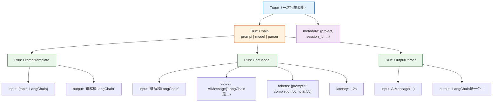
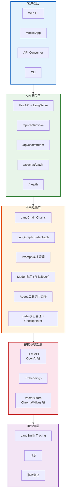

# API 集成与部署技术参考

> **定位**：本文档涵盖 LangChain/LangGraph 应用的 API 封装、服务部署、可观测性与生产化最佳实践。

---

## 目录

1. [LangServe：API 服务化](#1-langserveapi-服务化)
2. [FastAPI 集成](#2-fastapi-集成)
3. [LangSmith：可观测性](#3-langsmith可观测性)
4. [LangGraph 平台部署](#4-langgraph-平台部署)
5. [生产化最佳实践](#5-生产化最佳实践)

---

## 1. LangServe：API 服务化

### 1.1 概述

LangServe 将 LangChain 的 Runnable/Chain 部署为 REST API，自动生成端点和交互式文档。

### 1.2 快速部署

```python
from fastapi import FastAPI
from langserve import add_routes
from langchain_openai import ChatOpenAI
from langchain_core.prompts import ChatPromptTemplate
from langchain_core.output_parsers import StrOutputParser

app = FastAPI(title="LangChain API Server")

# 创建链
chain = (
    ChatPromptTemplate.from_template("用一句话解释{topic}")
    | ChatOpenAI(model="gpt-4o-mini")
    | StrOutputParser()
)

# 添加 API 路由
add_routes(
    app,
    chain,
    path="/explain",
)

# 启动：uvicorn server:app --host 0.0.0.0 --port 8000
```

### 1.3 自动生成的端点

| 端点 | 方法 | 用途 |
|------|------|------|
| `/explain/invoke` | POST | 单次调用 |
| `/explain/batch` | POST | 批量调用 |
| `/explain/stream` | POST | 流式输出 |
| `/explain/ainvoke` | POST | 异步调用 |
| `/playground/` | GET | 交互式 Playground |

### 1.4 客户端调用

```python
from langserve import RemoteRunnable

# 远程调用
remote_chain = RemoteRunnable("http://localhost:8000/explain")
result = remote_chain.invoke({"topic": "量子计算"})

# 流式调用
for chunk in remote_chain.stream({"topic": "量子计算"}):
    print(chunk, end="", flush=True)
```

---

## 2. FastAPI 集成

### 2.1 完整 API 服务示例

```python
from fastapi import FastAPI, HTTPException
from pydantic import BaseModel
from langchain_openai import ChatOpenAI
from langchain_core.prompts import ChatPromptTemplate
from langchain_core.output_parsers import StrOutputParser

app = FastAPI(title="LangChain 应用 API")

# 请求模型
class QueryRequest(BaseModel):
    question: str
    session_id: str = "default"

# 响应模型
class QueryResponse(BaseModel):
    answer: str
    session_id: str

# 创建链
chain = (
    ChatPromptTemplate.from_messages([
        ("system", "你是一个有用的助手"),
        ("human", "{question}"),
    ])
    | ChatOpenAI(model="gpt-4o-mini", temperature=0)
    | StrOutputParser()
)

@app.post("/api/chat", response_model=QueryResponse)
async def chat(request: QueryRequest):
    try:
        answer = await chain.ainvoke({"question": request.question})
        return QueryResponse(answer=answer, session_id=request.session_id)
    except Exception as e:
        raise HTTPException(status_code=500, detail=str(e))

@app.get("/health")
async def health():
    return {"status": "ok"}
```

### 2.2 带流式输出的 API

```python
from fastapi.responses import StreamingResponse
import json

@app.post("/api/chat/stream")
async def chat_stream(request: QueryRequest):
    async def generate():
        async for chunk in chain.astream({"question": request.question}):
            yield f"data: {json.dumps({'chunk': chunk})}\n\n"
        yield f"data: {json.dumps({'done': True})}\n\n"
    
    return StreamingResponse(generate(), media_type="text/event-stream")
```

---

## 3. LangSmith：可观测性

### 3.1 概述

LangSmith 是 LangChain 团队的**AI 应用可观测性平台**，提供追踪、评估、监控和调试能力。

| 功能 | 说明 |
|------|------|
| 追踪（Tracing） | 记录每一步执行的输入/输出/耗时 |
| 评估（Evaluation） | 自动评估 LLM 输出质量 |
| 监控（Monitoring） | 生产环境性能监控 |
| 调试（Debugging） | 可视化执行链路 |
| 数据集管理 | 管理测试数据集 |

### 3.2 配置

```python
import os

# 环境变量配置
os.environ["LANGSMITH_API_KEY"] = "ls-..."
os.environ["LANGSMITH_TRACING"] = "true"
os.environ["LANGSMITH_PROJECT"] = "my-langchain-app"
os.environ["LANGSMITH_ENDPOINT"] = "https://api.smith.langchain.com"

# 配置后，所有 LangChain 调用自动被追踪
chain = prompt | model | parser
result = chain.invoke({"topic": "LangChain"})
# 在 LangSmith 面板可看到完整追踪链路
```

### 3.3 追踪信息结构



> **图解说明**：LangSmith 追踪以树形结构记录每次调用——顶层是整个 Chain 的执行，下面分支记录每个子组件（PromptTemplate、ChatModel、OutputParser）的输入、输出、token 用量和延迟。这种可视化让调试和性能优化变得直观。

### 3.4 评估

```python
from langsmith import Client

client = Client()

# 创建评估数据集
dataset = client.create_dataset("qa_eval", description="问答质量评估")

# 添加测试用例
client.create_example(
    inputs={"question": "什么是LangChain？"},
    outputs={"answer": "LangChain是一个LLM应用开发框架"},
    dataset_id=dataset.id,
)

# 运行评估
from langsmith.evaluation import evaluate

def correctness(run, example):
    # 自定义评估函数
    predicted = run.outputs.get("answer", "")
    expected = example.outputs.get("answer", "")
    score = 1 if expected.lower() in predicted.lower() else 0
    return {"key": "correctness", "score": score}

evaluate(
    lambda x: chain.invoke(x),
    data="qa_eval",
    evaluators=[correctness],
)
```

---

## 4. LangGraph 平台部署

### 4.1 部署方式对比

| 方式 | 适用场景 | 优点 | 缺点 |
|------|---------|------|------|
| **自部署（FastAPI）** | 小规模 | 完全可控 | 需自行运维 |
| **LangGraph Cloud** | 中大规模 | 全托管 | 需付费 |
| **Docker** | 通用 | 可移植 | 需配置 |
| **LangGraph Studio** | 开发调试 | 可视化 | 非生产 |

### 4.2 Docker 部署

```dockerfile
# Dockerfile
FROM python:3.12-slim

WORKDIR /app

COPY requirements.txt .
RUN pip install --no-cache-dir -r requirements.txt

COPY . .

EXPOSE 8000

CMD ["uvicorn", "server:app", "--host", "0.0.0.0", "--port", "8000"]
```

```yaml
# requirements.txt
langchain>=0.3.0
langgraph>=0.2.0
langchain-openai>=0.2.0
fastapi>=0.115.0
uvicorn>=0.30.0
langserve>=0.3.0
```

### 4.3 LangGraph Studio

LangGraph Studio 是可视化调试工具，可在开发阶段可视化图结构、实时调试。

```bash
# 安装 LangGraph CLI
pip install langgraph-cli

# 启动 Studio（本地开发）
langgraph dev

# 会启动本地服务并打开可视化界面
```

---

## 5. 生产化最佳实践

### 5.1 性能优化

| 优化项 | 方法 | 效果 |
|--------|------|------|
| 异步调用 | `ainvoke()` / `abatch()` | 提高并发能力 |
| 流式输出 | `stream()` / `astream()` | 提升用户体验 |
| 批量处理 | `batch()` | 减少请求次数 |
| 连接池 | 复用 HTTP 连接 | 降低延迟 |
| 缓存 | `CacheBackedEmbeddings` | 减少重复嵌入 |
| 超时设置 | `timeout` + `max_retries` | 防止挂起 |

### 5.2 错误处理与容错

```python
from langchain_core.runnables import RunnableWithFallbacks

# 主模型 + 备用模型
primary = ChatOpenAI(model="gpt-4o", timeout=10)
fallback = ChatOpenAI(model="gpt-4o-mini", timeout=15)
model_with_fallback = primary.with_fallbacks([fallback])

# 重试配置
model = ChatOpenAI(
    model="gpt-4o-mini",
    max_retries=3,          # 最多重试 3 次
    timeout=30,             # 超时 30 秒
)
```

### 5.3 成本控制

| 策略 | 方法 | 节省比例 |
|------|------|---------|
| 模型分级 | 简单任务用 mini，复杂用 pro | 50%~80% |
| 缓存 | 缓存 Embedding 和常见回答 | 30%~50% |
| 限制 token | 设置 `max_tokens` | 视情况 |
| 批量调用 | `batch()` 减少 API 开销 | 10%~20% |
| 本地模型 | Ollama 替代非核心环节 | 100%（API 费用） |

### 5.4 安全检查清单

| 检查项 | 说明 | 状态 |
|--------|------|------|
| API Key 不硬编码 | 使用环境变量 | ☐ |
| 输入验证 | Pydantic 模型校验 | ☐ |
| 输出过滤 | 敏感信息脱敏 | ☐ |
| 速率限制 | 防止滥用 | ☐ |
| 日志脱敏 | 不记录用户敏感数据 | ☐ |
| 工具权限 | Agent 工具白名单 | ☐ |
| 沙箱执行 | 代码执行隔离 | ☐ |

---

## 部署架构速查



> **图解说明**：LangChain/LangGraph 应用的典型部署架构分为五层——客户端层（多端入口）→ API 网关层（FastAPI+LangServe 提供统一接口）→ 应用编排层（Chains+StateGraph 处理业务逻辑）→ 数据与模型层（LLM API、Embeddings、向量库）→ 可观测层（LangSmith 全链路追踪+监控）。

---

> **配套学习课程**：请阅读 `学习课程/第10课_从开发到部署_LangChain应用上线实战.md`
