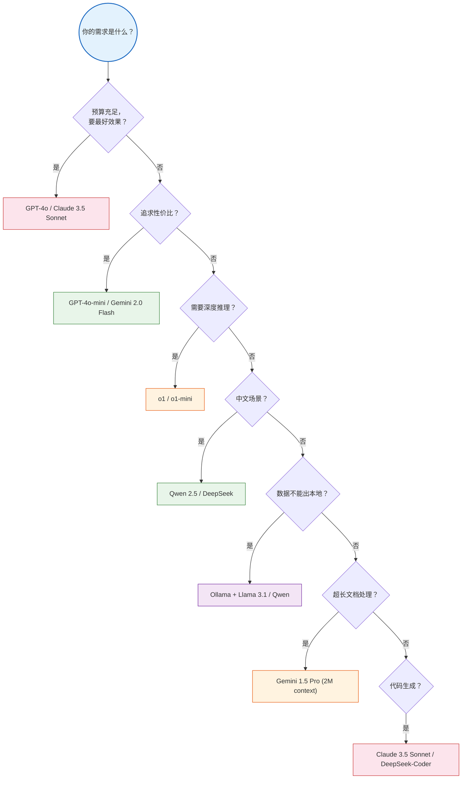
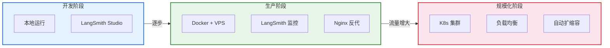

# 生态对比与模型集成数据表

> **定位**：本文档汇总 LangChain 生态中各组件、模型、工具的横向对比数据，以及与竞品框架的对比分析，供技术选型参考。

---

## 目录

1. [LLM 提供商对比](#1-llm-提供商对比)
2. [Embedding 模型对比](#2-embedding-模型对比)
3. [向量数据库对比](#3-向量数据库对比)
4. [LangChain vs 竞品框架](#4-langchain-vs-竞品框架)
5. [工具生态对比](#5-工具生态对比)
6. [部署方案对比](#6-部署方案对比)

---

## 1. LLM 提供商对比

### 1.1 闭源模型

| 模型 | 提供商 | LangChain 集成包 | 上下文窗口 | 特点 | 价格（输入/输出 每百万token） |
|------|--------|-----------------|-----------|------|---------------------------|
| GPT-4o | OpenAI | `langchain-openai` | 128K | 多模态、综合最强 | $2.50 / $10.00 |
| GPT-4o-mini | OpenAI | `langchain-openai` | 128K | 性价比高 | $0.15 / $0.60 |
| o1 | OpenAI | `langchain-openai` | 200K | 深度推理 | $15.00 / $60.00 |
| Claude 3.5 Sonnet | Anthropic | `langchain-anthropic` | 200K | 代码能力强 | $3.00 / $15.00 |
| Claude 3 Haiku | Anthropic | `langchain-anthropic` | 200K | 快速、便宜 | $0.25 / $1.25 |
| Gemini 2.0 Flash | Google | `langchain-google-genai` | 1M | 超长上下文 | $0.10 / $0.40 |
| Gemini 1.5 Pro | Google | `langchain-google-genai` | 2M | 最长上下文 | $1.25 / $5.00 |

### 1.2 开源/本地模型

| 模型 | 参数量 | LangChain 集成 | 运行方式 | 适用场景 |
|------|--------|---------------|---------|---------|
| Llama 3.1 | 8B/70B/405B | `langchain-ollama` | Ollama 本地 | 通用、本地部署 |
| Qwen 2.5 | 7B~72B | `langchain-ollama` | Ollama 本地 | 中文优秀 |
| Mistral | 7B/8x7B | `langchain-ollama` | Ollama 本地 | 推理能力强 |
| Phi-3 | 3.8B/14B | `langchain-ollama` | Ollama 本地 | 小模型高性能 |
| DeepSeek-V2 | 16B/236B | API / 本地 | API 或 vLLM | 性价比极高 |

### 1.3 模型选择决策



> **图解说明**：根据需求逐级筛选模型——追求效果选 GPT-4o/Claude，性价比选 mini 系列，推理选 o1，中文选 Qwen/DeepSeek，本地部署用 Ollama，超长文档用 Gemini Pro。

### 1.4 代码切换示例

```python
# 统一接口，一行切换
from langchain_openai import ChatOpenAI
# from langchain_anthropic import ChatAnthropic
# from langchain_google_genai import ChatGoogleGenerativeAI
# from langchain_ollama import ChatOllama

# 只需改这一行
model = ChatOpenAI(model="gpt-4o-mini", temperature=0)

# 以下代码完全不变
response = model.invoke("你好")
```

---

## 2. Embedding 模型对比

### 2.1 商用 API

| 模型 | 提供商 | 维度 | 价格（每百万token） | 中文效果 | 多语言 |
|------|--------|------|-------------------|---------|--------|
| text-embedding-3-small | OpenAI | 1536 | $0.02 | 良好 | 支持 |
| text-embedding-3-large | OpenAI | 3072 | $0.13 | 优秀 | 支持 |
| text-embedding-ada-002 | OpenAI | 1536 | $0.10 | 一般 | 支持 |
| voyage-3 | Voyage AI | 1024 | $0.06 | 优秀 | 支持 |
| Cohere embed-v3 | Cohere | 1024 | $0.10 | 良好 | 支持 |

### 2.2 开源本地

| 模型 | 参数量 | 维度 | 中文效果 | 运行方式 |
|------|--------|------|---------|---------|
| bge-large-zh-v1.5 | 326M | 1024 | 优秀 | 本地/HuggingFace |
| bge-m3 | 568M | 1024 | 优秀 | 本地/HuggingFace |
| m3e-base | 110M | 768 | 良好 | 本地/HuggingFace |
| nomic-embed-text | 137M | 768 | 一般 | Ollama 本地 |
| GTE-large | 335M | 1024 | 良好 | 本地/HuggingFace |

### 2.3 选择建议

| 场景 | 推荐模型 | 理由 |
|------|---------|------|
| 快速原型 | text-embedding-3-small | 便宜、够用 |
| 生产环境（英文） | text-embedding-3-large | 效果好 |
| 中文生产环境 | bge-large-zh-v1.5 | 中文 SOTA、开源免费 |
| 本地隐私场景 | bge-m3 + Ollama | 全本地、多语言 |
| 预算极低 | nomic-embed-text | 完全免费 |

---

## 3. 向量数据库对比

### 3.1 综合对比

| 向量库 | 类型 | 部署 | 性能 | 最大规模 | 混合检索 | 持久化 | 生态成熟度 |
|--------|------|------|------|---------|---------|--------|-----------|
| Chroma | 嵌入式 | 本地 | 中 | 百万级 | 否 | 是 | ★★★★☆ |
| FAISS | 库 | 本地 | 高 | 亿级 | 否 | 手动 | ★★★★☆ |
| Pinecone | SaaS | 云 | 高 | 十亿级 | 是 | 自动 | ★★★★★ |
| Milvus | 独立服务 | 自部署/云 | 高 | 百亿级 | 是 | 是 | ★★★★☆ |
| Weaviate | 独立服务 | 自部署/云 | 高 | 亿级 | 是 | 是 | ★★★★☆ |
| Qdrant | 独立服务 | 自部署/云 | 高 | 亿级 | 是 | 是 | ★★★☆☆ |
| pgvector | PG 扩展 | 自部署 | 中 | 百万级 | 是 | 是 | ★★★☆☆ |

### 3.2 选型矩阵

| 需求 | 首选 | 备选 |
|------|------|------|
| 零配置开发 | Chroma | FAISS |
| 快速原型 | Chroma | Pinecone |
| 大规模生产 | Milvus | Pinecone |
| 免运维 SaaS | Pinecone | Qdrant Cloud |
| 已有 PostgreSQL | pgvector | - |
| 混合检索需求 | Weaviate | Milvus |
| 极致性能 | FAISS | Milvus |
| 中文文档 | 均可（取决于 Embedding 模型） | - |

---

## 4. LangChain vs 竞品框架

### 4.1 框架定位对比

| 框架 | 定位 | 语言 | 核心优势 | 社区规模 | 学习曲线 |
|------|------|------|---------|---------|---------|
| **LangChain** | 通用 LLM 应用框架 | Python/TS | 生态最大、组件全 | ★★★★★ | 中等 |
| **LangGraph** | 图式工作流编排 | Python | 复杂 Agent、状态管理 | ★★★★☆ | 中高 |
| **LlamaIndex** | RAG 专用框架 | Python/TS | RAG 能力最强 | ★★★★☆ | 较低 |
| **Semantic Kernel** | 微软 AI 编排 | C#/Py/Java | 企业级集成 | ★★★☆☆ | 较高 |
| **AutoGen** | 多 Agent 对话 | Python | Agent 协作 | ★★★☆☆ | 中等 |
| **CrewAI** | 多 Agent 角色扮演 | Python | 简单易用 | ★★★☆☆ | 较低 |
| **Dify** | LLMOps 平台 | Python/TS | 可视化、全流程 | ★★★★☆ | 低 |
| **Haystack** | 搜索/RAG 框架 | Python | 搜索能力强 | ★★★☆☆ | 中等 |

### 4.2 功能对比矩阵

| 功能 | LangChain | LangGraph | LlamaIndex | AutoGen | CrewAI |
|------|-----------|-----------|------------|---------|--------|
| LLM 调用 | ✅ | ✅ | ✅ | ✅ | ✅ |
| Prompt 管理 | ✅ | ✅ | ✅ | ⚠️ | ⚠️ |
| 链式编排 | ✅ LCEL | ✅ Graph | ✅ Pipeline | ⚠️ | ⚠️ |
| RAG | ✅ | ✅ | ✅★★★ | ⚠️ | ⚠️ |
| Agent | ✅ | ✅★★★ | ⚠️ | ✅★★★ | ✅ |
| 多 Agent | ⚠️ | ✅★★★ | ❌ | ✅★★★ | ✅★★★ |
| 状态管理 | ⚠️ | ✅★★★ | ❌ | ⚠️ | ⚠️ |
| 人机协作 | ❌ | ✅★★★ | ❌ | ⚠️ | ⚠️ |
| 持久化 | ⚠️ | ✅★★★ | ⚠️ | ⚠️ | ⚠️ |
| 可观测性 | ✅ LangSmith | ✅ | ⚠️ | ⚠️ | ⚠️ |
| 向量库集成 | ✅★★★ | ✅ | ✅★★★ | ⚠️ | ⚠️ |

> ✅★★★ = 行业领先；✅ = 支持；⚠️ = 部分支持/需自定义；❌ = 不支持

### 4.3 选型建议

| 你的需求 | 推荐框架 | 理由 |
|---------|---------|------|
| 通用 LLM 应用 | LangChain | 生态最大、组件最全 |
| 复杂 Agent 工作流 | LangGraph | 图编排、状态管理最强 |
| RAG 专用项目 | LlamaIndex | RAG 管道最完善 |
| 多 Agent 协作 | AutoGen / CrewAI | 多 Agent 原生支持 |
| 企业级 .NET 项目 | Semantic Kernel | 微软生态 |
| 快速搭建无代码 | Dify | 可视化搭建 |
| 搜索引擎增强 | Haystack | 搜索能力强 |

---

## 5. 工具生态对比

### 5.1 LangChain 内置工具

| 工具类别 | 工具名 | 包 | 功能 |
|----------|--------|-----|------|
| 搜索 | DuckDuckGoSearchRun | community | 免费网络搜索 |
| 搜索 | GoogleSearchRun | community | Google 搜索（需 API Key） |
| 搜索 | TavilySearchResults | community | AI 专用搜索引擎 |
| 百科 | WikipediaQueryRun | community | 维基百科查询 |
| 计算 | Calculator | community | 数学计算 |
| 代码 | PythonREPLTool | experimental | Python 代码执行 |
| 文件 | ReadFileTool | community | 读取文件 |
| 文件 | WriteFileTool | community | 写入文件 |
| Shell | ShellTool | community | 执行 Shell 命令 |
| SQL | QuerySQLDataBaseTool | community | SQL 查询 |
| API | RequestsGetTool | community | HTTP 请求 |

### 5.2 第三方工具集成

| 平台 | 集成包 | 可用工具 |
|------|--------|---------|
| Zapier | `langchain-community` | 5000+ 应用集成 |
| Wolfram | `langchain-community` | 数学/科学计算 |
| Arxiv | `langchain-community` | 论文搜索 |
| PubMed | `langchain-community` | 医学文献 |
| GitHub | `langchain-community` | 仓库操作 |
| Slack | `langchain-community` | 消息发送 |
| Gmail | `langchain-community` | 邮件操作 |
| Notion | `langchain-community` | 文档操作 |

---

## 6. 部署方案对比

### 6.1 部署方式对比

| 方式 | 复杂度 | 成本 | 可控性 | 适用阶段 |
|------|--------|------|--------|---------|
| 本地开发 | ★☆☆ | 免费 | 完全 | 原型开发 |
| Docker | ★★☆ | 低 | 完全 | 测试/小规模 |
| VPS 部署 | ★★☆ | 低~中 | 完全 | 小规模生产 |
| LangGraph Cloud | ★★☆ | 中 | 部分 | 中规模生产 |
| 云原生 (K8s) | ★★★ | 中~高 | 完全 | 大规模生产 |
| Serverless | ★★★ | 按量 | 部分 | 低频调用 |

### 6.2 推荐部署路径



> **图解说明**：推荐部署路径分三阶段递进——开发期用本地运行+LangSmith Studio 调试；生产初期用 Docker+VPS+Nginx 反代+LangSmith 监控；流量增大后迁移到 K8s 集群，配合负载均衡和自动扩缩容。

### 6.3 成本估算参考

| 场景 | 月调用量 | 推荐模型 | 月 API 成本 | 月基础设施成本 |
|------|---------|---------|------------|--------------|
| 个人学习 | ~1K | GPT-4o-mini | ~$1 | $0（本地） |
| 小型应用 | ~10K | GPT-4o-mini | ~$10 | ~$5（VPS） |
| 中型应用 | ~100K | GPT-4o-mini + GPT-4o | ~$100 | ~$50 |
| 大型应用 | ~1M | 混合 + 本地模型 | ~$500+ | ~$200+ |

---

## 综合技术选型速查

| 选型维度 | 零基础/学习 | 小型项目 | 中型项目 | 大型/企业 |
|----------|-----------|---------|---------|----------|
| LLM | GPT-4o-mini | GPT-4o-mini | GPT-4o + mini | 混合多模型 |
| Embedding | text-embedding-3-small | 同左 | 同左 | bge-large-zh |
| 向量库 | Chroma | Chroma | Milvus/Pinecone | Milvus 集群 |
| 编排 | LangChain LCEL | LCEL | LCEL + LangGraph | LangGraph |
| 部署 | 本地 | Docker/VPS | Docker + 云 | K8s |
| 监控 | LangSmith 免费版 | LangSmith | LangSmith Pro | LangSmith + 自建 |
| 检查点 | MemorySaver | SQLite | PostgreSQL | PostgreSQL 集群 |

---

> **配套学习课程**：请阅读 `学习课程/第10课_从开发到部署_LangChain应用上线实战.md`
