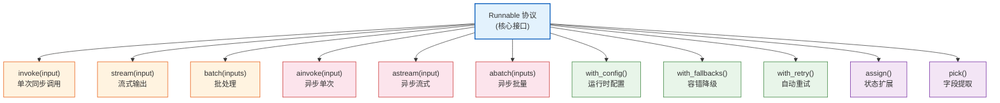
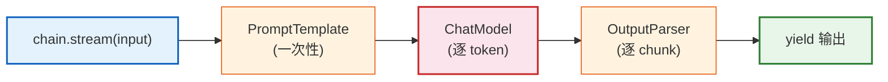
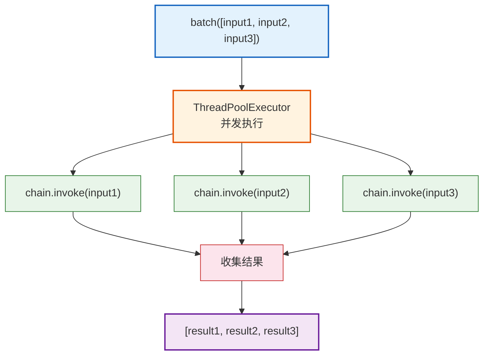
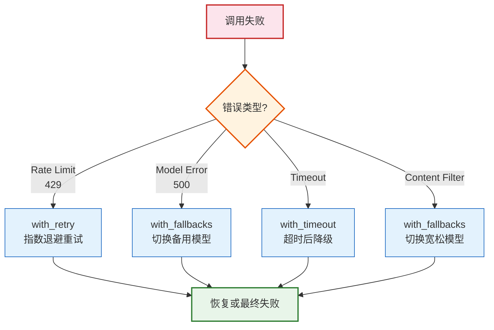

# LCEL 表达式语言深入技术参考

> **定位**：本文档系统讲解 LangChain Expression Language（LCEL）的设计理念、核心接口、流式/异步/批处理能力、容错机制与高级用法，是 LCEL 的完整技术参考。

---

## 目录

1. [LCEL 概述](#1-lcel-概述)
2. [Runnable 协议](#2-runnable-协议)
3. [管道运算符 | 的原理](#3-管道运算符--的原理)
4. [流式输出](#4-流式输出)
5. [异步处理](#5-异步处理)
6. [批处理](#6-批处理)
7. [Fallbacks 与重试](#7-fallbacks-与重试)
8. [RunnableConfig 与回调](#8-runnableconfig-与回调)
9. [LCEL vs 传统 Chain](#9-lcel-vs-传统-chain)
10. [常用代码模板](#10-常用代码模板)

---

## 1. LCEL 概述

### 1.1 什么是 LCEL

LCEL（LangChain Expression Language）是 LangChain v0.3 的**核心语法体系**，用管道运算符 `|` 将组件串联成链。


> **图解说明**：LCEL 用 `prompt | model | parser` 的语法将三个组件串联为一条处理链，数据从左向右流动。

### 1.2 设计理念

| 设计原则 | 说明 | 对比传统 Chain |
|---------|------|---------------|
| **声明式** | 用 `|` 声明数据流，不写过程代码 | 传统 Chain 需要显式构造 |
| **统一接口** | 所有组件实现 Runnable 协议 | 传统组件接口不统一 |
| **流式优先** | 原生支持 stream，逐 token 输出 | 传统 Chain 需额外封装 |
| **异步原生** | invoke/ainvoke 双栈支持 | 传统 Chain 异步支持不完整 |
| **可组合** | 任意 Runnable 都可参与管道 | 传统 Chain 组合受限 |
| **可观测** | 内置 LangSmith 追踪 | 传统 Chain 需手动埋点 |

### 1.3 最小示例

```python
from langchain_openai import ChatOpenAI
from langchain_core.prompts import ChatPromptTemplate
from langchain_core.output_parsers import StrOutputParser

# LCEL 写法：管道串联
chain = (
    ChatPromptTemplate.from_messages([
        ("system", "你是{role}"),
        ("human", "{question}"),
    ])
    | ChatOpenAI(model="gpt-4o-mini", temperature=0)
    | StrOutputParser()
)

result = chain.invoke({"role": "Python专家", "question": "解释装饰器"})
print(result)
```

---

## 2. Runnable 协议

### 2.1 协议定义

Runnable 是 LCEL 的**根基接口**，所有可参与管道的组件都实现它。



> **图解说明**：Runnable 协议定义了 11 个核心方法，分四组：同步调用（橙）、异步调用（红）、运行时配置与容错（绿）、状态操作（紫）。任何实现 Runnable 的组件都自动获得这些能力。

### 2.2 核心 Runnable 类型

| 类型 | 说明 | 示例 |
|------|------|------|
| `RunnablePassthrough` | 透传输入，常用于保留原始值 | `{"context": retriever, "question": RunnablePassthrough()}` |
| `RunnableLambda` | 将普通函数包装为 Runnable | `RunnableLambda(lambda x: x.upper())` |
| `RunnableParallel` | 并行执行多个 Runnable | `RunnableParallel(a=fn1, b=fn2)` |
| `RunnableBranch` | 条件分支，根据路由函数选择 | `RunnableBranch({(lambda x: x>0): fn1}, default)` |
| `RunnableMap` | RunnableParallel 的别名 | 同上 |

### 2.3 RunnablePassthrough 详解

```python
from langchain_core.runnables import RunnablePassthrough

# 1. 基本透传——输入原样传出
chain = RunnablePassthrough()
assert chain.invoke("hello") == "hello"

# 2. 在管道中保留原始值
chain = RunnablePassthrough.assign(
    upper=lambda x: x["text"].upper()
)
# 输入: {"text": "hi"} -> 输出: {"text": "hi", "upper": "HI"}

# 3. 与 retriever 搭配
chain = ({
    "context": retriever,           # 用 retriever 获取上下文
    "question": RunnablePassthrough()  # 保留原始问题
} | prompt | model | parser)
```

### 2.4 RunnableLambda 详解

```python
from langchain_core.runnables import RunnableLambda

# 1. 包装普通函数
def word_count(text: str) -> int:
    return len(text.split())

chain = RunnableLambda(word_count)
print(chain.invoke("hello world"))  # 2

# 2. 在管道中使用
chain = (
    ChatPromptTemplate.from_template("写一首关于{topic}的诗")
    | ChatOpenAI()
    | StrOutputParser()
    | RunnableLambda(lambda poem: {"poem": poem, "word_count": len(poem.split())})
)

# 3. 异步函数
async def async_process(x):
    await asyncio.sleep(0.1)
    return x * 2

chain = RunnableLambda(async_process)
result = await chain.ainvoke(5)  # 10
```

### 2.5 RunnableParallel 详解

```python
from langchain_core.runnables import RunnableParallel, RunnableLambda

# 1. 字典语法（最常用）
chain = RunnableParallel(
    joke=ChatPromptTemplate.from_template("讲一个关于{topic}的笑话") | ChatOpenAI() | StrOutputParser(),
    fact=ChatPromptTemplate.from_template("关于{topic}的事实") | ChatOpenAI() | StrOutputParser(),
)
result = chain.invoke({"topic": "猫"})
# {"joke": "...", "fact": "..."}

# 2. 字典字面量语法（等价）
chain = {
    "joke": prompt1 | model | parser,
    "fact": prompt2 | model | parser,
}

# 3. 合并 retriever 和 passthrough
chain = ({
    "context": retriever,
    "question": RunnablePassthrough(),
    "history": RunnablePassthrough.assign(history=lambda x: memory_buffer),
} | prompt | model | parser)
```

---

## 3. 管道运算符 | 的原理

### 3.1 运算符重载

LCEL 通过 Python 的 `__or__` 魔术方法实现 `|` 运算符：

```python
# 底层原理
class Runnable:
    def __or__(self, other):
        """self | other -> RunnableSequence"""
        return RunnableSequence(first=self, last=other)

    def __ror__(self, other):
        """other | self -> RunnableSequence(other, self)"""
        return RunnableSequence(first=RunnableLambda(other), last=self)
```

### 3.2 RunnableSequence 内部结构

```mermaid
graph LR
    A["输入<br/>dict/input"] --> B["RunnableSequence"]
    B --> C["第一步: PromptTemplate"]
    C --> D["中间结果<br/>ChatPromptValue"]
    D --> E["第二步: ChatModel"]
    E --> F["中间结果<br/>AIMessage"]
    F --> G["第三步: OutputParser"]
    G --> H["最终输出<br/>str"]

    style A fill:#E3F2FD,stroke:#1565C0,stroke-width:2px
    style B fill:#FFF3E0,stroke:#E65100,stroke-width:2px
    style C fill:#E3F2FD,stroke:#1565C0
    style D fill:#FCE4EC,stroke:#C62828
    style E fill:#E3F2FD,stroke:#1565C0
    style F fill:#FCE4EC,stroke:#C62828
    style G fill:#E3F2FD,stroke:#1565C0
    style H fill:#E8F5E9,stroke:#2E7D32,stroke-width:2px
```



> **图解说明**：`prompt | model | parser` 生成一个 RunnableSequence，内部保存了三个 Runnable 的有序列表。调用 `invoke` 时，输入依次流过每一步，每一步的输出作为下一步的输入。

### 3.3 嵌套管道

```python
# 管道可以嵌套
# 等价: (prompt | model | parser) 与 ((prompt | model) | parser) 相同
chain = prompt | (model | parser)
# 即: prompt 的输出 -> (model | parser) 的输入

# 更复杂的嵌套
retrieval_chain = (
    RunnableParallel(
        context=retriever | RunnableLambda(format_docs),
        question=RunnablePassthrough(),
    )
    | prompt
    | model
    | StrOutputParser()
)
```

---

## 4. 流式输出

### 4.1 stream 方法

```python
# 基本流式输出
for chunk in chain.stream({"topic": "量子计算"}):
    print(chunk, end="", flush=True)
# 逐 token 输出: "量" "子" "计" "算" "是" "一" "种" ...

# 流式输出的内部机制
```



> **图解说明**：流式输出中，PromptTemplate 和 OutputParser 是一次性处理（它们不生成 token），只有 ChatModel 是逐 token 产出的。LCEL 的 stream 方法会自动处理这个差异，对调用方透明。

### 4.2 流式输出模式

| 方法 | 说明 | 适用场景 |
|------|------|---------|
| `stream(input)` | 同步流式，逐 chunk yield | 命令行、简单后端 |
| `astream(input)` | 异步流式，逐 chunk yield | FastAPI、Web 前端 |
| `astream_events(input)` | 细粒度事件流（含中间步骤） | 调试、复杂前端展示 |

### 4.3 astream_events 详解

```python
# 获取细粒度事件——可以看到每个 Runnable 的输入输出
async for event in chain.astream_events(
    {"topic": "量子计算"},
    version="v2",
):
    kind = event["event"]
    name = event["name"]
    data = event["data"]

    if kind == "on_chat_model_stream":
        # LLM 正在产出 token
        chunk = data["chunk"]
        print(chunk.content, end="", flush=True)

    elif kind == "on_chain_start":
        # 某个 Runnable 开始执行
        print(f"\n[{name}] 开始执行")

    elif kind == "on_chain_end":
        # 某个 Runnable 执行完成
        print(f"\n[{name}] 完成: {str(data['output'])[:50]}...")
```

---

## 5. 异步处理

### 5.1 异步 API 对照表

| 同步方法 | 异步方法 | 说明 |
|---------|---------|------|
| `invoke(input)` | `ainvoke(input)` | 单次调用 |
| `stream(input)` | `astream(input)` | 流式输出 |
| `batch(inputs)` | `abatch(inputs)` | 批处理 |
| `transform(iterator)` | `atransform(iterator)` | 转换器 |

### 5.2 异步示例

```python
import asyncio

async def main():
    chain = prompt | model | parser

    # 异步单次调用
    result = await chain.ainvoke({"topic": "量子计算"})

    # 异步流式
    async for chunk in chain.astream({"topic": "量子计算"}):
        print(chunk, end="", flush=True)

    # 异步批量
    inputs = [{"topic": "量子计算"}, {"topic": "深度学习"}, {"topic": "区块链"}]
    results = await chain.abatch(inputs)

asyncio.run(main())
```

---

## 6. 批处理

### 6.1 batch 方法

```python
# 同步批量
inputs = [
    {"topic": "量子计算"},
    {"topic": "深度学习"},
    {"topic": "区块链"},
]
results = chain.batch(inputs)
# 返回 ["结果1", "结果2", "结果3"]

# 异步批量
results = await chain.abatch(inputs)

# 控制并发数
results = chain.batch(inputs, config={"max_concurrency": 2})
```

### 6.2 批处理原理



> **图解说明**：batch 方法使用线程池（同步）或 asyncio（异步）并发执行多个 invoke 调用。`max_concurrency` 控制最大并发数，避免触发 API 限流。

---

## 7. Fallbacks 与重试

### 7.1 with_fallbacks

```python
# 模型降级：gpt-4o 失败时用 gpt-4o-mini
model = ChatOpenAI(model="gpt-4o", temperature=0).with_fallbacks([
    ChatOpenAI(model="gpt-4o-mini", temperature=0),
    ChatOpenAI(model="gpt-3.5-turbo", temperature=0),
])

chain = prompt | model | parser
# 如果 gpt-4o 调用失败，自动切换到 gpt-4o-mini，再失败用 gpt-3.5-turbo
```

### 7.2 with_retry

```python
# 自动重试
model = ChatOpenAI(model="gpt-4o-mini").with_retry(
    stop_after_attempt=3,       # 最多重试3次
    wait_exponential_jitter=True,  # 指数退避+抖动
)

# 链级重试
chain = (prompt | model | parser).with_retry(stop_after_attempt=2)
```

### 7.3 容错策略对比



> **图解说明**：容错策略根据错误类型选择不同处理方式——速率限制用重试（指数退避）、模型错误用降级切换、超时用 with_timeout 设置硬限制、内容过滤用宽松模型替代。

---

## 8. RunnableConfig 与回调

### 8.1 RunnableConfig

```python
from langchain_core.runnables import RunnableConfig

# 运行时配置
config = RunnableConfig(
    tags=["production", "v2"],
    metadata={"user_id": "u123", "session_id": "s456"},
    run_name="qa_chain",
)

result = chain.invoke({"topic": "量子计算"}, config=config)

# 在 LangSmith 中，这些 tag/metadata 会附加到追踪记录
```

### 8.2 回调机制

```python
from langchain_core.callbacks import BaseCallbackHandler

class MyCallback(BaseCallbackHandler):
    def on_llm_start(self, serialized, prompts, **kwargs):
        print(f"LLM 开始: {serialized.get('name', 'unknown')}")

    def on_llm_end(self, response, **kwargs):
        print(f"LLM 完成, token 用量: {response.llm_output.get('token_usage')}")

    def on_chain_error(self, error, **kwargs):
        print(f"链出错: {error}")

# 使用回调
chain.invoke(
    {"topic": "量子计算"},
    config={"callbacks": [MyCallback()]}
)
```

---

## 9. LCEL vs 传统 Chain

### 9.1 写法对比

| 维度 | LCEL | 传统 Chain (v0.1) |
|------|------|------------------|
| 语法 | `prompt \| model \| parser` | `LLMChain(prompt=prompt, llm=model)` |
| 流式 | 原生 `stream()` | 需额外封装 |
| 异步 | 原生 `ainvoke()` | 部分支持 |
| 批处理 | 原生 `batch()` | 需手动循环 |
| 容错 | `with_fallbacks()` / `with_retry()` | 无内置 |
| 可组合性 | 任意嵌套 | 受限于 Chain 类型 |
| 追踪 | 自动 LangSmith | 需手动埋点 |

### 9.2 迁移指南

```python
# ---- 旧写法 (v0.1) ----
from langchain.chains import LLMChain

chain = LLMChain(
    llm=ChatOpenAI(),
    prompt=ChatPromptTemplate.from_template("解释{topic}"),
)
result = chain.run(topic="量子计算")

# ---- 新写法 (v0.3 LCEL) ----
chain = (
    ChatPromptTemplate.from_template("解释{topic}")
    | ChatOpenAI()
    | StrOutputParser()
)
result = chain.invoke({"topic": "量子计算"})
```

---

## 10. 常用代码模板

### 10.1 RAG 模板

```python
from langchain_core.runnables import RunnablePassthrough

def format_docs(docs):
    return "\n\n".join(doc.page_content for doc in docs)

rag_chain = (
    {
        "context": retriever | format_docs,
        "question": RunnablePassthrough(),
    }
    | ChatPromptTemplate.from_messages([
        ("system", "根据以下上下文回答问题:\n{context}"),
        ("human", "{question}"),
    ])
    | ChatOpenAI(model="gpt-4o-mini", temperature=0)
    | StrOutputParser()
)
```

### 10.2 带记忆的对话模板

```python
from langchain_core.runnables import RunnablePassthrough, RunnableLambda

def load_memory(input):
    return memory.load_memory_variables({})["history"]

chat_chain = (
    {
        "history": RunnableLambda(load_memory),
        "input": RunnablePassthrough(),
    }
    | ChatPromptTemplate.from_messages([
        ("system", "你是助手。历史:\n{history}"),
        ("human", "{input}"),
    ])
    | ChatOpenAI()
    | StrOutputParser()
)

# 使用后保存记忆
response = chat_chain.invoke("你好")
memory.save_context({"input": "你好"}, {"output": response})
```

### 10.3 条件路由模板

```python
from langchain_core.runnables import RunnableBranch

# 根据输入类型选择不同的处理链
branch = RunnableBranch(
    (lambda x: "代码" in x, code_chain),
    (lambda x: "翻译" in x, translate_chain),
    (lambda x: "总结" in x, summary_chain),
    default_chain,  # 默认链
)

result = branch.invoke("帮我写一段Python代码")
```

### 10.4 多模型并行模板

```python
from langchain_core.runnables import RunnableParallel

# 同时用两个模型生成，取最好的
multi_model = RunnableParallel(
    gpt4=ChatPromptTemplate.from_template("{input}") | ChatOpenAI(model="gpt-4o") | StrOutputParser(),
    claude=ChatPromptTemplate.from_template("{input}") | ChatOpenAI(model="gpt-4o-mini") | StrOutputParser(),
)

results = multi_model.invoke({"input": "解释量子计算"})
# {"gpt4": "...", "claude": "..."}
```

---

## 附录：Runnable 方法完整速查

| 方法 | 同步 | 异步 | 说明 |
|------|------|------|------|
| 单次调用 | `invoke(input)` | `ainvoke(input)` | 标准调用 |
| 流式输出 | `stream(input)` | `astream(input)` | 逐 chunk 输出 |
| 批处理 | `batch(inputs)` | `abatch(inputs)` | 并发批量 |
| 事件流 | — | `astream_events(input)` | 细粒度事件 |
| 转换 | `transform(iter)` | `atransform(iter)` | 流转换器 |
| 配置 | `with_config(config)` | — | 运行时配置 |
| 降级 | `with_fallbacks([...])` | — | 容错降级 |
| 重试 | `with_retry(...)` | — | 自动重试 |
| 赋值 | `assign(**kwargs)` | — | 扩展输出 |
| 提取 | `pick(key)` | — | 提取字段 |
| 绑定 | `bind(**kwargs)` | — | 绑定参数 |
| 类型 | `with_types(...)` | — | 类型标注 |

---

## 配套课程

- 📖 `学习课程/第11课_LCEL深入_管道运算符与流式输出.md` — LCEL 教学版
