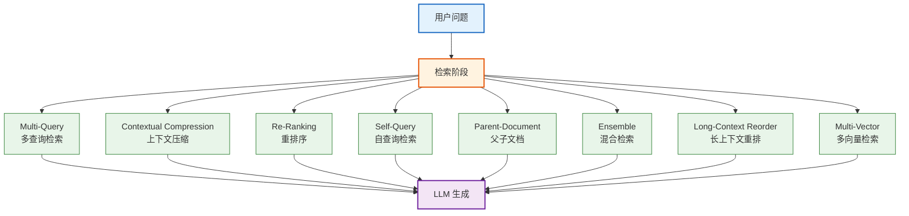
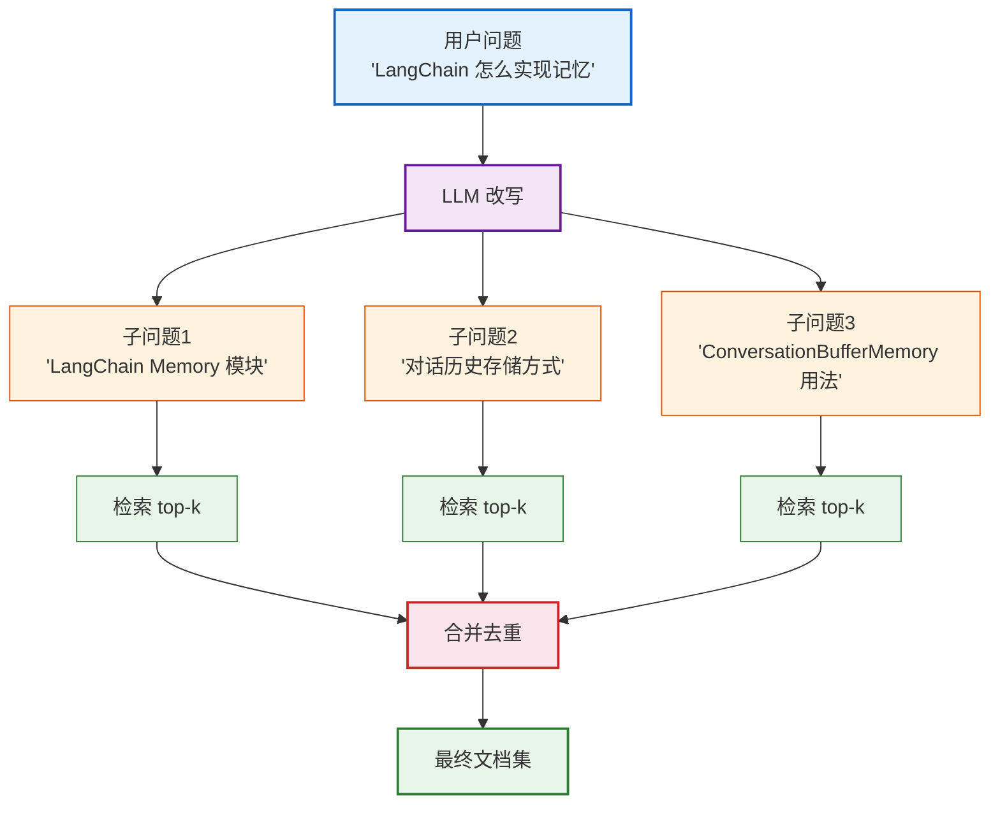
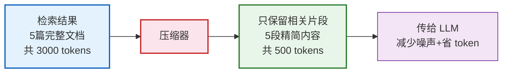
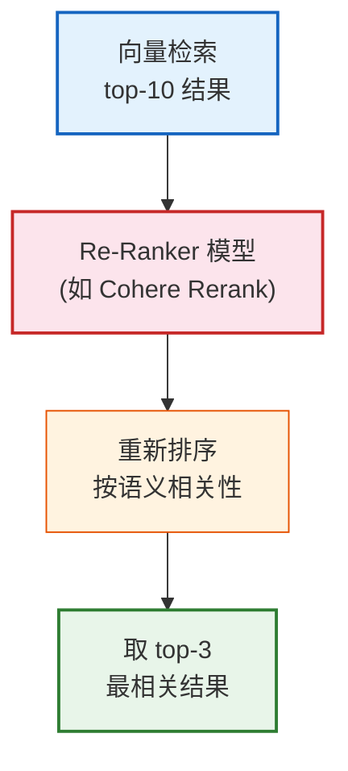
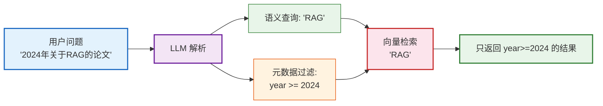
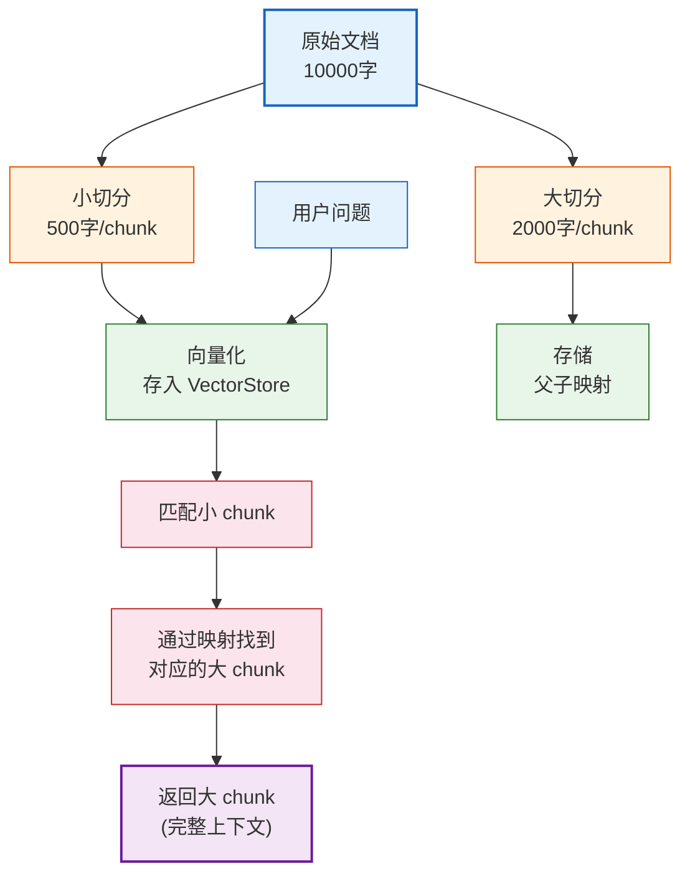
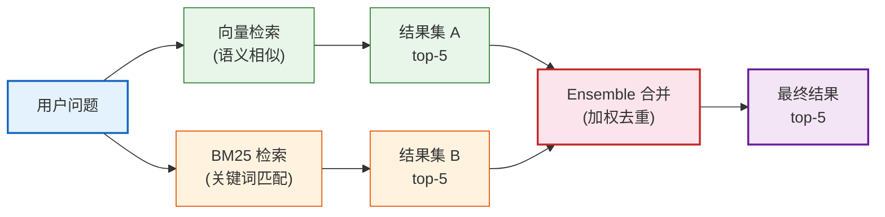
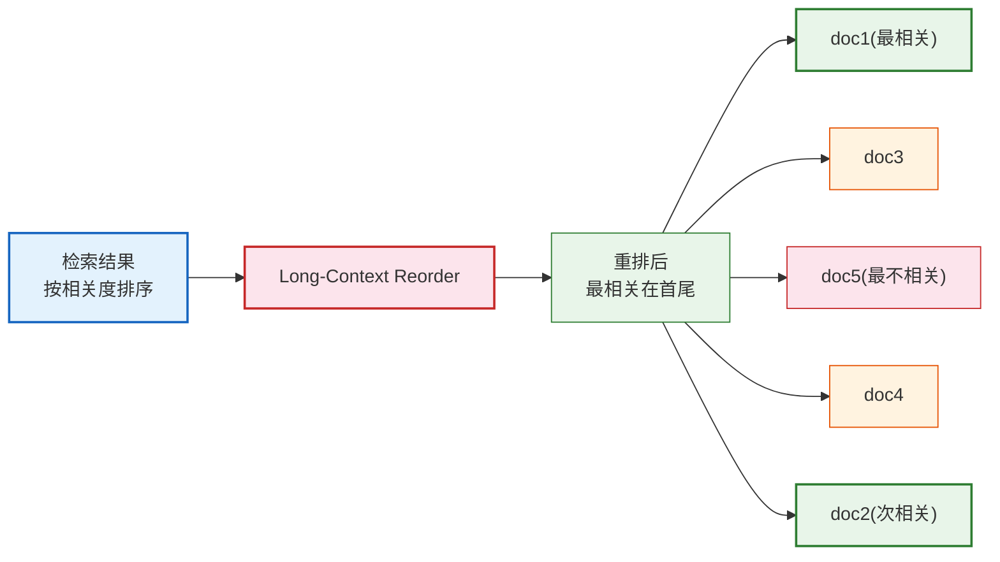
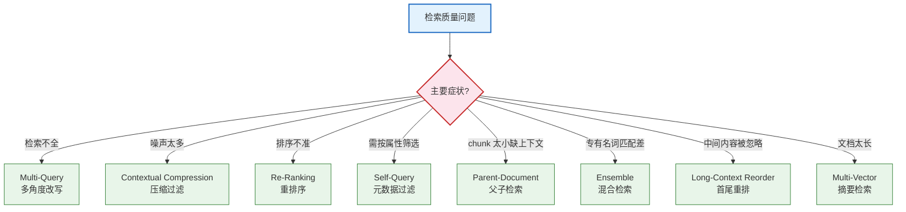

# 高级 RAG 与检索策略技术手册

> **定位**：本文档系统讲解 LangChain 高级 RAG 技术，覆盖多查询检索、上下文压缩、自查询、重排序、混合检索、Parent-Document 检索等策略，是基础 RAG 文档的进阶补充。

---

## 目录

1. [高级 RAG 概述](#1-高级-rag-概述)
2. [多查询检索 Multi-Query](#2-多查询检索-multi-query)
3. [上下文压缩 Contextual Compression](#3-上下文压缩-contextual-compression)
4. [重排序 Re-Ranking](#4-重排序-re-ranking)
5. [自查询检索 Self-Query](#5-自查询检索-self-query)
6. [Parent-Document 检索](#6-parent-document-检索)
7. [混合检索 Ensemble Retriever](#7-混合检索-ensemble-retriever)
8. [长上下文重排 Long-Context Reorder](#8-长上下文重排-long-context-reorder)
9. [多向量检索 Multi-Vector](#9-多向量检索-multi-vector)
10. [RAG 策略选型决策](#10-rag-策略选型决策)

---

## 1. 高级 RAG 概述

### 1.1 基础 RAG 的局限

| 局限 | 表现 | 影响 |
|------|------|------|
| **单查询** | 用户一个问题只检索一次 | 复杂问题检索不全 |
| **无过滤** | 返回所有相关文档片段 | 噪声多，浪费 token |
| **无排序** | 按向量相似度排序，非语义相关性 | 最相关的可能不在前面 |
| **固定粒度** | 切分后的 chunk 大小固定 | 小 chunk 缺上下文，大 chunk 噪声多 |
| **无元数据** | 不能按属性过滤 | 无法按日期/作者/类型筛选 |

### 1.2 高级 RAG 策略全景



> **图解说明**：高级 RAG 在检索阶段引入 8 种策略，每种解决基础 RAG 的一个特定局限。策略可叠加使用——例如先 Multi-Query 扩大检索面，再 Re-Ranking 精排，最后 Long-Context Reorder 优化上下文位置。

---

## 2. 多查询检索 Multi-Query

### 2.1 原理

用 LLM 将用户的一个问题**改写为多个角度的子问题**，分别检索后合并去重。



> **图解说明**：Multi-Query 用 LLM 从不同角度改写问题，扩大检索覆盖面。例如"LangChain 怎么实现记忆"被改写为 3 个子问题，每个独立检索后合并去重，获得更全面的文档集。

### 2.2 代码

```python
from langchain.retrievers.multi_query import MultiQueryRetriever
from langchain_openai import ChatOpenAI
from langchain_community.vectorstores import FAISS

llm = ChatOpenAI(model="gpt-4o-mini", temperature=0)
vectorstore = FAISS.load_local("index", embeddings, allow_dangerous_deserialization=True)

# 创建多查询检索器
mq_retriever = MultiQueryRetriever.from_llm(
    retriever=vectorstore.as_retriever(search_kwargs={"k": 3}),
    llm=llm,
)

# 使用
docs = mq_retriever.invoke("LangChain 怎么实现记忆")
# LLM 会生成 3 个子问题，各检索 top-3，合并去重后返回
```

### 2.3 参数说明

| 参数 | 说明 | 默认值 |
|------|------|--------|
| `retriever` | 基础向量检索器 | 必填 |
| `llm` | 用于改写问题的 LLM | 必填 |
| `include_original` | 是否包含原始问题的检索结果 | `False` |
| `prompt` | 自定义改写提示词 | 内置默认 |

---

## 3. 上下文压缩 Contextual Compression

### 3.1 原理

检索后用 LLM 或模型**只保留与问题相关的片段**，去掉无关内容。



> **图解说明**：上下文压缩在检索后增加一步过滤——用 LLM 分析每篇文档，只提取与问题相关的段落。好处是减少噪声（LLM 只看到相关内容）和节省 token（输入更短）。

### 3.2 代码

```python
from langchain.retrievers import ContextualCompressionRetriever
from langchain.retrievers.document_compressors import LLMChainExtractor
from langchain_openai import ChatOpenAI

llm = ChatOpenAI(model="gpt-4o-mini", temperature=0)
compressor = LLMChainExtractor.from_llm(llm)

compression_retriever = ContextualCompressionRetriever(
    base_compressor=compressor,
    base_retriever=vectorstore.as_retriever(search_kwargs={"k": 5}),
)

# 检索结果会被压缩——只保留相关片段
docs = compression_retriever.invoke("如何使用 RAG")
```

### 3.3 压缩器对比

| 压缩器 | 原理 | 优点 | 缺点 |
|--------|------|------|------|
| `LLMChainExtractor` | LLM 提取相关片段 | 精准 | 耗时+贵 |
| `LLMChainFilter` | LLM 判断保留/丢弃 | 快 | 只能整篇保留/丢弃 |
| `EmbeddingsFilter` | 向量相似度过滤 | 最快最省 | 不理解语义 |

```python
# EmbeddingsFilter——最快的压缩方式
from langchain.retrievers.document_compressors import EmbeddingsFilter
from langchain_openai import OpenAIEmbeddings

embeddings = OpenAIEmbeddings()
embed_filter = EmbeddingsFilter(
    embeddings=embeddings,
    similarity_threshold=0.76,  # 相似度阈值
)

compression_retriever = ContextualCompressionRetriever(
    base_compressor=embed_filter,
    base_retriever=vectorstore.as_retriever(search_kwargs={"k": 10}),
)
```

---

## 4. 重排序 Re-Ranking

### 4.1 原理

向量检索返回的结果按**向量相似度**排序，但最相似不等于最相关。Re-Ranking 用一个**专门的排序模型**重新打分。



> **图解说明**：Re-Ranking 是两阶段检索的第二阶段——第一阶段用向量检索快速召回 top-10，第二阶段用专门的排序模型精排取 top-3。排序模型比向量相似度更准确，但更慢，所以只对少量候选打分。

### 4.2 代码

```python
from langchain.retrievers.document_compressors import CohereRerank
from langchain.retrievers import ContextualCompressionRetriever

# 使用 Cohere Rerank（需要 API Key）
reranker = CohereRerank(top_n=3)  # 只保留前3个

rerank_retriever = ContextualCompressionRetriever(
    base_compressor=reranker,
    base_retriever=vectorstore.as_retriever(search_kwargs={"k": 10}),
)

docs = rerank_retriever.invoke("如何使用 RAG")
# 从 top-10 中精选出 top-3 最相关的
```

### 4.3 本地 Re-Ranker（无需外部 API）

```python
from langchain.retrievers.document_compressors import CrossEncoderReranker
from langchain_community.cross_encoders import HuggingFaceCrossEncoder

# 使用本地 Cross-Encoder 模型重排序
model = HuggingFaceCrossEncoder(model_name="BAAI/bge-reranker-base")
reranker = CrossEncoderReranker(model=model, top_n=3)

rerank_retriever = ContextualCompressionRetriever(
    base_compressor=reranker,
    base_retriever=vectorstore.as_retriever(search_kwargs={"k": 10}),
)
```

---

## 5. 自查询检索 Self-Query

### 5.1 原理

用 LLM 从自然语言中**提取语义查询和元数据过滤条件**，实现"按属性筛选"。



> **图解说明**：Self-Query 把用户问题拆成两部分——语义查询（"RAG"）用于向量检索，元数据过滤（year≥2024）用于精确筛选。两者同时执行，只返回满足条件的结果。

### 5.2 代码

```python
from langchain.retrievers.self_query.base import SelfQueryRetriever
from langchain.chains.query_constructor.base import AttributeInfo

# 定义元数据字段
metadata_field_info = [
    AttributeInfo(name="title", description="文档标题", type="string"),
    AttributeInfo(name="year", description="发表年份", type="integer"),
    AttributeInfo(name="author", description="作者", type="string"),
]

# 创建自查询检索器
self_query_retriever = SelfQueryRetriever.from_llm(
    llm=llm,
    vectorstore=vectorstore,
    document_contents="关于 AI 和机器学习的论文",
    metadata_field_info=metadata_field_info,
    enable_limit=True,
)

docs = self_query_retriever.invoke("2024年关于RAG的论文，作者是张三")
# LLM 解析为: 语义="RAG", 过滤={"year": {"$gte": 2024}, "author": "张三"}
```

---

## 6. Parent-Document 检索

### 6.1 原理

检索时用**小 chunk**（精准匹配），返回时用**大 chunk**（保留上下文）。



> **图解说明**：Parent-Document 检索解决"小 chunk 缺上下文、大 chunk 噪声多"的矛盾——用小 chunk 做精准匹配（向量相似度高），但返回大 chunk（完整上下文给 LLM）。

### 6.2 代码

```python
from langchain.retrievers import ParentDocumentRetriever
from langchain_text_splitters import RecursiveCharacterTextSplitter

# 两个切分器：小用于检索，大用于返回
child_splitter = RecursiveCharacterTextSplitter(chunk_size=400)
parent_splitter = RecursiveCharacterTextSplitter(chunk_size=2000)

# 创建 Parent-Document 检索器
parent_retriever = ParentDocumentRetriever(
    vectorstore=vectorstore,        # 存小 chunk 的向量库
    docstore=docstore,               # 存大 chunk 的文档库
    child_splitter=child_splitter,
    parent_splitter=parent_splitter,
)

# 添加文档
parent_retriever.add_documents(docs)

# 检索
results = parent_retriever.invoke("LangChain 的架构")
# 返回的是大 chunk，包含完整上下文
```

---

## 7. 混合检索 Ensemble Retriever

### 7.1 原理

同时使用**向量检索**和**关键词检索（BM25）**，合并两者结果。



> **图解说明**：混合检索结合语义和关键词两种检索方式——向量检索擅长理解同义词和语义相似，BM25 擅长精确匹配专有名词和代码。两者结果加权合并，取长补短。

### 7.2 代码

```python
from langchain.retrievers import EnsembleRetriever
from langchain_community.retrievers import BM25Retriever

# BM25 检索器（关键词匹配）
bm25_retriever = BM25Retriever.from_documents(docs)
bm25_retriever.k = 5

# 向量检索器（语义相似）
vector_retriever = vectorstore.as_retriever(search_kwargs={"k": 5})

# 混合检索器
ensemble_retriever = EnsembleRetriever(
    retrievers=[bm25_retriever, vector_retriever],
    weights=[0.4, 0.6],  # BM25 权重 40%，向量 60%
)

docs = ensemble_retriever.invoke("LangChain Runnable 协议")
```

---

## 8. 长上下文重排 Long-Context Reorder

### 8.1 原理

研究表明 LLM 对**中间位置**的信息容易"忽略"（Lost in the Middle）。重排策略将最相关的放在**首尾**。



> **图解说明**：LLM 存在"中间遗忘"效应——对文档开头的记忆最好，中间最差，结尾次之。Long-Context Reorder 把最相关的内容放在首尾位置，最不相关的放在中间，最大化 LLM 的理解效果。

### 8.3 代码

```python
from langchain_community.document_transformers import LongContextReorder

reorder = LongContextReorder()
reordered_docs = reorder.transform_documents(docs)
# 最相关的在首尾，最不相关的在中间
```

---

## 9. 多向量检索 Multi-Vector

### 9.1 原理

为每篇文档生成**多个向量**（如摘要向量、标题向量、内容向量），检索时匹配任一向量。

```python
from langchain.retrievers.multi_vector import MultiVectorRetriever
from langchain.storage import InMemoryStore

# 为每篇文档生成摘要，用摘要向量检索
import uuid

store = InMemoryStore()
id_key = "doc_id"

# 创建多向量检索器
mv_retriever = MultiVectorRetriever(
    vectorstore=vectorstore,
    docstore=store,
    id_key=id_key,
)

# 添加文档——为每篇生成摘要并用摘要向量化
for doc in docs:
    doc_id = str(uuid.uuid4())
    # 生成摘要
    summary = llm.invoke(f"用一句话总结: {doc.page_content}").content
    # 摘要向量化存入向量库
    vectorstore.add_texts([summary], metadatas=[{id_key: doc_id}])
    # 原文存入文档库
    store.mset([(doc_id, doc)])

# 检索——用摘要向量匹配，返回原文
results = mv_retriever.invoke("如何实现记忆")
```

---

## 10. RAG 策略选型决策



> **图解说明**：按检索质量的主要症状选择策略——检索不全用 Multi-Query 扩大覆盖面，噪声多用 Compression 过滤，排序不准用 Re-Ranking 精排，需属性过滤用 Self-Query 等。策略可叠加：Multi-Query → Ensemble → Re-Ranking → Long-Context Reorder 是推荐的完整管道。

### 策略组合推荐

| 场景 | 推荐组合 | 理由 |
|------|---------|------|
| **通用问答** | Multi-Query + Re-Ranking | 多角度召回 + 精排 |
| **技术文档** | Ensemble + Parent-Document | 关键词+语义+上下文 |
| **学术论文** | Self-Query + Multi-Vector | 按年份/作者过滤 + 摘要检索 |
| **客服 FAQ** | Compression + Re-Ranking | 过滤噪声 + 精排 |
| **长文档** | Parent-Document + Long-Context Reorder | 保留上下文 + 首尾优化 |

---

## 配套课程

- 📖 `学习课程/第12课_高级RAG技术_让检索更精准.md` — 高级 RAG 教学版
