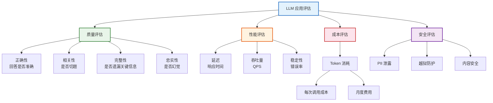
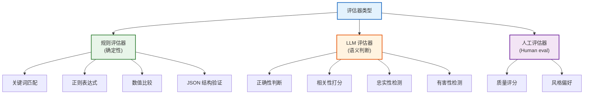
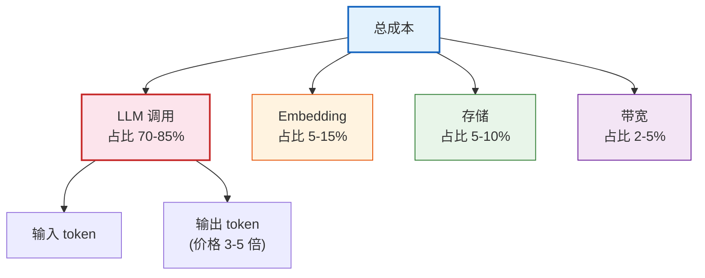

# 评估测试与成本优化技术参考

> **定位**：本文档系统讲解 LangChain 应用的评估方法、测试策略、在线监控和成本优化技术，是生产化部署的必备参考。

---

## 目录

1. [评估概述](#1-评估概述)
2. [LangSmith 评估体系](#2-langsmith-评估体系)
3. [测试数据集管理](#3-测试数据集管理)
4. [评估器类型](#4-评估器类型)
5. [在线监控与告警](#5-在线监控与告警)
6. [成本优化策略](#6-成本优化策略)
7. [A/B 测试](#7-ab-测试)
8. [性能基准](#8-性能基准)

---

## 1. 评估概述

### 1.1 为什么需要评估

| 阶段 | 没有评估的风险 | 有评估的收益 |
|------|--------------|-------------|
| 开发期 | 不知道改动是否改善效果 | 量化每次变更的影响 |
| 上线前 | 不知道应用是否达标 | 上线前确认质量达标 |
| 运行期 | 不知道线上是否退化 | 及时发现质量下降 |
| 迭代时 | 凭感觉判断改好改坏 | 数据驱动迭代决策 |

### 1.2 评估维度



> **图解说明**：LLM 应用评估涵盖四个维度——质量（回答是否准确、相关、完整、无幻觉）、性能（延迟、吞吐、稳定性）、成本（token 消耗和费用）、安全（隐私泄露和内容合规）。

---

## 2. LangSmith 评估体系

### 2.1 评估流程


> **图解说明**：LangSmith 评估的五步流程——创建数据集→定义评估标准→自动运行→查看对比→决策上线。每次改动都可以重跑评估，对比基线版本看是否改善。

### 2.2 基本用法

```python
from langsmith import Client
from langsmith.evaluation import evaluate

client = Client()

# 1. 创建测试数据集
dataset = client.create_dataset("qa_test_v1", description="问答测试")

# 2. 添加测试用例
client.create_example(
    inputs={"question": "什么是 LangChain?"},
    outputs={"answer": "LLM 应用开发框架"},
    dataset_id=dataset.id,
)
client.create_example(
    inputs={"question": "什么是 RAG?"},
    outputs={"answer": "检索增强生成"},
    dataset_id=dataset.id,
)

# 3. 定义评估器
def correctness_evaluator(run, example):
    predicted = run.outputs.get("answer", "")
    expected = example.outputs.get("answer", "")
    score = 1 if expected.lower() in predicted.lower() else 0
    return {"key": "correctness", "score": score}

def relevance_evaluator(run, example):
    # 用 LLM 判断相关性
    prompt = f"判断以下回答是否与问题相关:\n问题: {example.inputs['question']}\n回答: {run.outputs['answer']}\n输出1或0"
    score = int(llm.invoke(prompt).content.strip())
    return {"key": "relevance", "score": score}

# 4. 运行评估
results = evaluate(
    lambda x: chain.invoke(x),  # 被测应用
    data="qa_test_v1",          # 测试数据集
    evaluators=[correctness_evaluator, relevance_evaluator],
    experiment_prefix="v1",
)
# 输出: correctness: 0.95, relevance: 0.90
```

---

## 3. 测试数据集管理

### 3.1 数据集类型

| 类型 | 来源 | 适用场景 | 优点 | 缺点 |
|------|------|---------|------|------|
| **标准答案集** | 人工标注 | 功能测试 | 准确 | 标注成本高 |
| **LLM 生成集** | LLM 生成 | 压力测试 | 数量大 | 质量不稳定 |
| **线上采样集** | 真实用户问题 | 回归测试 | 真实 | 需脱敏 |
| **对抗集** | 红队构造 | 安全测试 | 覆盖边界 | 设计困难 |

### 3.2 代码管理

```python
# 从线上日志采样创建数据集
def create_dataset_from_traces(dataset_name, project_name, n=50):
    """从 LangSmith 追踪记录采样创建数据集"""
    traces = list(client.list_runs(
        project_name=project_name,
        limit=n,
        execution_order=1,
    ))
    for trace in traces:
        client.create_example(
            inputs=trace.inputs,
            outputs=trace.outputs,
            dataset_name=dataset_name,
        )

create_dataset_from_traces("production_sample_2024", "prod-app", n=100)
```

---

## 4. 评估器类型

### 4.1 评估器分类



> **图解说明**：评估器分三类——规则评估器（确定性判断，如关键词匹配）、LLM 评估器（用 LLM 做语义判断，如正确性/相关性打分）、人工评估器（人主观打分）。实际使用中混合搭配。

### 4.2 常用评估器实现

```python
# 1. 关键词匹配评估器
def keyword_evaluator(run, example):
    """检查回答是否包含关键词"""
    answer = run.outputs.get("answer", "")
    keywords = example.outputs.get("keywords", [])
    hit = sum(1 for kw in keywords if kw.lower() in answer.lower())
    score = hit / len(keywords) if keywords else 0
    return {"key": "keyword_coverage", "score": score}

# 2. LLM 评估器（正确性）
def llm_correctness_evaluator(run, example):
    """用 LLM 判断回答正确性"""
    prompt = f"""判断回答是否正确:
问题: {example.inputs['question']}
标准答案: {example.outputs['answer']}
待评估回答: {run.outputs['answer']}
请输出 0(错误) 或 1(正确)"""
    score = int(llm.invoke(prompt).content.strip())
    return {"key": "llm_correctness", "score": score}

# 3. 忠实性评估器（检测幻觉）
from langchain.smith import run_evaluator

@run_evaluator
def faithfulness_evaluator(run, example):
    """检测回答是否忠实于上下文"""
    context = run.outputs.get("context", "")
    answer = run.outputs.get("answer", "")
    prompt = f"""判断回答是否完全基于上下文:
上下文: {context}
回答: {answer}
如果回答中有上下文不支持的内容，输出0，否则输出1"""
    score = int(llm.invoke(prompt).content.strip())
    return {"key": "faithfulness", "score": score}
```

### 4.3 使用内置评估器

```python
from langchain.evaluation import EvaluatorType, load_evaluator

# 加载内置评估器
exact_match = load_evaluator(EvaluatorType.EXACT_MATCH)
embedding_distance = load_evaluator(EvaluatorType.EMBEDDING_DISTANCE)
llm_string_match = load_evaluator(EvaluatorType.LLM_STRING_MATCH, llm=llm)
criteria_eval = load_evaluator(
    EvaluatorType.CRITERIA,
    criteria="conciseness",
    llm=llm,
)
```

---

## 5. 在线监控与告警

### 5.1 监控指标

```python
from langchain.callbacks.tracers import LangChainTracer

# 配置 LangSmith 追踪
tracer = LangChainTracer(project_name="production-app")

chain = prompt | model | parser

# 每次调用自动记录到 LangSmith
result = chain.invoke(
    {"question": "什么是 RAG"},
    config={"callbacks": [tracer]},
)
```

### 5.2 关键监控指标

| 指标 | 正常范围 | 告警阈值 | 说明 |
|------|---------|---------|------|
| 错误率 | < 1% | > 5% | API 调用失败率 |
| 平均延迟 | < 3s | > 8s | 端到端响应时间 |
| P99 延迟 | < 10s | > 30s | 99 分位延迟 |
| Token 消耗 | 按预算 | 超预算 80% | 每日 token 总量 |
| 幻觉率 | < 5% | > 15% | 回答含错误信息比例 |
| 用户满意度 | > 80% | < 60% | 点赞/点踩比 |

### 5.3 告警脚本

```python
import requests

def check_and_alert():
    """定期检查并告警"""
    runs = list(client.list_runs(
        project_name="production-app",
        limit=100,
    ))

    errors = [r for r in runs if r.error]
    error_rate = len(errors) / len(runs)

    if error_rate > 0.05:
        send_alert(f"错误率 {error_rate:.1%} 超过 5%!")

    avg_latency = sum(r.end_time - r.start_time for r in runs if r.end_time) / len(runs)
    if avg_latency.total_seconds() > 8:
        send_alert(f"平均延迟 {avg_latency.total_seconds():.1f}s 超过 8s!")
```

---

## 6. 成本优化策略

### 6.1 成本构成



> **图解说明**：LLM 应用成本主要来自模型调用（70-85%），其中输出 token 的价格是输入的 3-5 倍。优化重点应放在减少 LLM 调用次数和减少输入 token 数量上。

### 6.2 优化策略

| 策略 | 效果 | 实现方式 |
|------|------|---------|
| **模型分级** | 降低 60% | 简单任务用小模型，复杂任务用大模型 |
| **语义缓存** | 降低 30% | 相似问题直接返回缓存结果 |
| **Prompt 精简** | 降低 20% | 去除冗余上下文，压缩 prompt |
| **检索过滤** | 降低 15% | 只传最相关的 top-k |
| **流式返回** | 不省钱但提体验 | 提前返回结果，用户体验更好 |
| **批处理** | 降低 API 调用数 | batch() 合并多个请求 |

### 6.3 语义缓存实现

```python
from langchain_community.cache import SQLiteCache
from langchain.globals import set_llm_cache

# 设置 LLM 缓存——相同输入直接返回缓存结果
set_llm_cache(SQLiteCache(database_path="langchain_cache.db"))

# 第一次调用——实际请求 LLM
result1 = chain.invoke({"question": "什么是 RAG"})

# 第二次相同问题——直接从缓存返回
result2 = chain.invoke({"question": "什么是 RAG"})
# result2 == result1，但不消耗 token
```

### 6.4 模型分级路由

```python
from langchain_core.runnables import RunnableBranch

# 简单问题用小模型，复杂问题用大模型
simple_chain = simple_prompt | ChatOpenAI(model="gpt-4o-mini") | parser
complex_chain = complex_prompt | ChatOpenAI(model="gpt-4o") | parser

def route(input):
    question = input["question"]
    # 启发式路由
    if len(question) < 50 and "?" in question:
        return simple_chain
    return complex_chain

smart_chain = RunnableBranch(
    (lambda x: len(x["question"]) < 50, simple_chain),
    default=complex_chain,
)
# 整体成本降低约 60%
```

---

## 7. A/B 测试

### 7.1 A/B 测试流程

```python
from langchain.globals import set_llm_cache
import random

def ab_test(chain_a, chain_b, question, ratio=0.5):
    """A/B 测试路由"""
    if random.random() < ratio:
        variant = "A"
        result = chain_a.invoke(question)
    else:
        variant = "B"
        result = chain_b.invoke(question)

    # 记录到 LangSmith
    client.create_example(
        inputs={"question": question, "variant": variant},
        outputs={"answer": result},
        dataset_name="ab_test_results",
    )
    return result
```

### 7.2 对比评估

```python
# 对比两个版本的表现
results = evaluate(
    lambda x: chain_v1.invoke(x),
    data="ab_test_dataset",
    evaluators=[correctness_evaluator, relevance_evaluator],
    experiment_prefix="v1",
)

results = evaluate(
    lambda x: chain_v2.invoke(x),
    data="ab_test_dataset",
    evaluators=[correctness_evaluator, relevance_evaluator],
    experiment_prefix="v2",
)
# 在 LangSmith UI 中对比 v1 vs v2 的指标
```

---

## 8. 性能基准

### 8.1 基准测试代码

```python
import time
import statistics

def benchmark(chain, inputs, n=10):
    """对链进行基准测试"""
    latencies = []
    for i in range(n):
        start = time.time()
        chain.invoke(inputs[i % len(inputs)])
        latencies.append(time.time() - start)

    return {
        "mean": statistics.mean(latencies),
        "median": statistics.median(latencies),
        "p99": sorted(latencies)[int(n * 0.99)],
        "min": min(latencies),
        "max": max(latencies),
    }

bench = benchmark(chain, test_inputs, n=50)
print(f"平均: {bench['mean']:.2f}s | P99: {bench['p99']:.2f}s")
```

### 8.2 常见链的性能参考

| 链类型 | 平均延迟 | P99 | Token | 适用场景 |
|--------|---------|-----|-------|---------|
| 单轮问答 | 0.5-2s | 5s | 200-500 | 简单问答 |
| RAG 问答 | 2-5s | 10s | 1000-3000 | 文档问答 |
| Agent 工具调用 | 5-15s | 30s | 2000-5000 | 复杂任务 |
| 多 Agent | 10-60s | 120s | 5000-20000 | 团队协作 |

---

## 附录：评估检查清单

- [ ] 定义了至少 3 个评估维度
- [ ] 测试数据集 >= 50 条
- [ ] 有标准答案或参考答案
- [ ] 配置了 LangSmith 自动追踪
- [ ] 设置了错误率告警
- [ ] 设置了延迟告警
- [ ] 实施了成本预算监控
- [ ] 启用了语义缓存
- [ ] 配置了模型分级路由
- [ ] 做过至少一轮 A/B 测试

---

## 配套课程

- 📖 `学习课程/第13课_综合实战_从零构建AI知识助手.md` — 实战项目含评估环节
