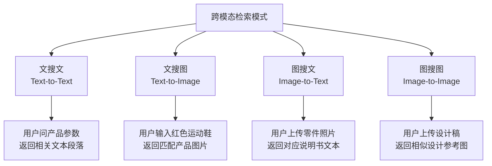
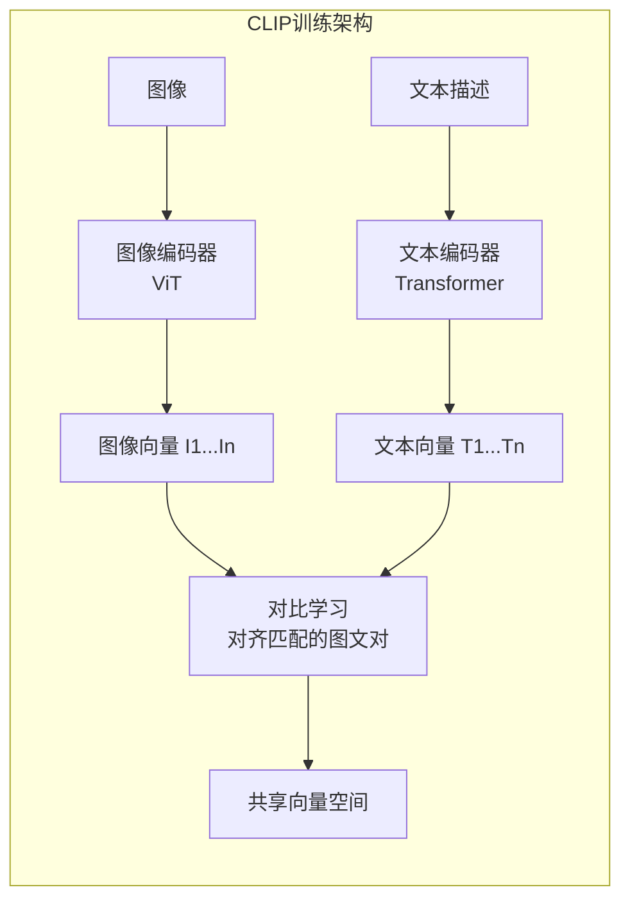
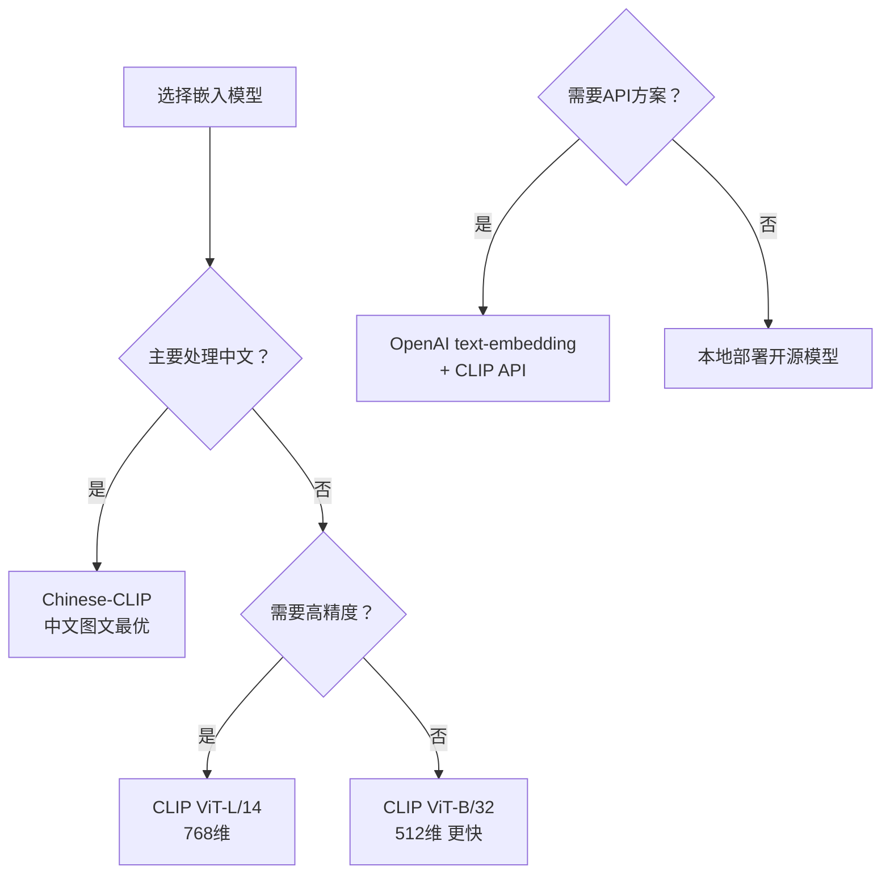
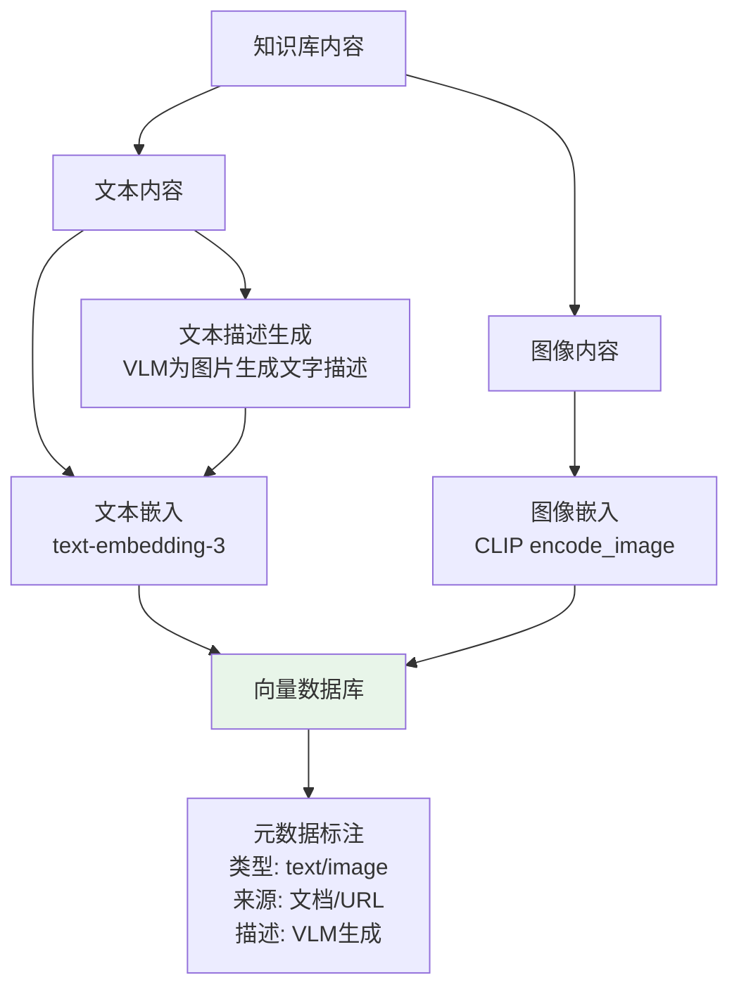
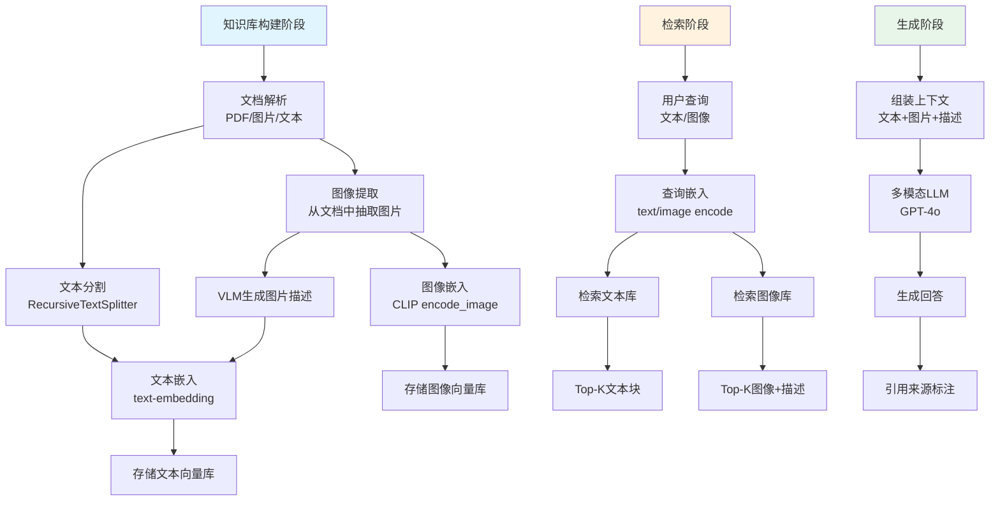
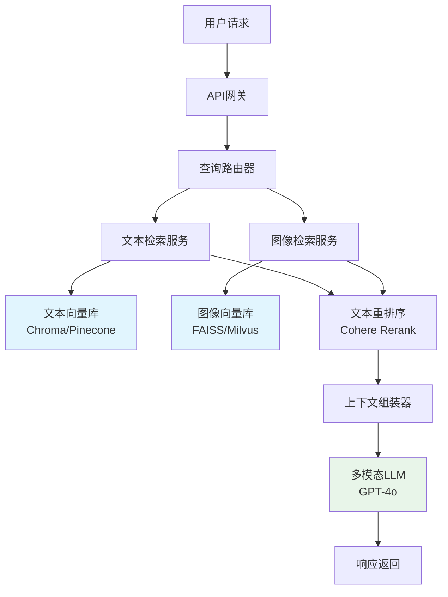

# 100. 多模态RAG与跨模态检索引擎

> **知识库编号：KB100** | **阶段：19** | **难度：高级** | **前置知识：KB98（多模态LLM基础）、KB99（图文混排解析）、第38-53课（高级应用RAG）**
>
> 本篇系统讲解多模态RAG架构、跨模态嵌入模型（CLIP/BLIP）、多模态向量数据库、图文混合检索流水线与混合检索策略，解决图文混合知识库的检索增强生成问题。

---

## 1. 多模态RAG概述

### 1.1 传统RAG的局限

传统RAG（Retrieval-Augmented Generation）只处理文本：用户输入文本问题 → 检索文本块 → LLM生成回答。但真实世界的知识库往往图文混合——技术手册有配图、医疗档案有影像、电商有产品图。

**一句话理解**：就像图书馆如果只能按书名搜索而不能按封面图片找书，那遇到"我记得那本红色封面的书"就无能为力。多模态RAG让检索系统"既能按文字找，也能按图片找"。

### 1.2 多模态RAG vs 传统RAG

| 维度 | 传统RAG | 多模态RAG |
|------|---------|-----------|
| 输入类型 | 纯文本查询 | 文本/图像/混合 |
| 嵌入模型 | text-embedding | CLIP/BLIP跨模态嵌入 |
| 向量库内容 | 文本向量 | 文本向量+图像向量 |
| 检索方式 | 文搜文 | 文搜文/图搜文/文搜图/图搜图 |
| 生成模型 | 文本LLM | 多模态LLM |
| 应用场景 | 文档问答 | 图文问答/产品搜索/医学影像 |

### 1.3 四种跨模态检索模式



---

## 2. 跨模态嵌入模型

### 2.1 CLIP模型原理

CLIP（Contrastive Language-Image Pre-training）是OpenAI提出的跨模态嵌入模型，通过对比学习将图像和文本映射到同一向量空间。



**核心思想**：匹配的图文对在向量空间中距离近，不匹配的距离远。训练后，CLIP能将"一只猫的照片"和文字"a photo of a cat"映射到相近的向量。

### 2.2 主流跨模态嵌入模型

| 模型 | 维度 | 支持模态 | 中文支持 | 开源 | 特点 |
|------|------|---------|---------|------|------|
| CLIP (ViT-B/32) | 512 | 图+文 | 一般 | 是 | 基线模型 |
| CLIP (ViT-L/14) | 768 | 图+文 | 一般 | 是 | 更高精度 |
| BLIP-2 | 768 | 图+文 | 一般 | 是 | 生成+嵌入 |
| Chinese-CLIP | 512/768 | 图+文 | 优秀 | 是 | 中文优化 |
| SigLIP | 768 | 图+文 | 一般 | 是 | 改进CLIP |
| Jina-CLIP | 768 | 图+文 | 良好 | 是 | 多语言 |

### 2.3 选型决策



---

## 3. 多模态向量数据库

### 3.1 架构设计



### 3.2 双轨索引策略

| 策略 | 原理 | 优点 | 缺点 |
|------|------|------|------|
| 仅图像嵌入 | 所有图片用CLIP嵌入 | 纯视觉检索 | 文本检索不可用 |
| 仅文本嵌入 | VLM为每张图生成描述后嵌入 | 检索准确 | 丢失视觉细节 |
| 双轨索引 | 图像嵌入+文本描述嵌入并存 | 双模态检索均可 | 存储成本翻倍 |
| 混合索引 | 图像+文本+VLM描述三重索引 | 最全面 | 维护复杂 |

### 3.3 使用Chroma实现多模态向量库

```python
import chromadb
from langchain_chroma import Chroma
from langchain_core.documents import Document
from langchain_openai import OpenAIEmbeddings
import base64

class MultimodalVectorStore:
    """多模态向量数据库"""
    
    def __init__(self, persist_dir="./mm_vdb"):
        self.text_embedder = OpenAIEmbeddings(model="text-embedding-3-small")
        self.text_store = Chroma(
            collection_name="text_collection",
            embedding_function=self.text_embedder,
            persist_directory=persist_dir,
        )
        # 图像集合单独管理
        self.image_store = Chroma(
            collection_name="image_collection",
            embedding_function=self.text_embedder,  # 用VLM描述的文本嵌入
            persist_directory=persist_dir,
        )
    
    def add_text(self, text, metadata=None):
        """添加文本文档"""
        doc = Document(page_content=text, metadata=metadata or {})
        self.text_store.add_documents([doc])
    
    def add_image(self, image_path, description, metadata=None):
        """添加图片（使用VLM生成的描述作为嵌入源）"""
        doc = Document(
            page_content=description,  # VLM生成的图片描述
            metadata={
                **(metadata or {}),
                "type": "image",
                "image_path": image_path,
            }
        )
        self.image_store.add_documents([doc])
    
    def search(self, query, k=5):
        """检索：同时搜索文本和图像"""
        text_results = self.text_store.similarity_search(query, k=k)
        image_results = self.image_store.similarity_search(query, k=k)
        
        # 合并结果
        all_results = []
        for doc in text_results:
            all_results.append({
                "content": doc.page_content,
                "type": "text",
                "metadata": doc.metadata,
            })
        for doc in image_results:
            all_results.append({
                "content": doc.page_content,
                "type": "image",
                "image_path": doc.metadata.get("image_path"),
                "description": doc.page_content,
                "metadata": doc.metadata,
            })
        
        return all_results

# 使用
vdb = MultimodalVectorStore()
vdb.add_text("Qwen-VL是阿里开源的视觉语言模型", {"source": "tech_doc.md"})
vdb.add_image("qwen_vl_arch.png", "Qwen-VL架构图，展示视觉编码器与语言模型的连接", {"source": "tech_doc.md"})

results = vdb.search("Qwen视觉模型架构", k=3)
for r in results:
    print(f"[{r['type']}] {r['content'][:80]}...")
```

---

## 4. CLIP本地嵌入实现

### 4.1 安装与加载

```python
# 安装: pip install transformers torch pillow
from transformers import CLIPModel, CLIPProcessor, CLIPTokenizer
from PIL import Image
import torch

class CLIPEmbedder:
    """CLIP本地嵌入器"""
    
    def __init__(self, model_name="openai/clip-vit-base-patch32"):
        self.device = "cuda" if torch.cuda.is_available() else "cpu"
        self.model = CLIPModel.from_pretrained(model_name).to(self.device)
        self.processor = CLIPProcessor.from_pretrained(model_name)
        self.tokenizer = CLIPTokenizer.from_pretrained(model_name)
    
    def encode_text(self, texts):
        """文本嵌入"""
        inputs = self.tokenizer(texts, padding=True, return_tensors="pt").to(self.device)
        with torch.no_grad():
            embeddings = self.model.get_text_features(**inputs)
        # L2归一化
        embeddings = embeddings / embeddings.norm(dim=-1, keepdim=True)
        return embeddings.cpu().numpy()
    
    def encode_image(self, image_paths):
        """图像嵌入"""
        images = [Image.open(p) for p in image_paths]
        inputs = self.processor(images=images, return_tensors="pt").to(self.device)
        with torch.no_grad():
            embeddings = self.model.get_image_features(**inputs)
        embeddings = embeddings / embeddings.norm(dim=-1, keepdim=True)
        return embeddings.cpu().numpy()
    
    def encode_image_pil(self, images):
        """PIL图像嵌入"""
        inputs = self.processor(images=images, return_tensors="pt").to(self.device)
        with torch.no_grad():
            embeddings = self.model.get_image_features(**inputs)
        embeddings = embeddings / embeddings.norm(dim=-1, keepdim=True)
        return embeddings.cpu().numpy()

# 使用
embedder = CLIPEmbedder()
text_emb = embedder.encode_text(["一只猫", "一只狗", "一辆车"])
img_emb = embedder.encode_image(["cat.jpg", "dog.jpg", "car.jpg"])

# 计算图文相似度
import numpy as np
for i, text in enumerate(["一只猫", "一只狗", "一辆车"]):
    for j, img in enumerate(["cat.jpg", "dog.jpg", "car.jpg"]):
        sim = np.dot(text_emb[i], img_emb[j])
        print(f"'{text}' vs '{img}': {sim:.4f}")
```

### 4.2 相似度矩阵示例

```
              cat.jpg    dog.jpg    car.jpg
'一只猫'        0.3245     0.1876     0.1201
'一只狗'        0.1987     0.3102     0.1156
'一辆车'        0.0891     0.1023     0.2847
```

---

## 5. 多模态RAG流水线

### 5.1 完整架构



### 5.2 完整多模态RAG实现

```python
from langchain_openai import ChatOpenAI, OpenAIEmbeddings
from langchain_chroma import Chroma
from langchain_core.documents import Document
from langchain_core.messages import HumanMessage, SystemMessage
from langchain_text_splitters import RecursiveCharacterTextSplitter
import base64

class MultimodalRAG:
    """多模态RAG系统"""
    
    def __init__(self, model="gpt-4o", persist_dir="./mm_rag_vdb"):
        self.llm = ChatOpenAI(model=model, temperature=0)
        self.embedder = OpenAIEmbeddings(model="text-embedding-3-small")
        self.splitter = RecursiveCharacterTextSplitter(
            chunk_size=1000, chunk_overlap=200
        )
        self.text_store = Chroma(
            collection_name="mm_text",
            embedding_function=self.embedder,
            persist_directory=persist_dir,
        )
        self.image_store = Chroma(
            collection_name="mm_images",
            embedding_function=self.embedder,
            persist_directory=persist_dir,
        )
    
    def add_documents(self, text_docs, image_docs):
        """添加文档到知识库
        
        Args:
            text_docs: [{"text": "...", "source": "..."}]
            image_docs: [{"path": "img.png", "description": "...", "source": "..."}]
        """
        # 添加文本
        text_chunks = []
        for doc in text_docs:
            chunks = self.splitter.split_text(doc["text"])
            for chunk in chunks:
                text_chunks.append(Document(
                    page_content=chunk,
                    metadata={"source": doc.get("source", "unknown"), "type": "text"}
                ))
        if text_chunks:
            self.text_store.add_documents(text_chunks)
        
        # 添加图片（用VLM描述嵌入）
        image_docs_list = []
        for doc in image_docs:
            image_docs_list.append(Document(
                page_content=doc["description"],
                metadata={
                    "source": doc.get("source", "unknown"),
                    "type": "image",
                    "image_path": doc["path"],
                }
            ))
        if image_docs_list:
            self.image_store.add_documents(image_docs_list)
        
        print(f"已添加 {len(text_chunks)} 个文本块, {len(image_docs_list)} 张图片")
    
    def retrieve(self, query, k=3):
        """检索相关内容"""
        text_results = self.text_store.similarity_search(query, k=k)
        image_results = self.image_store.similarity_search(query, k=k)
        return text_results, image_results
    
    def generate(self, query, text_results, image_results):
        """生成回答"""
        # 组装文本上下文
        text_context = "\n\n".join([
            f"[文本来源: {d.metadata.get('source', '?')}]\n{d.page_content}"
            for d in text_results
        ])
        
        # 组装图片上下文
        image_content = []
        for d in image_results:
            image_content.append({
                "type": "text",
                "text": f"[图片描述: {d.page_content}] (来源: {d.metadata.get('source', '?')})"
            })
            # 如果有图片路径，添加实际图片
            img_path = d.metadata.get("image_path")
            if img_path:
                with open(img_path, "rb") as f:
                    img_b64 = base64.b64encode(f.read()).decode("utf-8")
                image_content.append({
                    "type": "image_url",
                    "image_url": {"url": f"data:image/png;base64,{img_b64}"}
                })
        
        system_prompt = """你是一个多模态知识库问答助手。
请基于以下检索到的文本和图片信息回答用户问题。
- 优先使用检索到的信息
- 如果信息不足，说明局限性
- 标注信息来源"""
        
        message = HumanMessage(content=[
            {"type": "text", "text": f"检索到的文本信息:\n{text_context}\n\n用户问题: {query}"},
            *image_content,
        ])
        
        response = self.llm.invoke([SystemMessage(content=system_prompt), message])
        return response.content
    
    def query(self, question, k=3):
        """完整问答流程"""
        text_results, image_results = self.retrieve(question, k=k)
        answer = self.generate(question, text_results, image_results)
        return {
            "answer": answer,
            "text_sources": len(text_results),
            "image_sources": len(image_results),
        }

# 使用示例
rag = MultimodalRAG()

# 添加知识库
rag.add_documents(
    text_docs=[
        {"text": "Qwen-VL-Max支持最大图像分辨率4096x4096...", "source": "model_spec.md"},
        {"text": "CLIP模型使用对比学习训练...", "source": "clip_paper.md"},
    ],
    image_docs=[
        {"path": "qwen_arch.png", "description": "Qwen-VL架构图，展示视觉编码器和语言模型", "source": "model_spec.md"},
        {"path": "clip_training.png", "description": "CLIP对比学习训练流程图", "source": "clip_paper.md"},
    ]
)

# 问答
result = rag.query("Qwen-VL的架构是怎样的？")
print(result["answer"])
```

---

## 6. 混合检索策略

### 6.1 检索策略分类

| 策略 | 描述 | 适用场景 |
|------|------|---------|
| 纯文本检索 | 只用文本嵌入检索 | 纯文本知识库 |
| 纯图像检索 | 只用CLIP图像嵌入检索 | 纯图片库 |
| 并行检索 | 文本库和图像库分别检索后合并 | 通用场景 |
| 融合排序 | 并行检索后用RRF融合重排 | 精度要求高 |
| 级联检索 | 先文本检索，不足时补充图像 | 成本敏感 |
| 交叉检索 | 文本查询检索图像库 | 文搜图场景 |

### 6.2 RRF融合排序

```python
def reciprocal_rank_fusion(result_lists, k=60):
    """RRF融合排序
    
    Args:
        result_lists: 多个检索结果列表，每个元素是 {doc_id: score}
        k: 平滑参数
    
    Returns:
        融合后的排序结果
    """
    rrf_scores = {}
    
    for result_list in result_lists:
        for rank, (doc_id, score) in enumerate(result_list):
            if doc_id not in rrf_scores:
                rrf_scores[doc_id] = 0
            rrf_scores[doc_id] += 1.0 / (k + rank + 1)
    
    # 按RRF分数排序
    sorted_results = sorted(rrf_scores.items(), key=lambda x: x[1], reverse=True)
    return sorted_results

# 使用：融合文本检索和图像检索结果
text_results = [("doc1", 0.9), ("doc2", 0.85), ("doc3", 0.7)]
image_results = [("doc2", 0.88), ("doc4", 0.82), ("doc1", 0.75)]

fused = reciprocal_rank_fusion([text_results, image_results])
print(fused)
# [('doc1', 0.0325), ('doc2', 0.0321), ('doc3', 0.0161), ('doc4', 0.0159)]
```

### 6.3 多路检索实现

```python
class HybridRetriever:
    """多路混合检索器"""
    
    def __init__(self, text_store, image_store, clip_embedder=None):
        self.text_store = text_store
        self.image_store = image_store
        self.clip_embedder = clip_embedder
    
    def retrieve(self, query, query_image_path=None, k=5):
        """多路检索"""
        results = []
        
        # 路径1：文本查询 → 文本库
        text_results = self.text_store.similarity_search_with_score(query, k=k)
        for doc, score in text_results:
            results.append({
                "doc": doc,
                "source": "text_to_text",
                "score": score,
            })
        
        # 路径2：文本查询 → 图像库（通过VLM描述）
        image_results = self.image_store.similarity_search_with_score(query, k=k)
        for doc, score in image_results:
            results.append({
                "doc": doc,
                "source": "text_to_image",
                "score": score,
            })
        
        # 路径3：图像查询 → 图像库（CLIP）
        if query_image_path and self.clip_embedder:
            query_emb = self.clip_embedder.encode_image([query_image_path])
            # 在CLIP向量库中检索（需要单独的CLIP向量集合）
            # 这里用语义搜索模拟
            pass
        
        # RRF融合
        doc_scores = {}
        for i, r in enumerate(results):
            doc_id = r["doc"].page_content[:50]  # 简化ID
            if doc_id not in doc_scores:
                doc_scores[doc_id] = {"score": 0, "doc": r["doc"]}
            doc_scores[doc_id]["score"] += 1.0 / (60 + i + 1)
        
        sorted_results = sorted(doc_scores.values(), key=lambda x: x["score"], reverse=True)
        return sorted_results[:k]
```

---

## 7. 图像索引优化

### 7.1 批量索引

```python
import os
from PIL import Image

def batch_index_images(directory, vlm_model, vector_store, batch_size=32):
    """批量索引目录中的所有图片"""
    image_files = [
        f for f in os.listdir(directory)
        if f.lower().endswith(('.png', '.jpg', '.jpeg', '.bmp'))
    ]
    
    for i in range(0, len(image_files), batch_size):
        batch = image_files[i:i+batch_size]
        
        # 批量生成描述
        descriptions = []
        for img_file in batch:
            img_path = os.path.join(directory, img_file)
            # 使用VLM生成描述
            desc = generate_description(img_path, vlm_model)
            descriptions.append(desc)
        
        # 批量添加到向量库
        docs = [
            Document(
                page_content=desc,
                metadata={
                    "type": "image",
                    "image_path": os.path.join(directory, img_file),
                    "filename": img_file,
                }
            )
            for img_file, desc in zip(batch, descriptions)
        ]
        vector_store.add_documents(docs)
        print(f"已索引 {min(i+batch_size, len(image_files))}/{len(image_files)}")

def generate_description(image_path, llm):
    """使用VLM生成图片描述"""
    with open(image_path, "rb") as f:
        img_b64 = base64.b64encode(f.read()).decode("utf-8")
    
    message = HumanMessage(content=[
        {"type": "text", "text": "用一句话描述这张图片的关键内容。"},
        {"type": "image_url", "image_url": {"url": f"data:image/png;base64,{img_b64}"}},
    ])
    response = llm.invoke([message])
    return response.content
```

### 7.2 增量更新

```python
def incremental_update(directory, vector_store, vlm_model):
    """增量更新：只索引新增或修改的图片"""
    existing = set()
    for doc in vector_store.get()["metadatas"]:
        existing.add(doc.get("filename", ""))
    
    new_files = [
        f for f in os.listdir(directory)
        if f.lower().endswith(('.png', '.jpg', '.jpeg'))
        and f not in existing
    ]
    
    if new_files:
        print(f"发现 {len(new_files)} 张新图片")
        batch_index_images(directory, vlm_model, vector_store, batch_size=32)
    else:
        print("没有新图片需要索引")
```

---

## 8. 质量评估

### 8.1 检索质量指标

| 指标 | 含义 | 计算方式 |
|------|------|---------|
| Recall@K | 前K个结果中包含正确答案的比例 | 正确命中数 / 总查询数 |
| MRR | 平均倒数排名 | 1/正确答案排名的平均值 |
| nDCG | 归一化折损累计增益 | 考虑排序位置的加权 |
| Recall(文+图) | 文本+图像联合召回 | 融合后的召回率 |

### 8.2 评估实现

```python
def evaluate_retrieval(rag_system, test_cases):
    """评估检索质量
    
    Args:
        test_cases: [{"query": "...", "expected_sources": ["doc1", "img2"]}]
    """
    total_recall = 0
    total_mrr = 0
    
    for case in test_cases:
        text_results, image_results = rag_system.retrieve(case["query"], k=5)
        
        # 收集检索到的来源
        retrieved_sources = set()
        for doc in text_results:
            retrieved_sources.add(doc.metadata.get("source", ""))
        for doc in image_results:
            retrieved_sources.add(doc.metadata.get("source", ""))
        
        # 计算Recall
        expected = set(case["expected_sources"])
        hits = expected & retrieved_sources
        recall = len(hits) / len(expected) if expected else 0
        total_recall += recall
        
        # 计算MRR
        for rank, source in enumerate(retrieved_sources):
            if source in expected:
                total_mrr += 1.0 / (rank + 1)
                break
    
    n = len(test_cases)
    print(f"Recall@5: {total_recall/n:.4f}")
    print(f"MRR: {total_mrr/n:.4f}")
```

### 8.3 性能基准

| 检索策略 | Recall@5 | MRR | 平均延迟 |
|---------|---------|-----|---------|
| 纯文本 | 0.72 | 0.61 | 50ms |
| 纯图像(CLIP) | 0.65 | 0.52 | 80ms |
| 并行检索 | 0.88 | 0.73 | 90ms |
| RRF融合 | 0.92 | 0.78 | 95ms |
| 级联检索 | 0.85 | 0.70 | 60ms |

---

## 9. 生产部署要点

### 9.1 架构部署



### 9.2 缓存策略

| 缓存层 | 缓存内容 | TTL | 命中率 |
|--------|---------|-----|--------|
| 查询缓存 | 完整Q→A | 1小时 | 15-25% |
| 嵌入缓存 | 文本→向量 | 永久 | 40-60% |
| 描述缓存 | 图片→VLM描述 | 永久 | 90%+ |
| 检索缓存 | 查询→Top-K | 30分钟 | 10-20% |

---

## 10. 小结

本篇系统讲解了多模态RAG的完整技术栈：

1. **跨模态嵌入**：CLIP对比学习原理与六种嵌入模型对比
2. **向量数据库**：双轨索引策略与Chroma实现
3. **CLIP本地嵌入**：文本和图像的本地嵌入实现
4. **多模态RAG流水线**：从知识库构建到检索生成的完整链路
5. **混合检索策略**：并行检索、RRF融合、级联检索、交叉检索
6. **图像索引优化**：批量索引与增量更新
7. **质量评估**：Recall@K、MRR、nDCG指标与评估实现
8. **生产部署**：微服务架构与四层缓存策略

下一篇将深入语音ASR/TTS集成与多模态Agent，构建语音驱动的交互式多模态系统。
