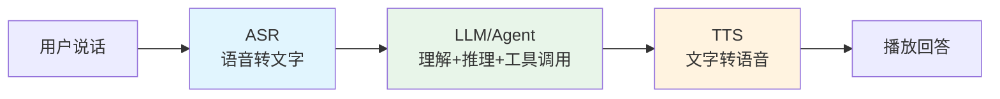
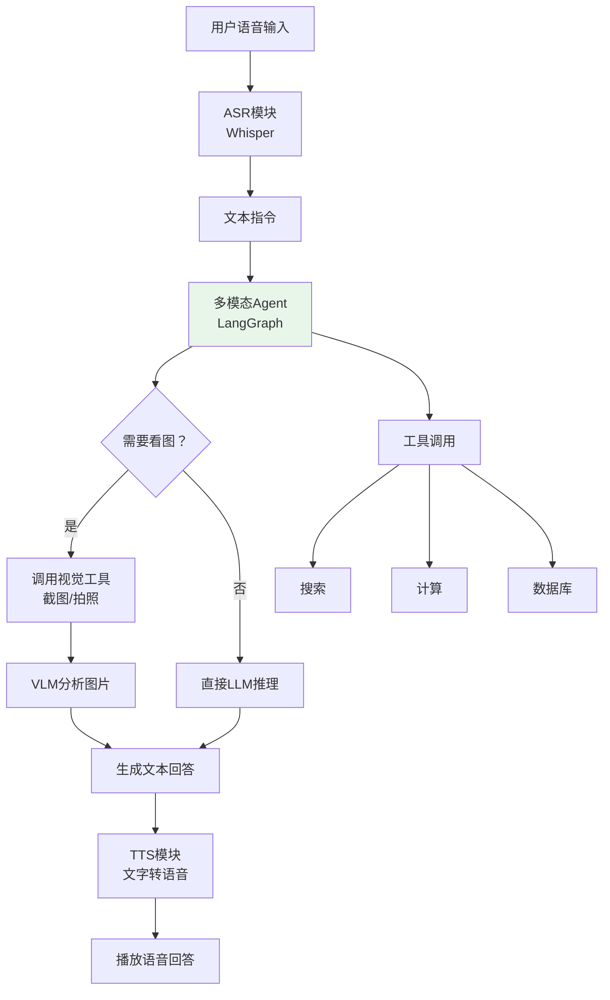
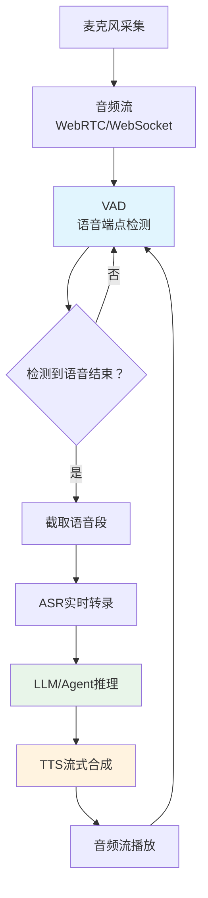
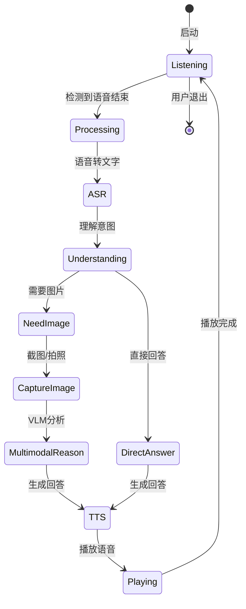
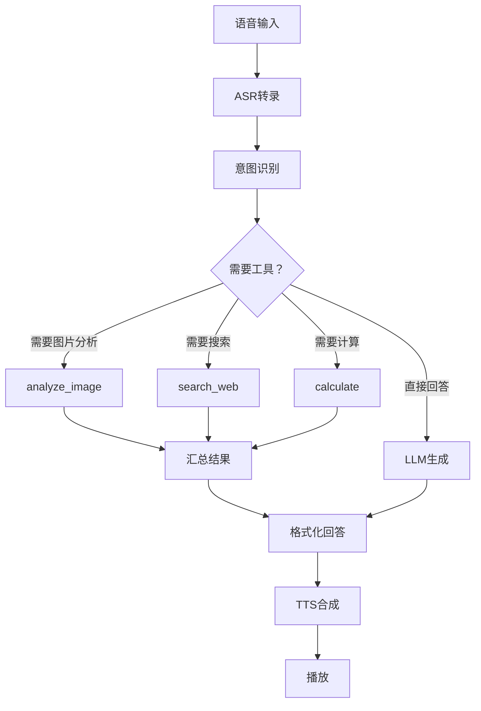
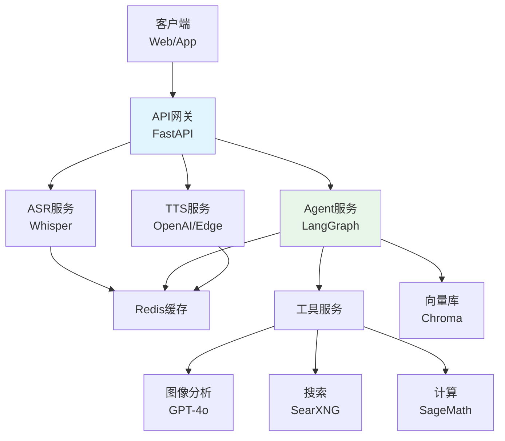

# 101. 语音ASR/TTS集成与多模态Agent

> **知识库编号：KB101** | **阶段：19** | **难度：高级** | **前置知识：KB98（多模态LLM基础）、KB100（多模态RAG）、第99-102课（Agent设计模式）**
>
> 本篇系统讲解语音识别（ASR）与语音合成（TTS）的集成方案、LangChain音频组件、语音驱动的多模态Agent架构，以及实时语音交互系统的完整实现。

---

## 1. 语音交互概述

### 1.1 语音交互的价值

语音是人类最自然的交互方式。将语音能力接入 LLM 应用，可以让用户通过"说话"来提问、操作和获取回答，极大降低使用门槛。

**一句话理解**：就像给只会打字的AI助手装上了"耳朵"和"嘴巴"——ASR让它能听懂你说话，TTS让它能用语音回答你。

### 1.2 语音交互架构



### 1.3 ASR vs TTS

| 维度 | ASR（语音识别） | TTS（语音合成） |
|------|----------------|----------------|
| 方向 | 语音→文字 | 文字→语音 |
| 输入 | 音频文件/流 | 文本 |
| 输出 | 文字 | 音频文件/流 |
| 关键指标 | 词错误率(WER) | 自然度(MOS) |
| 延迟要求 | 实时(<300ms) | 实时(<500ms) |
| 多语言 | 需多语言模型 | 需多语言音色 |

---

## 2. ASR（自动语音识别）

### 2.1 主流ASR方案

| 方案 | 类型 | 准确率 | 延迟 | 成本 | 中文支持 |
|------|------|--------|------|------|---------|
| OpenAI Whisper | 开源/本地 | 优秀 | 中 | 免费 | 优秀 |
| Whisper API | 云端API | 优秀 | 低 | $0.006/分钟 | 优秀 |
| 百度语音识别 | 云端API | 优秀 | 低 | 低 | 优秀 |
| 阿里ASR | 云端API | 优秀 | 低 | 低 | 优秀 |
| Google Speech | 云端API | 良好 | 低 | 中 | 良好 |
| Azure Speech | 云端API | 优秀 | 低 | 中 | 优秀 |

### 2.2 Whisper本地部署

```python
# 安装: pip install openai-whisper
import whisper

class WhisperASR:
    """Whisper语音识别"""
    
    def __init__(self, model_size="base"):
        # model_size: tiny/base/small/medium/large
        # 越大越准但越慢
        self.model = whisper.load_model(model_size)
    
    def transcribe(self, audio_path, language="zh"):
        """转录音频文件"""
        result = self.model.transcribe(
            audio_path,
            language=language,
            task="transcribe",
        )
        return {
            "text": result["text"],
            "segments": [
                {
                    "start": seg["start"],
                    "end": seg["end"],
                    "text": seg["text"].strip(),
                }
                for seg in result["segments"]
            ],
            "language": result.get("language", language),
        }
    
    def transcribe_with_timestamps(self, audio_path):
        """带时间戳的转录"""
        result = self.model.transcribe(audio_path)
        return [
            {
                "start": seg["start"],
                "end": seg["end"],
                "text": seg["text"].strip(),
            }
            for seg in result["segments"]
        ]

# 使用
asr = WhisperASR(model_size="base")
result = asr.transcribe("recording.wav")
print(result["text"])
# "你好，我想了解一下多模态大模型的基本概念"

for seg in result["segments"]:
    print(f"[{seg['start']:.1f}-{seg['end']:.1f}] {seg['text']}")
```

### 2.3 OpenAI Whisper API

```python
from openai import OpenAI
import json

class WhisperAPI:
    """OpenAI Whisper API"""
    
    def __init__(self):
        self.client = OpenAI()
    
    def transcribe(self, audio_path, language="zh"):
        """使用API转录"""
        with open(audio_path, "rb") as f:
            transcript = self.client.audio.transcriptions.create(
                model="whisper-1",
                file=f,
                language=language,
                response_format="verbose_json",
                timestamp_granularities=["segment"],
            )
        
        return {
            "text": transcript.text,
            "segments": [
                {
                    "start": seg.start,
                    "end": seg.end,
                    "text": seg.text,
                }
                for seg in transcript.segments
            ] if transcript.segments else [],
        }
    
    def translate(self, audio_path):
        """翻译为英文"""
        with open(audio_path, "rb") as f:
            translation = self.client.audio.translations.create(
                model="whisper-1",
                file=f,
            )
        return translation.text

# 使用
asr = WhisperAPI()
result = asr.transcribe("chinese_audio.wav")
print(result["text"])
```

### 2.4 ASR准确率对比

| 模型 | WER(中文) | 速度 | 内存 |
|------|----------|------|------|
| Whisper tiny | 18.5% | 5x实时 | 1GB |
| Whisper base | 12.3% | 3x实时 | 2GB |
| Whisper small | 8.7% | 1.5x实时 | 5GB |
| Whisper medium | 6.2% | 0.5x实时 | 10GB |
| Whisper large-v3 | 4.1% | 0.2x实时 | 12GB |
| Whisper API | ~4% | 快 | 0 |

---

## 3. TTS（文本转语音）

### 3.1 主流TTS方案

| 方案 | 类型 | 自然度 | 延迟 | 成本 | 中文支持 |
|------|------|--------|------|------|---------|
| OpenAI TTS | 云端API | 优秀 | 低 | $0.015/1K字符 | 优秀 |
| 百度TTS | 云端API | 优秀 | 低 | 低 | 优秀 |
| Edge TTS | 免费API | 良好 | 低 | 免费 | 优秀 |
| Azure Speech | 云端API | 优秀 | 低 | 中 | 优秀 |
| ChatTTS | 开源本地 | 优秀 | 中 | 免费 | 优秀 |
| CosyVoice | 开源本地 | 优秀 | 中 | 免费 | 优秀 |

### 3.2 OpenAI TTS实现

```python
from openai import OpenAI
import base64

class OpenAITTS:
    """OpenAI TTS"""
    
    VOICES = {
        "alloy": "中性女声",
        "echo": "温和男声",
        "fable": "中性男声",
        "onyx": "深沉男声",
        "nova": "年轻女声",
        "shimmer": "温柔女声",
    }
    
    def __init__(self):
        self.client = OpenAI()
    
    def synthesize(self, text, voice="alloy", model="tts-1"):
        """文字转语音"""
        response = self.client.audio.speech.create(
            model=model,
            voice=voice,
            input=text,
            response_format="mp3",
        )
        # 保存音频
        output_path = "output_speech.mp3"
        response.write_to_file(output_path)
        return output_path
    
    def synthesize_to_base64(self, text, voice="alloy"):
        """转语音并返回Base64"""
        response = self.client.audio.speech.create(
            model="tts-1",
            voice=voice,
            input=text,
            response_format="mp3",
        )
        return base64.b64encode(response.content).decode("utf-8")

# 使用
tts = OpenAITTS()
audio_path = tts.synthesize("你好，我是多模态AI助手。", voice="nova")
print(f"语音已保存至: {audio_path}")
```

### 3.3 Edge TTS免费方案

```python
# 安装: pip install edge-tts
import edge_tts
import asyncio

class EdgeTTS:
    """Edge TTS免费语音合成"""
    
    VOICES_CN = {
        "zh-CN-XiaoxiaoNeural": "女声-晓晓（自然）",
        "zh-CN-YunxiNeural": "男声-云希（自然）",
        "zh-CN-XiaoyiNeural": "女声-晓伊（活泼）",
        "zh-CN-YunyangNeural": "男声-云扬（专业）",
    }
    
    async def synthesize(self, text, voice="zh-CN-XiaoxiaoNeural", 
                         rate="+0%", pitch="+0Hz"):
        """文字转语音"""
        communicate = edge_tts.Communicate(
            text, voice, rate=rate, pitch=pitch
        )
        output_path = "edge_output.mp3"
        await communicate.save(output_path)
        return output_path
    
    def synthesize_sync(self, text, voice="zh-CN-XiaoxiaoNeural"):
        """同步包装"""
        return asyncio.run(self.synthesize(text, voice))

# 使用
tts = EdgeTTS()
audio_path = tts.synthesize_sync(
    "多模态大模型能同时理解文字和图片。", 
    voice="zh-CN-XiaoxiaoNeural"
)
```

### 3.4 TTS自然度对比

| 方案 | MOS(1-5) | 延迟 | 适合场景 |
|------|---------|------|---------|
| OpenAI TTS | 4.2 | 300ms | 通用 |
| Edge TTS | 3.8 | 200ms | 免费/快速 |
| Azure Neural | 4.5 | 250ms | 企业级 |
| ChatTTS | 4.3 | 800ms | 本地部署 |
| CosyVoice | 4.4 | 700ms | 本地部署+克隆 |

---

## 4. 语音驱动的多模态Agent

### 4.1 架构设计



### 4.2 完整语音Agent实现

```python
from langchain_openai import ChatOpenAI
from langchain_core.messages import HumanMessage, SystemMessage, AIMessage
from langchain_core.tools import tool
from langgraph.prebuilt import create_react_agent
import whisper
import base64

# === ASR模块 ===
class ASRModule:
    def __init__(self, model_size="base"):
        self.model = whisper.load_model(model_size)
    
    def listen(self, audio_path):
        result = self.model.transcribe(audio_path, language="zh")
        return result["text"]

# === TTS模块 ===
class TTSModule:
    def __init__(self):
        self.client = OpenAI()
    
    def speak(self, text, voice="nova"):
        response = self.client.audio.speech.create(
            model="tts-1", voice=voice, input=text
        )
        path = "response.mp3"
        response.write_to_file(path)
        return path

# === 工具定义 ===
@tool
def analyze_image(image_path: str, question: str) -> str:
    """分析图片内容，回答关于图片的问题。当用户提到图片、截图或需要看图时使用。"""
    with open(image_path, "rb") as f:
        img_b64 = base64.b64encode(f.read()).decode("utf-8")
    
    llm = ChatOpenAI(model="gpt-4o", temperature=0)
    message = HumanMessage(content=[
        {"type": "text", "text": question},
        {"type": "image_url", "image_url": {"url": f"data:image/png;base64,{img_b64}"}},
    ])
    response = llm.invoke([message])
    return response.content

@tool
def search_web(query: str) -> str:
    """搜索网络获取最新信息。"""
    # 模拟搜索
    return f"关于'{query}'的搜索结果：..."

@tool
def calculate(expression: str) -> str:
    """数学计算。输入数学表达式。"""
    try:
        result = eval(expression)
        return str(result)
    except:
        return "无法计算"

# === 语音Agent ===
class VoiceMultimodalAgent:
    """语音驱动的多模态Agent"""
    
    def __init__(self):
        self.asr = ASRModule(model_size="base")
        self.tts = TTSModule()
        self.llm = ChatOpenAI(model="gpt-4o", temperature=0)
        self.tools = [analyze_image, search_web, calculate]
        
        # 创建ReAct Agent
        self.agent = create_react_agent(
            self.llm, self.tools
        )
    
    def process(self, audio_path=None, text_input=None, image_path=None):
        """处理用户输入（语音或文本）"""
        # 1. ASR：语音转文字
        if audio_path:
            user_text = self.asr.listen(audio_path)
            print(f"[ASR] 识别结果: {user_text}")
        else:
            user_text = text_input
        
        # 2. Agent推理
        messages = [SystemMessage(content=(
            "你是一个语音交互的多模态AI助手。"
            "当用户提到图片或截图时，使用analyze_image工具。"
            "回答要简洁，适合语音播放。"
        ))]
        
        if image_path:
            # 附带图片上下文
            user_text += f"\n(参考图片: {image_path})"
        
        messages.append(HumanMessage(content=user_text))
        
        result = self.agent.invoke({"messages": messages})
        
        # 3. 提取回答
        answer = result["messages"][-1].content
        print(f"[Agent] 回答: {answer}")
        
        # 4. TTS：文字转语音
        audio_output = self.tts.speak(answer)
        print(f"[TTS] 语音已保存: {audio_output}")
        
        return {
            "user_text": user_text,
            "answer": answer,
            "audio_path": audio_output,
        }

# 使用
agent = VoiceMultimodalAgent()

# 纯语音交互
result = agent.process(audio_path="user_question.wav")

# 语音+图片
result = agent.process(
    audio_path="what_is_in_this_image.wav",
    image_path="screenshot.png"
)

# 纯文本
result = agent.process(text_input="帮我算一下 3.14 * 100")
```

---

## 5. 实时语音交互

### 5.1 实时架构



### 5.2 流式TTS实现

```python
from openai import OpenAI

class StreamingTTS:
    """流式TTS：边生成边播放"""
    
    def __init__(self):
        self.client = OpenAI()
    
    def synthesize_stream(self, text, voice="nova"):
        """流式合成语音，逐块返回音频"""
        response = self.client.audio.speech.create(
            model="tts-1",
            voice=voice,
            input=text,
            response_format="opus",
        )
        # 返回流式数据
        for chunk in response.iter_bytes():
            yield chunk
    
    def synthesize_sentences(self, text, voice="nova"):
        """按句子分段合成"""
        import re
        sentences = re.split(r'(?<=[。！？.!?])', text)
        sentences = [s.strip() for s in sentences if s.strip()]
        
        for sent in sentences:
            response = self.client.audio.speech.create(
                model="tts-1",
                voice=voice,
                input=sent,
            )
            yield sent, response.content

# 使用：边接收LLM回答边合成
tts = StreamingTTS()

# 假设LLM输出是多句话
llm_response = "多模态大模型可以同时处理文字和图片。它的核心是视觉编码器和对齐层。这使得AI能像人一样看图说话。"

for sentence, audio_data in tts.synthesize_sentences(llm_response):
    print(f"合成: {sentence}")
    # 在实际应用中，这里播放audio_data
```

### 5.3 VAD语音端点检测

```python
# 安装: pip install webrtcvad
import webrtcvad
import struct
import wave

class VoiceActivityDetector:
    """语音活动检测"""
    
    def __init__(self, aggressiveness=3):
        # 0-3, 越高越激进
        self.vad = webrtcvad.Vad(aggressiveness)
    
    def detect_speech(self, audio_data, sample_rate=16000, frame_duration=30):
        """检测音频帧中是否有语音"""
        frame_size = int(sample_rate * frame_duration / 1000) * 2  # 16-bit
        frames = [
            audio_data[i:i+frame_size]
            for i in range(0, len(audio_data), frame_size)
        ]
        
        speech_frames = []
        for frame in frames:
            if len(frame) < frame_size:
                break
            is_speech = self.vad.is_speech(frame, sample_rate)
            speech_frames.append(is_speech)
        
        return speech_frames
    
    def find_speech_segments(self, audio_data, sample_rate=16000):
        """找到语音段落的起止时间"""
        frames = self.detect_speech(audio_data, sample_rate)
        segments = []
        
        in_speech = False
        start = 0
        
        for i, is_speech in enumerate(frames):
            if is_speech and not in_speech:
                # 语音开始
                start = i * 30  # ms
                in_speech = True
            elif not is_speech and in_speech:
                # 语音结束
                end = i * 30  # ms
                segments.append((start / 1000, end / 1000))
                in_speech = False
        
        if in_speech:
            segments.append((start / 1000, len(frames) * 30 / 1000))
        
        return segments
```

---

## 6. 多模态对话管理

### 6.1 对话状态机



### 6.2 对话上下文管理

```python
from langchain_core.messages import HumanMessage, AIMessage, SystemMessage
from langgraph.graph import StateGraph, END
from typing import TypedDict, Annotated
from langchain_core.messages import BaseMessage
import operator

class ConversationState(TypedDict):
    messages: Annotated[list, operator.add]
    current_image: str
    audio_output: str

class VoiceConversationManager:
    """语音对话管理器"""
    
    def __init__(self):
        self.asr = ASRModule(model_size="base")
        self.tts = TTSModule()
        self.llm = ChatOpenAI(model="gpt-4o", temperature=0)
        self.history = [SystemMessage(content=(
            "你是一个语音交互助手。回答简洁、口语化，适合语音播放。"
            "避免长段落输出。每段不超过3句话。"
        ))]
    
    def turn(self, audio_path=None, text_input=None, image_path=None):
        """一轮对话"""
        # ASR
        if audio_path:
            user_text = self.asr.listen(audio_path)
        else:
            user_text = text_input
        
        # 构建消息
        if image_path:
            # 多模态输入
            with open(image_path, "rb") as f:
                img_b64 = base64.b64encode(f.read()).decode("utf-8")
            msg = HumanMessage(content=[
                {"type": "text", "text": user_text},
                {"type": "image_url", "image_url": {"url": f"data:image/png;base64,{img_b64}"}},
            ])
        else:
            msg = HumanMessage(content=user_text)
        
        self.history.append(msg)
        
        # LLM推理
        response = self.llm.invoke(self.history)
        self.history.append(AIMessage(content=response.content))
        
        # 限制历史长度
        if len(self.history) > 20:
            self.history = [self.history[0]] + self.history[-18:]
        
        # TTS
        audio_path = self.tts.speak(response.content)
        
        return {
            "user_text": user_text,
            "answer": response.content,
            "audio": audio_path,
        }

# 使用
conv = VoiceConversationManager()

# 第1轮
r1 = conv.turn(text_input="什么是多模态大模型？")
print(r1["answer"])

# 第2轮（带图片）
r2 = conv.turn(
    text_input="帮我看看这张图里的数据趋势",
    image_path="chart.png"
)
print(r2["answer"])
```

---

## 7. 多模态Agent工具集成

### 7.1 工具注册表

```python
from langchain_core.tools import tool, StructuredTool
from pydantic import BaseModel, Field

class ImageAnalysisInput(BaseModel):
    image_path: str = Field(description="图片文件路径")
    question: str = Field(description="关于图片的问题")

# 视觉工具
@tool("analyze_image", args_schema=ImageAnalysisInput)
def analyze_image(image_path: str, question: str) -> str:
    """分析图片内容并回答问题。当需要理解图片/截图/照片时使用此工具。"""
    with open(image_path, "rb") as f:
        img_b64 = base64.b64encode(f.read()).decode("utf-8")
    llm = ChatOpenAI(model="gpt-4o", temperature=0)
    msg = HumanMessage(content=[
        {"type": "text", "text": question},
        {"type": "image_url", "image_url": {"url": f"data:image/png;base64,{img_b64}"}},
    ])
    return llm.invoke([msg]).content

# 语音工具
@tool("text_to_speech")
def text_to_speech(text: str) -> str:
    """将文字转为语音。当需要语音输出时使用。"""
    client = OpenAI()
    response = client.audio.speech.create(
        model="tts-1", voice="nova", input=text
    )
    path = "tool_tts_output.mp3"
    response.write_to_file(path)
    return f"语音已生成: {path}"

# 屏幕截图工具
@tool("capture_screen")
def capture_screen() -> str:
    """截取当前屏幕。当用户说'看看屏幕'或'截图'时使用。"""
    # 实际需要平台相关实现
    return "screenshot.png"

# 工具注册表
VOICE_AGENT_TOOLS = [
    analyze_image,
    text_to_speech,
    capture_screen,
    search_web,
    calculate,
]
```

### 7.2 Agent工作流



---

## 8. 成本与延迟分析

### 8.1 端到端延迟分解

| 环节 | 延迟(本地Whisper) | 延迟(Whisper API) | 占比 |
|------|-------------------|-------------------|------|
| ASR | 800ms | 300ms | 25-40% |
| Agent推理 | 1500ms | 1500ms | 50-60% |
| TTS | 300ms | 300ms | 10-15% |
| 网络 | 0 | 200ms | 0-8% |
| 总计 | 2600ms | 2300ms | 100% |

### 8.2 成本估算

| 组件 | 单价 | 每次对话成本 |
|------|------|-------------|
| Whisper API | $0.006/分钟 | $0.006 |
| GPT-4o | $0.005/1K输入+0.015/1K输出 | $0.02 |
| TTS API | $0.015/1K字符 | $0.008 |
| 每次对话总成本 | - | ~$0.034 |

### 8.3 优化策略

| 优化方向 | 策略 | 效果 |
|---------|------|------|
| 降低ASR延迟 | 流式ASR | -400ms |
| 降低Agent延迟 | 使用轻量模型 | -800ms |
| 降低TTS延迟 | 流式TTS | -200ms |
| 缓存 | 相同问题缓存回答 | -1500ms |
| 本地化 | Whisper本地+EdgeTTS | $0成本 |

---

## 9. 生产部署架构

### 9.1 微服务部署



### 9.2 API接口设计

```python
from fastapi import FastAPI, UploadFile, File
from fastapi.responses import FileResponse
import json

app = FastAPI()

@app.post("/api/voice/chat")
async def voice_chat(
    audio: UploadFile = File(...),
    image: UploadFile = None
):
    """语音对话接口"""
    # 保存音频
    audio_path = f"/tmp/{audio.filename}"
    with open(audio_path, "wb") as f:
        f.write(await audio.read())
    
    # 处理
    image_path = None
    if image:
        image_path = f"/tmp/{image.filename}"
        with open(image_path, "wb") as f:
            f.write(await image.read())
    
    agent = VoiceMultimodalAgent()
    result = agent.process(
        audio_path=audio_path,
        image_path=image_path
    )
    
    return {
        "user_text": result["user_text"],
        "answer": result["answer"],
        "audio_url": f"/api/audio/{result['audio_path']}",
    }

@app.get("/api/audio/{path}")
async def get_audio(path: str):
    return FileResponse(f"/tmp/{path}")
```

---

## 10. 小结

本篇系统讲解了语音ASR/TTS集成与多模态Agent的完整技术栈：

1. **ASR方案**：Whisper本地部署与API对比，六种方案选型
2. **TTS方案**：OpenAI TTS、Edge TTS免费方案、自然度对比
3. **语音Agent**：ASR + LangGraph Agent + TTS 的完整语音交互链路
4. **实时交互**：流式TTS、VAD端点检测、实时对话架构
5. **对话管理**：状态机设计、上下文管理、历史窗口控制
6. **工具集成**：视觉工具、语音工具、截图工具的注册与调用
7. **延迟与成本**：端到端延迟分解、每次对话成本估算
8. **生产部署**：微服务架构、API接口设计

至此，阶段19 四篇知识库全部完成。结合学习课程第111-114课和附录AU-AV，构成了完整的多模态LLM应用开发学习路径。
