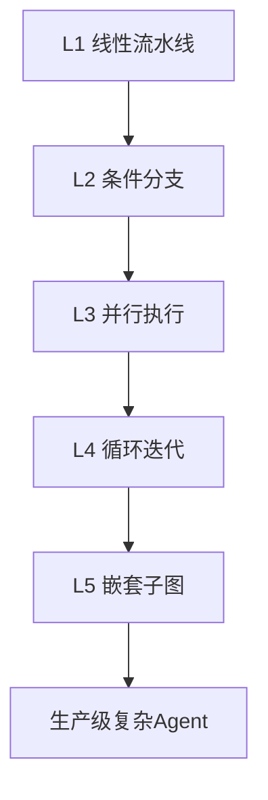
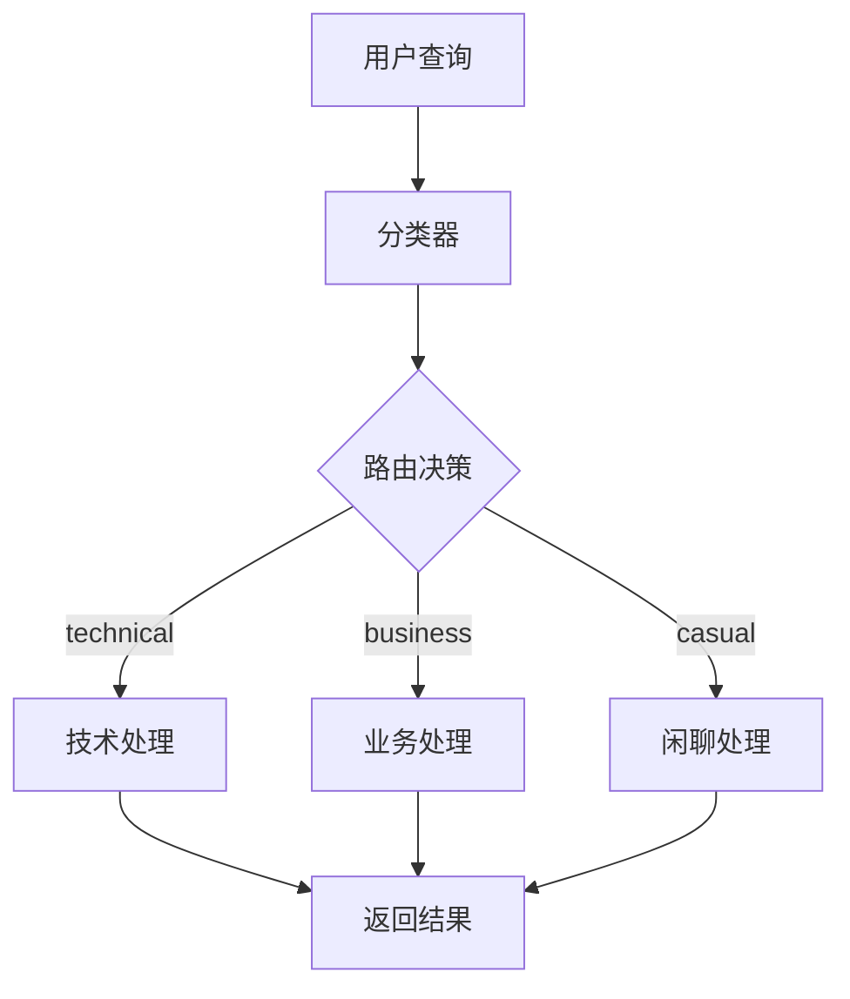
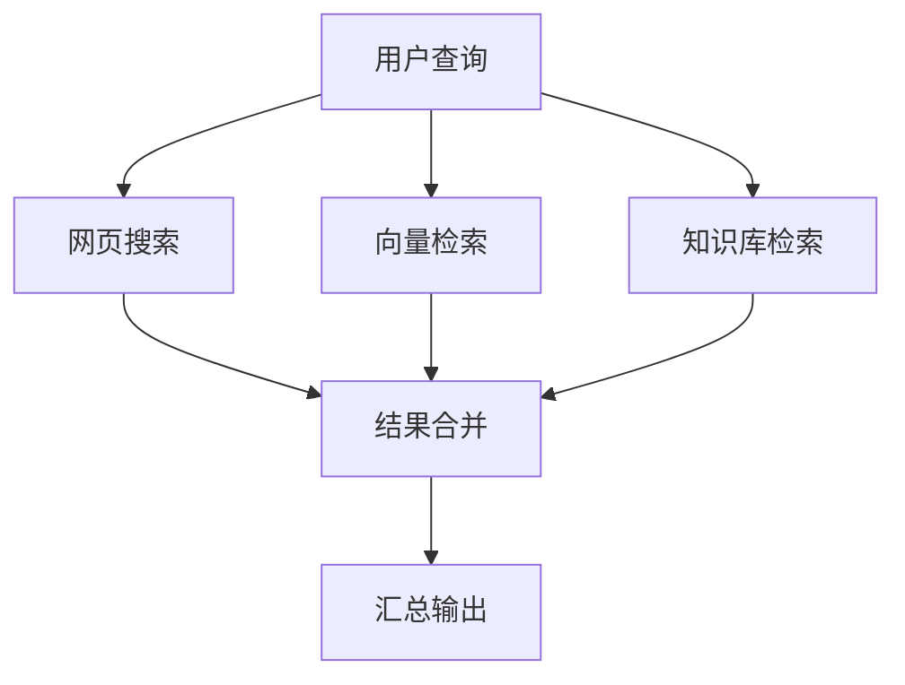
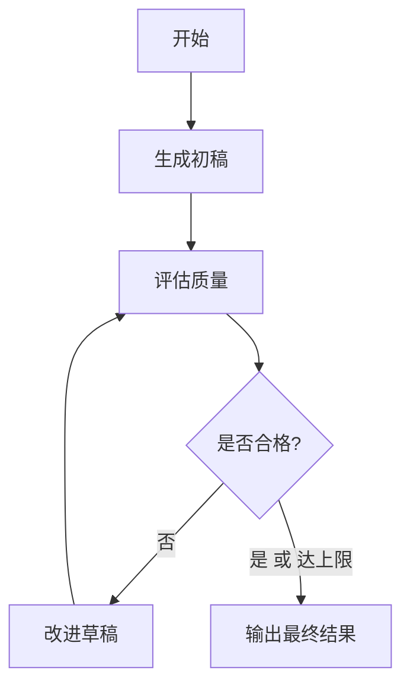
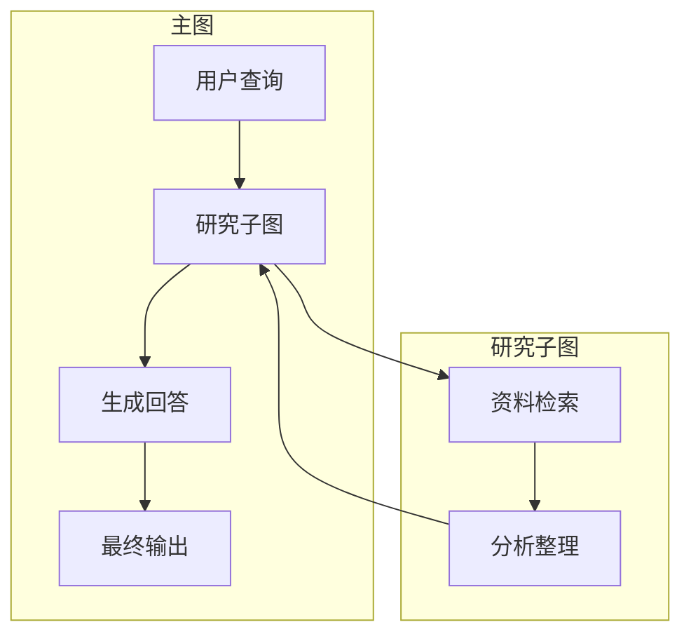

# KB110：LangGraph 高级编排模式与复杂状态机

> **知识库编号：KB110** | **阶段：22** | **创建：2026-08-28**
>
> 本文档系统阐述 LangGraph 的高级编排模式，包括复杂状态机设计、并行执行、动态路由、子图嵌套和循环控制。

---

## 1. LangGraph 编排模式概述

### 1.1 编排模式分类

LangGraph 提供多种编排模式，从简单到复杂分为五个层次：

| 层次 | 模式 | 典型场景 | 复杂度 |
|------|------|---------|--------|
| L1 | 线性流水线 | 顺序处理 | 低 |
| L2 | 条件分支 | 动态路由 | 中 |
| L3 | 并行执行 | 多路检索 | 中 |
| L4 | 循环迭代 | 自我修正 | 高 |
| L5 | 嵌套子图 | 复杂系统 | 高 |



### 1.2 核心概念

```python
from langgraph.graph import StateGraph, END, START
from typing import TypedDict, Annotated, List
from operator import add

# 状态定义：编排的核心数据结构
class AgentState(TypedDict):
    messages: Annotated[List[str], add]  # 消息列表（累加）
    current_node: str                    # 当前节点
    iterations: int                      # 迭代次数
    results: dict                        # 结果存储
    errors: Annotated[List[str], add]    # 错误收集
```

---

## 2. 条件分支与动态路由

### 2.1 基本条件路由

```python
from langgraph.graph import StateGraph, END, START
from typing import TypedDict, Annotated, List
from langchain_openai import ChatOpenAI
from langchain_core.messages import HumanMessage

class RouteState(TypedDict):
    query: str
    category: str
    response: str

llm = ChatOpenAI(model="gpt-4o-mini", temperature=0)

def classify_query(state: RouteState) -> RouteState:
    """分类用户查询"""
    prompt = f"""判断以下查询的类别，只输出一个词:
    - technical: 技术问题
    - business: 业务问题
    - casual: 闲聊
    
    查询: {state['query']}
    """
    category = llm.invoke([HumanMessage(content=prompt)]).content.strip().lower()
    return {"category": category}

def handle_technical(state: RouteState) -> RouteState:
    return {"response": f"技术回答: {state['query']}"}

def handle_business(state: RouteState) -> RouteState:
    return {"response": f"业务回答: {state['query']}"}

def handle_casual(state: RouteState) -> RouteState:
    return {"response": f"闲聊回答: {state['query']}"}

def route_function(state: RouteState) -> str:
    """路由函数: 根据类别决定下一个节点"""
    category = state.get("category", "casual")
    if category == "technical":
        return "technical_handler"
    elif category == "business":
        return "business_handler"
    else:
        return "casual_handler"

# 构建图
graph = StateGraph(RouteState)
graph.add_node("classifier", classify_query)
graph.add_node("technical_handler", handle_technical)
graph.add_node("business_handler", handle_business)
graph.add_node("casual_handler", handle_casual)

graph.add_edge(START, "classifier")
graph.add_conditional_edges(
    "classifier",
    route_function,
    {
        "technical_handler": "technical_handler",
        "business_handler": "business_handler",
        "casual_handler": "casual_handler",
    }
)
graph.add_edge("technical_handler", END)
graph.add_edge("business_handler", END)
graph.add_edge("casual_handler", END)

app = graph.compile()
```

### 2.2 路由决策图



### 2.3 多级路由

```python
class MultiRouteState(TypedDict):
    query: str
    primary_category: str
    secondary_category: str
    response: str

def primary_classify(state: MultiRouteState) -> MultiRouteState:
    """一级分类: 技术 vs 非技术"""
    prompt = f"查询 '{state['query']}' 属于 technical 还是 general? 只输出一个词。"
    result = llm.invoke([HumanMessage(content=prompt)]).content.strip().lower()
    return {"primary_category": result}

def secondary_classify(state: MultiRouteState) -> MultiRouteState:
    """二级分类: 进一步细分"""
    if state["primary_category"] == "technical":
        prompt = f"查询 '{state['query']}' 属于 frontend 还是 backend? 只输出一个词。"
    else:
        prompt = f"查询 '{state['query']}' 属于 business 还是 casual? 只输出一个词。"
    result = llm.invoke([HumanMessage(content=prompt)]).content.strip().lower()
    return {"secondary_category": result}

def route_primary(state: MultiRouteState) -> str:
    if state["primary_category"] == "technical":
        return "tech_secondary"
    return "general_secondary"

def route_secondary(state: MultiRouteState) -> str:
    sc = state.get("secondary_category", "")
    if sc in ("frontend", "backend"):
        return f"{sc}_handler"
    elif sc in ("business", "casual"):
        return f"{sc}_handler"
    return "default_handler"
```

---

## 3. 并行执行模式

### 3.1 Fan-out / Fan-in 模式

```python
import asyncio
from typing import TypedDict, Annotated, List
from operator import add

class ParallelState(TypedDict):
    query: str
    search_results: Annotated[List[str], add]  # 并行结果累加
    summary: str

async def web_search(state: ParallelState) -> dict:
    """并行: 网页搜索"""
    await asyncio.sleep(0.5)  # 模拟搜索
    return {"search_results": [f"网页结果: {state['query']}"]}

async def vector_search(state: ParallelState) -> dict:
    """并行: 向量检索"""
    await asyncio.sleep(0.3)
    return {"search_results": [f"向量结果: {state['query']}"]}

async def knowledge_search(state: ParallelState) -> dict:
    """并行: 知识库检索"""
    await asyncio.sleep(0.4)
    return {"search_results": [f"知识库结果: {state['query']}"]}

def merge_results(state: ParallelState) -> dict:
    """汇总合并"""
    all_results = state.get("search_results", [])
    summary = f"共找到 {len(all_results)} 条结果"
    return {"summary": summary}

# 构建并行图
graph = StateGraph(ParallelState)
graph.add_node("web_search", web_search)
graph.add_node("vector_search", vector_search)
graph.add_node("knowledge_search", knowledge_search)
graph.add_node("merge", merge_results)

# Fan-out: 从START分出到多个并行节点
graph.add_edge(START, "web_search")
graph.add_edge(START, "vector_search")
graph.add_edge(START, "knowledge_search")

# Fan-in: 多个节点汇聚到merge
graph.add_edge("web_search", "merge")
graph.add_edge("vector_search", "merge")
graph.add_edge("knowledge_search", "merge")
graph.add_edge("merge", END)

parallel_app = graph.compile()
```

### 3.2 并行执行架构



### 3.3 带超时的并行执行

```python
import asyncio
from typing import Optional

async def search_with_timeout(query: str, timeout: float = 5.0) -> Optional[str]:
    """带超时的搜索"""
    try:
        async def do_search():
            await asyncio.sleep(1)
            return f"结果: {query}"
        
        return await asyncio.wait_for(do_search(), timeout=timeout)
    except asyncio.TimeoutError:
        return f"超时: {query}"

async def parallel_search_with_timeout(state: ParallelState) -> dict:
    """并行搜索 + 超时控制"""
    tasks = [
        search_with_timeout(f"web_{state['query']}", 3.0),
        search_with_timeout(f"vector_{state['query']}", 5.0),
        search_with_timeout(f"kb_{state['query']}", 4.0),
    ]
    results = await asyncio.gather(*tasks, return_exceptions=True)
    
    valid_results = []
    for r in results:
        if isinstance(r, str):
            valid_results.append(r)
        elif isinstance(r, Exception):
            valid_results.append(f"错误: {type(r).__name__}")
    
    return {"search_results": valid_results}
```

---

## 4. 循环迭代模式

### 4.1 自我修正循环

```python
from typing import TypedDict, Annotated, List

class RefineState(TypedDict):
    query: str
    draft: str
    feedback: str
    iterations: int
    final_answer: str

MAX_ITERATIONS = 3
QUALITY_THRESHOLD = 0.85

def generate_draft(state: RefineState) -> dict:
    """生成初稿"""
    prompt = f"请回答以下问题: {state['query']}"
    draft = llm.invoke([HumanMessage(content=prompt)]).content
    return {"draft": draft, "iterations": 0}

def evaluate_draft(state: RefineState) -> dict:
    """评估草稿质量"""
    prompt = f"""评估以下回答的质量(0-1分)，只输出数字。
    问题: {state['query']}
    回答: {state['draft']}
    """
    score_text = llm.invoke([HumanMessage(content=prompt)]).content.strip()
    try:
        score = float(score_text)
    except:
        score = 0.5
    
    if score < QUALITY_THRESHOLD:
        feedback = "回答不够完整，需要补充更多细节"
    else:
        feedback = "质量合格"
    
    return {"feedback": feedback, "iterations": state.get("iterations", 0) + 1}

def refine_draft(state: RefineState) -> dict:
    """根据反馈改进"""
    prompt = f"""改进以下回答。
    问题: {state['query']}
    原回答: {state['draft']}
    反馈: {state['feedback']}
    请改进回答。"""
    improved = llm.invoke([HumanMessage(content=prompt)]).content
    return {"draft": improved}

def should_continue(state: RefineState) -> str:
    """决定是否继续迭代"""
    if state.get("feedback") == "质量合格":
        return "done"
    if state.get("iterations", 0) >= MAX_ITERATIONS:
        return "done"
    return "refine"

def finalize(state: RefineState) -> dict:
    return {"final_answer": state.get("draft", "")}

# 构建循环图
graph = StateGraph(RefineState)
graph.add_node("generate", generate_draft)
graph.add_node("evaluate", evaluate_draft)
graph.add_node("refine", refine_draft)
graph.add_node("finalize", finalize)

graph.add_edge(START, "generate")
graph.add_edge("generate", "evaluate")
graph.add_conditional_edges(
    "evaluate",
    should_continue,
    {"refine": "refine", "done": "finalize"}
)
graph.add_edge("refine", "evaluate")
graph.add_edge("finalize", END)

refine_app = graph.compile()
```

### 4.2 自我修正循环



---

## 5. 子图嵌套模式

### 5.1 子图定义与调用

```python
from langgraph.graph import StateGraph, END, START
from typing import TypedDict

# 子图状态
class ResearchState(TypedDict):
    topic: str
    findings: list
    report: str

def research_node(state: ResearchState) -> dict:
    """子图节点: 研究"""
    findings = [f"发现1: 关于{state['topic']}", f"发现2: 关于{state['topic']}"]
    return {"findings": findings}

def analyze_node(state: ResearchState) -> dict:
    """子图节点: 分析"""
    findings = state.get("findings", [])
    report = f"基于 {len(findings)} 条发现的分析报告"
    return {"report": report}

# 构建研究子图
research_graph = StateGraph(ResearchState)
research_graph.add_node("research", research_node)
research_graph.add_node("analyze", analyze_node)
research_graph.add_edge(START, "research")
research_graph.add_edge("research", "analyze")
research_graph.add_edge("analyze", END)
research_subgraph = research_graph.compile()

# 主图状态
class MainState(TypedDict):
    user_query: str
    research_report: str
    final_answer: str

def call_research(state: MainState) -> dict:
    """在主图中调用子图"""
    result = research_subgraph.invoke({"topic": state["user_query"]})
    return {"research_report": result["report"]}

def generate_answer(state: MainState) -> dict:
    """基于研究结果生成回答"""
    answer = f"基于研究: {state['research_report']}"
    return {"final_answer": answer}

# 主图
main_graph = StateGraph(MainState)
main_graph.add_node("research", call_research)
main_graph.add_node("answer", generate_answer)
main_graph.add_edge(START, "research")
main_graph.add_edge("research", "answer")
main_graph.add_edge("answer", END)
main_app = main_graph.compile()
```

### 5.2 嵌套子图架构



---

## 6. 动态图构建

### 6.1 运行时动态生成节点

```python
def build_dynamic_graph(config: dict):
    """根据配置动态构建图"""
    graph = StateGraph(AgentState)
    
    # 根据配置添加节点
    for node_name, node_func in config.get("nodes", {}).items():
        graph.add_node(node_name, node_func)
    
    # 根据配置添加边
    for edge in config.get("edges", []):
        graph.add_edge(edge["from"], edge["to"])
    
    # 设置入口
    entry = config.get("entry_point", "start")
    graph.add_edge(START, entry)
    
    return graph.compile()

# 使用示例
config = {
    "entry_point": "intake",
    "nodes": {
        "intake": intake_func,
        "process": process_func,
        "output": output_func,
    },
    "edges": [
        {"from": "intake", "to": "process"},
        {"from": "process", "to": "output"},
    ]
}
dynamic_app = build_dynamic_graph(config)
```

### 6.2 基于能力的动态路由

```python
class CapabilityRouter:
    """基于Agent能力动态路由"""
    
    def __init__(self):
        self.capabilities = {}
    
    def register(self, name: str, handler, condition):
        self.capabilities[name] = {
            "handler": handler,
            "condition": condition
        }
    
    def route(self, state) -> str:
        """根据条件选择最佳处理器"""
        for name, cap in self.capabilities.items():
            if cap["condition"](state):
                return name
        return "default"
    
    def build_graph(self):
        graph = StateGraph(AgentState)
        
        # 添加路由节点
        graph.add_node("router", lambda s: s)
        
        # 添加所有能力节点
        for name, cap in self.capabilities.items():
            graph.add_node(name, cap["handler"])
        
        # 添加条件边
        graph.add_edge(START, "router")
        
        route_map = {name: name for name in self.capabilities}
        route_map["default"] = "router"
        
        graph.add_conditional_edges("router", self.route, route_map)
        
        for name in self.capabilities:
            graph.add_edge(name, END)
        
        return graph.compile()
```

---

## 7. 状态持久化与检查点

### 7.1 检查点配置

```python
from langgraph.checkpoint.memory import MemorySaver
from langgraph.checkpoint.sqlite import SqliteSaver
import sqlite3

# 内存检查点（开发用）
memory_saver = MemorySaver()

# SQLite 检查点（持久化）
conn = sqlite3.connect(":memory:", check_same_thread=False)
sqlite_saver = SqliteSaver(conn)

# 编译时附加检查点
app_with_checkpoint = graph.compile(
    checkpointer=sqlite_saver,
    interrupt_before=["refine"]  # 在refine节点前暂停
)

# 使用thread_id管理会话
config = {"configurable": {"thread_id": "session-001"}}
result = app_with_checkpoint.invoke(
    {"query": "解释RAG"},
    config=config
)

# 恢复执行
result = app_with_checkpoint.invoke(None, config=config)
```

### 7.2 检查点流程


---

## 8. 编排模式选择指南

| 场景 | 推荐模式 | 关键组件 | 示例 |
|------|---------|---------|------|
| 顺序处理 | 线性流水线 | `add_edge` | ETL 流程 |
| 分类处理 | 条件分支 | `add_conditional_edges` | 客服路由 |
| 多源检索 | 并行执行 | Fan-out/Fan-in | 混合搜索 |
| 质量优化 | 循环迭代 | 条件边+计数器 | 自我修正 |
| 复杂系统 | 子图嵌套 | 子图compile | 多阶段研究 |
| 灵活扩展 | 动态图 | 运行时构建 | 插件化架构 |

---

## 9. 性能考量

### 9.1 并行度优化

```python
# 控制并行度
import asyncio

async def controlled_parallel(tasks, max_concurrency=5):
    """限制并发数的并行执行"""
    semaphore = asyncio.Semaphore(max_concurrency)
    
    async def limited_task(task):
        async with semaphore:
            return await task
    
    return await asyncio.gather(*[limited_task(t) for t in tasks])
```

### 9.2 状态大小控制

```python
# 大状态会导致检查点存储膨胀
# 建议: 状态中只保留必要字段
class LeanState(TypedDict):
    query: str           # 必需
    result: str          # 必需
    # 避免: 大量历史消息、大文档全文
    # 替代: 只存引用ID，需要时再加载
    doc_refs: List[str]  # 文档引用而非全文
```

---

## 10. 最佳实践

1. **状态最小化**：TypedDict 中只放必要字段，大对象用引用
2. **路由函数纯化**：路由函数不做副作用，只返回节点名
3. **并行粒度控制**：避免过多并行节点导致资源竞争
4. **循环上限设置**：所有循环必须有最大迭代次数
5. **检查点策略**：长流程用 SQLite/PostgreSQL 持久化
6. **错误传播**：子图错误向上传播时附加上下文
7. **子图解耦**：子图状态独立于主图，通过接口字段通信
8. **动态图缓存**：频繁构建的动态图应缓存编译结果
