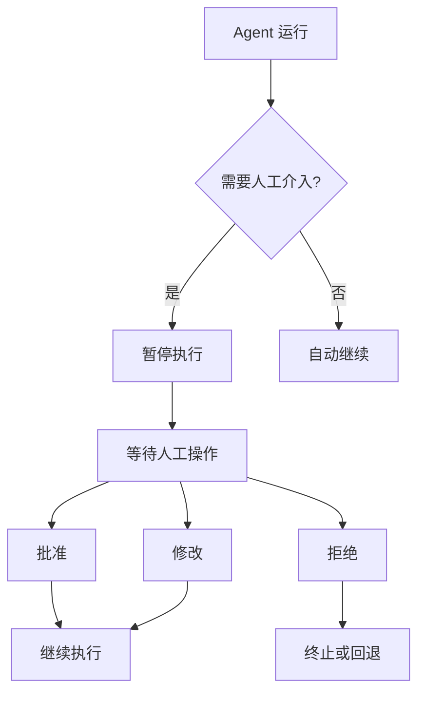
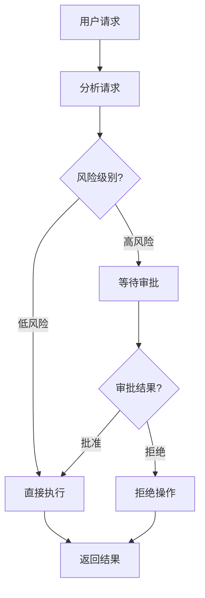
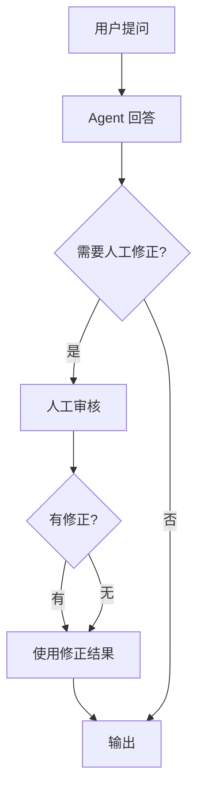
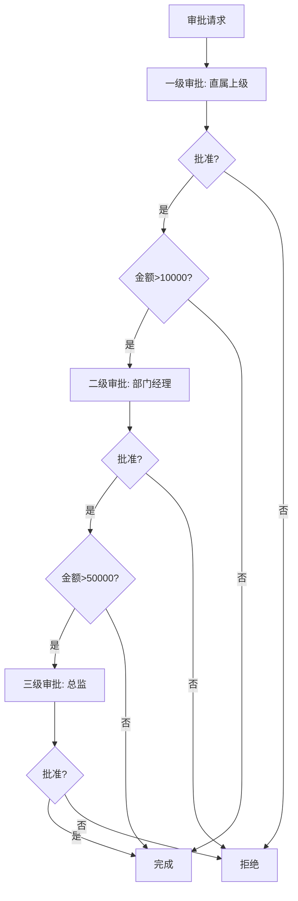
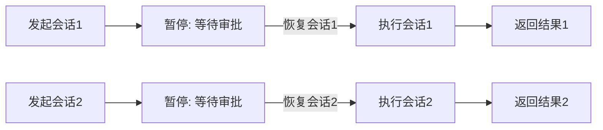

# KB111：Human-in-the-loop 人工介入与审批工作流

> **知识库编号：KB111** | **阶段：22** | **创建：2026-08-28**
>
> 本文档系统阐述 LangGraph 的 Human-in-the-loop (HITL) 机制，包括中断与恢复、审批工作流、人工修正与接管。

---

## 1. HITL 概述

### 1.1 为什么需要人工介入

LLM Agent 在以下场景需要人工介入：

| 场景 | 风险等级 | 介入方式 | 示例 |
|------|---------|---------|------|
| 高风险操作 | P0 | 执行前审批 | 删除数据、发送邮件 |
| 低置信度回答 | P1 | 人工修正 | 不确定的事实回答 |
| 敏感内容 | P0 | 人工审核 | 法律建议、医疗信息 |
| 复杂决策 | P1 | 人工选择 | 多方案抉择 |
| 首次执行 | P2 | 人工观察 | 新功能上线 |



### 1.2 LangGraph HITL 机制

LangGraph 提供三种中断方式：

```python
from langgraph.graph import StateGraph, END, START
from typing import TypedDict

class ReviewState(TypedDict):
    task: str
    agent_output: str
    human_feedback: str
    status: str
    final_result: str

# 方式1: interrupt_before - 在指定节点前暂停
app1 = graph.compile(
    interrupt_before=["execute_action"]
)

# 方式2: interrupt_after - 在指定节点后暂停
app2 = graph.compile(
    interrupt_after=["generate_proposal"]
)

# 方式3: 动态中断 - 在节点函数中返回Command
from langgraph.types import Command
from langgraph.errors import GraphInterrupt

def check_and_interrupt(state: ReviewState):
    """动态判断是否需要中断"""
    if is_high_risk(state["agent_output"]):
        raise GraphInterrupt(
            "需要人工审批: 检测到高风险操作"
        )
    return {"status": "approved"}
```

---

## 2. 审批工作流

### 2.1 基本审批流程

```python
from langgraph.graph import StateGraph, END, START
from langgraph.checkpoint.memory import MemorySaver
from typing import TypedDict

class ApprovalState(TypedDict):
    user_request: str
    proposed_action: str
    risk_level: str
    approval_status: str       # pending / approved / rejected
    reviewer_comment: str
    executed: bool
    result: str

def analyze_request(state: ApprovalState) -> dict:
    """分析请求并生成操作建议"""
    request = state["user_request"]
    
    # 模拟风险评估
    risk_keywords = ["删除", "发送", "执行", "修改", "更新"]
    risk = "high" if any(kw in request for kw in risk_keywords) else "low"
    
    action = f"拟执行操作: {request}"
    return {
        "proposed_action": action,
        "risk_level": risk,
        "approval_status": "pending"
    }

def route_by_risk(state: ApprovalState) -> str:
    """根据风险级别路由"""
    if state["risk_level"] == "high":
        return "wait_approval"
    return "execute"

def wait_for_approval(state: ApprovalState) -> dict:
    """等待人工审批 - 此节点会被中断"""
    # 当使用 interrupt_before 时, 此函数体不会立即执行
    # 人工审批后通过 update_state 注入审批结果
    return {"approval_status": "pending"}

def execute_action(state: ApprovalState) -> dict:
    """执行操作"""
    if state.get("approval_status") == "approved":
        result = f"已执行: {state['proposed_action']}"
        return {"executed": True, "result": result}
    return {"executed": False, "result": "未执行: 审批未通过"}

def reject_action(state: ApprovalState) -> dict:
    """拒绝操作"""
    return {"executed": False, "result": "操作被拒绝"}

# 构建审批图
graph = StateGraph(ApprovalState)
graph.add_node("analyze", analyze_request)
graph.add_node("wait_approval", wait_for_approval)
graph.add_node("execute", execute_action)
graph.add_node("reject", reject_action)

graph.add_edge(START, "analyze")
graph.add_conditional_edges(
    "analyze",
    route_by_risk,
    {"wait_approval": "wait_approval", "execute": "execute"}
)

# 审批后根据结果路由
graph.add_conditional_edges(
    "wait_approval",
    lambda s: "execute" if s.get("approval_status") == "approved" else "reject",
    {"execute": "execute", "reject": "reject"}
)

graph.add_edge("execute", END)
graph.add_edge("reject", END)

# 编译时在 wait_approval 前中断
checkpointer = MemorySaver()
approval_app = graph.compile(
    checkpointer=checkpointer,
    interrupt_before=["wait_approval"]
)
```

### 2.2 审批流程图



### 2.3 执行审批交互

```python
# 模拟审批交互流程

# 步骤1: 发起请求
config = {"configurable": {"thread_id": "approval-001"}}

# Agent 分析请求（到 wait_approval 前暂停）
result = approval_app.invoke(
    {"user_request": "删除用户ID为1001的账户数据"},
    config=config
)

print(f"风险级别: {result['risk_level']}")
print(f"拟执行操作: {result['proposed_action']}")
print(f"审批状态: {result['approval_status']}")
# 输出: 风险级别: high, 审批状态: pending

# 步骤2: 人工审批（注入审批结果）
approval_app.update_state(
    config,
    {
        "approval_status": "approved",
        "reviewer_comment": "已确认用户已注销，同意删除"
    },
    as_node="wait_approval"
)

# 步骤3: 继续执行
result = approval_app.invoke(None, config=config)
print(f"执行结果: {result['result']}")
# 输出: 执行结果: 已执行: 拟执行操作: 删除用户ID为1001的账户数据
```

---

## 3. 人工修正与接管

### 3.1 人工修正模式

```python
class CorrectionState(TypedDict):
    query: str
    agent_answer: str
    human_correction: str
    final_answer: str
    correction_count: int

def agent_respond(state: CorrectionState) -> dict:
    """Agent 生成回答"""
    answer = llm.invoke([
        HumanMessage(content=state["query"])
    ]).content
    return {"agent_answer": answer, "correction_count": 0}

def needs_correction(state: CorrectionState) -> str:
    """判断是否需要人工修正"""
    # 默认需要人工审核（可配置）
    if state.get("correction_count", 0) >= 2:
        return "finalize"
    return "human_review"

def human_review(state: CorrectionState) -> dict:
    """人工审核节点（此处会被中断）"""
    # 中断后人工注入修正
    correction = state.get("human_correction", "")
    if correction:
        return {"final_answer": correction}
    return {"final_answer": state["agent_answer"]}

def finalize(state: CorrectionState) -> dict:
    return {"final_answer": state.get("final_answer", "")}

# 构建
graph = StateGraph(CorrectionState)
graph.add_node("respond", agent_respond)
graph.add_node("review", human_review)
graph.add_node("finalize", finalize)

graph.add_edge(START, "respond")
graph.add_conditional_edges(
    "respond",
    needs_correction,
    {"human_review": "review", "finalize": "finalize"}
)
graph.add_conditional_edges(
    "review",
    lambda s: "finalize" if s.get("human_correction") else "respond",
    {"finalize": "finalize", "respond": "respond"}
)
graph.add_edge("finalize", END)

correction_app = graph.compile(
    checkpointer=MemorySaver(),
    interrupt_before=["review"]
)
```

### 3.2 人工修正流程



---

## 4. 多级审批工作流

### 4.1 串行多级审批

```python
class MultiApprovalState(TypedDict):
    request: str
    amount: float
    level1_status: str    # 直属上级
    level2_status: str    # 部门经理
    level3_status: str    # 总监
    final_status: str
    result: str

def level1_review(state: MultiApprovalState) -> dict:
    """一级审批: 直属上级"""
    return {"level1_status": "pending"}

def level2_review(state: MultiApprovalState) -> dict:
    """二级审批: 部门经理"""
    return {"level2_status": "pending"}

def level3_review(state: MultiApprovalState) -> dict:
    """三级审批: 总监"""
    return {"level3_status": "pending"}

def check_level1(state: MultiApprovalState) -> str:
    if state.get("level1_status") == "approved":
        if state.get("amount", 0) > 10000:
            return "level2_review"
        return "finalize"
    return "rejected"

def check_level2(state: MultiApprovalState) -> str:
    if state.get("level2_status") == "approved":
        if state.get("amount", 0) > 50000:
            return "level3_review"
        return "finalize"
    return "rejected"

def finalize(state: MultiApprovalState) -> dict:
    return {"final_status": "approved", "result": "审批通过"}

def reject(state: MultiApprovalState) -> dict:
    return {"final_status": "rejected", "result": "审批未通过"}

graph = StateGraph(MultiApprovalState)
graph.add_node("level1_review", level1_review)
graph.add_node("level2_review", level2_review)
graph.add_node("level3_review", level3_review)
graph.add_node("finalize", finalize)
graph.add_node("rejected", reject)

graph.add_edge(START, "level1_review")
graph.add_conditional_edges("level1_review", check_level1,
    {"level2_review": "level2_review", "finalize": "finalize", "rejected": "rejected"})
graph.add_conditional_edges("level2_review", check_level2,
    {"level3_review": "level3_review", "finalize": "finalize", "rejected": "rejected"})
graph.add_conditional_edges("level3_review",
    lambda s: "finalize" if s.get("level3_status") == "approved" else "rejected",
    {"finalize": "finalize", "rejected": "rejected"})
graph.add_edge("finalize", END)
graph.add_edge("rejected", END)

multi_approval_app = graph.compile(
    checkpointer=MemorySaver(),
    interrupt_before=["level1_review", "level2_review", "level3_review"]
)
```

### 4.2 多级审批流程



---

## 5. 动态中断与条件中断

### 5.1 基于内容的条件中断

```python
from langgraph.errors import GraphInterrupt

def safe_execute(state) -> dict:
    """带条件中断的执行节点"""
    action = state.get("proposed_action", "")
    
    # 检查是否包含高危关键词
    high_risk_patterns = ["DROP TABLE", "DELETE FROM", "rm -rf", "format"]
    if any(pattern.lower() in action.lower() for pattern in high_risk_patterns):
        raise GraphInterrupt({
            "reason": "检测到高危操作",
            "action": action,
            "required_approval": "admin"
        })
    
    # 检查影响范围
    if state.get("affected_records", 0) > 1000:
        raise GraphInterrupt({
            "reason": "影响范围过大",
            "affected_records": state["affected_records"],
            "required_approval": "manager"
        })
    
    return {"status": "executed", "result": "操作成功"}
```

### 5.2 超时自动处理

```python
import time
from datetime import datetime, timedelta

class TimeoutState(TypedDict):
    task: str
    submitted_at: str
    approval_timeout_seconds: int
    approval_status: str
    result: str

def check_timeout(state: TimeoutState) -> str:
    """检查审批是否超时"""
    submitted = datetime.fromisoformat(state["submitted_at"])
    timeout = timedelta(seconds=state.get("approval_timeout_seconds", 3600))
    
    if datetime.now() - submitted > timeout:
        if state.get("approval_status") == "pending":
            return "auto_reject"
    return "wait"
```

---

## 6. 状态恢复与会话管理

### 6.1 会话状态恢复

```python
# 使用 thread_id 管理多个审批会话
checkpointer = MemorySaver()
app = graph.compile(checkpointer=checkpointer, interrupt_before=["approval"])

# 会话1: 用户A的审批
config_a = {"configurable": {"thread_id": "user-a-001"}}
app.invoke({"request": "用户A申请报销5000元"}, config=config_a)

# 会话2: 用户B的审批
config_b = {"configurable": {"thread_id": "user-b-001"}}
app.invoke({"request": "用户B申请采购设备"}, config=config_b)

# 恢复会话1并审批
app.update_state(config_a, {"approval_status": "approved"}, as_node="approval")
result_a = app.invoke(None, config=config_a)

# 恢复会话2并拒绝
app.update_state(config_b, {"approval_status": "rejected"}, as_node="approval")
result_b = app.invoke(None, config=config_b)
```

### 6.2 状态恢复流程



---

## 7. 通知与提醒

### 7.1 审批通知集成

```python
import json

class NotificationManager:
    """审批通知管理"""
    
    def __init__(self):
        self.channels = {
            "email": self.send_email,
            "im": self.send_im,
            "webhook": self.send_webhook
        }
    
    def notify(self, recipient, title, content, channels=["im"]):
        """发送通知"""
        for ch in channels:
            if ch in self.channels:
                self.channels[ch](recipient, title, content)
    
    def send_email(self, to, title, content):
        print(f"[邮件] -> {to}: {title}")
    
    def send_im(self, to, title, content):
        print(f"[IM] -> {to}: {title}")
    
    def send_webhook(self, url, title, content):
        print(f"[Webhook] -> {url}: {title}")

notifier = NotificationManager()

def notify_approval_needed(state):
    """在审批节点前发送通知"""
    notifier.notify(
        recipient="manager@company.com",
        title=f"待审批: {state.get('user_request', '')}",
        content=f"风险级别: {state.get('risk_level', 'unknown')}",
        channels=["email", "im"]
    )
    return state
```

---

## 8. HITL 模式总结

| 模式 | 中断方式 | 适用场景 | 恢复方式 |
|------|---------|---------|---------|
| 执行前审批 | interrupt_before | 高风险操作 | update_state + invoke |
| 生成后审核 | interrupt_after | 质量把关 | update_state + invoke |
| 条件中断 | GraphInterrupt | 动态判断 | 异常处理后 invoke |
| 多级审批 | 多个interrupt | 分级权限 | 逐级 update_state |
| 人工修正 | interrupt+循环 | 回答纠错 | 注入修正后 invoke |
| 超时处理 | 定时检查 | 紧急响应 | 超时自动处理 |

---

## 9. 最佳实践

1. **最小化中断点**：只在必要的节点中断，减少人工等待
2. **审批超时设置**：所有审批必须有超时机制，避免无限等待
3. **审批上下文完整**：中断时提供足够信息供人工决策
4. **多级审批分层**：按金额/风险分层，小额自动通过
5. **审计日志记录**：记录所有审批操作、修改和决策
6. **回退机制**：拒绝后提供回退到上一步的选项
7. **通知集成**：中断时自动通知相关审批人
8. **状态隔离**：不同审批会话用不同 thread_id 隔离
