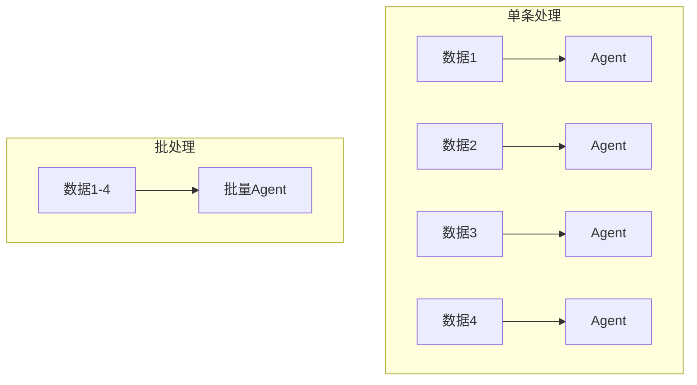
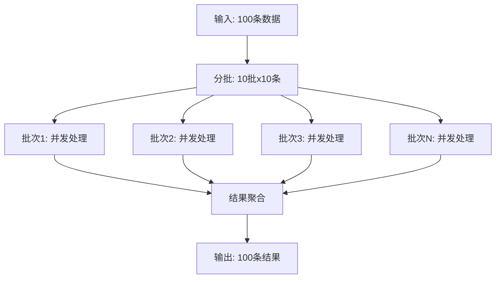
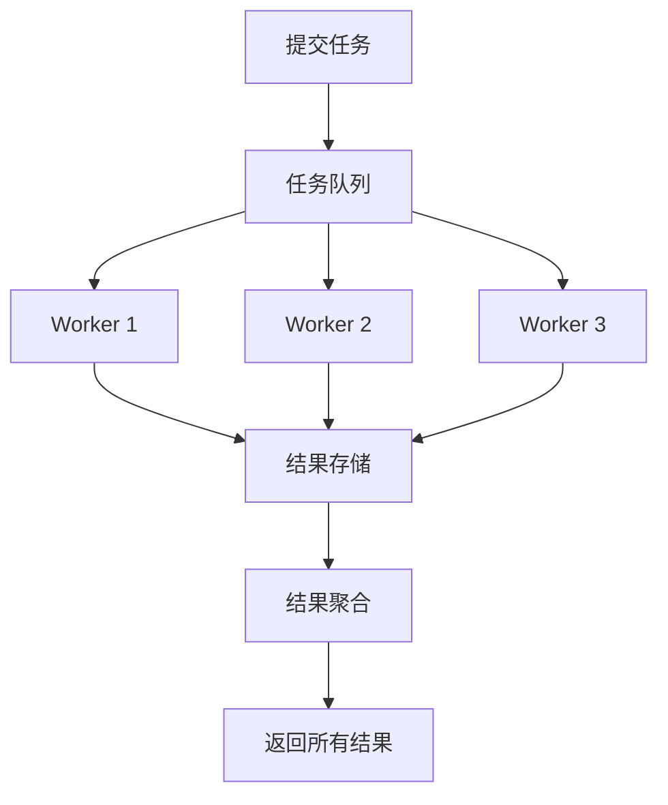
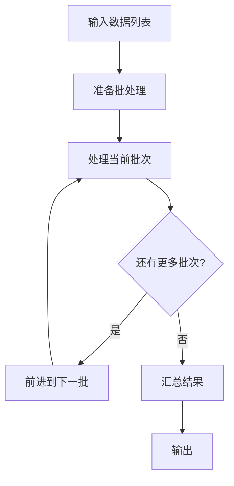
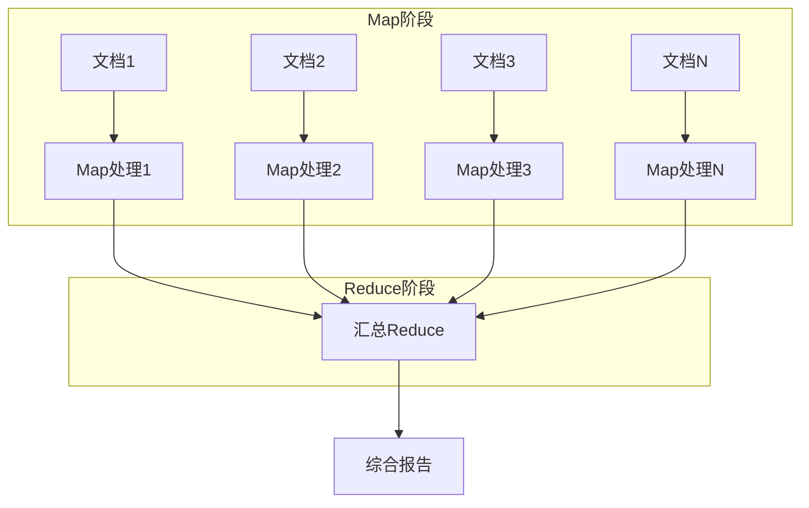
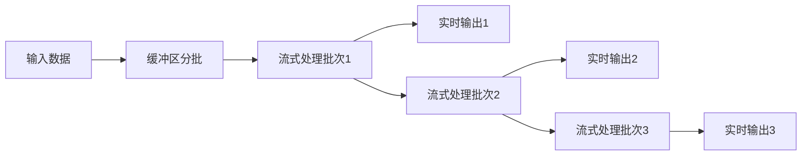
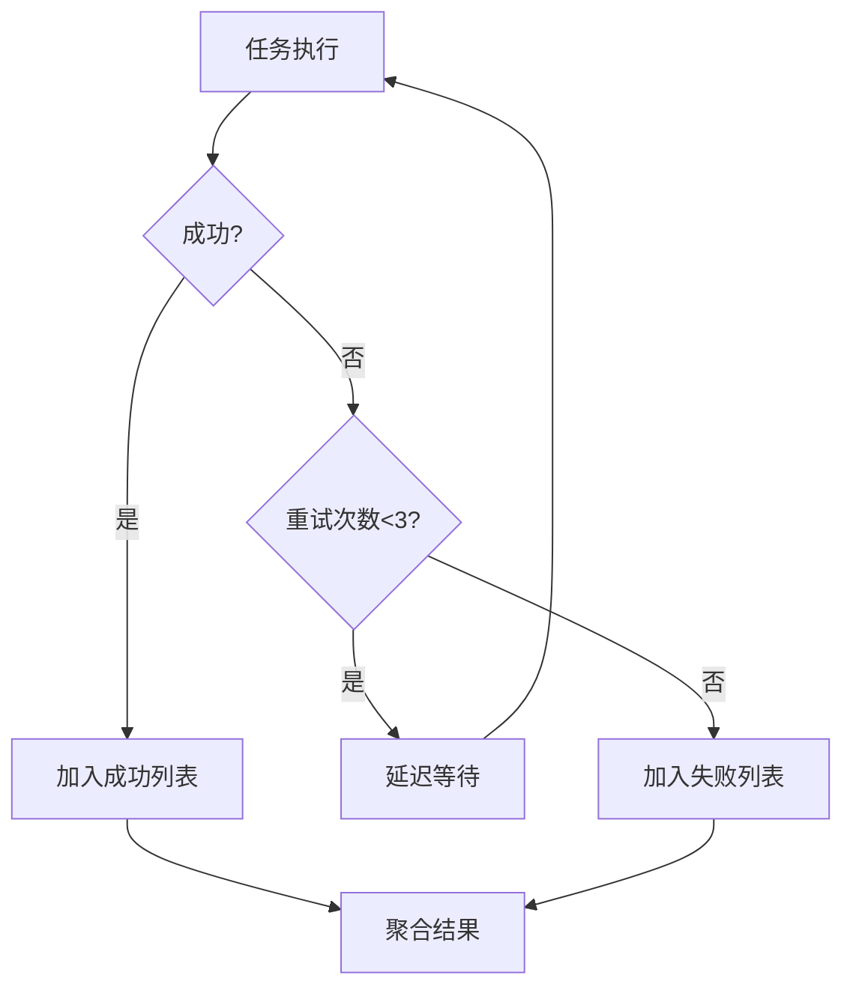
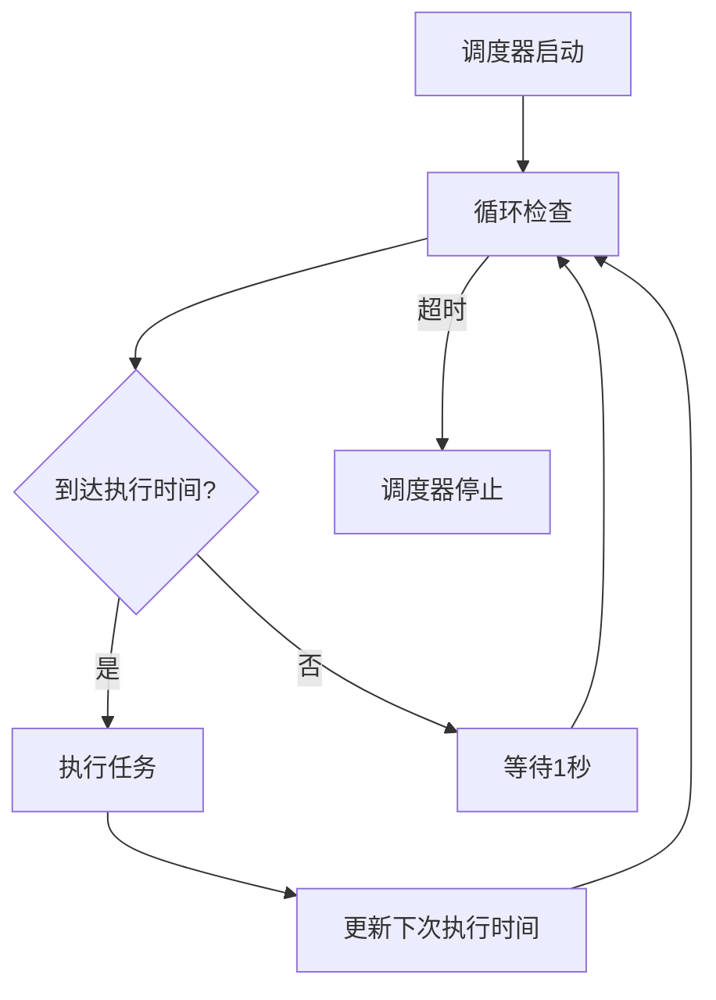
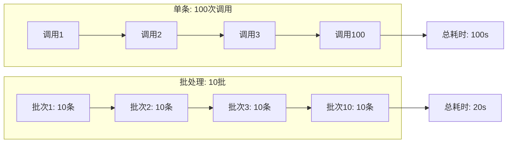

# KB112：Agent 批处理与异步任务编排

> **知识库编号：KB112** | **阶段：22** | **创建：2026-08-28**
>
> 本文档阐述 LangGraph 的批处理与异步任务编排模式，包括批量推理、异步队列、任务调度和结果聚合。

---

## 1. 批处理概述

### 1.1 为什么需要批处理

| 场景 | 单条处理 | 批处理 | 收益 |
|------|---------|--------|------|
| 文档摘要 | 每篇单独调用 | 10篇一批 | 延迟降60%, 成本降40% |
| 数据标注 | 逐条标注 | 批量标注 | 吞吐量提升5倍 |
| 向量索引 | 逐条嵌入 | 批量嵌入 | API调用减少80% |
| 质量评估 | 逐题评估 | 批量评估 | 总时间线性下降 |



### 1.2 批处理核心概念

```python
from typing import TypedDict, List, Annotated
from operator import add

class BatchState(TypedDict):
    tasks: List[dict]              # 待处理任务列表
    results: Annotated[List[dict], add]  # 结果累加
    batch_size: int                # 每批大小
    completed: int                 # 已完成数
    failed: int                    # 失败数
    total: int                     # 总数

def create_batch_tasks(items: List[dict], batch_size: int = 10) -> List[List[dict]]:
    """将任务列表分批"""
    batches = []
    for i in range(0, len(items), batch_size):
        batches.append(items[i:i + batch_size])
    return batches
```

---

## 2. 批量推理

### 2.1 基本批量调用

```python
from langchain_openai import ChatOpenAI
from langchain_core.messages import HumanMessage
import asyncio

llm = ChatOpenAI(model="gpt-4o-mini", temperature=0, max_tokens=200)

async def batch_generate(prompts: List[str], concurrency: int = 5) -> List[str]:
    """并发批量生成"""
    semaphore = asyncio.Semaphore(concurrency)
    
    async def process_one(prompt: str) -> str:
        async with semaphore:
            try:
                resp = await llm.ainvoke([HumanMessage(content=prompt)])
                return resp.content
            except Exception as e:
                return f"ERROR: {type(e).__name__}: {e}"
    
    tasks = [process_one(p) for p in prompts]
    return await asyncio.gather(*tasks)

# 使用
prompts = [
    "用一句话解释RAG",
    "用一句话解释Agent",
    "用一句话解释LangChain",
    "用一句话解释向量数据库",
    "用一句话解释MCP",
]

results = asyncio.run(batch_generate(prompts, concurrency=3))
for p, r in zip(prompts, results):
    print(f"Q: {p}")
    print(f"A: {r}\n")
```

### 2.2 批量推理流程



### 2.3 批量嵌入

```python
from langchain_openai import OpenAIEmbeddings
import asyncio

embeddings = OpenAIEmbeddings()

async def batch_embed(texts: List[str], batch_size: int = 100) -> List[List[float]]:
    """批量生成向量嵌入"""
    all_vectors = []
    
    for i in range(0, len(texts), batch_size):
        batch = texts[i:i + batch_size]
        try:
            vectors = await embeddings.aembed_documents(batch)
            all_vectors.extend(vectors)
        except Exception as e:
            print(f"批次 {i//batch_size} 失败: {e}")
            # 降级: 逐条嵌入
            for text in batch:
                try:
                    vec = await embeddings.aembed_query(text)
                    all_vectors.append(vec)
                except:
                    all_vectors.append([0.0] * 1536)  # 零向量占位
    
    return all_vectors
```

---

## 3. 异步任务队列

### 3.1 任务队列架构

```python
import asyncio
from typing import Callable, Any
from collections import deque
import time

class AsyncTaskQueue:
    """异步任务队列"""
    
    def __init__(self, max_concurrency: int = 5):
        self.queue = deque()
        self.max_concurrency = max_concurrency
        self.results = {}
        self.status = {}  # task_id -> status
        self.semaphore = asyncio.Semaphore(max_concurrency)
    
    def submit(self, task_id: str, func: Callable, *args, **kwargs) -> str:
        """提交任务"""
        self.queue.append({
            "task_id": task_id,
            "func": func,
            "args": args,
            "kwargs": kwargs,
            "submitted_at": time.time()
        })
        self.status[task_id] = "queued"
        return task_id
    
    async def process(self):
        """处理队列中的所有任务"""
        tasks = []
        while self.queue:
            item = self.queue.popleft()
            task = self._process_one(item)
            tasks.append(task)
        
        await asyncio.gather(*tasks)
    
    async def _process_one(self, item: dict):
        """处理单个任务"""
        async with self.semaphore:
            task_id = item["task_id"]
            self.status[task_id] = "running"
            
            try:
                result = await item["func"](*item["args"], **item["kwargs"])
                self.results[task_id] = result
                self.status[task_id] = "completed"
            except Exception as e:
                self.results[task_id] = f"ERROR: {e}"
                self.status[task_id] = "failed"
    
    def get_result(self, task_id: str) -> Any:
        """获取任务结果"""
        return self.results.get(task_id)
    
    def get_status(self, task_id: str) -> str:
        """获取任务状态"""
        return self.status.get(task_id, "unknown")

# 使用
async def example_usage():
    queue = AsyncTaskQueue(max_concurrency=3)
    
    async def slow_task(n):
        await asyncio.sleep(1)
        return f"结果{n}"
    
    for i in range(10):
        queue.submit(f"task-{i}", slow_task, i)
    
    await queue.process()
    
    for i in range(10):
        print(f"task-{i}: {queue.get_status(f'task-{i}')} -> {queue.get_result(f'task-{i}')}")

asyncio.run(example_usage())
```

### 3.2 任务队列流程



---

## 4. LangGraph 批处理编排

### 4.1 批处理状态图

```python
from langgraph.graph import StateGraph, END, START
from typing import TypedDict, List, Annotated
from operator import add

class BatchProcessState(TypedDict):
    input_items: List[dict]
    batch_size: int
    current_batch_idx: int
    processed_results: Annotated[List[dict], add]
    failed_items: Annotated[List[dict], add]
    total_processed: int
    total_failed: int

BATCH_SIZE = 5

def prepare_batches(state: BatchProcessState) -> dict:
    """准备批处理"""
    return {
        "current_batch_idx": 0,
        "batch_size": state.get("batch_size", BATCH_SIZE),
        "processed_results": [],
        "failed_items": [],
        "total_processed": 0,
        "total_failed": 0
    }

def process_batch(state: BatchProcessState) -> dict:
    """处理当前批次"""
    items = state["input_items"]
    batch_size = state["batch_size"]
    idx = state["current_batch_idx"]
    
    batch = items[idx:idx + batch_size]
    
    results = []
    failed = []
    
    for item in batch:
        try:
            # 模拟处理
            result = {"id": item.get("id"), "status": "success", "data": f"processed_{item.get('id')}"}
            results.append(result)
        except Exception as e:
            failed.append({"id": item.get("id"), "error": str(e)})
    
    return {
        "processed_results": results,
        "failed_items": failed,
        "total_processed": state["total_processed"] + len(results),
        "total_failed": state["total_failed"] + len(failed),
    }

def advance_batch(state: BatchProcessState) -> dict:
    """前进到下一批"""
    return {"current_batch_idx": state["current_batch_idx"] + state["batch_size"]}

def should_continue(state: BatchProcessState) -> str:
    """判断是否还有批次"""
    if state["current_batch_idx"] < len(state["input_items"]):
        return "process"
    return "summarize"

def summarize(state: BatchProcessState) -> dict:
    """汇总结果"""
    return {
        "total_processed": state["total_processed"],
        "total_failed": state["total_failed"]
    }

# 构建批处理图
graph = StateGraph(BatchProcessState)
graph.add_node("prepare", prepare_batches)
graph.add_node("process", process_batch)
graph.add_node("advance", advance_batch)
graph.add_node("summarize", summarize)

graph.add_edge(START, "prepare")
graph.add_edge("prepare", "process")
graph.add_conditional_edges(
    "process",
    should_continue,
    {"process": "advance", "summarize": "summarize"}
)
graph.add_edge("advance", "process")
graph.add_edge("summarize", END)

batch_app = graph.compile()
```

### 4.2 批处理流程图



---

## 5. MapReduce 模式

### 5.1 分布式 MapReduce

```python
from typing import TypedDict, List, Annotated
from operator import add

class MapReduceState(TypedDict):
    documents: List[str]          # 输入文档
    mapped_results: Annotated[List[dict], add]  # Map阶段结果
    reduced_result: str          # Reduce阶段结果

async def map_function(doc: str) -> dict:
    """Map: 提取每个文档的关键信息"""
    prompt = f"提取以下文档的3个关键点，用JSON输出: {doc[:500]}"
    resp = await llm.ainvoke([HumanMessage(content=prompt)])
    return {"doc": doc[:50], "key_points": resp.content}

async def map_stage(state: MapReduceState) -> dict:
    """Map阶段: 并行处理所有文档"""
    tasks = [map_function(doc) for doc in state["documents"]]
    results = await asyncio.gather(*tasks, return_exceptions=True)
    
    valid = [r for r in results if isinstance(r, dict)]
    return {"mapped_results": valid}

async def reduce_stage(state: MapReduceState) -> dict:
    """Reduce阶段: 汇总所有结果"""
    all_points = "\n".join(
        f"- {r['doc']}: {r['key_points']}" 
        for r in state["mapped_results"]
    )
    
    prompt = f"基于以下所有关键点，生成一份综合报告:\n{all_points}"
    result = await llm.ainvoke([HumanMessage(content=prompt)])
    
    return {"reduced_result": result.content}

# 构建 MapReduce 图
graph = StateGraph(MapReduceState)
graph.add_node("map", map_stage)
graph.add_node("reduce", reduce_stage)
graph.add_edge(START, "map")
graph.add_edge("map", "reduce")
graph.add_edge("reduce", END)

mapreduce_app = graph.compile()
```

### 5.2 MapReduce 流程



---

## 6. 异步流式处理

### 6.1 流式输出

```python
from langchain_openai import ChatOpenAI
from langchain_core.messages import HumanMessage

async def stream_batch_response(prompts: List[str]):
    """批量流式输出"""
    llm = ChatOpenAI(model="gpt-4o-mini", temperature=0)
    
    async def stream_one(prompt: str):
        full_response = ""
        async for chunk in llm.astream([HumanMessage(content=prompt)]):
            full_response += chunk.content
            yield chunk.content
        return full_response
    
    # 并发流式
    async for output in asyncio.as_completed([
        stream_one(p).__anext__() for p in prompts[:3]
    ]):
        yield await output
```

### 6.2 流式处理流程



---

## 7. 错误处理与重试

### 7.1 批处理错误处理

```python
import asyncio
from typing import List, Tuple

class BatchProcessor:
    """带错误处理的批处理器"""
    
    def __init__(self, max_retries=3, retry_delay=1.0):
        self.max_retries = max_retries
        self.retry_delay = retry_delay
    
    async def process_with_retry(self, func, item) -> Tuple[dict, str]:
        """带重试的处理"""
        for attempt in range(self.max_retries):
            try:
                result = await func(item)
                return result, "success"
            except Exception as e:
                if attempt < self.max_retries - 1:
                    await asyncio.sleep(self.retry_delay * (attempt + 1))
                else:
                    return {"item": item, "error": str(e)}, "failed"
    
    async def process_batch(self, items: List, func, concurrency=5) -> dict:
        """批量处理"""
        semaphore = asyncio.Semaphore(concurrency)
        
        async def process_one(item):
            async with semaphore:
                return await self.process_with_retry(func, item)
        
        results = await asyncio.gather(*[process_one(item) for item in items])
        
        successes = [r for r, s in results if s == "success"]
        failures = [r for r, s in results if s == "failed"]
        
        return {
            "total": len(items),
            "success": len(successes),
            "failed": len(failures),
            "results": successes,
            "failures": failures,
        }

# 使用
processor = BatchProcessor(max_retries=3)

async def process_document(doc):
    if "error" in doc.lower():
        raise ValueError("文档包含错误标记")
    return {"processed": doc, "summary": f"摘要: {doc[:20]}"}

docs = [f"文档{i}内容" for i in range(20)] + ["这个文档有error"]
result = asyncio.run(processor.process_batch(docs, process_document))
print(f"成功: {result['success']}, 失败: {result['failed']}")
```

### 7.2 错误处理流程



---

## 8. 任务调度

### 8.1 定时批处理

```python
import asyncio
from datetime import datetime, timedelta

class ScheduledBatchRunner:
    """定时批处理运行器"""
    
    def __init__(self):
        self.schedules = []
    
    def schedule(self, name: str, func, interval_seconds: int, batch_data=None):
        """添加定时任务"""
        self.schedules.append({
            "name": name,
            "func": func,
            "interval": interval_seconds,
            "batch_data": batch_data,
            "next_run": datetime.now() + timedelta(seconds=interval_seconds)
        })
    
    async def run(self, duration_seconds: int = 3600):
        """运行调度器"""
        end_time = datetime.now() + timedelta(seconds=duration_seconds)
        
        while datetime.now() < end_time:
            now = datetime.now()
            
            for schedule in self.schedules:
                if now >= schedule["next_run"]:
                    print(f"[{now.strftime('%H:%M:%S')}] 执行: {schedule['name']}")
                    
                    try:
                        result = await schedule["func"](schedule["batch_data"])
                        print(f"  完成: {result}")
                    except Exception as e:
                        print(f"  失败: {e}")
                    
                    schedule["next_run"] = now + timedelta(seconds=schedule["interval"])
            
            await asyncio.sleep(1)

# 使用示例
async def daily_summary(data):
    await asyncio.sleep(2)  # 模拟处理
    return f"处理了 {len(data) if data else 0} 条数据"

runner = ScheduledBatchRunner()
runner.schedule("每小时摘要", daily_summary, 3600, ["doc1", "doc2"])
runner.schedule("每分钟检查", daily_summary, 60, ["check1"])
# asyncio.run(runner.run(300))  # 运行5分钟
```

### 8.2 调度流程



---

## 9. 性能优化

### 9.1 批量大小优化

```python
import time
from typing import List

def find_optimal_batch_size(
    data: List,
    process_fn,
    batch_sizes: List[int] = [1, 5, 10, 20, 50, 100]
) -> dict:
    """寻找最优批次大小"""
    results = {}
    
    for bs in batch_sizes:
        start = time.time()
        
        for i in range(0, min(len(data), 100), bs):
            batch = data[i:i+bs]
            process_fn(batch)
        
        elapsed = time.time() - start
        throughput = len(data[:100]) / elapsed if elapsed > 0 else 0
        results[bs] = {"time": elapsed, "throughput": throughput}
    
    optimal = max(results, key=lambda k: results[k]["throughput"])
    return {"optimal_batch_size": optimal, "details": results}
```

### 9.2 批处理 vs 单条处理



---

## 10. 最佳实践

1. **批次大小选择**：根据API限制和延迟要求选择，通常5-20条/批
2. **并发控制**：使用信号量限制并发数，避免触发速率限制
3. **错误隔离**：单条失败不影响整批，记录失败项供重试
4. **进度追踪**：实时显示处理进度（已完成/总数）
5. **结果顺序**：批量结果保持与输入对应顺序
6. **超时设置**：每个批次设置超时，避免长时间阻塞
7. **降级策略**：批量失败时降级为逐条处理
8. **资源回收**：处理完成后释放连接和内存
