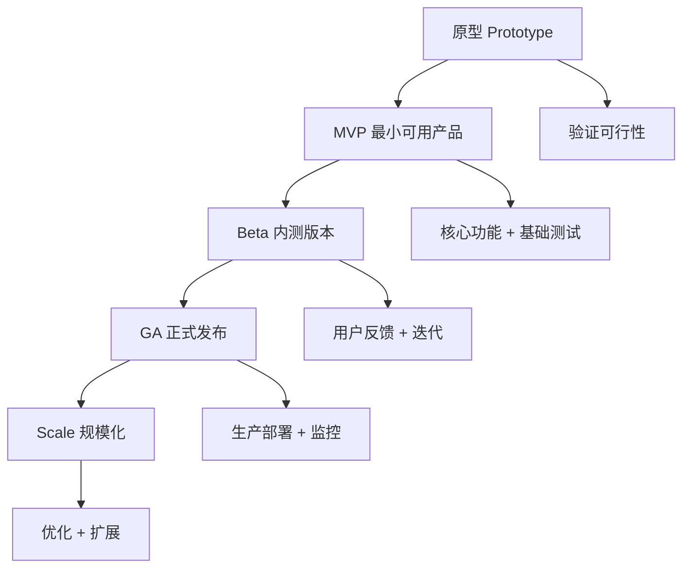
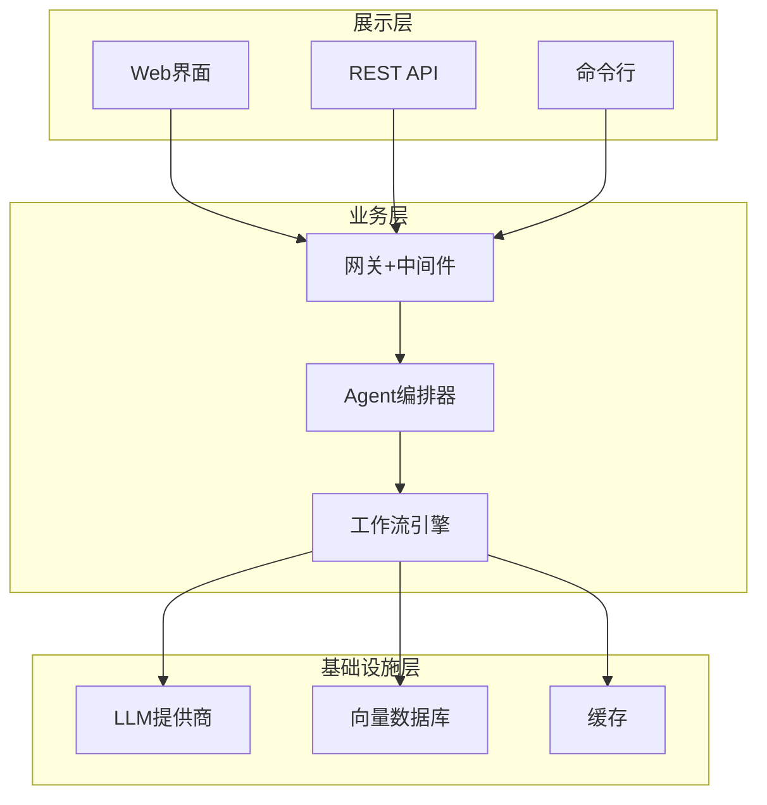
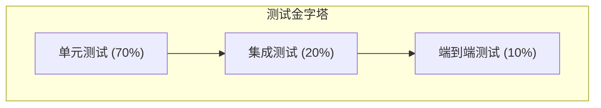
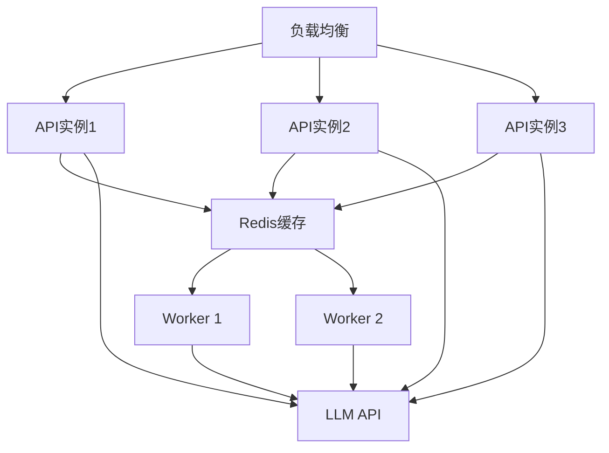
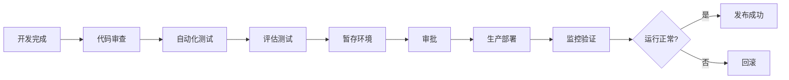
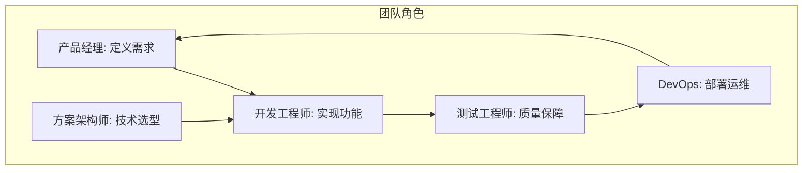
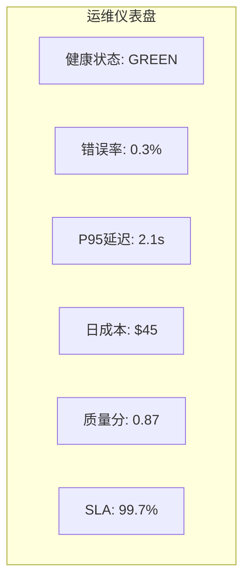

# KB113：Agent 产品化与工程化最佳实践

> **知识库编号：KB113** | **阶段：22** | **创建：2026-08-28**
>
> 本文档系统总结 Agent 从原型到产品化的工程化最佳实践，涵盖架构设计、开发规范、测试策略、部署运维和团队协作。

---

## 1. 产品化概述

### 1.1 从原型到产品的鸿沟

| 维度 | 原型阶段 | 产品阶段 | 差距 |
|------|---------|---------|------|
| 可靠性 | 偶尔出错 | 99.9%+可用 | 错误处理体系 |
| 性能 | 不关心延迟 | P95<3s | 缓存+并发优化 |
| 成本 | 不关心花费 | <预算控制 | Token监控+模型选型 |
| 安全 | 无防护 | 完整安全链路 | 输入过滤+输出审核 |
| 可观测 | 无日志 | 全链路追踪 | LangSmith+自定义监控 |
| 可维护 | 代码混乱 | 模块化+文档 | 架构规范+CI/CD |



### 1.2 产品化成熟度模型

```python
from enum import IntEnum

class MaturityLevel(IntEnum):
    """Agent 产品成熟度等级"""
    LEVEL_0_PROTOTYPE = 0     # 原型: 能跑就行
    LEVEL_1_MVP = 1           # MVP: 核心功能可用
    LEVEL_2_TESTED = 2        # 测试版: 有测试覆盖
    LEVEL_3_PRODUCTION = 3    # 生产版: 监控+告警
    LEVEL_4_OPTIMIZED = 4     # 优化版: 性能+成本调优
    LEVEL_5_SCALE = 5         # 规模化: 多团队协作

class MaturityAssessment:
    """成熟度评估"""
    
    CRITERIA = {
        "error_handling": {2: "基础try-catch", 3: "全面错误恢复", 4: "自愈机制"},
        "testing": {2: "单元测试", 3: "集成+回归测试", 4: "自动化CI/CD"},
        "monitoring": {3: "基础监控", 4: "全链路追踪", 5: "智能告警"},
        "documentation": {2: "API文档", 3: "架构文档", 4: "运维手册"},
        "security": {3: "输入验证", 4: "审计日志", 5: "安全扫描"},
        "scalability": {4: "水平扩展", 5: "自动伸缩"},
    }
    
    def assess(self, features: dict) -> int:
        """评估当前成熟度"""
        level = 0
        for category, implemented in features.items():
            thresholds = self.CRITERIA.get(category, {})
            for lvl in sorted(thresholds.keys(), reverse=True):
                if implemented and lvl <= level + 1:
                    level = max(level, lvl)
                    break
        return level
```

---

## 2. 架构设计原则

### 2.1 分层架构

```python
"""
Agent 产品化分层架构
"""
from typing import TypedDict, Any, Optional
from dataclasses import dataclass, field

# ===== 展示层 (Presentation Layer) =====
@dataclass
class UserRequest:
    """用户请求"""
    query: str
    user_id: str
    session_id: str
    metadata: dict = field(default_factory=dict)

@dataclass
class AgentResponse:
    """Agent响应"""
    answer: str
    confidence: float
    sources: list = field(default_factory=list)
    latency_ms: float = 0
    metadata: dict = field(default_factory=dict)

# ===== 业务层 (Business Layer) =====
class AgentOrchestrator:
    """Agent编排器"""
    
    def __init__(self, config: dict):
        self.config = config
        self.graph = self._build_graph()
    
    def _build_graph(self):
        """构建LangGraph工作流"""
        # 构建编排图
        from langgraph.graph import StateGraph, END, START
        
        class WorkflowState(TypedDict):
            query: str
            context: str
            answer: str
        
        graph = StateGraph(WorkflowState)
        graph.add_node("retrieve", self._retrieve)
        graph.add_node("generate", self._generate)
        graph.add_edge(START, "retrieve")
        graph.add_edge("retrieve", "generate")
        graph.add_edge("generate", END)
        return graph.compile()
    
    async def _retrieve(self, state: dict) -> dict:
        return {"context": "检索结果"}
    
    async def _generate(self, state: dict) -> dict:
        return {"answer": "生成回答"}
    
    async def execute(self, request: UserRequest) -> AgentResponse:
        import time
        start = time.time()
        
        result = await self.graph.ainvoke({"query": request.query})
        
        return AgentResponse(
            answer=result.get("answer", ""),
            confidence=0.9,
            latency_ms=(time.time() - start) * 1000
        )

# ===== 基础设施层 (Infrastructure Layer) =====
class LLMProvider:
    """LLM提供商抽象"""
    
    def __init__(self, provider="openai", model="gpt-4o-mini"):
        self.provider = provider
        self.model = model
    
    async def generate(self, prompt: str, **kwargs) -> str:
        """统一生成接口"""
        if self.provider == "openai":
            from langchain_openai import ChatOpenAI
            llm = ChatOpenAI(model=self.model, temperature=kwargs.get("temperature", 0))
            resp = await llm.ainvoke([HumanMessage(content=prompt)])
            return resp.content
        elif self.provider == "anthropic":
            from langchain_anthropic import ChatAnthropic
            llm = ChatAnthropic(model=self.model, temperature=kwargs.get("temperature", 0))
            resp = await llm.ainvoke([HumanMessage(content=prompt)])
            return resp.content
        else:
            raise ValueError(f"不支持的提供商: {self.provider}")

class VectorStoreProvider:
    """向量数据库抽象"""
    
    def __init__(self, backend="faiss"):
        self.backend = backend
    
    async def search(self, query: str, k: int = 5) -> list:
        """统一搜索接口"""
        # 实现略
        return [{"content": "doc1", "score": 0.9}]

# ===== 接入层 (Gateway) =====
class AgentGateway:
    """Agent网关: 统一入口"""
    
    def __init__(self, orchestrator: AgentOrchestrator):
        self.orchestrator = orchestrator
        self.middleware = []
    
    def use(self, middleware):
        """添加中间件"""
        self.middleware.append(middleware)
    
    async def handle(self, request: UserRequest) -> AgentResponse:
        """处理请求"""
        # 前置中间件
        for mw in self.middleware:
            request = await mw.before(request)
        
        # 执行
        response = await self.orchestrator.execute(request)
        
        # 后置中间件
        for mw in reversed(self.middleware):
            response = await mw.after(response)
        
        return response
```

### 2.2 分层架构图



---

## 3. 开发规范

### 3.1 代码组织

```
agent_project/
├── src/
│   ├── agents/              # Agent定义
│   │   ├── base_agent.py
│   │   ├── rag_agent.py
│   │   └── tool_agent.py
│   ├── graphs/              # LangGraph工作流
│   │   ├── rag_graph.py
│   │   └── approval_graph.py
│   ├── tools/               # 工具定义
│   │   ├── search_tool.py
│   │   └── calculator.py
│   ├── providers/           # 基础设施
│   │   ├── llm_provider.py
│   │   └── vector_store.py
│   ├── middleware/          # 中间件
│   │   ├── rate_limiter.py
│   │   ├── logger.py
│   │   └── auth.py
│   └── utils/               # 工具函数
│       ├── token_counter.py
│       └── retry.py
├── tests/
│   ├── unit/
│   ├── integration/
│   └── eval/                # 评估测试
├── config/
│   ├── default.yaml
│   └── production.yaml
└── scripts/
    ├── deploy.py
    └── evaluate.py
```

### 3.2 配置管理

```python
from pydantic import BaseModel
from typing import Optional
import yaml

class AgentConfig(BaseModel):
    """Agent配置模型"""
    
    # LLM配置
    llm_provider: str = "openai"
    llm_model: str = "gpt-4o-mini"
    llm_temperature: float = 0.0
    llm_max_tokens: int = 2000
    
    # 检索配置
    vector_store_backend: str = "faiss"
    retrieval_top_k: int = 5
    chunk_size: int = 512
    chunk_overlap: int = 50
    
    # 运行时配置
    max_iterations: int = 10
    timeout_seconds: int = 60
    max_concurrency: int = 5
    
    # 监控配置
    enable_tracing: bool = True
    log_level: str = "INFO"
    
    # 安全配置
    max_input_length: int = 10000
    enable_content_filter: bool = True

def load_config(env: str = "default") -> AgentConfig:
    """加载配置"""
    with open(f"config/{env}.yaml", "r") as f:
        config_data = yaml.safe_load(f)
    return AgentConfig(**config_data)
```

---

## 4. 测试策略

### 4.1 测试金字塔



### 4.2 单元测试

```python
import pytest
from unittest.mock import AsyncMock, patch

class TestRAGAgent:
    """RAG Agent单元测试"""
    
    @pytest.fixture
    def mock_llm(self):
        llm = AsyncMock()
        llm.ainvoke = AsyncMock(return_value=AsyncMock(content="测试回答"))
        return llm
    
    @pytest.fixture
    def mock_vectorstore(self):
        vs = AsyncMock()
        vs.asimilarity_search = AsyncMock(return_value=[
            AsyncMock(page_content="测试文档", metadata={"id": "1"})
        ])
        return vs
    
    @pytest.mark.asyncio
    async def test_retrieve(self, mock_vectorstore):
        """测试检索"""
        docs = await mock_vectorstore.asimilarity_search("测试查询", k=3)
        assert len(docs) == 1
        assert docs[0].page_content == "测试文档"
    
    @pytest.mark.asyncio
    async def test_generate(self, mock_llm):
        """测试生成"""
        from langchain_core.messages import HumanMessage
        resp = await mock_llm.ainvoke([HumanMessage(content="测试")])
        assert resp.content == "测试回答"
    
    @pytest.mark.asyncio
    async def test_full_rag_flow(self, mock_llm, mock_vectorstore):
        """测试完整RAG流程"""
        # 检索
        docs = await mock_vectorstore.asimilarity_search("测试", k=3)
        context = "\n".join(d.page_content for d in docs)
        
        # 生成
        prompt = f"基于以下内容回答: {context}\n问题: 测试"
        resp = await mock_llm.ainvoke([HumanMessage(content=prompt)])
        
        assert resp.content == "测试回答"
        assert "测试文档" in context
```

### 4.3 评估测试

```python
class TestAgentQuality:
    """Agent质量评估测试"""
    
    TEST_CASES = [
        {"q": "什么是RAG?", "expected_keywords": ["检索", "增强", "生成"]},
        {"q": "LangChain是什么?", "expected_keywords": ["框架", "LLM", "应用"]},
        {"q": "向量数据库的作用?", "expected_keywords": ["存储", "检索", "向量"]},
    ]
    
    def test_response_contains_keywords(self):
        """测试回答包含关键词"""
        for case in self.TEST_CASES:
            answer = self.agent.answer(case["q"])
            for kw in case["expected_keywords"]:
                assert kw.lower() in answer.lower(), f"回答缺少关键词: {kw}"
    
    def test_response_latency(self):
        """测试响应延迟"""
        for case in self.TEST_CASES:
            import time
            start = time.time()
            self.agent.answer(case["q"])
            elapsed = time.time() - start
            assert elapsed < 5.0, f"响应超时: {elapsed:.2f}s"
    
    def test_no_hallucination(self):
        """测试无幻觉"""
        # 对事实性问题验证回答准确性
        fact_cases = [
            {"q": "Python的创建者是谁?", "must_contain": "Guido"},
        ]
        for case in fact_cases:
            answer = self.agent.answer(case["q"])
            assert case["must_contain"].lower() in answer.lower()
```

---

## 5. 部署架构

### 5.1 容器化部署

```dockerfile
# Dockerfile
FROM python:3.11-slim

WORKDIR /app

# 安装依赖
COPY requirements.txt .
RUN pip install --no-cache-dir -r requirements.txt

# 复制代码
COPY src/ ./src/
COPY config/ ./config/

# 健康检查
HEALTHCHECK --interval=30s --timeout=10s --retries=3 \
    CMD python -c "import requests; requests.get('http://localhost:8000/health')"

EXPOSE 8000

CMD ["python", "-m", "src.server"]
```

```yaml
# docker-compose.yml
version: '3.8'
services:
  agent-api:
    build: .
    ports:
      - "8000:8000"
    environment:
      - OPENAI_API_KEY=${OPENAI_API_KEY}
      - LANGSMITH_API_KEY=${LANGSMITH_API_KEY}
      - REDIS_URL=redis://redis:6379
    depends_on:
      - redis
    restart: unless-stopped
    deploy:
      resources:
        limits:
          memory: 2G
          cpus: '2'
  
  redis:
    image: redis:7-alpine
    ports:
      - "6379:6379"
    restart: unless-stopped
  
  worker:
    build: .
    command: python -m src.worker
    environment:
      - OPENAI_API_KEY=${OPENAI_API_KEY}
      - REDIS_URL=redis://redis:6379
    depends_on:
      - redis
    restart: unless-stopped
```

### 5.2 部署架构图



---

## 6. 版本管理与发布

### 6.1 语义化版本

```python
from dataclasses import dataclass

@dataclass
class SemanticVersion:
    """语义化版本号"""
    major: int
    minor: int
    patch: int
    prerelease: str = ""
    
    def __str__(self):
        v = f"{self.major}.{self.minor}.{self.patch}"
        if self.prerelease:
            v += f"-{self.prerelease}"
        return v
    
    def bump_patch(self):
        return SemanticVersion(self.major, self.minor, self.patch + 1)
    
    def bump_minor(self):
        return SemanticVersion(self.major, self.minor + 1, 0)
    
    def bump_major(self):
        return SemanticVersion(self.major + 1, 0, 0)

# 版本策略:
# major: 破坏性变更(状态结构改、API不兼容)
# minor: 新功能(新增节点、新增工具)
# patch: 修复和优化
```

### 6.2 发布流程



---

## 7. 文档体系

### 7.1 文档分类

| 文档类型 | 受众 | 内容 | 更新频率 |
|---------|------|------|---------|
| API文档 | 开发者 | 接口定义、参数说明 | 每次发版 |
| 架构文档 | 架构师 | 系统设计、技术选型 | 重大变更 |
| 运维手册 | 运维人员 | 部署、配置、排障 | 季度 |
| 用户手册 | 最终用户 | 使用指南、FAQ | 版本发布 |
| 开发规范 | 团队 | 代码规范、提交流程 | 半年 |

### 7.2 README模板

```markdown
# Agent项目名称

## 简介
一句话描述项目用途。

## 快速开始
    pip install -r requirements.txt
    cp .env.example .env
    python -m src.server

## 架构
[架构图]

## 配置
| 参数 | 默认值 | 说明 |
|------|--------|------|

## API
### POST /api/agent
请求: {"query": "你的问题"}
响应: {"answer": "回答", "confidence": 0.9}

## 测试
    pytest tests/

## 部署
    docker-compose up -d

## 版本日志
- v1.2.0: 新增多模态支持
- v1.1.0: 新增Human-in-the-loop
- v1.0.0: 初始版本
```

---

## 8. 团队协作

### 8.1 角色分工



### 8.2 代码审查清单

```
## 代码审查清单

### 功能正确性
- [ ] 核心逻辑是否正确
- [ ] 边界条件是否处理
- [ ] 错误路径是否覆盖

### 代码质量
- [ ] 命名是否清晰
- [ ] 函数是否过长（>50行需拆分）
- [ ] 是否有重复代码
- [ ] 类型注解是否完整

### 性能
- [ ] 是否有N+1查询
- [ ] 是否有不必要的LLM调用
- [ ] 缓存是否合理使用

### 安全
- [ ] 用户输入是否验证
- [ ] 是否有敏感信息泄露
- [ ] 权限检查是否到位

### 可维护性
- [ ] 是否有注释说明复杂逻辑
- [ ] 是否更新了相关文档
- [ ] 是否有对应的测试用例
```

---

## 9. 监控与运维

### 9.1 运维检查清单

```python
class OpsChecklist:
    """运维检查清单"""
    
    DAILY_CHECKS = [
        "API健康状态 (200 OK)",
        "错误率是否正常 (<1%)",
        "P95延迟是否达标 (<5s)",
        "日成本是否在预算内",
        "LLM API配额是否充足",
        "磁盘空间是否充足 (>20%)",
    ]
    
    WEEKLY_CHECKS = [
        "评估测试通过率",
        "慢查询Top10分析",
        "用户反馈汇总",
        "依赖包安全更新",
        "备份是否成功",
    ]
    
    MONTHLY_CHECKS = [
        "成本趋势分析",
        "容量规划评估",
        "安全审计",
        "文档更新",
        "团队回顾会议",
    ]
```

### 9.2 运维仪表盘



---

## 10. 产品化最佳实践总结

### 10.1 核心原则

| 原则 | 描述 | 关键动作 |
|------|------|---------|
| 渐进式 | 小步快跑，持续交付 | MVP→迭代→扩展 |
| 可观测 | 全链路可追踪可监控 | 日志+追踪+指标 |
| 可测试 | 自动化测试覆盖 | 单元+集成+评估 |
| 可回滚 | 快速回退到稳定版本 | 蓝绿部署+版本管理 |
| 成本可控 | Token和资源消耗可见 | 监控+预算告警 |
| 安全可靠 | 输入输出双向防护 | 过滤+审核+审计 |
| 文档同步 | 文档随代码一起更新 | README+API+运维 |

### 10.2 产品化检查清单

```
## 上线前检查清单

### 代码质量
- [ ] 代码审查通过
- [ ] 单元测试覆盖率 >80%
- [ ] 集成测试通过
- [ ] 评估测试达标 (>0.85)

### 部署就绪
- [ ] Docker镜像构建成功
- [ ] 环境变量配置完成
- [ ] 健康检查端点正常
- [ ] 负载均衡配置正确

### 监控告警
- [ ] 日志收集正常
- [ ] 指标采集正常
- [ ] 告警规则已配置
- [ ] 值班排班已安排

### 安全合规
- [ ] 输入验证已启用
- [ ] 内容过滤已配置
- [ ] 审计日志已开启
- [ ] 敏感信息已脱敏

### 文档
- [ ] API文档已更新
- [ ] 运维手册已更新
- [ ] 变更记录已填写
- [ ] 用户通知已发送

### 回滚准备
- [ ] 上一版本可用
- [ ] 回滚脚本已测试
- [ ] 数据库迁移可逆
- [ ] 回滚时间 <5分钟
```
