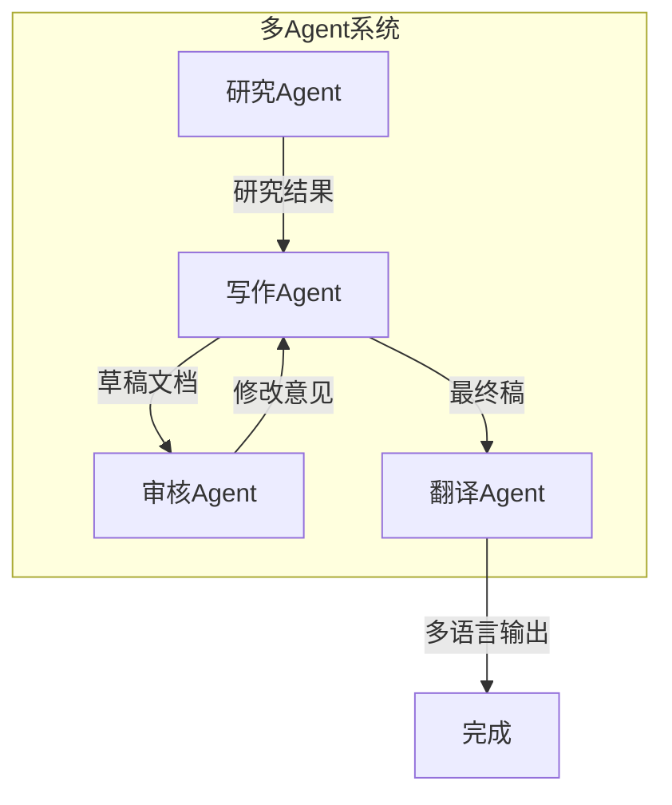
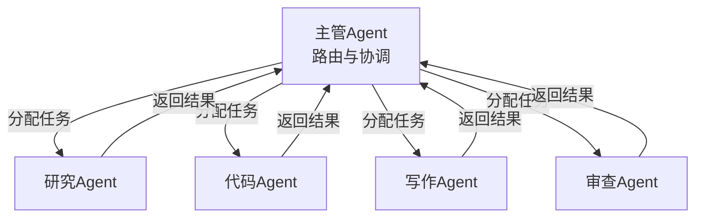
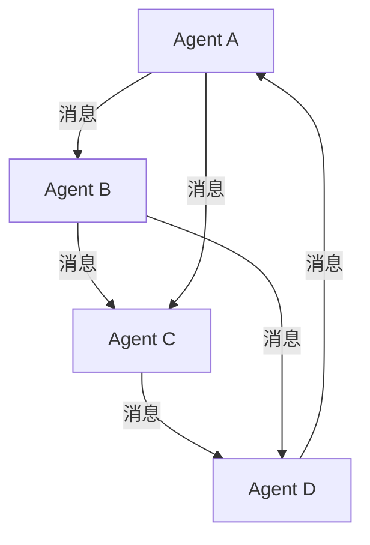
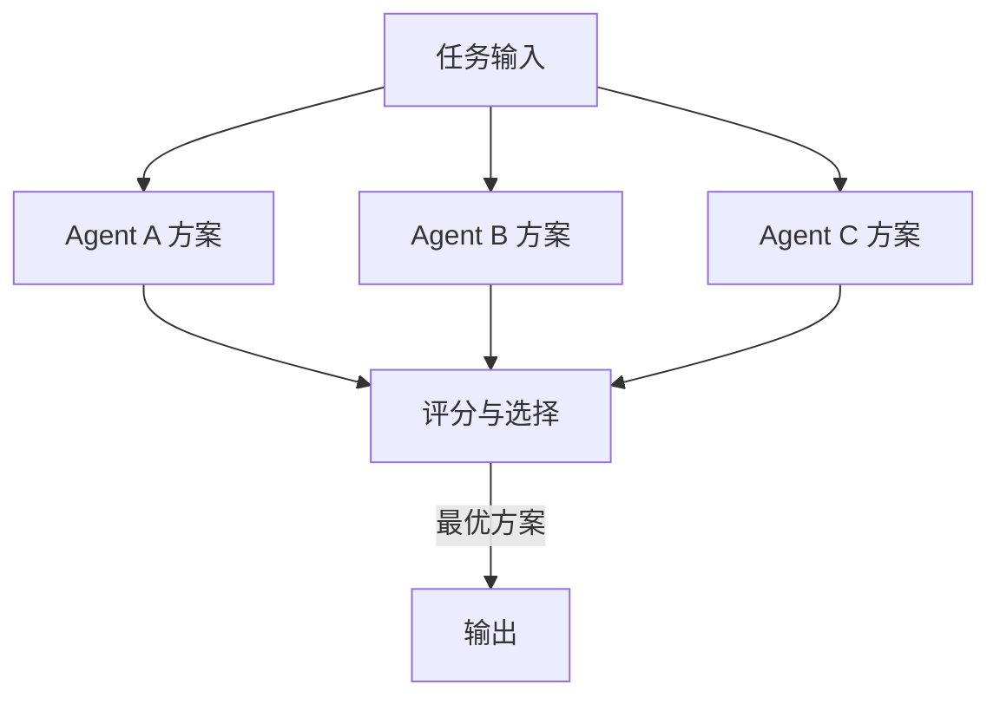
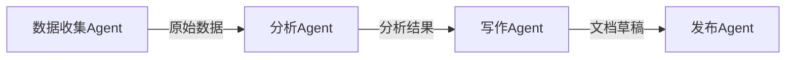
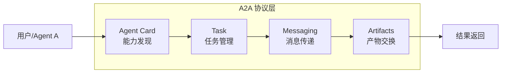
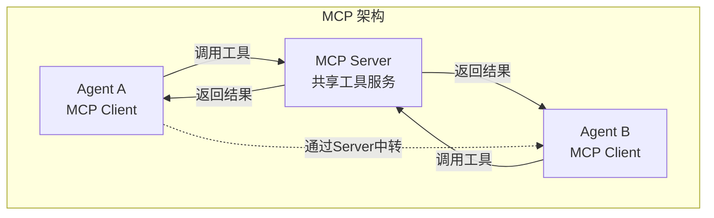
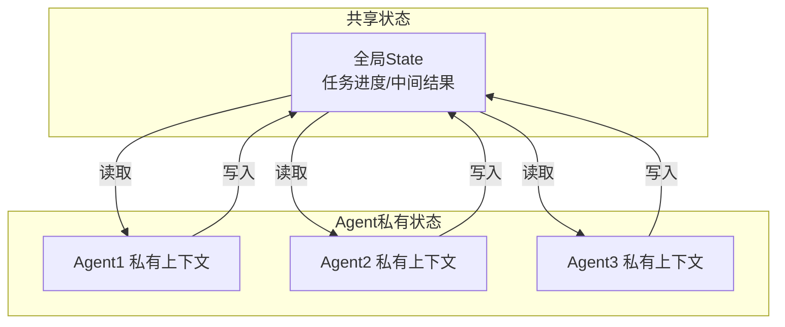
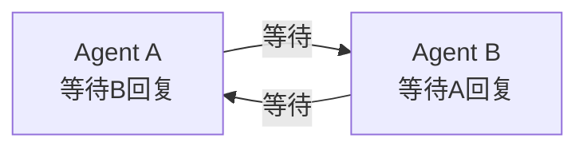
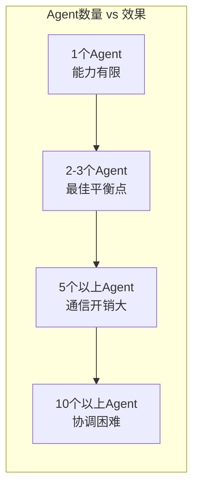

# KB114：多 Agent 系统架构原理与通信协议

> **阶段 23 | 方向一：多 Agent 系统架构与 Agent 间通信协议**
> 技术基准：langchain-core 1.5.3、langgraph 1.0.7、MCP 协议、A2A（Agent-to-Agent）通信
> 面向零基础学习者，配图文说明

---

## 1 多 Agent 系统概述

### 1.1 什么是多 Agent 系统

多 Agent 系统（Multi-Agent System, MAS）是指多个 AI Agent 协同工作，各自承担不同角色和职责，通过通信协议交换信息、协调行动，共同完成单个 Agent 难以胜任的复杂任务。



### 1.2 单 Agent vs 多 Agent

| 维度 | 单 Agent | 多 Agent |
|------|---------|---------|
| 任务复杂度 | 适合线性任务 | 适合复杂、多步骤任务 |
| 角色分工 | 一个 Agent 承担所有角色 | 每个 Agent 专注一个角色 |
| 错误传播 | 一个错误影响全局 | 可隔离到特定 Agent |
| 扩展性 | 受 context 限制 | 可水平扩展 |
| 成本 | 较低 | 较高（多轮通信） |
| 适用场景 | 简单问答、单步工具调用 | 研究报告、软件开发、多语言处理 |

### 1.3 多 Agent 系统的核心价值

- **专业化分工**：每个 Agent 只需精通一个领域，提示词更精准
- **并行处理**：多个 Agent 可同时工作，提高效率
- **容错隔离**：一个 Agent 出错不会影响其他 Agent
- **上下文隔离**：每个 Agent 有独立的上下文窗口，避免信息过载
- **可组合性**：Agent 可按需组合，适应不同任务

---

## 2 多 Agent 架构模式

### 2.1 层级架构（Hierarchical）

最经典的多 Agent 架构，包含一个"主管 Agent"（Supervisor）和多个"工作者 Agent"（Worker）。



**主管职责**：
- 分析用户请求，决定调用哪个工作者
- 汇总工作者返回的结果
- 决定任务是否完成

**工作者职责**：
- 执行具体任务（搜索、编码、写作等）
- 返回结构化结果给主管

### 2.2 网状架构（Network/Mesh）

所有 Agent 之间可以互相通信，没有固定层级。



**特点**：
- 灵活性最高，Agent 可自由协作
- 通信开销大，容易形成消息风暴
- 适合探索性、非确定性任务

### 2.3 竞争架构（Competitive）

多个 Agent 对同一任务给出不同方案，通过评分机制选最优。



### 2.4 流水线架构（Pipeline）

Agent 按固定顺序串联执行，前一个的输出是后一个的输入。



---

## 3 Agent 间通信协议

### 3.1 通信的核心要素

多 Agent 通信需要解决三个核心问题：

1. **谁发给谁**：寻址与路由
2. **说什么**：消息格式与语义
3. **怎么协调**：同步/异步、请求/响应

### 3.2 消息结构设计

```python
from pydantic import BaseModel, Field
from typing import Optional
from datetime import datetime
import uuid

class AgentMessage(BaseModel):
    """Agent 间通信的标准消息格式"""
    message_id: str = Field(default_factory=lambda: str(uuid.uuid4()))
    sender: str = Field(description="发送者 Agent 名称")
    receiver: str = Field(description="接收者 Agent 名称")
    message_type: str = Field(description="消息类型: request/response/broadcast")
    content: str = Field(description="消息内容")
    metadata: dict = Field(default_factory=dict, description="附加元数据")
    timestamp: str = Field(default_factory=lambda: datetime.now().isoformat())
    reply_to: Optional[str] = Field(None, description="回复的消息ID")

# 示例：研究Agent向写作Agent发送研究结果
msg = AgentMessage(
    sender="research_agent",
    receiver="writer_agent",
    message_type="request",
    content="以下是关于Transformer架构的研究结果：...",
    metadata={"topic": "transformer", "priority": "high"}
)
print(msg.model_dump_json(indent=2))
```

### 3.3 A2A（Agent-to-Agent）协议概述

A2A 是 Google 提出的开放协议，旨在让不同框架构建的 Agent 互相通信。



**核心概念**：
- **Agent Card**：每个 Agent 发布 JSON 格式的能力卡片
- **Task**：Agent 间的协作任务单元
- **Messaging**：支持同步请求和流式推送
- **Artifacts**：任务产出的结构化产物

### 3.4 LangGraph 中的 Agent 通信

LangGraph 通过 State 共享实现 Agent 间通信：

```python
from langgraph.graph import StateGraph, END
from typing import TypedDict, Annotated
from langgraph.graph.message import add_messages
import operator

class MultiAgentState(TypedDict):
    messages: Annotated[list, add_messages]
    research_notes: str
    draft: str
    review_feedback: str
    next_speaker: str

def research_agent(state: MultiAgentState):
    """研究Agent：收集信息并更新 research_notes"""
    notes = "研究发现：LangGraph 支持多Agent编排..."
    return {"research_notes": notes, "next_speaker": "writer"}

def writer_agent(state: MultiAgentState):
    """写作Agent：基于研究笔记写草稿"""
    draft = f"基于研究：{state['research_notes']}"
    return {"draft": draft, "next_speaker": "reviewer"}

def reviewer_agent(state: MultiAgentState):
    """审核Agent：检查草稿质量"""
    feedback = "草稿质量良好，建议补充更多实例"
    return {"review_feedback": feedback, "next_speaker": "writer"}

# 构建多Agent图
graph_builder = StateGraph(MultiAgentState)
graph_builder.add_node("researcher", research_agent)
graph_builder.add_node("writer", writer_agent)
graph_builder.add_node("reviewer", reviewer_agent)

def route(state: MultiAgentState):
    next_speaker = state.get("next_speaker", "researcher")
    if next_speaker == "writer":
        return "writer"
    elif next_speaker == "reviewer":
        return "reviewer"
    else:
        return END

graph_builder.set_entry_point("researcher")
graph_builder.add_conditional_edges("researcher", route)
graph_builder.add_conditional_edges("writer", route)
graph_builder.add_conditional_edges("reviewer", route)

app = graph_builder.compile()
```

### 3.5 MCP 与多 Agent 通信

MCP（Model Context Protocol）为 Agent 提供了标准化工具访问能力，也可用于 Agent 间通信：



```python
# MCP Server 作为 Agent 间的通信中转
from mcp.server import Server
import asyncio

server = Server("agent-communication")

@server.tool()
async def send_message_to_agent(
    target_agent: str,
    message: str,
    sender: str
) -> str:
    """向另一个 Agent 发送消息"""
    # 在实际实现中，这里会写入消息队列
    return f"Message from {sender} to {target_agent}: {message}"

@server.tool()
async def get_messages_for_agent(
    agent_name: str
) -> list:
    """获取发给某个 Agent 的所有消息"""
    # 实际实现中从消息队列读取
    return []
```

---

## 4 多 Agent 系统的状态管理

### 4.1 共享状态 vs 私有状态



### 4.2 状态隔离的实现

```python
from langgraph.graph import StateGraph, END
from typing import TypedDict, Annotated
from langgraph.graph.message import add_messages

# 全局共享状态
class SharedState(TypedDict):
    messages: Annotated[list, add_messages]
    task_queue: list
    completed_tasks: list

# 每个Agent的私有状态（通过子图实现）
def create_agent_subgraph(agent_name: str, agent_prompt: str):
    """创建一个Agent子图，拥有独立状态"""
    class AgentPrivateState(TypedDict):
        messages: Annotated[list, add_messages]
        internal_reasoning: str
    
    def agent_node(state: AgentPrivateState):
        # Agent 在自己的私有上下文中工作
        reasoning = f"[{agent_name}] 正在思考..."
        response = f"[{agent_name}] 的回复"
        return {
            "messages": [{"role": "assistant", "content": response}],
            "internal_reasoning": reasoning
        }
    
    subgraph = StateGraph(AgentPrivateState)
    subgraph.add_node(agent_name, agent_node)
    subgraph.set_entry_point(agent_name)
    subgraph.add_edge(agent_name, END)
    return subgraph.compile()
```

---

## 5 多 Agent 通信的工程挑战

### 5.1 消息丢失与重复

```python
from collections import defaultdict
import time

class MessageBroker:
    """简易消息代理，处理消息去重和重试"""
    def __init__(self):
        self.queue = defaultdict(list)
        self.processed_ids = set()
        self.max_retries = 3
        self.retry_delay = 2
    
    def send(self, target: str, message_id: str, content: str):
        """发送消息，自动去重"""
        if message_id in self.processed_ids:
            return False  # 已处理，跳过
        self.queue[target].append({
            "message_id": message_id,
            "content": content,
            "attempts": 0,
            "timestamp": time.time()
        })
        return True
    
    def receive(self, agent_name: str) -> list:
        """接收消息"""
        messages = self.queue.get(agent_name, [])
        unprocessed = []
        for msg in messages:
            if msg["message_id"] not in self.processed_ids:
                unprocessed.append(msg)
        return unprocessed
    
    def ack(self, message_id: str):
        """确认消息已处理"""
        self.processed_ids.add(message_id)
```

### 5.2 死锁检测

当多个 Agent 互相等待对方回复时，会产生死锁：



```python
class DeadlockDetector:
    """检测多Agent间的死锁"""
    def __init__(self, timeout: int = 60):
        self.waiting_for = {}  # agent -> waiting_for_agent
        self.timestamps = {}
        self.timeout = timeout
    
    def register_wait(self, agent: str, waiting_for: str):
        self.waiting_for[agent] = waiting_for
        self.timestamps[agent] = time.time()
    
    def check_deadlock(self) -> bool:
        """检测是否有循环等待"""
        for agent in self.waiting_for:
            visited = set()
            current = agent
            while current in self.waiting_for:
                if current in visited:
                    return True  # 发现循环
                visited.add(current)
                current = self.waiting_for[current]
                # 超时也视为死锁
                if time.time() - self.timestamps.get(agent, 0) > self.timeout:
                    return True
        return False
```

### 5.3 通信成本优化

| 策略 | 说明 | 适用场景 |
|------|------|---------|
| 批量通信 | 多条消息合并发送 | Agent 需要等待多个结果 |
| 摘要传递 | 只传递摘要而非完整内容 | 上下文较长时 |
| 条件触发 | 仅在特定条件下通信 | 减少不必要的通信 |
| 异步流水线 | 非阻塞式通信 | I/O 密集型任务 |

---

## 6 主流多 Agent 框架对比

### 6.1 LangGraph 多 Agent

```python
from langgraph.graph import StateGraph, END
from langchain_openai import ChatOpenAI

llm = ChatOpenAI(model="gpt-4o-mini")

# Supervisor 模式
def supervisor(state):
    """主管Agent决定下一步调用哪个工作者"""
    response = llm.invoke(
        f"根据当前状态，决定下一步调用哪个Agent: {state}"
    )
    return {"next": response.content}

# Worker Agents
def research_worker(state):
    return {"result": "研究结果"}

def code_worker(state):
    return {"result": "代码实现"}

def writer_worker(state):
    return {"result": "文档草稿"}
```

### 6.2 AutoGen 多 Agent

```python
# AutoGen 风格的对话式多Agent
# 注意：以下为概念展示，实际需安装 pyautogen
"""
from autogen import AssistantAgent, UserProxyAgent

config_list = [{"model": "gpt-4o-mini", "api_key": "your_key"}]

researcher = AssistantAgent(
    name="researcher",
    system_message="你是一个研究助手",
    llm_config={"config_list": config_list}
)

coder = AssistantAgent(
    name="coder", 
    system_message="你是一个编程助手",
    llm_config={"config_list": config_list}
)

user_proxy = UserProxyAgent(name="user")
user_proxy.initiate_chat(researcher, message="研究LangGraph")
"""
```

### 6.3 CrewAI 多 Agent

```python
# CrewAI 风格
# 注意：以下为概念展示
"""
from crewai import Agent, Task, Crew

researcher = Agent(
    role="研究员",
    goal="收集和整理信息",
    backstory="资深研究员，擅长信息检索"
)

writer = Agent(
    role="作家",
    goal="撰写高质量文档",
    backstory="技术作家，擅长将复杂概念简单化"
)

research_task = Task(
    description="研究多Agent系统",
    agent=researcher,
    expected_output="研究报告"
)

write_task = Task(
    description="基于研究写文章",
    agent=writer,
    expected_output="技术文章"
)

crew = Crew(agents=[researcher, writer], tasks=[research_task, write_task])
result = crew.kickoff()
"""
```

### 6.4 框架对比表

| 特性 | LangGraph | AutoGen | CrewAI |
|------|-----------|---------|--------|
| 编排方式 | 图结构 | 对话轮次 | 任务链 |
| 状态管理 | 显式 State | 隐式对话历史 | 任务上下文 |
| 灵活性 | 最高 | 中等 | 中等 |
| 学习曲线 | 较陡 | 平缓 | 平缓 |
| 适合场景 | 复杂工作流 | 对话式协作 | 角色扮演任务 |
| 流式支持 | 原生支持 | 需配置 | 有限 |

---

## 7 完整示例：多 Agent 协作写作系统

```python
from langgraph.graph import StateGraph, END
from langchain_openai import ChatOpenAI
from langchain_core.messages import HumanMessage, AIMessage
from typing import TypedDict, Annotated
from langgraph.graph.message import add_messages

llm = ChatOpenAI(model="gpt-4o-mini", temperature=0.7)

class WritingState(TypedDict):
    messages: Annotated[list, add_messages]
    topic: str
    research_notes: str
    outline: str
    draft: str
    review_feedback: str
    final_article: str
    step: str

def research_agent(state: WritingState):
    """研究Agent：收集主题相关信息"""
    response = llm.invoke([
        {"role": "system", "content": "你是研究助手，输出简洁要点。"},
        {"role": "user", "content": f"研究主题：{state['topic']}"}
    ])
    return {"research_notes": response.content, "step": "outline"}

def outline_agent(state: WritingState):
    """大纲Agent：基于研究生成文章大纲"""
    response = llm.invoke([
        {"role": "system", "content": "你是写作规划师，输出Markdown格式大纲。"},
        {"role": "user", "content": f"基于以下研究写大纲：{state['research_notes']}"}
    ])
    return {"outline": response.content, "step": "draft"}

def draft_agent(state: WritingState):
    """写作Agent：基于大纲写初稿"""
    response = llm.invoke([
        {"role": "system", "content": "你是技术作家，基于大纲写完整文章。"},
        {"role": "user", "content": f"大纲：{state['outline']}\n研究：{state['research_notes']}"}
    ])
    return {"draft": response.content, "step": "review"}

def review_agent(state: WritingState):
    """审核Agent：审核草稿并给出修改意见"""
    response = llm.invoke([
        {"role": "system", "content": "你是审稿编辑，检查质量和准确性。"},
        {"role": "user", "content": f"审核以下文章：{state['draft']}"}
    ])
    feedback = response.content
    if "通过" in feedback or "合格" in feedback:
        return {"review_feedback": feedback, "final_article": state["draft"], "step": "done"}
    else:
        return {"review_feedback": feedback, "step": "draft"}

def route_agent(state: WritingState):
    step = state.get("step", "research")
    if step == "outline":
        return "outliner"
    elif step == "draft":
        return "drafter"
    elif step == "review":
        return "reviewer"
    elif step == "done":
        return END
    else:
        return "researcher"

# 构建图
g = StateGraph(WritingState)
g.add_node("researcher", research_agent)
g.add_node("outliner", outline_agent)
g.add_node("drafter", draft_agent)
g.add_node("reviewer", review_agent)
g.set_entry_point("researcher")
g.add_conditional_edges("researcher", route_agent)
g.add_conditional_edges("outliner", route_agent)
g.add_conditional_edges("drafter", route_agent)
g.add_conditional_edges("reviewer", route_agent)

app = g.compile()

# 运行
result = app.invoke({
    "topic": "LangGraph多Agent系统",
    "messages": [HumanMessage(content="写一篇关于LangGraph多Agent系统的文章")],
    "research_notes": "", "outline": "", "draft": "",
    "review_feedback": "", "final_article": "", "step": "research"
})
print(result["final_article"])
```

---

## 8 多 Agent 系统的设计原则

### 8.1 何时使用多 Agent

| 场景 | 推荐方案 | 理由 |
|------|---------|------|
| 简单问答 | 单 Agent | 多Agent过度设计 |
| 多步骤研究 | 2-3 个 Agent | 分工提升质量 |
| 软件开发 | 3-5 个 Agent | 需求/编码/测试/审查 |
| 大规模数据处理 | 流水线 Agent | 顺序处理效率高 |
| 创意方案生成 | 竞争 Agent | 多方案选优 |

### 8.2 Agent 数量的权衡



### 8.3 提示词设计原则

每个 Agent 的系统提示词应包含：
1. **角色定义**：你是谁，负责什么
2. **输入格式**：你会收到什么信息
3. **输出格式**：你应该返回什么格式
4. **约束条件**：有什么限制
5. **协作规范**：如何与其他 Agent 配合

---

## 9 总结

本篇系统阐述了多 Agent 系统的架构原理与通信协议：

- **四种架构模式**：层级、网状、竞争、流水线，各有适用场景
- **通信协议**：标准消息结构、A2A 协议、MCP 中转、LangGraph State 共享
- **状态管理**：共享状态与私有状态的隔离设计
- **工程挑战**：消息去重、死锁检测、通信成本优化
- **框架对比**：LangGraph、AutoGen、CrewAI 的优劣分析

下一篇 KB115 将深入 LangGraph 的三种多 Agent 编排模式（Supervisor/Swarm/Network）的源码级实现。

---

> **参考文献**
> - LangGraph Multi-Agent 文档：https://langchain-ai.github.io/langgraph/concepts/multi_agent/
> - A2A Protocol 规范：https://a2a-protocol.org/
> - MCP 官方文档：https://modelcontextprotocol.io/
> - AutoGen 文档：https://microsoft.github.io/autogen/
> - CrewAI 文档：https://docs.crewai.com/
