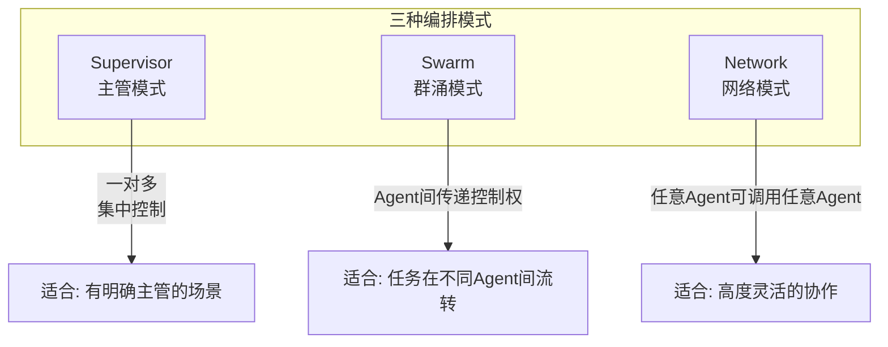
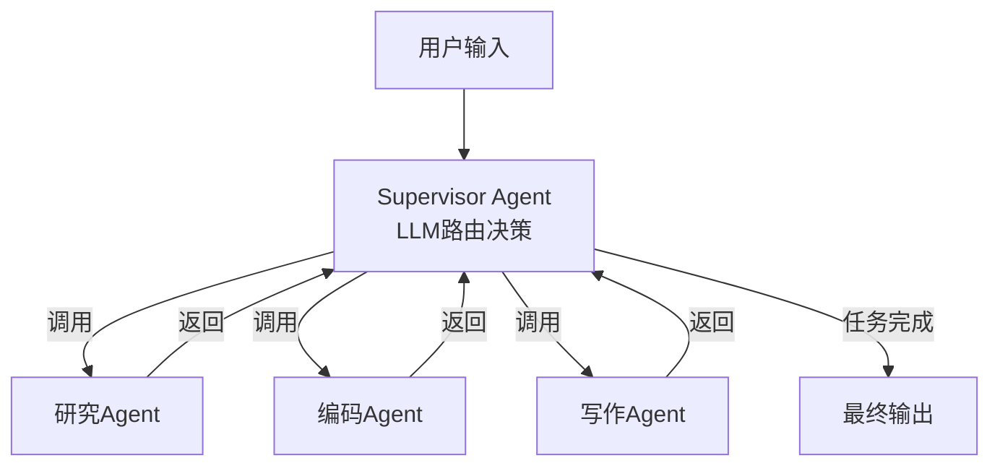
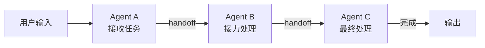
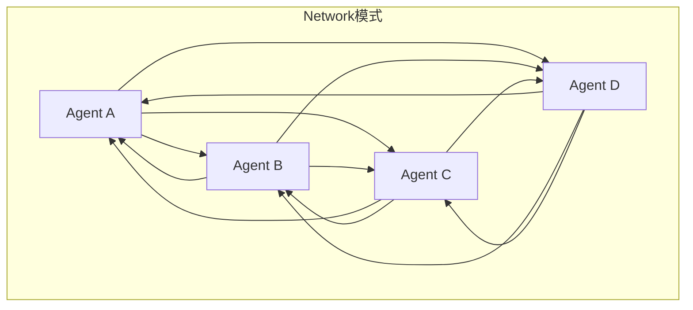
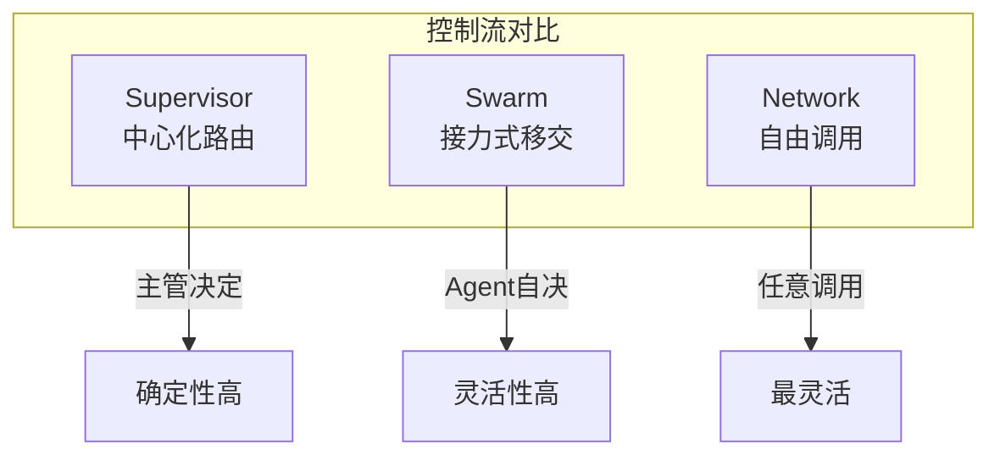
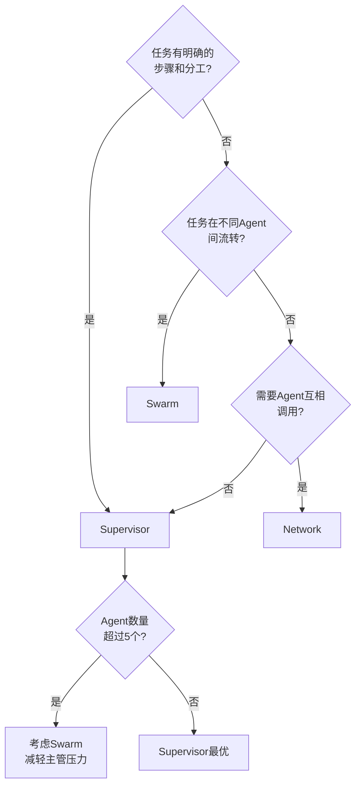

# KB115：LangGraph 多 Agent 编排模式深度解析

> **阶段 23 | 方向二：LangGraph 多 Agent 编排模式**
> 技术基准：langgraph 1.0.7、langchain-core 1.5.3
> 深入 Supervisor / Swarm / Network 三种编排模式的源码级实现

---

## 1 编排模式概览

LangGraph 提供三种核心多 Agent 编排模式，适用于不同复杂度的协作场景。



| 模式 | 控制方式 | 通信复杂度 | 适用场景 |
|------|---------|-----------|---------|
| Supervisor | 主管Agent统一调度 | 低 | 有明确分工的任务 |
| Swarm | Agent间传递控制权 | 中 | 任务在Agent间流转 |
| Network | 任意Agent互相调用 | 高 | 复杂协作网络 |

---

## 2 Supervisor 模式

### 2.1 原理

Supervisor 模式是最常用的多 Agent 编排模式。一个"主管 Agent"作为入口，分析用户请求后决定调用哪个工作者 Agent，收到工作者结果后决定下一步。



### 2.2 完整实现

```python
from langgraph.graph import StateGraph, END, START
from langchain_openai import ChatOpenAI
from langchain_core.messages import HumanMessage, AIMessage, SystemMessage
from typing import TypedDict, Annotated, Literal
from langgraph.graph.message import add_messages
import json

llm = ChatOpenAI(model="gpt-4o-mini", temperature=0)

class SupervisorState(TypedDict):
    messages: Annotated[list, add_messages]
    next_agent: str
    research_result: str
    code_result: str
    write_result: str
    task_complete: bool

def supervisor(state: SupervisorState):
    """主管Agent：分析任务并路由到合适的工作者"""
    messages = state["messages"]
    
    # 构建路由决策
    route_prompt = SystemMessage(content="""你是任务路由器。
根据用户请求和当前状态，决定下一步调用哪个Agent:
- "researcher": 需要信息收集、分析、调研
- "coder": 需要编写代码、技术实现
- "writer": 需要撰写文档、总结报告
- "FINISH": 任务已完成

只返回Agent名称，不要其他文字。""")
    
    # 如果已有结果，告知Supervisor
    context = f"研究结果: {state.get('research_result', '无')}\n"
    context += f"代码结果: {state.get('code_result', '无')}\n"
    context += f"写作结果: {state.get('write_result', '无')}"
    
    response = llm.invoke([
        route_prompt,
        HumanMessage(content=f"用户请求: {messages[-1].content}\n当前状态:\n{context}")
    ])
    
    next_agent = response.content.strip().lower()
    task_complete = next_agent == "finish"
    
    return {"next_agent": next_agent, "task_complete": task_complete}

def research_agent(state: SupervisorState):
    """研究Agent"""
    response = llm.invoke([
        SystemMessage(content="你是研究助手，提供简洁准确的信息。"),
        HumanMessage(content=f"研究请求: {state['messages'][-1].content}")
    ])
    return {"research_result": response.content}

def code_agent(state: SupervisorState):
    """编码Agent"""
    response = llm.invoke([
        SystemMessage(content="你是编程助手，提供可运行代码。"),
        HumanMessage(content=f"编码请求: {state['messages'][-1].content}\n参考研究: {state.get('research_result', '')}")
    ])
    return {"code_result": response.content}

def write_agent(state: SupervisorState):
    """写作Agent"""
    response = llm.invoke([
        SystemMessage(content="你是技术作家，将技术内容转化为易懂文档。"),
        HumanMessage(content=f"写作请求: {state['messages'][-1].content}\n研究: {state.get('research_result', '')}\n代码: {state.get('code_result', '')}")
    ])
    return {"write_result": response.content}

def route_from_supervisor(state: SupervisorState):
    if state.get("task_complete"):
        return END
    return state.get("next_agent", "researcher")

# 构建Supervisor图
graph = StateGraph(SupervisorState)
graph.add_node("supervisor", supervisor)
graph.add_node("researcher", research_agent)
graph.add_node("coder", code_agent)
graph.add_node("writer", write_agent)

graph.add_edge(START, "supervisor")
graph.add_conditional_edges("supervisor", route_from_supervisor, {
    "researcher": "researcher",
    "coder": "coder",
    "writer": "writer",
    END: END
})
graph.add_edge("researcher", "supervisor")
graph.add_edge("coder", "supervisor")
graph.add_edge("writer", "supervisor")

app = graph.compile()

# 运行
result = app.invoke({
    "messages": [HumanMessage(content="帮我研究LangGraph，写一个示例代码，然后写一篇教程")],
    "next_agent": "",
    "research_result": "",
    "code_result": "",
    "write_result": "",
    "task_complete": False
})
```

### 2.3 Supervisor 模式的特点

**优点**：
- 架构清晰，易于理解和调试
- 主管可以全局把控任务进度
- 新增 Agent 只需在路由逻辑中添加

**缺点**：
- 主管是单点瓶颈，所有请求都经过它
- 主管的 LLM 调用增加延迟和成本
- 主管的上下文窗口可能溢出

---

## 3 Swarm 模式

### 3.1 原理

Swarm 模式中没有固定的主管 Agent。每个 Agent 完成自己的任务后，可以决定将控制权"移交"（handoff）给另一个 Agent。控制权在 Agent 之间流转，直到任务完成。



### 3.2 Handoff 机制

```python
from langgraph.graph import StateGraph, END, START
from langchain_openai import ChatOpenAI
from langchain_core.messages import HumanMessage, SystemMessage
from typing import TypedDict, Annotated
from langgraph.graph.message import add_messages

llm = ChatOpenAI(model="gpt-4o-mini", temperature=0)

class SwarmState(TypedDict):
    messages: Annotated[list, add_messages]
    current_agent: str
    context: dict
    task_complete: bool

# 定义handoff工具
def make_handoff_tool(agent_name: str, description: str):
    """创建移交工具"""
    def handoff(state: SwarmState):
        return {"current_agent": agent_name}
    return handoff

# Agent定义
def triage_agent(state: SwarmState):
    """分诊Agent：接收用户请求，判断应该交给谁"""
    response = llm.invoke([
        SystemMessage(content="""你是分诊Agent。
分析用户请求，决定移交给:
- "researcher": 需要信息查询
- "coder": 需要编程
- "FINISH": 无需进一步处理
返回Agent名称。"""),
        HumanMessage(content=state["messages"][-1].content)
    ])
    decision = response.content.strip().lower()
    if decision == "finish":
        return {"task_complete": True, "current_agent": "done"}
    return {"current_agent": decision, "context": {"original_request": state["messages"][-1].content}}

def research_agent_swarm(state: SwarmState):
    """研究Agent：查询信息后决定下一步"""
    request = state.get("context", {}).get("original_request", "")
    response = llm.invoke([
        SystemMessage(content="你是研究助手。完成研究后，决定是否移交给coder或writer。返回格式:研究结果|||next_agent_name"),
        HumanMessage(content=f"请求: {request}")
    ])
    parts = response.content.split("|||")
    research_text = parts[0].strip()
    next_agent = parts[1].strip().lower() if len(parts) > 1 else "finish"
    
    new_context = state.get("context", {})
    new_context["research"] = research_text
    
    if next_agent == "finish":
        return {"task_complete": True, "current_agent": "done", "context": new_context}
    return {"current_agent": next_agent, "context": new_context}

def coder_agent_swarm(state: SwarmState):
    """编码Agent：写代码后决定下一步"""
    ctx = state.get("context", {})
    response = llm.invoke([
        SystemMessage(content="你是编程助手。完成编码后，决定是否移交给writer。返回格式:代码|||next_agent_name"),
        HumanMessage(content=f"请求: {ctx.get('original_request', '')}\n研究: {ctx.get('research', '')}")
    ])
    parts = response.content.split("|||")
    code_text = parts[0].strip()
    next_agent = parts[1].strip().lower() if len(parts) > 1 else "finish"
    
    new_context = state.get("context", {})
    new_context["code"] = code_text
    
    if next_agent == "finish":
        return {"task_complete": True, "current_agent": "done", "context": new_context}
    return {"current_agent": next_agent, "context": new_context}

def writer_agent_swarm(state: SwarmState):
    """写作Agent：整合所有结果写最终文档"""
    ctx = state.get("context", {})
    response = llm.invoke([
        SystemMessage(content="你是技术作家。基于研究和代码写教程。"),
        HumanMessage(content=f"请求: {ctx.get('original_request', '')}\n研究: {ctx.get('research', '')}\n代码: {ctx.get('code', '')}")
    ])
    new_context = state.get("context", {})
    new_context["final"] = response.content
    return {"task_complete": True, "current_agent": "done", "context": new_context}

def route_swarm(state: SwarmState):
    if state.get("task_complete"):
        return END
    return state.get("current_agent", "triage")

# 构建Swarm图
swarm = StateGraph(SwarmState)
swarm.add_node("triage", triage_agent)
swarm.add_node("researcher", research_agent_swarm)
swarm.add_node("coder", coder_agent_swarm)
swarm.add_node("writer", writer_agent_swarm)

swarm.add_edge(START, "triage")
swarm.add_conditional_edges("triage", route_swarm, {
    "researcher": "researcher",
    "coder": "coder",
    "writer": "writer",
    "done": END
})
swarm.add_conditional_edges("researcher", route_swarm, {
    "coder": "coder",
    "writer": "writer",
    "done": END
})
swarm.add_conditional_edges("coder", route_swarm, {
    "writer": "writer",
    "done": END
})
swarm.add_edge("writer", END)

app = swarm.compile()
```

### 3.3 Swarm 模式的特点

**优点**：
- 无单点瓶颈，Agent 间直接移交
- 灵活性高，Agent 可自主决定下一步
- 更接近自然的人类协作方式

**缺点**：
- 调试困难，执行路径不固定
- 可能出现 Agent 间循环移交
- 需要设计好移交逻辑避免无限循环

---

## 4 Network 模式

### 4.1 原理

Network 模式是最灵活的编排模式。任意 Agent 可以调用任意其他 Agent，形成一个完全连接的协作网络。



### 4.2 实现

```python
from langgraph.graph import StateGraph, END, START
from langchain_openai import ChatOpenAI
from langchain_core.messages import HumanMessage, SystemMessage
from typing import TypedDict, Annotated
from langgraph.graph.message import add_messages

llm = ChatOpenAI(model="gpt-4o-mini", temperature=0)

class NetworkState(TypedDict):
    messages: Annotated[list, add_messages]
    agent_results: dict  # {agent_name: result}
    call_stack: list  # 防止无限递归
    max_depth: int
    task_complete: bool

def create_network_agent(name: str, system_prompt: str, peers: list):
    """创建一个Network Agent"""
    def agent_fn(state: NetworkState):
        # 防止无限递归
        call_stack = state.get("call_stack", [])
        max_depth = state.get("max_depth", 10)
        
        if len(call_stack) >= max_depth:
            return {"task_complete": True}
        
        if name in call_stack[-3:]:  # 同一Agent连续调用超过3次
            return {"task_complete": True}
        
        new_stack = call_stack + [name]
        
        # 获取已有结果
        results = state.get("agent_results", {})
        context = "\n".join(f"{k}: {v[:200]}" for k, v in results.items() if k != name)
        
        response = llm.invoke([
            SystemMessage(content=f"""{system_prompt}

你可以调用以下Agent: {', '.join(peers)}
或者返回 "FINISH" 表示任务完成。

返回格式:
- 调用Agent: CALL:agent_name:理由
- 完成任务: FINISH:最终结果"""),
            HumanMessage(content=f"用户请求: {state['messages'][-1].content}\n已有结果:\n{context}")
        ])
        
        content = response.content.strip()
        
        if content.startswith("FINISH"):
            final_result = content.split(":", 1)[1] if ":" in content else content
            new_results = dict(results)
            new_results[name] = final_result
            return {"agent_results": new_results, "task_complete": True}
        
        elif content.startswith("CALL"):
            parts = content.split(":", 2)
            if len(parts) >= 2:
                target = parts[1].strip().lower()
                if target in peers:
                    new_results = dict(results)
                    new_results[name] = parts[2] if len(parts) > 2 else "已调用"
                    return {
                        "agent_results": new_results,
                        "call_stack": new_stack,
                        "next_agent": target
                    }
        
        # 默认完成
        new_results = dict(results)
        new_results[name] = content
        return {"agent_results": new_results, "task_complete": True, "call_stack": new_stack}
    
    return agent_fn

def route_network(state: NetworkState):
    if state.get("task_complete"):
        return END
    return state.get("next_agent", END)

# 定义Agent列表
agent_names = ["analyst", "researcher", "coder", "reviewer"]

# 创建各个Agent
analyst_fn = create_network_agent(
    "analyst",
    "你是需求分析Agent，分析用户需求并决定调用谁。",
    agent_names
)
researcher_fn = create_network_agent(
    "researcher",
    "你是研究Agent，收集信息并提供给其他Agent。",
    agent_names
)
coder_fn = create_network_agent(
    "coder",
    "你是编码Agent，编写代码并可能请求reviewer审查。",
    agent_names
)
reviewer_fn = create_network_agent(
    "reviewer",
    "你是审查Agent，审查代码质量。",
    agent_names
)

# 构建Network图
net = StateGraph(NetworkState)
net.add_node("analyst", analyst_fn)
net.add_node("researcher", researcher_fn)
net.add_node("coder", coder_fn)
net.add_node("reviewer", reviewer_fn)

net.add_edge(START, "analyst")

# 每个Agent都可以路由到任意其他Agent
for agent in agent_names:
    routes = {a: a for a in agent_names if a != agent}
    routes[END] = END
    net.add_conditional_edges(agent, route_network, routes)

app = net.compile()
```

---

## 5 三种模式对比



| 维度 | Supervisor | Swarm | Network |
|------|-----------|-------|---------|
| 控制方式 | 主管统一路由 | Agent间移交 | 任意Agent互相调用 |
| 路由决策 | 主管LLM | 当前Agent | 当前Agent |
| 最大Agent数 | 建议 3-7 | 建议 3-5 | 建议 2-4 |
| 循环风险 | 低（主管控制） | 中（需设上限） | 高（需防递归） |
| 调试难度 | 低 | 中 | 高 |
| 延迟 | 每步2次LLM | 每步1次LLM | 每步1次LLM |
| 成本 | 最高 | 中等 | 中等 |
| 适用场景 | 通用 | 流水线任务 | 探索性任务 |

---

## 6 模式选择的决策树



---

## 7 混合编排模式

实际项目中可以混合使用多种模式：

```python
# 混合模式：Supervisor + Swarm
from langgraph.graph import StateGraph, END, START
from typing import TypedDict, Annotated
from langgraph.graph.message import add_messages

class HybridState(TypedDict):
    messages: Annotated[list, add_messages]
    stage: str  # "supervisor" / "swarm" / "done"
    supervisor_result: str
    swarm_result: str

def supervisor_stage(state: HybridState):
    """第一阶段：Supervisor处理"""
    return {
        "supervisor_result": "主管阶段完成",
        "stage": "swarm"
    }

def swarm_stage(state: HybridState):
    """第二阶段：Swarm接力"""
    return {
        "swarm_result": "群涌阶段完成",
        "stage": "done"
    }

def route_hybrid(state: HybridState):
    stage = state.get("stage", "supervisor")
    if stage == "swarm":
        return "swarm_node"
    elif stage == "done":
        return END
    return "supervisor_node"

# 构建混合图
hybrid = StateGraph(HybridState)
hybrid.add_node("supervisor_node", supervisor_stage)
hybrid.add_node("swarm_node", swarm_stage)
hybrid.add_edge(START, "supervisor_node")
hybrid.add_conditional_edges("supervisor_node", route_hybrid)
hybrid.add_conditional_edges("swarm_node", route_hybrid)

app = hybrid.compile()
```

---

## 8 总结

本篇深入解析了 LangGraph 的三种多 Agent 编排模式：

- **Supervisor**：主管统一路由，适合有明确分工的任务，架构清晰
- **Swarm**：Agent 间移交控制权，适合任务在 Agent 间流转的场景
- **Network**：任意 Agent 互相调用，适合高度灵活的协作网络
- **混合模式**：实际项目可组合多种模式

选择建议：从 Supervisor 开始，当主管成为瓶颈时考虑 Swarm，当需要高度灵活协作时考虑 Network。

---

> **参考文献**
> - LangGraph Multi-Agent Concepts: https://langchain-ai.github.io/langgraph/concepts/multi_agent/
> - LangGraph Supervisor Example: https://langchain-ai.github.io/langgraph/tutorials/multi_agent/multi-agent-collaboration/
> - LangGraph Swarm Example: https://langchain-ai.github.io/langgraph/tutorials/multi_agent/agent_supervisor/
