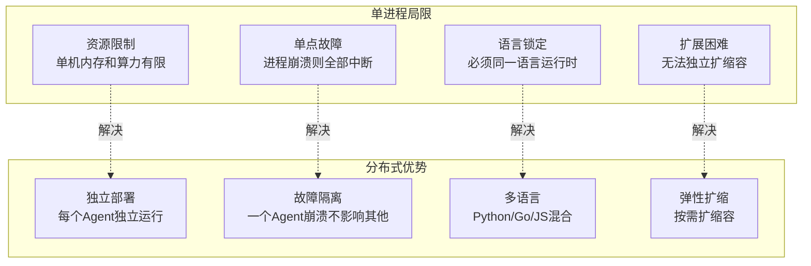
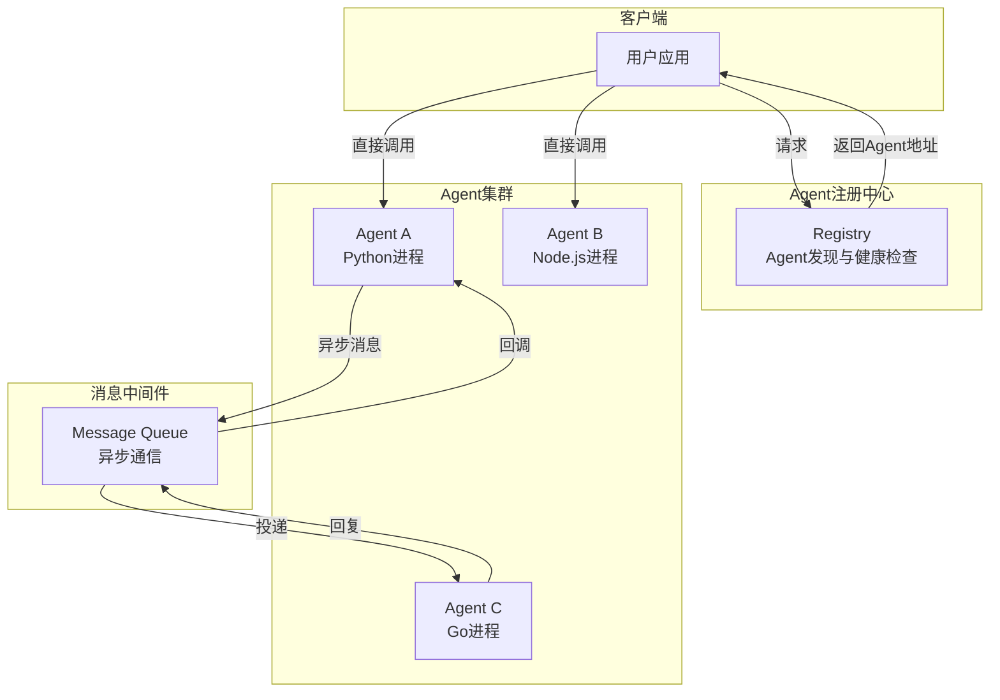
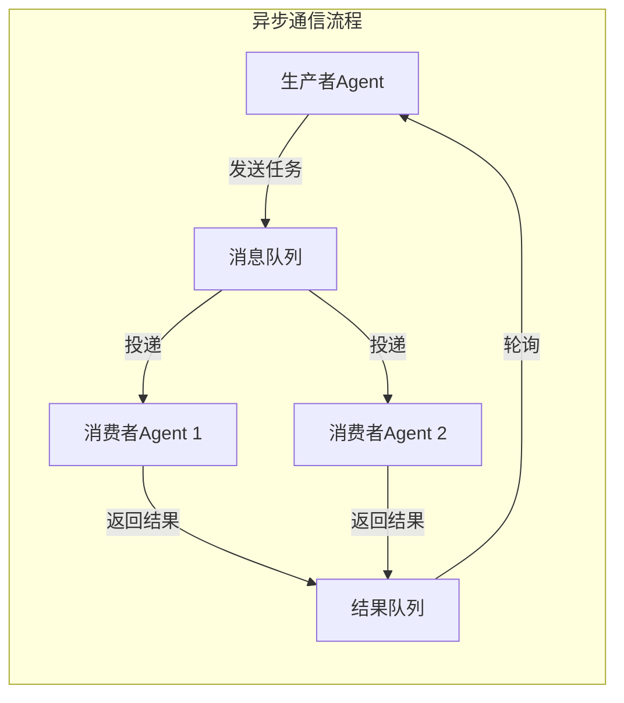
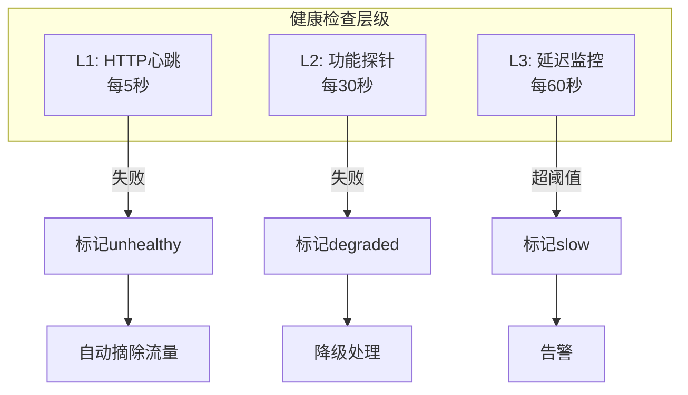
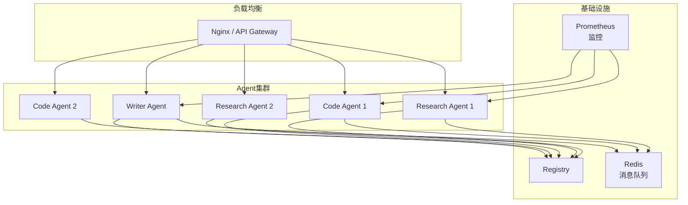

# KB116：分布式 Agent 部署与远程通信

> **阶段 23 | 方向三：分布式 Agent 部署与远程通信**
> 技术基准：langgraph 1.0.7、MCP、HTTP/gRPC、消息队列
> 面向零基础学习者，配图文说明

---

## 1 分布式 Agent 概述

### 1.1 为什么需要分布式部署

单进程内的多 Agent 系统虽然易于开发，但在生产环境中面临以下挑战：



### 1.2 分布式 Agent 架构



---

## 2 Agent 远程通信方案

### 2.1 通信方案对比

| 方案 | 协议 | 适用场景 | 延迟 | 复杂度 |
|------|------|---------|------|--------|
| HTTP REST | HTTP/JSON | 通用API调用 | 中 | 低 |
| gRPC | HTTP/2+Protobuf | 高性能微服务 | 低 | 中 |
| WebSocket | TCP | 实时双向通信 | 低 | 中 |
| Message Queue | AMQP/MQTT | 异步解耦 | 高 | 高 |
| MCP | JSON-RPC | 工具调用标准化 | 中 | 低 |

### 2.2 HTTP REST 通信

```python
# Agent服务端（使用FastAPI）
from fastapi import FastAPI
from pydantic import BaseModel
from langchain_openai import ChatOpenAI

app = FastAPI(title="Research Agent Service")
llm = ChatOpenAI(model="gpt-4o-mini", temperature=0)

class ResearchRequest(BaseModel):
    topic: str
    depth: str = "medium"  # shallow / medium / deep

class ResearchResponse(BaseModel):
    topic: str
    findings: str
    sources: list[str]

@app.post("/research", response_model=ResearchResponse)
async def research(req: ResearchRequest):
    """研究Agent的HTTP接口"""
    response = llm.invoke([
        {"role": "system", "content": "你是研究助手，提供简洁准确的信息。"},
        {"role": "user", "content": f"研究主题: {req.topic}, 深度: {req.depth}"}
    ])
    return ResearchResponse(
        topic=req.topic,
        findings=response.content,
        sources=["来源1", "来源2"]
    )

@app.get("/health")
async def health():
    """健康检查端点"""
    return {"status": "healthy"}
```

```python
# Agent客户端（调用远程Agent）
import httpx

async def call_research_agent(topic: str, depth: str = "medium"):
    """调用远程研究Agent"""
    async with httpx.AsyncClient(timeout=30) as client:
        response = await client.post(
            "http://localhost:8001/research",
            json={"topic": topic, "depth": depth}
        )
        return response.json()

# 在LangGraph中使用远程Agent
from langgraph.graph import StateGraph, END
from typing import TypedDict, Annotated
from langgraph.graph.message import add_messages
import asyncio

class RemoteAgentState(TypedDict):
    messages: Annotated[list, add_messages]
    research_result: str
    final_result: str

async def remote_research_node(state: RemoteAgentState):
    """在LangGraph节点中调用远程Agent"""
    topic = state["messages"][-1].content
    result = await call_research_agent(topic)
    return {"research_result": result["findings"]}

def final_node(state: RemoteAgentState):
    return {"final_result": f"基于研究: {state['research_result']}"}

g = StateGraph(RemoteAgentState)
g.add_node("research", remote_research_node)
g.add_node("finalize", final_node)
g.set_entry_point("research")
g.add_edge("research", "finalize")
g.add_edge("finalize", END)
app = g.compile()
```

### 2.3 MCP 远程通信

```python
# MCP Server作为远程Agent
from mcp.server import Server
from mcp.server.stdio import stdio_server
import asyncio

server = Server("remote-research-agent")

@server.tool()
async def search_web(query: str, max_results: int = 5) -> dict:
    """远程搜索工具"""
    # 模拟搜索
    return {
        "query": query,
        "results": [
            {"title": f"结果{i}", "snippet": f"内容{i}", "url": f"https://example.com/{i}"}
            for i in range(max_results)
        ]
    }

@server.tool()
async def analyze_content(content: str, focus: str = "general") -> str:
    """远程分析工具"""
    return f"分析结果: {content[:100]}... 聚焦: {focus}"

async def main():
    async with stdio_server() as (read, write):
        await server.run(read, write, server.create_initialization_options())

# 启动: python -m agent_server
```

### 2.4 消息队列异步通信



```python
# 基于Redis的消息队列实现
# 注意：需安装 redis 包
import redis
import json
import time

class AgentMessageQueue:
    """基于Redis的Agent消息队列"""
    
    def __init__(self, redis_url: str = "redis://localhost:6379"):
        self.redis = redis.from_url(redis_url)
    
    def send_task(self, queue_name: str, task: dict):
        """发送任务到队列"""
        self.redis.lpush(queue_name, json.dumps(task))
    
    def receive_task(self, queue_name: str, timeout: int = 30):
        """从队列接收任务（阻塞等待）"""
        result = self.redis.brpop(queue_name, timeout=timeout)
        if result:
            return json.loads(result[1])
        return None
    
    def send_result(self, result_queue: str, result: dict):
        """发送结果"""
        self.redis.lpush(result_queue, json.dumps(result))

# 生产者Agent
class ProducerAgent:
    def __init__(self, mq: AgentMessageQueue):
        self.mq = mq
    
    def dispatch(self, task_type: str, payload: dict):
        task_id = f"task_{int(time.time()*1000)}"
        task = {"id": task_id, "type": task_type, "payload": payload}
        self.mq.send_task(f"queue_{task_type}", task)
        return task_id
    
    def wait_result(self, task_id: str, timeout: int = 60):
        """等待结果"""
        result = self.mq.receive_task(f"result_{task_id}", timeout=timeout)
        return result

# 消费者Agent
class ConsumerAgent:
    def __init__(self, mq: AgentMessageQueue, agent_name: str):
        self.mq = mq
        self.agent_name = agent_name
    
    def listen(self, queue_name: str, handler):
        """监听队列并处理任务"""
        while True:
            task = self.mq.receive_task(queue_name, timeout=60)
            if task:
                result = handler(task)
                self.mq.send_result(f"result_{task['id']}", result)
```

---

## 3 Agent 注册与发现

### 3.1 注册中心设计

```python
import time
from dataclasses import dataclass, field
from typing import Optional

@dataclass
class AgentInfo:
    name: str
    endpoint: str  # http://host:port 或 mcp://host
    capabilities: list  # ["research", "code", "write"]
    status: str = "healthy"  # healthy / unhealthy / draining
    last_heartbeat: float = field(default_factory=time.time)
    load: int = 0  # 当前负载数

class AgentRegistry:
    """Agent注册中心"""
    
    def __init__(self, heartbeat_timeout: int = 30):
        self.agents: dict[str, AgentInfo] = {}
        self.heartbeat_timeout = heartbeat_timeout
    
    def register(self, name: str, endpoint: str, capabilities: list):
        """注册Agent"""
        self.agents[name] = AgentInfo(
            name=name, endpoint=endpoint, capabilities=capabilities
        )
        print(f"Agent {name} registered at {endpoint}")
    
    def deregister(self, name: str):
        """注销Agent"""
        self.agents.pop(name, None)
    
    def discover(self, capability: str) -> Optional[AgentInfo]:
        """发现具有指定能力的Agent"""
        candidates = [
            a for a in self.agents.values()
            if capability in a.capabilities and a.status == "healthy"
            and (time.time() - a.last_heartbeat) < self.heartbeat_timeout
        ]
        if not candidates:
            return None
        # 选择负载最低的
        return min(candidates, key=lambda a: a.load)
    
    def heartbeat(self, name: str, load: int = 0):
        """Agent心跳"""
        if name in self.agents:
            self.agents[name].last_heartbeat = time.time()
            self.agents[name].load = load
    
    def cleanup_stale(self):
        """清理过期Agent"""
        now = time.time()
        stale = [
            name for name, info in self.agents.items()
            if now - info.last_heartbeat > self.heartbeat_timeout
        ]
        for name in stale:
            self.agents[name].status = "unhealthy"
            print(f"Agent {name} marked unhealthy (no heartbeat)")
```

### 3.2 注册中心服务

```python
from fastapi import FastAPI
from pydantic import BaseModel

app = FastAPI(title="Agent Registry")
registry = AgentRegistry()

class RegisterRequest(BaseModel):
    name: str
    endpoint: str
    capabilities: list[str]

class HeartbeatRequest(BaseModel):
    name: str
    load: int = 0

class DiscoverRequest(BaseModel):
    capability: str

@app.post("/register")
async def register_agent(req: RegisterRequest):
    registry.register(req.name, req.endpoint, req.capabilities)
    return {"status": "registered"}

@app.post("/deregister")
async def deregister_agent(name: str):
    registry.deregister(name)
    return {"status": "deregistered"}

@app.post("/heartbeat")
async def heartbeat(req: HeartbeatRequest):
    registry.heartbeat(req.name, req.load)
    return {"status": "ok"}

@app.post("/discover")
async def discover_agent(req: DiscoverRequest):
    agent = registry.discover(req.capability)
    if agent:
        return {"found": True, "endpoint": agent.endpoint, "name": agent.name}
    return {"found": False}

@app.get("/agents")
async def list_agents():
    return {"agents": [
        {"name": a.name, "endpoint": a.endpoint, "capabilities": a.capabilities, "status": a.status}
        for a in registry.agents.values()
    ]}
```

---

## 4 Agent 健康检查与容错

### 4.1 健康检查策略



```python
import httpx
import asyncio

class HealthChecker:
    """Agent健康检查器"""
    
    def __init__(self, registry: AgentRegistry):
        self.registry = registry
    
    async def check_http(self, endpoint: str) -> bool:
        """HTTP健康检查"""
        try:
            async with httpx.AsyncClient(timeout=5) as client:
                resp = await client.get(f"{endpoint}/health")
                return resp.status_code == 200
        except Exception:
            return False
    
    async def check_function(self, endpoint: str) -> bool:
        """功能探针：发送一个简单请求验证Agent能正常工作"""
        try:
            async with httpx.AsyncClient(timeout=15) as client:
                resp = await client.post(
                    f"{endpoint}/research",
                    json={"topic": "health check", "depth": "shallow"},
                    timeout=15
                )
                return resp.status_code == 200
        except Exception:
            return False
    
    async def check_latency(self, endpoint: str, threshold: float = 5.0) -> tuple:
        """延迟检查"""
        import time
        start = time.time()
        ok = await self.check_http(endpoint)
        latency = time.time() - start
        return ok and latency < threshold, latency
    
    async def run_periodic_checks(self, interval: int = 30):
        """定期运行健康检查"""
        while True:
            for name, info in list(self.registry.agents.items()):
                if info.status == "unhealthy":
                    continue
                ok, latency = await self.check_latency(info.endpoint)
                if not ok:
                    info.status = "unhealthy"
                    print(f"Agent {name} is unhealthy")
                elif latency > 5.0:
                    info.status = "slow"
                    print(f"Agent {name} is slow ({latency:.1f}s)")
                else:
                    info.status = "healthy"
            await asyncio.sleep(interval)
```

### 4.2 故障恢复

```python
class FailoverManager:
    """故障转移管理器"""
    
    def __init__(self, registry: AgentRegistry):
        self.registry = registry
        self.retry_count = 3
        self.retry_delay = 1
    
    async def call_with_failover(self, capability: str, request: dict) -> dict:
        """带故障转移的Agent调用"""
        errors = []
        
        for attempt in range(self.retry_count):
            agent = self.registry.discover(capability)
            if not agent:
                raise Exception(f"No agent available for capability: {capability}")
            
            try:
                async with httpx.AsyncClient(timeout=30) as client:
                    resp = await client.post(
                        f"{agent.endpoint}/execute",
                        json={"capability": capability, "request": request}
                    )
                    if resp.status_code == 200:
                        return resp.json()
                    errors.append(f"HTTP {resp.status_code}")
            except Exception as e:
                errors.append(str(e))
                # 标记Agent不健康
                agent.status = "unhealthy"
            
            await asyncio.sleep(self.retry_delay)
        
        raise Exception(f"All retries failed: {'; '.join(errors)}")
```

---

## 5 负载均衡

### 5.1 负载均衡策略

```python
import random
from typing import Optional

class LoadBalancer:
    """Agent负载均衡器"""
    
    def __init__(self, registry: AgentRegistry):
        self.registry = registry
    
    def round_robin(self, capability: str) -> Optional[AgentInfo]:
        """轮询策略"""
        candidates = [
            a for a in self.registry.agents.values()
            if capability in a.capabilities and a.status == "healthy"
        ]
        if not candidates:
            return None
        return random.choice(candidates)
    
    def least_loaded(self, capability: str) -> Optional[AgentInfo]:
        """最少负载策略"""
        candidates = [
            a for a in self.registry.agents.values()
            if capability in a.capabilities and a.status == "healthy"
        ]
        if not candidates:
            return None
        return min(candidates, key=lambda a: a.load)
    
    def weighted(self, capability: str) -> Optional[AgentInfo]:
        """加权随机策略"""
        candidates = [
            a for a in self.registry.agents.values()
            if capability in a.capabilities and a.status == "healthy"
        ]
        if not candidates:
            return None
        # 负载越低权重越高
        weights = [1.0 / (a.load + 1) for a in candidates]
        return random.choices(candidates, weights=weights)[0]
```

---

## 6 完整示例：分布式多 Agent 系统

```python
# 完整的分布式多Agent系统示例
import asyncio
import httpx
from langgraph.graph import StateGraph, END
from typing import TypedDict, Annotated
from langgraph.graph.message import add_messages

class DistributedState(TypedDict):
    messages: Annotated[list, add_messages]
    research: str
    code: str
    final: str

class DistributedAgentOrchestrator:
    """分布式Agent编排器"""
    
    def __init__(self, registry_url: str = "http://localhost:8000"):
        self.registry_url = registry_url
    
    async def discover_agent(self, capability: str) -> dict:
        """从注册中心发现Agent"""
        async with httpx.AsyncClient(timeout=5) as client:
            resp = await client.post(
                f"{self.registry_url}/discover",
                json={"capability": capability}
            )
            data = resp.json()
            if data.get("found"):
                return data
            raise Exception(f"No agent for: {capability}")
    
    async def call_agent(self, endpoint: str, payload: dict) -> dict:
        """调用远程Agent"""
        async with httpx.AsyncClient(timeout=60) as client:
            resp = await client.post(
                f"{endpoint}/execute",
                json=payload,
                timeout=60
            )
            return resp.json()
    
    async def research_node(self, state: DistributedState):
        try:
            agent_info = await self.discover_agent("research")
            result = await self.call_agent(
                agent_info["endpoint"],
                {"task": state["messages"][-1].content}
            )
            return {"research": result.get("result", "研究失败")}
        except Exception as e:
            return {"research": f"Agent调用失败: {e}"}
    
    async def code_node(self, state: DistributedState):
        try:
            agent_info = await self.discover_agent("code")
            result = await self.call_agent(
                agent_info["endpoint"],
                {"task": state["messages"][-1].content, "context": state.get("research", "")}
            )
            return {"code": result.get("result", "编码失败")}
        except Exception as e:
            return {"code": f"Agent调用失败: {e}"}
    
    def build_graph(self):
        g = StateGraph(DistributedState)
        g.add_node("research", self.research_node)
        g.add_node("code", self.code_node)
        g.add_node("finalize", lambda s: {"final": f"研究: {s.get('research', '')}\n代码: {s.get('code', '')}"})
        g.set_entry_point("research")
        g.add_edge("research", "code")
        g.add_edge("code", "finalize")
        g.add_edge("finalize", END)
        return g.compile()

# 使用
async def main():
    orchestrator = DistributedAgentOrchestrator()
    app = orchestrator.build_graph()
    result = await app.ainvoke({
        "messages": [{"role": "user", "content": "研究并实现一个排序算法"}],
        "research": "", "code": "", "final": ""
    })
    print(result["final"])

# asyncio.run(main())
```

---

## 7 部署架构参考

### 7.1 Docker Compose 部署

```yaml
# docker-compose.yml
version: "3.8"
services:
  registry:
    build: ./registry
    ports: ["8000:8000"]
    healthcheck:
      test: ["CMD", "curl", "-f", "http://localhost:8000/health"]
      interval: 10s
      retries: 3

  research-agent:
    build: ./agents/research
    ports: ["8001:8001"]
    environment:
      - REGISTRY_URL=http://registry:8000
      - OPENAI_API_KEY=${OPENAI_API_KEY}
    depends_on: [registry]
    deploy:
      replicas: 2

  code-agent:
    build: ./agents/code
    ports: ["8002:8002"]
    environment:
      - REGISTRY_URL=http://registry:8000
      - OPENAI_API_KEY=${OPENAI_API_KEY}
    depends_on: [registry]
    deploy:
      replicas: 2

  writer-agent:
    build: ./agents/writer
    ports: ["8003:8003"]
    environment:
      - REGISTRY_URL=http://registry:8000
      - OPENAI_API_KEY=${OPENAI_API_KEY}
    depends_on: [registry]
```

### 7.2 部署架构图



---

## 8 总结

本篇系统阐述了分布式 Agent 部署与远程通信：

- **通信方案**：HTTP REST、gRPC、WebSocket、消息队列、MCP 各有适用场景
- **注册发现**：Agent 注册中心实现服务发现与健康检查
- **容错机制**：故障转移、重试策略、健康检查层级
- **负载均衡**：轮询、最少负载、加权随机策略
- **部署架构**：Docker Compose 多副本部署参考

分布式部署是多 Agent 系统走向生产环境的关键一步。下一篇 KB117 将通过完整案例展示多 Agent 协作的综合应用。

---

> **参考文献**
> - FastAPI 文档: https://fastapi.tiangolo.com/
> - MCP 规范: https://modelcontextprotocol.io/
> - Redis 文档: https://redis.io/docs/
> - Docker Compose: https://docs.docker.com/compose/
